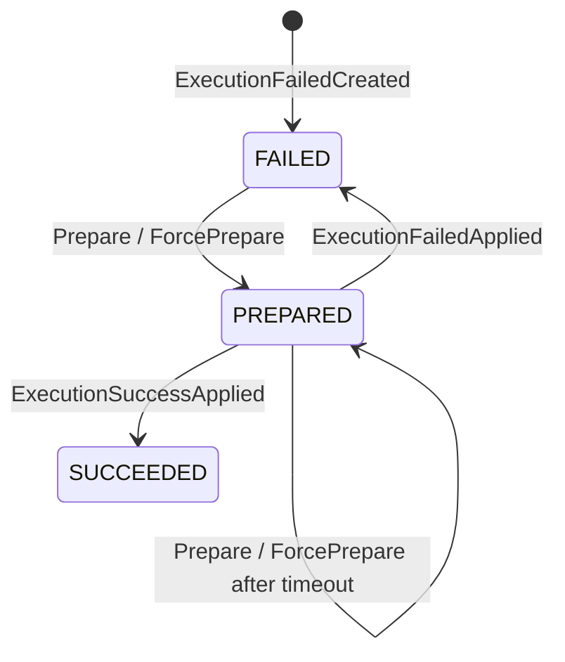

# Event Compensation

Event compensation recovers a **target function failure for an event that has already been committed**. It stores the failure and later redelivers the original event to the same function. It does not undo the original command, delete event history, or generate a business reverse action.

:::warning Compensation is not rollback
The source domain event entered EventStore before the handler ran. Compensation may call an external system again, so the function must remain idempotent using a stable identity such as the event ID or aggregate ID and version.
:::

## What Event Compensation Solves

Ordinary event processors, stateless sagas, projections, and snapshots all run after the source event is committed. An in-process retry can absorb a transient failure, but it cannot cross process termination or leave queryable recovery state. Event compensation fills that durability gap:

```text
committed event -> target function -> immediate retry exhausted -> ExecutionFailed
                                                               |
                                             scheduled or operator preparation
                                                               |
                                             original event + target function replay
```

It owns only “invoke the failed function again.” When the business needs a reverse command to offset an earlier effect, model that business compensation in a [Saga](./saga.md) instead of using `ExecutionFailed` as a domain decision.

## Immediate Retry and Durable Compensation

The two recovery layers use separate policies:

| Layer | Trigger and lifetime | Policy source | Durable record? |
| --- | --- | --- | --- |
| `RetryableFilter` | Recoverable errors in the current processing call | Global runtime exception classification; 3 retries with a 2-second minimum backoff by default | No |
| `EventCompensationFilter` | The inner chain still fails | Function `@Retry` or server default retry specification | Yes |

The compensation filter wraps the immediate-retry filter, so only an error that survives immediate retry enters the durable failure path. The `recoverable`, `unrecoverable`, `maxRetries`, `minBackoff`, and `executionTimeout` values on `@Retry` belong to durable compensation and do not rewrite the immediate `RetryableFilter` policy. `@Retry(enabled = false)` likewise opts the function out only from durable recording.

See the [Compensation Configuration Reference](../../reference/config/compensation.md) for complete properties, defaults, and YAML.

## Creating the Failure Record

`EventCompensationFilter` handles only an exchange that has already matched a target function. On a first failure without a compensation ID, it sends `CreateExecutionFailed` with:

- the original event ID, aggregate identity, and version;
- the target function context, processor, name, and `FunctionKind`;
- error code, message, binding errors, and stack trace;
- execution time, retry specification, and recoverability classification.

When function information is absent, or when the function declares `@Retry(enabled = false)`, the original error propagates without creating a record. After the compensation command send succeeds, the original handler error continues to the dispatcher error boundary. If the compensation command send itself fails, that send error terminates the reactive chain; the original error must not be treated as durably recorded.

A replay exchange already carries `compensationId` in its header. Another failure sends `ApplyExecutionFailed`, while success sends `ApplyExecutionSuccess`; both update the same `ExecutionFailed` aggregate.

## The ExecutionFailed State Machine



| State | Meaning | Accepted result commands |
| --- | --- | --- |
| `FAILED` | The latest invocation failed and awaits a due time or operator action | Prepare; ForcePrepare |
| `PREPARED` | A replay was prepared and awaits success, failure, or timeout | ApplyExecutionFailed; ApplyExecutionSuccess |
| `SUCCEEDED` | The target function replay succeeded | No new prepare/apply |

Ordinary `PrepareCompensation` accepts only `FAILED` or a timed-out `PREPARED`, with `retries < maxRetries`. `ForcePrepareCompensation` may cross the retry-count limit, but still rejects `SUCCEEDED` and a `PREPARED` attempt that has not timed out. Every preparation increments `retries` and recalculates `retryAt`, `timeoutAt`, and `nextRetryAt` from the current retry specification.

`isRetryable` describes state and count only; it does not contain recoverability. Whether `RECOVERABLE`, `UNKNOWN`, or `UNRECOVERABLE` enters automatic scheduling is a separate query-layer decision.

## Scheduling and Preparing a Retry

The compensation-service scheduler selects records that satisfy all of these conditions:

- recoverability is `RECOVERABLE` or `UNKNOWN`;
- the ordinary retry limit has not been reached;
- `nextRetryAt` is due;
- state is `FAILED`, or it is `PREPARED` past `timeoutAt`.

Each candidate receives `PrepareCompensation`. After the aggregate emits `CompensationPrepared`, the application-side `CompensationEventProcessor` handles only local aggregate metadata and replays the recorded event version and target function. `EVENT` resends a domain event stream; `STATE_EVENT` rebuilds and sends the corresponding state event. Compensation headers restrict dispatcher matching to the recorded context, processor, and function instead of invoking every handler for that event again.

## Success, Another Failure, and Unrecoverable Records

After a successful replay, the outer compensation filter sends `ApplyExecutionSuccess` and the state becomes `SUCCEEDED`. Another replay failure sends `ApplyExecutionFailed`, updates the error, execution time, and recoverability, and returns to `FAILED`. The new classification, count, and timing determine whether it can be scheduled again.

An `UNRECOVERABLE` record is still persisted but excluded from the automatic query. It preserves evidence for diagnosis and an operator decision; it is not a resolved record. A notification also reports only a compensation state change, not proof that external business consistency was restored.

## Operator Intervention Boundaries

An operator can prepare or force-prepare, change the retry specification, reclassify recoverability, or update a migrated target function. The state machine remains authoritative:

- force prepare crosses only the count limit, not success or an unexpired execution;
- reclassification changes scheduler eligibility and requires checking the error and any existing side effects first;
- changing function identity is for a confirmed handler migration, not arbitrary reassignment of a failure;
- every replay requires idempotency protection for the target side effect.

Authentication, authorization, approval, audit, and network isolation are deployment responsibilities; the `ExecutionFailed` aggregate does not provide them automatically.

## Verification and Operator Entry Points

Start by checking the state machine, capture, and replay paths in the domain and core modules:

```bash
./gradlew :wow-compensation-domain:check :wow-compensation-core:check
```

- Properties, defaults, complete YAML, and shutdown boundaries: [Compensation Configuration Reference](../../reference/config/compensation.md).
- Dashboard, management commands, runnable example, and deployment verification: [Event Compensation Example](../../reference/example/compensation.md).
- Handler idempotency, ordering, and reactive completion: [Event Processor](./processor.md).
