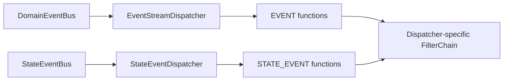

# Event Dispatch Pipeline

Event dispatch routes committed domain facts to matching functions. It determines which bus supplies a message, which functions execute, how cross-cutting filters wrap a function, and when processing ends in notification and acknowledgement. It does not move downstream processing into the source aggregate transaction.

## DomainEventBus and StateEventBus

| Bus | Message | Function kind |
| --- | --- | --- |
| `DomainEventBus` | `DomainEventStream`, the ordered event batch appended by one command | `FunctionKind.EVENT` |
| `StateEventBus` | `StateEvent`, the event stream plus aggregate state sourced at that version | `FunctionKind.STATE_EVENT` |

Both implement `MessageBus`, but their topic kinds, subscriptions, and transport acknowledgement semantics are independent. Send completion means only the boundary defined by the concrete Bus implementation. It is not handler completion and does not promise exactly-once processing. See [Event Sourcing](../domain/event-sourcing.md) for the point at which a domain event becomes authoritative history.

## Composite Dispatcher

`DomainEventDispatcher`, `ProjectionDispatcher`, and `StatelessSagaDispatcher` are all based on `CompositeEventDispatcher`. One Composite Dispatcher creates two child dispatchers and shares an aggregate scheduler:



`EventStreamDispatcher` retains only `FunctionKind.EVENT`; `StateEventDispatcher` retains only `FunctionKind.STATE_EVENT`. Each creates subscriptions from the aggregate topics supported by its registered functions. An aggregate without a corresponding function does not get a consumption path for that dispatcher.

One received event stream handles its events with `concatMap`. Multiple functions matching one event run through `flatMap`, so no function order may be assumed. The aggregate scheduler supplies only serial processing within one group key; it does not establish global order across dispatchers, processes, or external systems.

## Function Registration and Selection

During Spring startup, the AutoRegistrar for a Processor, Saga, or Projection registers parsed message functions in that component's `MessageFunctionRegistrar`. Function metadata includes at least:

- `FunctionKind`;
- context, processor, and function name;
- supported event-body type;
- supported named-aggregate topics.

Dispatch first splits the registrar by `FunctionKind`, then selects by topic and event-body type. An ordinary message matches every eligible function. A compensation message must also match the context, processor, and function name carried in its header. After selection, the dispatcher stores the function on the exchange, and the function filter retrieves and invokes it.

See [Event Processor](./processor.md) and [Saga](./saga.md) for application declarations. This page owns only the runtime pipeline after registration.

## Filter Order

Each dispatcher collects Spring `ExchangeFilter` beans compatible with its exchange type, applies `@FilterType` to keep filters for that dispatcher, and sorts them by `@Order`. The current critical relative order has two forms:

```text
Processor / Saga / Projection:
Notifier -> DomainEventCompensationFilter -> RetryableFilter -> FunctionFilter

Snapshot:
SnapshotNotifierFilter -> StateEventCompensationFilter -> SnapshotFunctionFilter
```

Filters enter from left to right and observe completion or error from right to left. The only `RetryableFilter` bean is typed for `DomainEventExchange`; the Snapshot chain collects `StateEventExchange` filters and therefore has no immediate-retry layer. Enabled modules and custom filters may further change the actual set. Treat the startup `Build ... FilterChain` log as the evidence for a running instance.

## Notifiers

Within this critical filter set, a notifier is outermost and sends its wait signal only after the inner chain completes successfully:

| Dispatcher | Notification stage |
| --- | --- |
| `DomainEventDispatcher` | `EVENT_HANDLED` |
| `StatelessSagaDispatcher` | `SAGA_HANDLED` |
| `ProjectionDispatcher` | `PROJECTED` |
| `SnapshotDispatcher` | `SNAPSHOT` |

Notification uses `notifyAndForget`; a notification failure is logged and does not reverse the processing result. Each stage proves only its matching function boundary, not another dispatcher, a follow-up command, or an external system. See [Completion Semantics](../command/completion.md) for caller-visible waits.

## RetryableFilter

`RetryableFilter` wraps the function filter in Processor, Saga, and Projection chains and resubscribes to the inner publisher. By default it retries only errors runtime-classified as `RECOVERABLE`, up to 3 retries with a 2-second minimum backoff. The final error continues outward. The Snapshot `StateEventExchange` chain does not contain this filter.

The filter has no durable state, cannot recover after process exit, and does not read durable-compensation parameters from function `@Retry`. A retry invokes the same function again, so the target side effect must be idempotent.

## CompensationFilter Insertion Point

When the compensation module is enabled, `DomainEventCompensationFilter` enters the domain/state function chains for event processors, stateless sagas, and projections, after the notifier and before `RetryableFilter`. `StateEventCompensationFilter` enters the Snapshot chain after `SnapshotNotifierFilter` and directly wraps `SnapshotFunctionFilter`:

- an inner terminal failure creates `ExecutionFailed` on first execution or updates the existing record during compensation;
- an inner success carrying a compensation ID writes `ApplyExecutionSuccess`;
- after recording a failure, the error still reaches the dispatcher's `ErrorHandler`.

This prevents a wait notification from announcing success before compensation write-back. Durable recording in Processor, Saga, and Projection observes errors that remain after immediate retry; Snapshot has no such layer, so its first function failure can enter durable compensation. See [Event Compensation](./compensation.md) for the complete state machine.

## Acknowledgement and Failure Boundaries

A function error is handled by that component's `Handler` error boundary. Event Processor, Saga, and Projection use `LogResumeErrorHandler` by default, which logs and resumes. After function handling for a domain event stream or state event terminates, `AbstractAggregateEventDispatcher` uses `finallyAck` to acknowledge the source exchange. The Snapshot function filter also applies `finallyAck` to its state-event exchange. These acknowledgements run on both successful and erroneous termination, and the concrete Bus Adapter maps each call to its own acknowledgement action.

Keep three boundaries distinct:

| Boundary | What it proves | What it does not prove |
| --- | --- | --- |
| Function publisher completion | This function invocation completed | Exactly-once behavior in an external system |
| Wait notifier | The corresponding processing-stage signal was emitted | Another branch or follow-up command completed |
| Exchange ack | The Bus Adapter accepted acknowledgement | Event history was rolled back or business consistency was restored |

The source event was committed before dispatch. A function, compensation-record, or acknowledgement failure cannot roll back EventStore. The application still needs stable idempotency keys for broker redelivery, immediate retry, and compensation replay.

## Source Entry Points

- [`DomainEventBus`](https://github.com/Ahoo-Wang/Wow/blob/main/wow-core/src/main/kotlin/me/ahoo/wow/event/DomainEventBus.kt) / [`StateEventBus`](https://github.com/Ahoo-Wang/Wow/blob/main/wow-core/src/main/kotlin/me/ahoo/wow/eventsourcing/state/StateEventBus.kt)
- [`CompositeEventDispatcher`](https://github.com/Ahoo-Wang/Wow/blob/main/wow-core/src/main/kotlin/me/ahoo/wow/event/dispatcher/CompositeEventDispatcher.kt) / [`AbstractAggregateEventDispatcher`](https://github.com/Ahoo-Wang/Wow/blob/main/wow-core/src/main/kotlin/me/ahoo/wow/event/dispatcher/AbstractAggregateEventDispatcher.kt)
- [`DomainEventFunctionRegistrar`](https://github.com/Ahoo-Wang/Wow/blob/main/wow-core/src/main/kotlin/me/ahoo/wow/event/dispatcher/DomainEventFunctionRegistrar.kt) / [`DomainEventFunctionFilter`](https://github.com/Ahoo-Wang/Wow/blob/main/wow-core/src/main/kotlin/me/ahoo/wow/event/dispatcher/DomainEventFunctionFilter.kt)
- [`NotifierFilters`](https://github.com/Ahoo-Wang/Wow/blob/main/wow-core/src/main/kotlin/me/ahoo/wow/command/wait/NotifierFilters.kt) / [`RetryableFilter`](https://github.com/Ahoo-Wang/Wow/blob/main/wow-core/src/main/kotlin/me/ahoo/wow/messaging/handler/RetryableFilter.kt)
- [`CompensationFilter`](https://github.com/Ahoo-Wang/Wow/blob/main/compensation/wow-compensation-core/src/main/kotlin/me/ahoo/wow/compensation/core/CompensationFilter.kt) / [`FilterChainBuilder`](https://github.com/Ahoo-Wang/Wow/blob/main/wow-core/src/main/kotlin/me/ahoo/wow/filter/FilterChainBuilder.kt)

Minimal framework checks:

```bash
./gradlew :wow-core:test --tests "me.ahoo.wow.event.DomainEventDispatcherTest"
./gradlew :wow-core:test --tests "me.ahoo.wow.messaging.handler.RetryableExchangeFilterTest"
```
