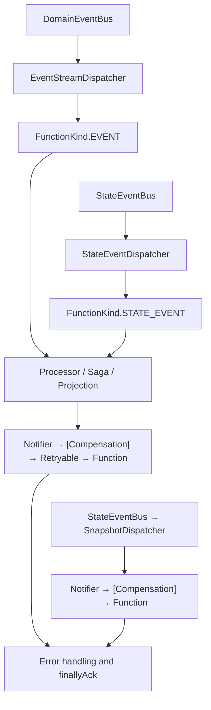

# Event Dispatch Pipeline

Event dispatch routes committed domain facts to matching functions. It determines which bus supplies a message, which functions execute, how cross-cutting filters wrap a function, and when processing ends in notification and acknowledgement. It does not move downstream processing into the source aggregate transaction.

## DomainEventBus and StateEventBus

| Bus | Message | Function kind |
| --- | --- | --- |
| `DomainEventBus` | `DomainEventStream`, the ordered event batch appended by one command | `FunctionKind.EVENT` |
| `StateEventBus` | `StateEvent`, the event stream plus aggregate state sourced at that version | `FunctionKind.STATE_EVENT` |

Both implement `MessageBus`, but their topic kinds, subscriptions, and transport acknowledgement semantics are independent. Send completion means only the boundary defined by the concrete Bus implementation. It is not handler completion and does not promise exactly-once processing. See [Event Sourcing](../domain/event-sourcing.md) for the point at which a domain event becomes authoritative history.

There is no ordering guarantee between the two buses, or between topics. Each bus keeps an aggregate's messages in send order, but with local-first a domain event of version N may reach the distributed transport after the state event of version N, because the domain event's distributed copy waits until every local event receiver decided (see [LocalFirst dual-copy admission](../command/internals/transport.md#localfirst-dual-copy-admission)). A consumer must not rely on order across topics, for example on having seen a domain event before the state event of the same version; 9.2 never guaranteed consumer-side order across topics either.

## Composite Dispatcher

`DomainEventDispatcher`, `ProjectionDispatcher`, and `StatelessSagaDispatcher` are all based on `CompositeEventDispatcher`. One Composite Dispatcher creates two child dispatchers; like every dispatcher, they run on the runtime's [`KeyedExecutor`](../advanced/keyed-executor.md):


```mermaid
flowchart TB
    DomainBus["DomainEventBus"] --> EventStream["EventStreamDispatcher"]
    StateBus["StateEventBus"] --> StateEvent["StateEventDispatcher"]
    EventStream --> EventKind["FunctionKind.EVENT"]
    EventKind ~~~ StateBus
    StateEvent --> StateKind["FunctionKind.STATE_EVENT"]
    EventKind --> Functions["Processor / Saga / Projection"]
    StateKind --> Functions
    Functions --> EventFilters["Notifier → [Compensation] → Retryable → Function"]
    SnapshotPath["StateEventBus → SnapshotDispatcher"] --> SnapshotFilters["Notifier → [Compensation] → Function"]
    EventFilters --> Boundary["Error handling and finallyAck"]
    SnapshotFilters --> Boundary
    EventFilters ~~~ SnapshotPath
```

`EventStreamDispatcher` retains only `FunctionKind.EVENT`; `StateEventDispatcher` retains only `FunctionKind.STATE_EVENT`. Each subscribes to the aggregate topics supported by its registered functions, with one receiver (one Kafka consumer) per bounded context of those aggregates since 9.3.0. An aggregate without a corresponding function does not get a consumption path for that dispatcher.

One received event stream handles its events with `concatMap`. Multiple functions matching one event run through `flatMap`, so no function order may be assumed. The keyed executor supplies only serial processing per aggregate ID within one dispatcher; it does not establish global order across dispatchers, processes, or external systems.

## Function Registration and Selection

During Spring startup, the AutoRegistrar for a Processor, Saga, or Projection registers parsed message functions in that component's `MessageFunctionRegistrar`. Function metadata includes at least:

- `FunctionKind`;
- context, processor, and function name;
- supported event-body type;
- supported named-aggregate topics.

Dispatch first splits the registrar by `FunctionKind`, then selects by topic and event-body type. An ordinary message matches every eligible function. A compensation message must also match the context, processor, and function name carried in its header. After selection, the dispatcher stores the function on the exchange, and the function filter retrieves and invokes it.

See [Event Processor](./processor.md) and [Saga](../event/saga.md) for application declarations. This page owns only the runtime pipeline after registration.

## Filter Order

Each dispatcher collects Spring `ExchangeFilter` beans compatible with its exchange type, applies `@FilterType` to keep filters for that dispatcher, and sorts them by `@Order`: the `before`/`after` constraints are satisfied as a whole (a topological sort), ties go by `value` and then by registration order, a constraint naming a filter that is not present is ignored, and constraints that form a cycle fail startup with an error naming the cycle (since 9.3.0). The order can differ from 9.2 even where 9.2 satisfied the constraints: with X `@Order(100, before = [Y])`, Y `@Order(0)` and Z `@Order(50)`, 9.2 sorted by value and then moved X before Y, `[X, Y, Z]`; 9.3 places each filter as early as its value allows once its constraints hold, `[Z, X, Y]`. The current critical relative order has two forms:

```text
Processor / Saga / Projection:
Notifier -> RetryableFilter -> FunctionFilter

Snapshot:
SnapshotNotifierFilter -> SnapshotFunctionFilter
```

The handler that runs the chain records failures after it terminates ([Failure Recording](#failure-recording)); since 9.3.0 the compensation module adds no filter.

Filters enter from left to right and observe completion or error from right to left. The only `RetryableFilter` bean is typed for `DomainEventExchange`; the Snapshot chain collects `StateEventExchange` filters and therefore has no immediate-retry layer. Enabled modules and custom filters may further change the actual set. Treat the startup `Build ... FilterChain` log as the evidence for a running instance.

## Notifiers

Within this critical filter set, a notifier is outermost. When the inner chain completes or fails, it emits the corresponding success or failure wait signal; notification delivery itself remains fire-and-forget:

| Dispatcher | Notification stage |
| --- | --- |
| `DomainEventDispatcher` | `EVENT_HANDLED` |
| `StatelessSagaDispatcher` | `SAGA_HANDLED` |
| `ProjectionDispatcher` | `PROJECTED` |
| `SnapshotDispatcher` | `SNAPSHOT` |

Notification uses `notifyAndForget`; a notification failure is logged and does not reverse the processing result. Each stage proves only its matching function boundary, not another dispatcher, a follow-up command, or an external system. See [Completion Semantics](../command/completion.md) for caller-visible waits.

## RetryableFilter

`RetryableFilter` wraps the function filter in Processor, Saga, and Projection chains and resubscribes to the inner publisher. By default it retries only errors runtime-classified as `RECOVERABLE`, up to 3 retries with a 2-second minimum backoff. The final error continues outward. The Snapshot `StateEventExchange` chain does not contain this filter.

The filter has no durable state, cannot recover after process exit, and does not read durable-compensation parameters from function `@Retry`. A retry invokes the same function again, so the target side effect must be idempotent.

## Failure Recording

Since 9.3.0 the event handler of each function (`FailureRecordingHandler`: Processor, Saga, Projection and Snapshot) settles the outcome after the filter chain terminates, through the application's `FailureRecorder` (`me.ahoo.wow.processing.failure`, a `@WowSpi`):

| Outcome | When | Acknowledged |
| --- | --- | --- |
| `HANDLED` | the function succeeded; the recorder's `recordSuccess` runs | yes |
| `FAILURE_RECORDED` | the recorder recorded the failure durably | yes |
| `FAILURE_WAIVED` | the recorder chose not to record it (`@Retry(enabled = false)`) | yes |
| `FAILURE_UNRECORDED` | no recorder records failures (`FailureRecorder.NONE`, the default without the compensation module) | only while `wow.event.ack-on-unrecorded-failure` is `true` (the default) |
| `RECORDING_FAILED` | the recorder failed to record it | no |

The processing error then reaches the component's `ErrorHandler` (a recording error is added to it as suppressed). With the compensation module the recorder is `CompensationFailureRecorder`: a failure creates `ExecutionFailed` on first execution or updates the existing record during compensation, and a success carrying a compensation ID writes `ApplyExecutionSuccess`. Recording happens after the notifier has emitted its signal, so a wait signal no longer waits for the compensation record (before 9.3.0 the compensation filter sat inside the notifier): the record is eventually consistent with the signal; a caller that needs it polls `ExecutionFailed` by event ID. A failure whose in-process retries were exhausted is recorded and handled as its cause, the error of the last attempt, with or without a wait plan (before 9.3.0 the record then carried `IllegalState` "Retries exhausted" and `UNKNOWN`). Each outcome is counted in `wow.processing.outcomes` (tags `component`, `context`, `aggregate`, `message`, `processor`, `outcome`) when metrics are enabled. Processor, Saga and Projection record errors that remain after immediate retry; Snapshot has no such layer, so its first function failure can enter durable compensation. See [Event Compensation](./compensation.md) for the complete state machine.

## Acknowledgement and Failure Boundaries

A function error is handled by that component's `Handler` error boundary. Event Processor, Saga, and Projection use `LogResumeErrorHandler` by default, which logs and resumes. After function handling for a domain event stream or state event terminates, `AbstractAggregateEventDispatcher` uses `finallyAck` to acknowledge the source exchange. The Snapshot function filter also applies `finallyAck` to its state-event exchange. These acknowledgements run on both successful and erroneous termination, and the concrete Bus Adapter maps each call to its own acknowledgement action. The exception is an outcome that does not acknowledge ([Failure Recording](#failure-recording)): a failure the recorder could not record even after retrying, or, with `wow.event.ack-on-unrecorded-failure=false`, a failure no recorder recorded. That function exchange withholds acknowledgement, the other functions of the stream still run, and the dispatcher then leaves the whole source exchange unacknowledged. On Kafka this eventually pauses the whole receiver until a restart or rebalance (see [Event Compensation](./compensation.md)). The Snapshot function acknowledges its state event itself, so a Snapshot failure is recorded but never withholds acknowledgement.

Keep three boundaries distinct:

| Boundary | What it proves | What it does not prove |
| --- | --- | --- |
| Function publisher completion | This function invocation completed | Exactly-once behavior in an external system |
| Wait notifier | The corresponding processing-stage signal was emitted | Another branch or follow-up command completed |
| Exchange ack | The Bus Adapter accepted acknowledgement | Event history was rolled back or business consistency was restored |

The source event was committed before dispatch. A function, compensation-record, or acknowledgement failure cannot roll back EventStore. The application still needs stable idempotency keys for broker redelivery, immediate retry, and compensation replay.

## Source Entry Points

- [`DomainEventBus`](https://github.com/Ahoo-Wang/Wow/blob/main/wow-core/src/main/kotlin/me/ahoo/wow/event/DomainEventBus.kt) / [`StateEventBus`](https://github.com/Ahoo-Wang/Wow/blob/main/wow-core/src/main/kotlin/me/ahoo/wow/eventsourcing/state/StateEventBus.kt)
- [`CompositeEventDispatcher`](https://github.com/Ahoo-Wang/Wow/blob/main/wow-core/src/main/kotlin/me/ahoo/wow/event/dispatcher/CompositeEventDispatcher.kt) / [`AbstractAggregateEventDispatcher`](https://github.com/Ahoo-Wang/Wow/blob/main/wow-core/src/main/kotlin/me/ahoo/wow/event/dispatcher/AbstractAggregateEventDispatcher.kt)
- [`DomainEventFunctionRegistrar`](https://github.com/Ahoo-Wang/Wow/blob/main/wow-core/src/main/kotlin/me/ahoo/wow/event/dispatcher/DomainEventFunctionRegistrar.kt) / [`DomainEventFunctionFilter`](https://github.com/Ahoo-Wang/Wow/blob/main/wow-core/src/main/kotlin/me/ahoo/wow/event/dispatcher/DomainEventFunctionFilter.kt)
- [`NotifierFilters`](https://github.com/Ahoo-Wang/Wow/blob/main/wow-core/src/main/kotlin/me/ahoo/wow/command/wait/NotifierFilters.kt) / [`RetryableFilter`](https://github.com/Ahoo-Wang/Wow/blob/main/wow-core/src/main/kotlin/me/ahoo/wow/messaging/handler/RetryableFilter.kt)
- [`FailureRecordingHandler`](https://github.com/Ahoo-Wang/Wow/blob/main/wow-core/src/main/kotlin/me/ahoo/wow/processing/failure/FailureRecordingHandler.kt) / [`FailureRecorder`](https://github.com/Ahoo-Wang/Wow/blob/main/wow-core/src/main/kotlin/me/ahoo/wow/processing/failure/FailureRecorder.kt) / [`CompensationFailureRecorder`](https://github.com/Ahoo-Wang/Wow/blob/main/compensation/wow-compensation-core/src/main/kotlin/me/ahoo/wow/compensation/core/CompensationFailureRecorder.kt) / [`FilterChainBuilder`](https://github.com/Ahoo-Wang/Wow/blob/main/wow-core/src/main/kotlin/me/ahoo/wow/filter/FilterChainBuilder.kt)

Minimal framework checks:

```bash
./gradlew :wow-core:test --tests "me.ahoo.wow.event.DomainEventDispatcherTest"
./gradlew :wow-core:test --tests "me.ahoo.wow.messaging.handler.RetryableExchangeFilterTest"
```
