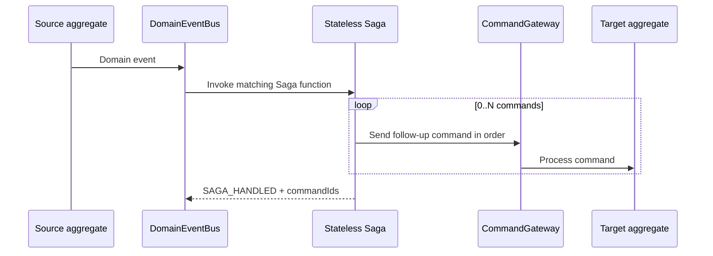

# Saga

Wow's `@StatelessSaga` is a stateless event orchestrator: it receives domain or state events and generates commands for the next step. Each target aggregate still handles its command in a local transaction. A Saga does not create a cross-aggregate ACID transaction.

A Stateless Saga converts an occurred fact into 0..N follow-up commands sent in order.



## When to Use a Saga

Use a Saga when a committed event must drive business behavior in other aggregates, such as sending an entry command to a target account after a transfer is prepared. Use an [Event Processor](./processor.md) for notifications, audit, or external integrations. Do not wrap an ordinary side effect that generates no command in a Saga.

A stateless Saga stores no workflow instance. Each event function must depend only on the current event and injectable context, then explicitly return the 0..N commands required for this invocation.

## Stateless Saga Contract

```text
committed event -> matching Saga function -> 0..N commands -> CommandGateway.send
```

A Saga shares event-function parsing, type/topic matching, domain/state-event dispatch, and the reactive filter chain with an ordinary Processor. The difference is that `StatelessSagaFunction` converts function results into commands, sends them in order, and stores the command stream on the exchange for the `SAGA_HANDLED` notification.

The source event is committed before the Saga runs. Neither a function failure nor a command-send failure can roll it back.

## Define Saga Functions

`@StatelessSaga` is also a Spring component marker. Functions may use the `onEvent` / `onStateEvent` conventional names or explicit `@OnEvent` / `@OnStateEvent` annotations. Their first parameter may likewise be the event body, `DomainEvent<T>`, or `DomainEventExchange<T>`.

```kotlin
@StatelessSaga
class CartSaga {
    @OnEvent
    fun onOrderCreated(event: DomainEvent<OrderCreated>): CommandBuilder? {
        if (!event.body.fromCart) return null

        return RemoveCartItem(
            productIds = event.body.items.map { it.productId }.toSet(),
        ).commandBuilder()
            .aggregateId(event.ownerId)
    }
}
```

Use `@OnStateEvent` and inject state as a later parameter only when the aggregate's latest state is required. Return a `CommandBuilder` when the target aggregate ID, request ID, or another command field must be selected explicitly.

## Generate 0..N Commands from an Event

A function can synchronously, asynchronously, or reactively return these results:

| Result | Send behavior |
| --- | --- |
| `null` / `Mono.empty()` | Send 0 commands |
| Command body | Convert it to a `CommandMessage` and send 1 command |
| `CommandBuilder` | Create and send 1 command with the builder's target and explicit fields |
| `CommandMessage<*>` | Preserve the existing message and send 1 command |
| `Iterable<*>`, `Flux`, `Publisher`, or `Flow` | Collect and send N commands in result order |

`StatelessSagaFunction` uses `concatMap` for multiple commands: the next [`CommandGateway.send`](../command/sending.md) starts only after the previous one completes. Keep result order stable. Reordering changes both the business flow and the default request IDs.

## requestId and Context Propagation

For a command body or `CommandBuilder`, the framework fills only missing fields:

- the default `requestId` is `${domainEvent.id}-${index}`, starting at index `0`;
- an explicit `requestId` is preserved;
- missing `tenantId` and `spaceId` propagate from the source event;
- the source event becomes upstream and its message header is propagated.

A prebuilt `CommandMessage` keeps its message and `requestId` while receiving source-event header propagation.

Replaying the same event with the same result order produces stable default request IDs that can cooperate with [command-gateway idempotency checks](../command/reliability.md). This does not make external side effects idempotent and does not deduplicate semantically repeated commands generated from different events.

## Business Compensation

Business compensation in a Saga is an explicit domain action. For example, `EntryFailed` can generate `UnlockAmount`:

```kotlin
@OnEvent
fun onEntryFailed(event: EntryFailed): UnlockAmount =
    UnlockAmount(event.sourceId, event.amount)
```

This command describes how the business offsets an earlier effect. It does not delete committed events such as `Prepared` or `EntryFailed`, and it is not a database rollback.

Do not conflate business compensation with processing-failure recovery. A Saga decides which business command follows a failure fact. Compensation decides how a failed invocation of the same processing function is durably recorded and replayed. See [Event Compensation](./compensation.md) for the authoritative recovery guide.

## Wait Integration

The runtime produces `SAGA_HANDLED` after the Saga function completes and every generated `CommandGateway.send` completes. The signal carries the command-stream `commandId` values, but proves only the send boundary, not that the target aggregates processed those commands.

Wait for the matching `SAGA_HANDLED` when the caller needs only to know that the Saga sent its commands. If every downstream command must reach another stage, use `CommandWait.chain(...)` with the Saga function and the tail stage/function. See [Completion Semantics](../command/completion.md) for stages, function matching, and early-arriving signals.

## Testing and Failure Boundaries

Use `SagaSpec` to verify the event-to-command mapping directly without starting a message broker:

```kotlin
class CartSagaSpec : SagaSpec<CartSaga>({
    on {
        whenEvent(orderCreatedFromCart, ownerId = ownerId) {
            expectNoError()
            expectCommandType(RemoveCartItem::class)
            expectCommand<RemoveCartItem> {
                aggregateId.id.assert().isEqualTo(ownerId)
            }
        }
    }
    on {
        whenEvent(orderCreatedNotFromCart, ownerId = ownerId) {
            expectNoCommand()
        }
    }
})
```

Cover the normal command, zero-command path, and every business-compensation branch. Add assertions on the full `CommandMessage` when relying on default request IDs, context propagation, multi-command order, or prebuilt messages. Add integration coverage only when relying on real sends, chained waits, or failure recovery.

An error from the Saga function or any `CommandGateway.send` propagates through the reactive chain before immediate retry or enabled durable Compensation handles it. Even when failure follows partial command acceptance, neither the source event nor accepted commands are automatically undone. Command handling and business compensation must therefore remain safe under replay.

**Completion signal:** tests cover the 0..N mapping, command order, request ID/context propagation, and business-compensation branches, and the wait contract does not misstate `SAGA_HANDLED` as downstream command completion.
