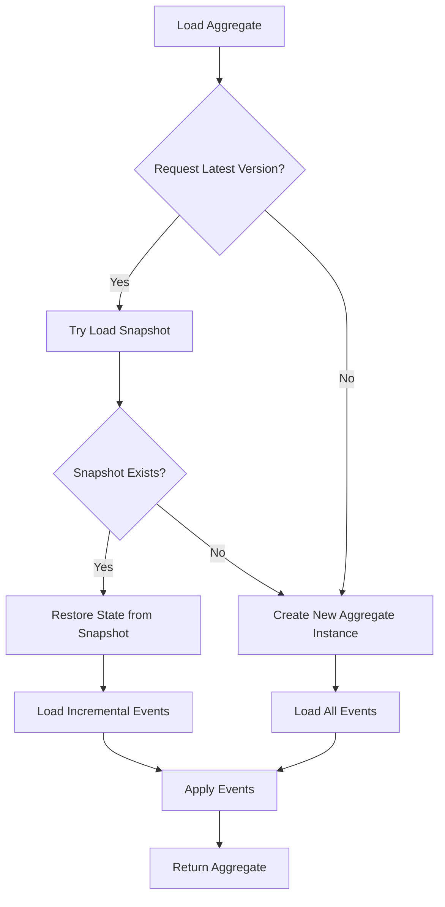

# Event Store

The Event Store is a core component of the event sourcing architecture, responsible for persisting and retrieving domain event streams. It is the foundation for aggregate root state reconstruction, ensuring that all state changes are recorded as immutable events.

## Event Sourcing

<center>


</center>

In traditional architectures, databases only store the current state, and historical change records are often lost. In event sourcing architecture:

- **Complete History**: Every state change is permanently stored as an event
- **Traceability**: State at any point in time can be reconstructed by replaying events
- **Audit-Friendly**: Naturally supports operation auditing and data analysis

## Core Interface

The `EventStore` interface defines the core operations for event storage:

```kotlin
interface EventStore {
    /**
     * Appends a domain event stream to the event store.
     * Ensures transaction consistency and handles version conflicts.
     */
    fun append(eventStream: DomainEventStream): Mono<Void>

    /**
     * Loads domain event streams for the specified aggregate within the given version range.
     * The range is inclusive: [headVersion, tailVersion].
     */
    fun load(
        aggregateId: AggregateId,
        headVersion: Int = 1,
        tailVersion: Int = Int.MAX_VALUE - 1
    ): Flux<DomainEventStream>

    /**
     * Loads domain event streams for the specified aggregate within the given event time range.
     * The range is inclusive: [headEventTime, tailEventTime].
     */
    fun load(
        aggregateId: AggregateId,
        headEventTime: Long,
        tailEventTime: Long
    ): Flux<DomainEventStream>
}
```

## Domain Event Stream

`DomainEventStream` represents a collection of domain events produced by a single command:

```kotlin
interface DomainEventStream : EventMessage<DomainEventStream, List<DomainEvent<*>>> {
    val aggregateId: AggregateId
    val size: Int
}
```

Key characteristics of event streams:

- **One-to-One Relationship**: One command produces one event stream
- **Version Increment**: Events are sorted in monotonically increasing version order
- **Atomicity**: All events in a stream are persisted as a single unit
- **Immutability**: Events cannot be modified once created

## Exception Handling

The event store may throw the following exceptions:

| Exception Type | Description |
|---------------|-------------|
| `EventVersionConflictException` | Version conflict, usually caused by concurrent writes |
| `DuplicateAggregateIdException` | Duplicate aggregate ID (at initial version) |
| `DuplicateRequestIdException` | Duplicate request ID, used for idempotency guarantee |

## Implementations

### In-Memory Implementation

`InMemoryEventStore` is suitable for testing and development:

```kotlin
class InMemoryEventStore : AbstractEventStore() {
    private val events = ConcurrentHashMap<AggregateId, CopyOnWriteArrayList<DomainEventStream>>()
    
    // Thread-safe in-memory storage implementation
}
```

### MongoDB Implementation

`MongoEventStore` is one of the recommended implementations for production:

```kotlin
class MongoEventStore(private val database: MongoDatabase) : AbstractEventStore() {
    // Uses MongoDB to store event streams
    // Supports unique indexes for version consistency and request idempotency
}
```

MongoDB storage features:
- Uses `aggregateId + version` unique index to prevent version conflicts
- Uses `requestId` unique index to ensure idempotency
- Queries sorted by version in ascending order

### Other Implementations

The Wow framework also provides the following event store implementations:

- **R2DBC**: Supports relational databases (MySQL, PostgreSQL, etc.)
- **Redis**: Suitable for high-performance scenarios

## Aggregate State Reconstruction

Reconstruct aggregate state through the event sourcing repository:

```kotlin
class EventSourcingStateAggregateRepository(
    private val stateAggregateFactory: StateAggregateFactory,
    private val snapshotRepository: SnapshotRepository,
    private val eventStore: EventStore
) : StateAggregateRepository {

    override fun <S : Any> load(
        aggregateId: AggregateId,
        metadata: StateAggregateMetadata<S>,
        tailVersion: Int
    ): Mono<StateAggregate<S>> {
        // 1. Try to load from snapshot (if requesting latest version)
        // 2. Load incremental events from event store
        // 3. Apply events to reconstruct state
    }
}
```

Loading process:



## Configuration

```yaml
wow:
  eventsourcing:
    store:
      storage: mongo  # Event store type (mongo, r2dbc, redis, in_memory)
```

For more detailed configuration options, see [Event Sourcing Configuration](../reference/config/eventsourcing).

## Best Practices

1. **Choose Appropriate Storage**: Select event store implementation based on business requirements
   - MongoDB or R2DBC recommended for production
   - InMemory implementation suitable for development and testing

2. **Combine with Snapshots**: For aggregates with many events, enable [snapshots](./snapshot) to reduce event replay

3. **Monitor Version Conflicts**: Version conflicts are normal concurrent control behavior, but frequent conflicts may require business process optimization

4. **Leverage Request Idempotency**: Use `requestId` to implement idempotent command handling and prevent duplicate execution

## Related Topics

- [Snapshot](./snapshot) - Learn how to use snapshots to optimize aggregate loading performance
- [Business Intelligence](./bi) - Learn how to leverage event streams for data analysis
