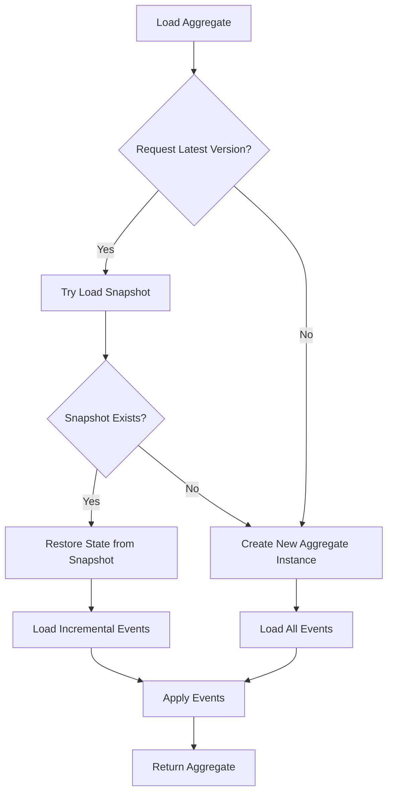
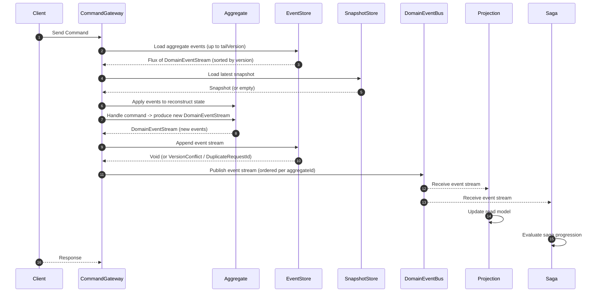
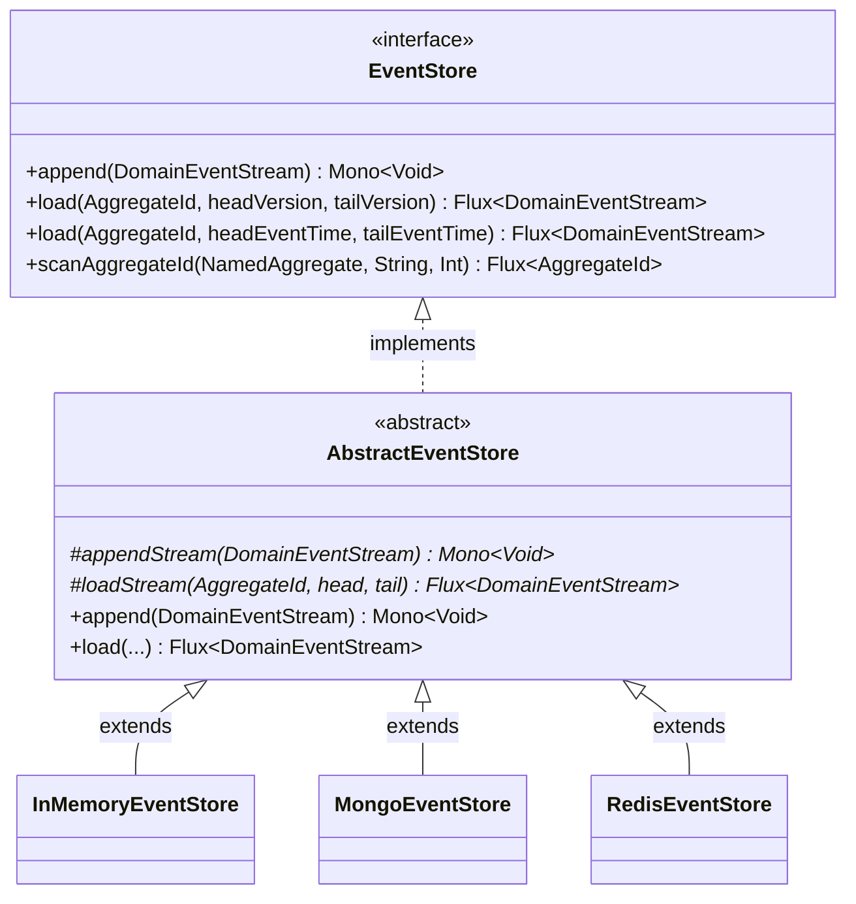
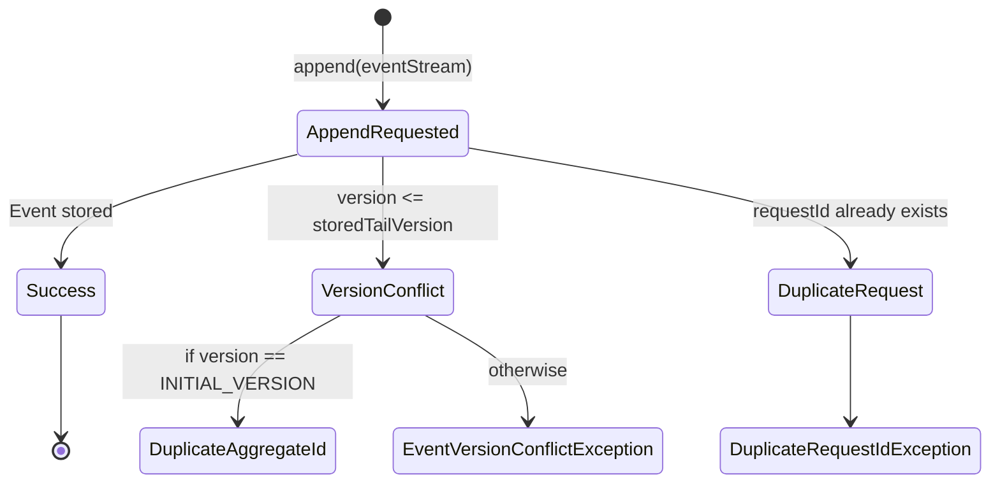

# Event Store

The Event Store is the persistence backbone of the event sourcing architecture. Unlike traditional CRUD databases that overwrite state and discard history, the event store acts as an **immutable, append-only ledger** of every domain event. Every state change — an `OrderCreated`, an `ItemAdded`, a `PaymentProcessed` — is recorded and can never be modified or deleted.

## Event Sourcing

<center>


</center>

In traditional architectures, databases only store the current state, and historical change records are often lost. In event sourcing architecture:

- **Complete History**: Every state change is permanently stored as an event
- **Traceability**: State at any point in time can be reconstructed by replaying events
- **Audit-Friendly**: Naturally supports operation auditing and data analysis
- **Decoupled Consumers**: Projections, sagas, and external systems independently subscribe to the same event stream

## Core Interface

The `EventStore` interface defines the core operations for event storage and owns paginated aggregate ID scanning by named aggregate:

```kotlin
interface EventStore :
    RequestIdExistenceChecker,
    AggregateIdScanner {
    fun append(eventStream: DomainEventStream): Mono<Void>
    fun load(
        aggregateId: AggregateId,
        headVersion: Int = 1,
        tailVersion: Int = Int.MAX_VALUE - 1
    ): Flux<DomainEventStream>
    fun load(
        aggregateId: AggregateId,
        headEventTime: Long,
        tailEventTime: Long
    ): Flux<DomainEventStream>
    fun last(aggregateId: AggregateId): Mono<DomainEventStream>
    fun scanAggregateId(
        namedAggregate: NamedAggregate,
        afterId: String = AggregateIdScanner.FIRST_ID,
        limit: Int = 10
    ): Flux<AggregateId>
}
```

### Domain Event Stream

`DomainEventStream` represents a collection of domain events produced by a single command:

```kotlin
interface DomainEventStream : EventMessage<DomainEventStream, List<DomainEvent<*>>> {
    val aggregateId: AggregateId
    val size: Int
}
```

Key characteristics:
- **One-to-One**: One command produces one event stream
- **Atomicity**: All events in a stream are persisted as a single unit
- **Immutability**: Events cannot be modified once created

### Key Concepts

| Concept | Description | Source |
|---|---|---|
| `DomainEvent` | Immutable fact about a past business action within an aggregate | [DomainEvent.kt:52-95](https://github.com/Ahoo-Wang/Wow/blob/main/wow-api/src/main/kotlin/me/ahoo/wow/api/event/DomainEvent.kt#L52-L95) |
| `DomainEventStream` | Ordered batch of domain events produced by a single command | [DomainEventStream.kt:51-125](https://github.com/Ahoo-Wang/Wow/blob/main/wow-core/src/main/kotlin/me/ahoo/wow/event/DomainEventStream.kt#L51-L125) |
| `EventStore` | Core interface for appending, loading event streams, and scanning aggregate IDs | [EventStore.kt](https://github.com/Ahoo-Wang/Wow/blob/main/wow-core/src/main/kotlin/me/ahoo/wow/eventsourcing/EventStore.kt) |
| `SnapshotStore` | Optimizes aggregate loading with versioned state checkpoints | [SnapshotStore.kt:27-58](https://github.com/Ahoo-Wang/Wow/blob/main/wow-core/src/main/kotlin/me/ahoo/wow/eventsourcing/snapshot/SnapshotStore.kt#L27-L58) |

## Aggregate State Reconstruction

The framework does **not** store current aggregate state in a traditional database. Instead, every aggregate's state is a **function of its event history**.


```mermaid
flowchart TD
    A[Load Aggregate] --> B{Request Latest Version?}
    B -->|Yes| C[Try Load Snapshot]
    B -->|No| D[Create New Aggregate Instance]
    C --> E{Snapshot Exists?}
    E -->|Yes| F[Restore State from Snapshot]
    E -->|No| D
    F --> G[Load Incremental Events]
    D --> H[Load All Events]
    G --> I[Apply Events]
    H --> I
    I --> J[Return Aggregate]
```

The `EventSourcingStateAggregateRepository` implements this reconstruction:

1. **Snapshot-first loading**: When requesting the latest version, the repository first loads from the snapshot store. If a snapshot exists, it serves as the starting point for incremental replay.
2. **Fresh aggregate creation**: If no snapshot exists, a new aggregate instance is created via the `StateAggregateFactory`.
3. **Event application**: Events are replayed in version order, each calling `stateAggregate.onSourcing(it)` to mutate the in-memory state.

## Event Sourcing Lifecycle

The following diagram illustrates the complete lifecycle from command receipt through event persistence, bus publication, and downstream processing:


```mermaid
sequenceDiagram
    autonumber
    participant Client
    participant CommandGateway
    participant Aggregate
    participant EventStore
    participant SnapshotStore
    participant DomainEventBus
    participant Projection
    participant Saga

    Client->>CommandGateway: Send Command
    CommandGateway->>EventStore: Load aggregate events (up to tailVersion)
    EventStore-->>CommandGateway: Flux of DomainEventStream (sorted by version)
    CommandGateway->>SnapshotStore: Load latest snapshot
    SnapshotStore-->>CommandGateway: Snapshot (or empty)
    CommandGateway->>Aggregate: Apply events to reconstruct state
    CommandGateway->>Aggregate: Handle command -> produce new DomainEventStream
    Aggregate-->>CommandGateway: DomainEventStream (new events)
    CommandGateway->>EventStore: Append event stream
    EventStore-->>CommandGateway: Void (or VersionConflict / DuplicateRequestId)
    CommandGateway->>DomainEventBus: Publish event stream (ordered per aggregateId)
    DomainEventBus-->>Projection: Receive event stream
    DomainEventBus-->>Saga: Receive event stream
    Projection->>Projection: Update read model
    Saga->>Saga: Evaluate saga progression
    Client-->>CommandGateway: Response
```

## Architecture

The framework defines a clean interface hierarchy with multiple persistence backends. Every implementation extends `AbstractEventStore` which provides centralized logging, input validation, and error mapping.


```mermaid
classDiagram
    class EventStore {
        <<interface>>
        +append(DomainEventStream) Mono~Void~
        +load(AggregateId, headVersion, tailVersion) Flux~DomainEventStream~
        +load(AggregateId, headEventTime, tailEventTime) Flux~DomainEventStream~
        +scanAggregateId(NamedAggregate, String, Int) Flux~AggregateId~
    }
    class AbstractEventStore {
        <<abstract>>
        #appendStream(DomainEventStream)* Mono~Void~
        #loadStream(AggregateId, head, tail)* Flux~DomainEventStream~
        +append(DomainEventStream) Mono~Void~
        +load(...) Flux~DomainEventStream~
    }
    class InMemoryEventStore
    class MongoEventStore
    class RedisEventStore

    EventStore <|.. AbstractEventStore : implements
    AbstractEventStore <|-- InMemoryEventStore : extends
    AbstractEventStore <|-- MongoEventStore : extends
    AbstractEventStore <|-- RedisEventStore : extends
```

The `AbstractEventStore` applies the **template method pattern** to centralize cross-cutting concerns:

- **`append()`** (public, concrete): Logs the operation, delegates to `appendStream()`, and upgrades version-conflict exceptions.
- **`load()`** (public, concrete): Validates version/time ranges, then delegates to `loadStream()`.
- **`appendStream()` / `loadStream()`** (protected, abstract): Each backend implements storage-specific logic.

## Exception Handling

The event store defines a hierarchy of typed exceptions:

| Exception Type | Description | Behavior |
|---|---|---|
| `EventVersionConflictException` | Version conflict from concurrent writes | Implements `RecoverableException` — safe to retry |
| `DuplicateAggregateIdException` | Attempt to create an already-existing aggregate | Fatal — indicates ID collision |
| `DuplicateRequestIdException` | Same command was already processed | Idempotent — success case, not an error |


```mermaid
stateDiagram-v2
    [*] --> AppendRequested: append(eventStream)
    AppendRequested --> Success: Event stored
    AppendRequested --> VersionConflict: version <= storedTailVersion
    AppendRequested --> DuplicateRequest: requestId already exists

    VersionConflict --> DuplicateAggregateId: if version == INITIAL_VERSION
    VersionConflict --> EventVersionConflictException: otherwise
    DuplicateRequest --> DuplicateRequestIdException
    Success --> [*]
```

## Implementation Comparison

| Feature | MongoDB | Redis | In-Memory |
|---|---|---|---|
| **Persistence** | Durable (disk) | Configurable | Volatile (memory) |
| **Version range query** | Yes | Yes (ZRANGEBYSCORE) | Yes (in-memory) |
| **Time range query** | Yes | No | Yes (in-memory) |
| **Concurrency control** | Unique compound index | Lua script (atomic) | Synchronized map |
| **Sharding support** | Sharded collections | Redis cluster | N/A |
| **Production readiness** | High | Medium | Dev/Test only |

### Storage Schema Per Implementation

**MongoDB** uses per-aggregate-type collections. The collection name is derived from the aggregate's context name and aggregate name (e.g., `order_event_stream`). Documents are indexed with a unique compound index on `(aggregate_id, version)` and another on `(aggregate_id, request_id)` ([EventStreamSchemaInitializer.kt:51-69](https://github.com/Ahoo-Wang/Wow/blob/main/wow-mongo/src/main/kotlin/me/ahoo/wow/mongo/EventStreamSchemaInitializer.kt#L51-L69)).

**Redis** stores event streams in a **sorted set** keyed by aggregate ID. Each member is a JSON-serialized `DomainEventStream`, scored by version number. Append operations use a Lua script for atomicity — checking version conflicts and duplicate request IDs in a single transaction ([RedisEventStore.kt:44-65](https://github.com/Ahoo-Wang/Wow/blob/main/wow-redis/src/main/kotlin/me/ahoo/wow/redis/eventsourcing/RedisEventStore.kt#L44-L65)). Time-range loading is not supported.


## Configuration

```yaml
wow:
  eventsourcing:
    store:
      storage: mongo
    snapshot:
      enabled: true
      strategy: version_offset  # all, version_offset
      version-offset: 10
      storage: mongo
```

| Property | Type | Default | Description |
|---|---|---|---|
| `wow.eventsourcing.store.storage` | `StorageType` | `mongo` | Event store backend |
| `wow.eventsourcing.snapshot.enabled` | `Boolean` | `true` | Enable snapshot mechanism |
| `wow.eventsourcing.snapshot.strategy` | `Strategy` | `all` | Snapshot strategy (all, version_offset) |
| `wow.eventsourcing.snapshot.version-offset` | `Int` | `5` | Version gap threshold |
| `wow.eventsourcing.snapshot.storage` | `StorageType` | `mongo` | Snapshot storage backend |

## Best Practices

1. **Enable snapshots for long-lived aggregates**: Set `strategy` to `version_offset` with offset 5-20 to avoid linear degradation for aggregates with many events.

2. **Monitor version conflicts**: Occasional `EventVersionConflictException`s are normal. High frequency indicates contention — consider redesigning aggregate boundaries.

3. **Leverage request idempotency**: The `requestId` field guarantees that retrying a command does not produce duplicate events — essential for at-least-once delivery.

4. **Keep events immutable and declarative**: Events should represent simple facts rather than conditional logic. The aggregate's sourcing function simply overlays events onto state.

5. **Use In-Memory for testing only**: `InMemoryEventStore` is thread-safe but volatile. Do not deploy to production.

## Related Topics

- [Snapshot](./snapshot) — Optimize aggregate loading with snapshots
- [Command Gateway](./command-gateway) — How commands are routed to aggregates
- [Saga](./saga) — Distributed transactions across aggregates
- [Projection](./projection) — How projections consume event streams
- [Business Intelligence](./bi) — Leverage event streams for data analysis
