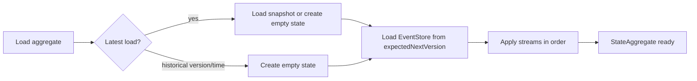
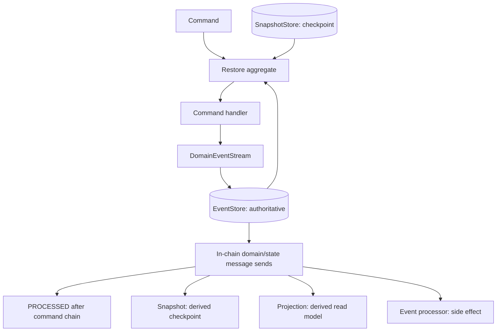

# Event Store

The event store is Wow's authoritative aggregate history. Appending a command's `DomainEventStream` is required for a successful `PROCESSED` result, but it is not sufficient: `ProcessedNotifierFilter` waits for the rest of the command filter chain, including in-chain event-bus sends. Snapshots accelerate loading, while projections and event processors derive other state or side effects; neither replaces event history.

## Event Sourcing

<center>


</center>

For the example `CreateOrder` command, the aggregate returns `OrderCreated`. Wow wraps that event in a stream containing the aggregate identity, `commandId`, `requestId`, version, headers, and ordered event bodies. Later commands restore `OrderState` by replaying that history.

The key ownership boundary is:

| Data | Role | Recovery source |
|---|---|---|
| domain event streams | authoritative business history | event store |
| snapshots | replaceable loading checkpoint/current-state materialization | rebuild from event history |
| projections | purpose-specific read model | replay/reprocess events according to projection recovery design |
| event-processor side effects | integration/application outcome | processor's idempotency, retry, and compensation design |

## Core Interface

```kotlin
interface EventStore :
    RequestIdExistenceChecker,
    AggregateIdScanner,
    AutoCloseable {
    fun append(eventStream: DomainEventStream): Mono<Void>

    fun load(
        aggregateId: AggregateId,
        headVersion: Int = 1,
        tailVersion: Int = Int.MAX_VALUE - 1,
    ): Flux<DomainEventStream>

    fun load(
        aggregateId: AggregateId,
        headEventTime: Long,
        tailEventTime: Long,
    ): Flux<DomainEventStream>

    fun single(aggregateId: AggregateId, version: Int): Mono<DomainEventStream>
    fun last(aggregateId: AggregateId): Mono<DomainEventStream>
}
```

Version and time ranges are inclusive. `AbstractEventStore` validates range arguments; the interface does not prescribe a storage engine, schema, transaction technology, or retry policy.

### Domain Event Stream

A `DomainEventStream` is the non-empty, ordered event batch produced by one command execution. All events in that stream belong to the same aggregate and share one stream/aggregate `version`; their `sequence` values increase from 1 within the stream. The stream retains `commandId` and `requestId`, which supports audit and duplicate lookup.

```kotlin
eventStore.append(eventStream)
    .thenReturn(eventStream)
```

`SimpleCommandAggregate` applies the emitted stream to its in-memory state before append, then calls `EventStore.append`. If append fails, command processing fails and the aggregate instance is expired; a retry restores state again rather than treating the uncommitted in-memory state as authoritative.

### Key Concepts

| Concept | Contract |
|---|---|
| `DomainEvent<T>` | immutable, named and revisioned business fact |
| `DomainEventStream` | events emitted by one command, correlated by command/request IDs |
| aggregate version | optimistic ordering boundary for append and replay |
| `requestId` | operation identity recorded with the stream; checked per aggregate |
| `EventStore` | append and history-load contract |
| `SnapshotStore` | separate replaceable checkpoint store |

## Aggregate State Reconstruction

For non-create commands, `RetryableAggregateProcessor` asks `StateAggregateRepository` for current state. `EventSourcingStateAggregateRepository`:

1. requests the latest snapshot when loading the latest version;
2. creates a fresh state aggregate when no snapshot exists;
3. loads event streams from `stateAggregate.expectedNextVersion` through the requested tail;
4. applies each stream with `stateAggregate.onSourcing`.


```mermaid
flowchart LR
    Load[Load aggregate] --> Snapshot{Latest load?}
    Snapshot -->|yes| Checkpoint[Load snapshot or create empty state]
    Snapshot -->|historical version/time| Empty[Create empty state]
    Checkpoint --> History[Load EventStore from expectedNextVersion]
    Empty --> History
    History --> Replay[Apply streams in order]
    Replay --> Ready[StateAggregate ready]
```

Historical version/time reconstruction does not use the latest snapshot, because a checkpoint from the future would corrupt the requested point in time.

## Event Sourcing Lifecycle

One successful command follows these ownership transitions:

1. `SENT`: the command bus accepted the command; no history append is proven.
2. Restore: non-create commands load snapshot plus later event history.
3. Execute: aggregate rules return a `DomainEventStream`.
4. Source: the new stream updates the working in-memory state.
5. Append: `EventStore.append` commits the new authoritative history.
6. Send: `SendDomainEventStreamFilter` sends the appended stream, then `SendStateEventFilter` attempts to send the resulting state event inside the command filter chain.
7. `PROCESSED`: `ProcessedNotifierFilter`, which wraps the chain with `ORDER_FIRST`, signals only after that chain completes or errors.
8. Independently, `SNAPSHOT`, `PROJECTED`, or `EVENT_HANDLED` reports that a selected downstream path completed; its signal may arrive before or after `PROCESSED`.

`DomainEventBus.send` propagates failure, so the caller can observe a failed `PROCESSED` even though append already committed authoritative history. The current state-event filter applies `logErrorResume()`: `StateEventBus.send` failures are logged and swallowed rather than failing `PROCESSED`. Downstream stage signals can race ahead of `PROCESSED`; `StageWaitState` retains an early target signal and waits for the `PROCESSED` prerequisite before final completion. These paths are not one global transaction.

## Architecture


```mermaid
flowchart TB
    Command[Command] --> Restore[Restore aggregate]
    EventStore[(EventStore: authoritative)] --> Restore
    SnapshotStore[(SnapshotStore: checkpoint)] --> Restore
    Restore --> Handler[Command handler]
    Handler --> Stream[DomainEventStream]
    Stream --> EventStore
    EventStore --> Bus[In-chain domain/state message sends]
    Bus --> Processed[PROCESSED after command chain]
    Bus --> Snapshot[Snapshot: derived checkpoint]
    Bus --> Projection[Projection: derived read model]
    Bus --> Processor[Event processor: side effect]
```

Applications should load aggregates through `StateAggregateRepository`, not manually merge event and snapshot data.

## Exception Handling

`EventStore.append` declares `EventVersionConflictException`, `DuplicateAggregateIdException`, and `DuplicateRequestIdException`. `AbstractEventStore` maps an initial-version conflict to `DuplicateAggregateIdException`; storage implementations are responsible for mapping their actual storage failures to the contract.

Do not assume every custom backend atomically checks version, aggregate creation, and request ID merely because the interface declares exceptions. Verify the chosen implementation and its contract tests.

A failed `PROCESSED` result is not proof that append failed. If an error occurred after append, retrying the command depends on stable `requestId` handling and the selected store's duplicate contract; query authoritative history by aggregate/request ID before treating the command as absent.

`RetryableAggregateProcessor` retries only failures classified as recoverable, with bounded backoff. That can re-run restoration and command processing, so handlers and injected services must respect their own retry/idempotency boundaries. Unrecoverable business errors fail immediately.

## Implementation Comparison

| Implementation | Typical role | Contract note |
|---|---|---|
| `InMemoryEventStore` | tests and local examples | volatile; not a production durability claim |
| MongoDB module | persistent event storage | validate actual indexes, write concern, topology, and module tests |
| Redis module | persistent event storage | validate Lua/script behavior, durability mode, and module tests |
| custom `EventStore` | application-specific backend | must define append atomicity, conflict mapping, ordering, and close behavior |

The core interface deliberately does not promise that all backends support identical operational features. For example, time-range loading or aggregate scanning may be unsupported by an implementation.

### Storage Schema Per Implementation

Schema and atomicity belong to the selected storage module, not `wow-core`. Before production use, verify at least:

- uniqueness and ordering keys for one aggregate stream;
- how `requestId` lookup is indexed or scanned;
- atomic behavior under concurrent append;
- serialization compatibility and event revision policy;
- backup, restore, retention, and corruption detection;
- behavior of range loading and aggregate scanning.

Do not copy a schema from this guide and treat it as proof of the running backend.

## Configuration

```yaml
wow:
  eventsourcing:
    store:
      storage: mongo
    snapshot:
      enabled: true
      strategy: all
      storage: mongo
```

The event and snapshot stores may use the same technology, but they remain separate contracts. Losing a snapshot should affect loading cost or current-state query availability, not redefine the authoritative history.

## Best Practices

1. Keep event payloads as immutable facts and test sourcing behavior.
2. Reuse one stable `requestId` when retrying the same command intent.
3. Treat successful `PROCESSED` as completion of the full command filter chain, not just append; on failure, check authoritative history because append may already have succeeded.
4. Restore through `StateAggregateRepository`; do not build a second replay algorithm in application code.
5. Test the selected backend's concurrency and duplicate behavior instead of generalizing from `EventStore` KDoc.
6. Make projections and external side effects replay-safe/idempotent, with explicit retry or compensation ownership.
7. Monitor version conflicts; persistent contention can indicate an aggregate-boundary problem.

## Related Topics

- [Snapshot](./snapshot) — loading checkpoints and `SNAPSHOT` semantics
- [Command Gateway](./command-gateway) — validation, idempotency, and wait stages
- [Event Processor](./event-processor) — downstream side effects and `EVENT_HANDLED`
- [Projection](./projection) — purpose-specific read models and `PROJECTED`
- [Saga](./saga) — cross-aggregate coordination
