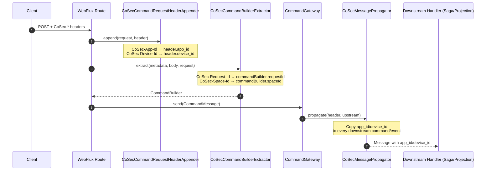

# CoSec

The CoSec extension integrates the [CoSec](https://github.com/Ahoo-Wang/CoSec) security framework with Wow's WebFlux command and query endpoints, handling security context injection and propagation.

::: danger Integration is not an authorization policy
`wow-cosec` reads and propagates CoSec context, but request headers alone do not authenticate a caller and the extension does not automatically authorize commands. Configure a trusted CoSec/Spring Security authentication chain and route policy; client-supplied tenant, owner, space, app, or device values are not authorization evidence. Query-side ABAC also requires an application-provided, fail-closed `AbacQueryFilter`. See [Data Access Control](../data-access.md#required-security-closure).
:::

## How It Works

CoSec integration provides four key components:

1. **CommandRequestHeaderAppender** — Extracts `CoSec-App-Id` and `CoSec-Device-Id` from HTTP request headers and appends them to command headers
2. **CommandBuilderExtractor** — Extracts `CoSec-Request-Id` and `CoSec-Space-Id` from HTTP request headers and injects them into the CommandBuilder
3. **MessagePropagator** — Propagates `app_id` and `device_id` from upstream message headers to downstream messages in the processing chain
4. **RewriteRequestCondition** — Resolves the query `spaceId` for snapshot/event-stream queries from the `CoSec-Space-Id` header (falling back to the request space), so read-side queries are scoped to the caller's space

## Installation

Add the `wow-cosec` dependency and enable the `cosec-support` capability in your Spring Boot Starter:

```kotlin [Gradle(Kotlin)]
implementation("me.ahoo.wow:wow-spring-boot-starter") {
    capabilities { requireCapability("cosec-support") }
}
```

## Auto-Configuration

When both `wow-cosec` and CoSec are on the classpath, the `CoSecAutoConfiguration` automatically registers the security integration beans. No additional configuration is required.

## Usage

The integration is transparent: clients send the CoSec headers on each command HTTP request, and the framework propagates them through the command pipeline so that downstream sagas, projections, and event handlers can observe the caller's app, device, request, and space context.

### Sending CoSec Headers

```http
POST /tenant/{tenantId}/owner/{ownerId}/sales-order
Content-Type: application/json
Command-Wait-Stage: PROCESSED
CoSec-App-Id: wow-shop
CoSec-Device-Id: 7f6e5d4c-3b2a-1f0e-9d8c-7b6a5f4e3d2c
CoSec-Request-Id: 550e8400-e29b-41d4-a716-446655440000
CoSec-Space-Id: production

{
  "items": [...]
}
```

With CoSec enabled, `CoSec-Space-Id` supplies the command `spaceId` when the standard `Wow-Space-Id` header is absent or blank. If both headers contain non-blank values, `Wow-Space-Id` takes precedence because the default extractor sets it first and `CoSecCommandBuilderExtractor` only fills an unset `spaceId`. The generated OpenAPI may still list the optional `Wow-Space-Id` header, so this example intentionally sends only `CoSec-Space-Id`.

### How the Context Flows



| Header | Extracted by | Injected into |
|---|---|---|
| `CoSec-App-Id` | `CoSecCommandRequestHeaderAppender` | command `header.app_id`, propagated to downstream messages |
| `CoSec-Device-Id` | `CoSecCommandRequestHeaderAppender` | command `header.device_id`, propagated to downstream messages |
| `CoSec-Request-Id` | `CoSecCommandBuilderExtractor` | `CommandBuilder.requestId` (idempotency) |
| `CoSec-Space-Id` | `CoSecCommandBuilderExtractor` + `CoSecRewriteRequestCondition` | `CommandBuilder.spaceId`; for read-side queries, `CoSecRewriteRequestCondition` resolves the `Wow-Space-Id` header first and falls back to `CoSec-Space-Id` only when it is blank |

To access the propagated context inside a handler, read it from the message header:

```kotlin
@StatelessSaga
class OrderSaga {
    fun onEvent(event: OrderCreated, exchange: DomainEventExchange<*>): Mono<Void> {
        val appId = exchange.message.header["app_id"]
        val deviceId = exchange.message.header["device_id"]
        // ... use the caller's app/device context
        return Mono.empty()
    }
}
```

## Completion Gates

- unauthenticated requests cannot access protected command or query routes;
- forged `CoSec-*`, `Wow-Space-Id`, tenant, or owner values cannot expand access;
- server-side policy binds identity to allowed scopes instead of trusting headers;
- a protected query rejects missing principal tags rather than falling back to `Condition.all()`;
- sagas, projections, and event handlers use propagated context only for audit or validated authorization decisions;
- integration tests cover anonymous, unauthorized, cross-tenant, and successful authorized paths.
