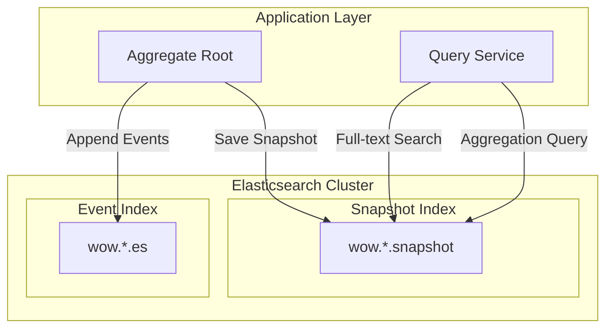

# Elasticsearch

The _Elasticsearch_ extension provides support for _Elasticsearch_, suitable for scenarios requiring full-text search and complex queries. It implements the following interfaces:

- `EventStore` - Event storage
- `EventStreamQueryService` - Event stream query service
- `SnapshotRepository` - Snapshot repository
- `SnapshotQueryService` - Snapshot query service

## Architecture Overview



## Installation

::: code-group
```kotlin [Gradle(Kotlin)]
implementation("me.ahoo.wow:wow-elasticsearch")
implementation("org.springframework.boot:spring-boot-starter-data-elasticsearch")
```
```groovy [Gradle(Groovy)]
implementation 'me.ahoo.wow:wow-elasticsearch'
implementation 'org.springframework.boot:spring-boot-starter-data-elasticsearch'
```
```xml [Maven]
<dependency>
    <groupId>me.ahoo.wow</groupId>
    <artifactId>wow-elasticsearch</artifactId>
    <version>${wow.version}</version>
</dependency>
<dependency>
    <groupId>org.springframework.boot</groupId>
    <artifactId>spring-boot-starter-data-elasticsearch</artifactId>
</dependency>
```
:::

## Configuration

### Spring Data Elasticsearch Configuration

```yaml
spring:
  elasticsearch:
    uris:
      - http://localhost:9200
    username: elastic
    password: your-password
```

### Wow Configuration

```yaml
wow:
  eventsourcing:
    store:
      storage: elasticsearch
    snapshot:
      storage: elasticsearch
```

## Index Naming Rules

| Data Type | Index Naming Format | Example |
|---------|------------|------|
| Event Stream | `wow.{contextName}.{aggregateName}.es` | `wow.order-service.order.es` |
| Snapshot | `wow.{contextName}.{aggregateName}.snapshot` | `wow.order-service.order.snapshot` |

## Configure Event Stream Index Template

```http request
POST _index_template/wow-event-stream-template
{
  "index_patterns": [
    "wow.*.es"
  ],
  "template": {
    "settings": {
      "number_of_shards": 3,
      "number_of_replicas": 2
    },
    "mappings": {
      "properties": {
        "aggregateId": {
          "type": "keyword"
        },
        "aggregateName": {
          "type": "keyword"
        },
        "body": {
          "properties": {
            "bodyType": {
              "type": "keyword"
            },
            "id": {
                "type": "keyword"
            },
            "name": {
              "type": "keyword"
            },
            "revision": {
              "type": "keyword"
            }
          }
        },
        "commandId": {
          "type": "keyword"
        },
        "contextName": {
          "type": "keyword"
        },
        "createTime": {
          "type": "long"
        },
        "header": {
          "properties": {
            "upstream_id": {
              "type": "keyword"
            },
            "upstream_name": {
              "type": "keyword"
            }
          }
        },
        "id": {
          "type": "keyword"
        },
        "requestId": {
          "type": "keyword"
        },
        "tenantId": {
          "type": "keyword"
        },
        "version": {
          "type": "integer"
        }
      },
      "dynamic_templates": [
        {
          "string_as_keyword": {
            "match_mapping_type": "string",
            "mapping": {
              "type": "keyword"
            }
          }
        }
      ]
    }
  }
}
```

## Configure Snapshot Index Template

```http request
POST _index_template/wow-snapshot-template
{
  "index_patterns": [
    "wow.*.snapshot"
  ],
  "template": {
    "settings": {
      "number_of_shards": 3,
      "number_of_replicas": 2
    },
    "mappings": {
      "properties": {
        "contextName": {
          "type": "keyword"
        },
        "aggregateName": {
          "type": "keyword"
        },
        "tenantId": {
          "type": "keyword"
        },
        "aggregateId": {
          "type": "keyword"
        },
        "version": {
          "type": "integer"
        },
        "eventId": {
          "type": "keyword"
        },
        "firstOperator": {
          "type": "keyword"
        },
        "operator": {
          "type": "keyword"
        },
        "firstEventTime": {
          "type": "long"
        },
        "eventTime": {
          "type": "long"
        },
        "snapshotTime": {
          "type": "long"
        },
        "deleted": {
          "type": "boolean"
        },
        "state": {
          "properties": {
            "id": {
              "type": "keyword"
            },
            "tenantId": {
              "type": "keyword"
            }
          }
        }
      },
      "dynamic_templates": [
        {
          "id_string_as_keyword": {
            "match": "id",
            "match_mapping_type": "string",
            "mapping": {
              "type": "keyword"
            }
          }
        },
        {
          "id_suffix_string_as_keyword": {
            "match": "*Id",
            "match_mapping_type": "string",
            "mapping": {
              "type": "keyword"
            }
          }
        }
      ]
    }
  }
}
```

## Full-Text Search

Leverage Elasticsearch's full-text search capabilities for complex queries on snapshot state:

### Add Full-Text Index for State Fields

```http request
POST _index_template/wow-order-snapshot-template
{
  "index_patterns": [
    "wow.*.order.snapshot"
  ],
  "template": {
    "mappings": {
      "properties": {
        "state": {
          "properties": {
            "description": {
              "type": "text",
              "analyzer": "standard"
            },
            "customerName": {
              "type": "text",
              "fields": {
                "keyword": {
                  "type": "keyword"
                }
              }
            }
          }
        }
      }
    }
  }
}
```

### Execute Full-Text Search

```kotlin
// Use QueryService for full-text search
val condition = Condition.all()
    .match("state.description", "phone")
    .range("state.totalAmount", 100, 500)
    .limit(10)

snapshotQueryService.dynamicQuery(condition)
```

## Aggregation Queries

Elasticsearch provides powerful aggregation capabilities:

### Statistical Analysis

```kotlin
// Count orders by status
val aggregation = SearchRequest.of { s ->
    s.index("wow.order-service.order.snapshot")
        .aggregations("status_count") { a ->
            a.terms { t ->
                t.field("state.status")
            }
        }
}
```

### Time Range Aggregation

```kotlin
// Daily order amount statistics
val aggregation = SearchRequest.of { s ->
    s.index("wow.order-service.order.snapshot")
        .aggregations("daily_amount") { a ->
            a.dateHistogram { d ->
                d.field("eventTime")
                    .calendarInterval(CalendarInterval.Day)
            }
            .aggregations("total") { sa ->
                sa.sum { sum ->
                    sum.field("state.totalAmount")
                }
            }
        }
}
```

## Index Design Recommendations

### Sharding Strategy

```http request
PUT wow.order-service.order.snapshot
{
  "settings": {
    "number_of_shards": 5,
    "number_of_replicas": 1
  }
}
```

| Data Volume | Recommended Shards | Recommended Replicas |
|--------|---------|---------|
| < 1M | 1-3 | 1 |
| 1M-10M | 3-5 | 1-2 |
| > 10M | 5-10 | 2 |

### Index Lifecycle Management (ILM)

```http request
PUT _ilm/policy/wow-snapshot-policy
{
  "policy": {
    "phases": {
      "hot": {
        "actions": {
          "rollover": {
            "max_size": "50gb",
            "max_age": "30d"
          }
        }
      },
      "warm": {
        "min_age": "30d",
        "actions": {
          "shrink": {
            "number_of_shards": 1
          }
        }
      },
      "cold": {
        "min_age": "90d",
        "actions": {
          "freeze": {}
        }
      }
    }
  }
}
```

## Performance Optimization

### Bulk Indexing

The Elasticsearch extension supports bulk operations for optimized indexing performance:

```yaml
spring:
  elasticsearch:
    rest:
      connection-timeout: 5s
      read-timeout: 30s
```

### Query Optimization

1. **Use Filter Instead of Query**: Use filter for exact matches to improve cache hit rate
2. **Limit Returned Fields**: Use `_source` filtering to return only needed fields
3. **Pagination Optimization**: Use `search_after` instead of `from/size` for large result sets

## Troubleshooting

### Common Issues

#### 1. Index Mapping Conflict

**Solutions**:
- Check dynamic template configuration
- Use strict mapping mode

#### 2. Cluster Status Yellow or Red

**Solutions**:
- Check node status
- Add replicas or reallocate shards

#### 3. Slow Query Performance

**Solutions**:
- Optimize query statements
- Increase index shards
- Use caching

## Complete Configuration Example

```yaml
spring:
  elasticsearch:
    uris:
      - http://es-node-1:9200
      - http://es-node-2:9200
      - http://es-node-3:9200
    username: elastic
    password: your-password
    connection-timeout: 5s
    socket-timeout: 30s

wow:
  eventsourcing:
    store:
      storage: elasticsearch
    snapshot:
      enabled: true
      strategy: all
      storage: elasticsearch
```

## Best Practices

1. **Pre-define Mappings**: Create index templates in production to avoid dynamic mapping issues
2. **Appropriate Sharding**: Set appropriate shard count based on data volume, avoid too many small shards
3. **Use Aliases**: Use index aliases for zero-downtime migration
4. **Enable ILM**: Use index lifecycle management to automatically manage indexes
5. **Monitor Cluster**: Monitor cluster health status and performance metrics