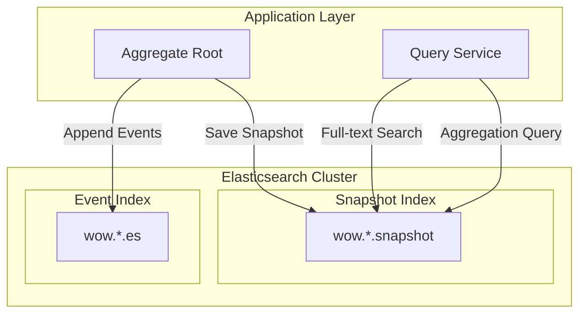

# Elasticsearch

The _Elasticsearch_ extension provides support for _Elasticsearch_, suitable for scenarios requiring full-text search and complex queries. It implements the following interfaces:

- `EventStore` - Event storage
- `EventStreamQueryService` - Event stream query service
- `SnapshotStore` - Snapshot store
- `SnapshotQueryService` - Snapshot query service

## Architecture Overview


```mermaid
flowchart TB
    subgraph Application["Application Layer"]
        AR[Aggregate Root]
        QS[Query Service]
    end
    
    subgraph Elasticsearch["Elasticsearch Cluster"]
        subgraph EventIndex["Event Index"]
            ES["wow.*.es"]
        end
        subgraph SnapshotIndex["Snapshot Index"]
            SS["wow.*.snapshot"]
        end
    end
    
    AR -->|Append Events| ES
    AR -->|Save Snapshot| SS
    QS -->|Full-text Search| SS
    QS -->|Aggregation Query| SS

```

## Installation

::: code-group
```kotlin [Gradle(Kotlin)]
implementation("me.ahoo.wow:wow-elasticsearch")
implementation("org.springframework.boot:spring-boot-starter-data-elasticsearch")
```
```groovy [Gradle(Groovy)]
implementation 'me.ahoo.wow:wow-elasticsearch'
implementation 'org.springframework.boot:spring-boot-starter-data-elasticsearch'
```
```xml [Maven]
<dependency>
    <groupId>me.ahoo.wow</groupId>
    <artifactId>wow-elasticsearch</artifactId>
    <version>${wow.version}</version>
</dependency>
<dependency>
    <groupId>org.springframework.boot</groupId>
    <artifactId>spring-boot-starter-data-elasticsearch</artifactId>
</dependency>
```
:::

## Configuration

### Spring Data Elasticsearch Configuration

```yaml
spring:
  elasticsearch:
    uris:
      - http://localhost:9200
    username: elastic
    password: your-password
```

### Wow Configuration

```yaml
wow:
  eventsourcing:
    store:
      storage: elasticsearch
    snapshot:
      storage: elasticsearch
```

- Configuration class: [ElasticsearchProperties](https://github.com/Ahoo-Wang/Wow/blob/main/wow-spring-boot-starter/src/main/kotlin/me/ahoo/wow/spring/boot/starter/elasticsearch/ElasticsearchProperties.kt)
- Prefix: `wow.elasticsearch.`

| Name | Data Type | Default Value | Description |
|---|---|---|---|
| `enabled` | `Boolean` | `true` | Whether to enable the Elasticsearch extension |
| `auto-init-template` | `Boolean` | `true` | Install required index templates before startup completes |
| `event-store-batch.enabled` | `Boolean` | `false` | Batch concurrent EventStore appends with Bulk `create` |
| `event-store-batch.max-size` | `Int` | `128` | Maximum event streams per bulk batch |
| `event-store-batch.max-delay` | `Duration` | `1ms` | Maximum wait used to collect a partial batch |
| `event-store-batch.max-pending-appends` | `Int` | `4096` | Maximum accepted appends waiting or being written; must be at least `max-size` |
| `event-store-batch.lane-count` | `Int` | `1` | Number of serial write lanes; appends for the same aggregate stay on one lane |
| `snapshot-store-batch.enabled` | `Boolean` | `false` | Batch concurrent SnapshotStore saves with Bulk scripted upserts |
| `snapshot-store-batch.max-size` | `Int` | `128` | Maximum snapshots per bulk batch |
| `snapshot-store-batch.max-delay` | `Duration` | `1ms` | Maximum wait used to collect a partial snapshot batch |
| `snapshot-store-batch.max-pending-saves` | `Int` | `4096` | Maximum accepted saves waiting or being written; must be at least `max-size` |
| `snapshot-store-batch.lane-count` | `Int` | `1` | Number of serial write lanes; saves for the same aggregate stay on one lane |

Required index templates are installed before application startup completes. A failed or unacknowledged request fails
startup. Set `wow.elasticsearch.auto-init-template=false` only when templates are managed externally. The built-in
templates intentionally leave shard and replica counts to the cluster or to a higher-priority operator template.

## Write Batching

EventStore and SnapshotStore write batching is opt-in:

```yaml
wow:
  elasticsearch:
    event-store-batch:
      enabled: true
      max-size: 128
      max-delay: 1ms
      max-pending-appends: 4096
      lane-count: 1
    snapshot-store-batch:
      enabled: true
      max-size: 128
      max-delay: 1ms
      max-pending-saves: 4096
      lane-count: 1
```

EventStore batches use Bulk `create`, so an existing event document is never
overwritten and an individual 409 remains an event-version conflict for only
that append. Bulk partial successes are returned to their corresponding callers.

SnapshotStore batches use Bulk `update` with scripted upserts. Direct saves use
the same atomic script: an incoming snapshot whose version is greater than or
equal to `_source.version` replaces the complete stored source, while a lower
version is a no-op. Equal-version replacement supports snapshot regeneration.
This also keeps pre-upgrade documents safe when their Elasticsearch
`_version` is an internal write counter rather than the aggregate version; no
version-metadata migration is required.

## Index Naming Rules

| Data Type | Index Naming Format | Example |
|---------|------------|------|
| Event Stream | `wow.{contextName}.{aggregateName}.es` | `wow.order-service.order.es` |
| Snapshot | `wow.{contextName}.{aggregateName}.snapshot` | `wow.order-service.order.snapshot` |

## Snapshot Query Field Resolution

On the first snapshot query for an aggregate index, Wow asynchronously loads the current Elasticsearch mapping and
compiles conditions and sorts from its physical field capabilities. The mapping is the only capability source; no
separate `QuerySchema` is maintained. The cache is isolated by index and has no TTL. A missing or incompatible cached
field triggers one automatic refresh. A successful refresh atomically replaces the cache; a failed refresh preserves
the previous cache and fails the current query closed.

Field selection follows these rules:

| Query operation | Mapping requirement |
|---|---|
| `EQ`, `NE`, `IN`, `NOT_IN`, `ALL_IN`, `TRUE`, `FALSE` | Term-query compatible |
| `CONTAINS`, `STARTS_WITH`, `ENDS_WITH` | `keyword` or `wildcard` |
| Range operations | numeric, date, or keyword |
| `MATCH` | `text`, `match_only_text`, or `search_as_you_type` |
| Sort | Indexed field sortable with `doc_values`, or a sortable runtime field |

For a multi-field, Wow tries the current field, `.keyword`/`.text`, `.exact`, and finally a single compatible child.
Multiple compatible children fail as ambiguous rather than silently changing semantics. `EXISTS`, `NULL`, `NOT_NULL`,
projection, and `RAW` remain logical fields; the parent of `ELEM_MATCH` must be mapped as `nested`. A custom
`ConditionConverter` retains ownership of its physical fields and bypasses this rewriting.

A field alias inherits the query and sort capabilities of its target while queries continue to use the alias name.
Runtime fields declared in the mapping also participate according to their type. They are evaluated at query time and
may be rejected by the cluster when `search.allow_expensive_queries=false`.

Each aggregate must resolve to one physical snapshot index. An alias or data stream that resolves to multiple indices
fails closed. Such a topology must be reduced to one physical index or handled by an application-specific `_field_caps`
query implementation.

## Actively Refresh a Mapping

Adding `org.springframework.boot:spring-boot-starter-actuator` registers an optional maintenance endpoint. It has no
access by default. Configure both access and Web exposure, and restrict it to a maintenance role in management endpoint
security:

```yaml
management:
  endpoint:
    wowElasticsearchMapping:
      access: unrestricted
  endpoints:
    web:
      exposure:
        include: health,wowElasticsearchMapping
```

Refresh the mapping for a registered aggregate on the current application instance:

```http request
POST /actuator/wowElasticsearchMapping/{contextName}/{aggregateName}
```

The endpoint does not accept arbitrary index expressions; it derives the index name from aggregate metadata. Its
response contains only `scope=LOCAL_INSTANCE`, `indexName`, `fieldCount`, `changed`, and `refreshedAt`, never the full
mapping. Elasticsearch credentials need `view_index_metadata` on the target index. Missing privileges, a missing index,
or an unparseable mapping fails the request without damaging a previously successful cache entry.

Refresh is local to the instance that receives the request. In a replicated deployment, operations must call each Pod;
there is no broadcast, scheduled refresh, or refresh-all operation. New queries use the refreshed mapping, while
in-flight queries continue with the mapping obtained when their compilation began.

## Configure Event Stream Index Template

```http request
POST _index_template/wow-event-stream-template
{
  "index_patterns": [
    "wow.*.es"
  ],
  "template": {
    "mappings": {
      "properties": {
        "aggregateId": {
          "type": "keyword"
        },
        "aggregateName": {
          "type": "keyword"
        },
        "body": {
          "properties": {
            "bodyType": {
              "type": "keyword"
            },
            "id": {
                "type": "keyword"
            },
            "name": {
              "type": "keyword"
            },
            "revision": {
              "type": "keyword"
            }
          }
        },
        "commandId": {
          "type": "keyword"
        },
        "contextName": {
          "type": "keyword"
        },
        "createTime": {
          "type": "long"
        },
        "header": {
          "properties": {
            "upstream_id": {
              "type": "keyword"
            },
            "upstream_name": {
              "type": "keyword"
            }
          }
        },
        "id": {
          "type": "keyword"
        },
        "requestId": {
          "type": "keyword"
        },
        "tenantId": {
          "type": "keyword"
        },
        "version": {
          "type": "integer"
        }
      },
      "dynamic_templates": [
        {
          "string_as_keyword": {
            "match_mapping_type": "string",
            "mapping": {
              "type": "keyword"
            }
          }
        }
      ]
    }
  }
}
```

## Configure Snapshot Index Template

```http request
POST _index_template/wow-snapshot-template
{
  "index_patterns": [
    "wow.*.snapshot"
  ],
  "template": {
    "mappings": {
      "properties": {
        "contextName": {
          "type": "keyword"
        },
        "aggregateName": {
          "type": "keyword"
        },
        "tenantId": {
          "type": "keyword"
        },
        "aggregateId": {
          "type": "keyword"
        },
        "version": {
          "type": "integer"
        },
        "eventId": {
          "type": "keyword"
        },
        "firstOperator": {
          "type": "keyword"
        },
        "operator": {
          "type": "keyword"
        },
        "firstEventTime": {
          "type": "long"
        },
        "eventTime": {
          "type": "long"
        },
        "snapshotTime": {
          "type": "long"
        },
        "deleted": {
          "type": "boolean"
        },
        "state": {
          "properties": {
            "id": {
              "type": "keyword"
            },
            "tenantId": {
              "type": "keyword"
            }
          }
        }
      },
      "dynamic_templates": [
        {
          "id_string_as_keyword": {
            "match": "id",
            "match_mapping_type": "string",
            "mapping": {
              "type": "keyword"
            }
          }
        },
        {
          "id_suffix_string_as_keyword": {
            "match": "*Id",
            "match_mapping_type": "string",
            "mapping": {
              "type": "keyword"
            }
          }
        }
      ]
    }
  }
}
```

## Full-Text Search

Leverage Elasticsearch's full-text search capabilities for complex queries on snapshot state:

### Add Full-Text Index for State Fields

```http request
POST _index_template/wow-order-snapshot-template
{
  "index_patterns": [
    "wow.*.order.snapshot"
  ],
  "priority": 100,
  "template": {
    "mappings": {
      "properties": {
        "state": {
          "properties": {
            "description": {
              "type": "text",
              "analyzer": "standard"
            },
            "customerName": {
              "type": "text",
              "fields": {
                "keyword": {
                  "type": "keyword"
                }
              }
            }
          }
        }
      }
    }
  }
}
```

The higher priority makes the aggregate template win over Wow's default snapshot template. The shortened example
shows only the custom fields; a production replacement must also include the required baseline snapshot mappings, or
compose both baseline and custom mappings from component templates.

### Execute Full-Text Search

```kotlin
// Use QueryService for full-text search
val condition = Condition.all()
    .match("state.description", "phone")
    .range("state.totalAmount", 100, 500)
    .limit(10)

snapshotQueryService.dynamicQuery(condition)
```

## Aggregation Queries

Elasticsearch provides powerful aggregation capabilities:

### Statistical Analysis

```kotlin
// Count orders by status
val aggregation = SearchRequest.of { s ->
    s.index("wow.order-service.order.snapshot")
        .aggregations("status_count") { a ->
            a.terms { t ->
                t.field("state.status")
            }
        }
}
```

### Time Range Aggregation

```kotlin
// Daily order amount statistics
val aggregation = SearchRequest.of { s ->
    s.index("wow.order-service.order.snapshot")
        .aggregations("daily_amount") { a ->
            a.dateHistogram { d ->
                d.field("eventTime")
                    .calendarInterval(CalendarInterval.Day)
            }
            .aggregations("total") { sa ->
                sa.sum { sum ->
                    sum.field("state.totalAmount")
                }
            }
        }
}
```

## Index Design Recommendations

### Sharding Strategy

```http request
PUT wow.order-service.order.snapshot
{
  "settings": {
    "number_of_shards": 5,
    "number_of_replicas": 1
  }
}
```

| Data Volume | Recommended Shards | Recommended Replicas |
|--------|---------|---------|
| < 1M | 1-3 | 1 |
| 1M-10M | 3-5 | 1-2 |
| > 10M | 5-10 | 2 |

### Index Lifecycle Management (ILM)

```http request
PUT _ilm/policy/wow-snapshot-policy
{
  "policy": {
    "phases": {
      "hot": {
        "actions": {
          "rollover": {
            "max_size": "50gb",
            "max_age": "30d"
          }
        }
      },
      "warm": {
        "min_age": "30d",
        "actions": {
          "shrink": {
            "number_of_shards": 1
          }
        }
      },
      "cold": {
        "min_age": "90d",
        "actions": {
          "freeze": {}
        }
      }
    }
  }
}
```

## Performance Optimization

### Bulk Indexing

The Elasticsearch extension supports bulk operations for optimized indexing performance:

```yaml
spring:
  elasticsearch:
    connection-timeout: 5s
    socket-timeout: 30s
```

### Query Optimization

1. **Use Filter Instead of Query**: Use filter for exact matches to improve cache hit rate
2. **Limit Returned Fields**: Use `_source` filtering to return only needed fields
3. **Full List Queries**: `ListQuery.limit=0` streams all matches with PIT + `search_after`; by default, limits from 1 through 10,000 use one request, while larger limits use the same internal pager. The 10,000 value is only the default internal batch size, not a result cap.
4. **Paged Queries**: `PagedQuery` keeps its `from/size` contract and remains subject to Elasticsearch `index.max_result_window`. Use a list query when the complete result set is required.

Set `wow.elasticsearch.query.batch-size` no higher than the target index's `index.max_result_window` when it is below 10,000. Increase `wow.elasticsearch.query.keep-alive` above its `1m` default when a slow subscriber may take longer than that to consume one batch.

## Troubleshooting

### Common Issues

#### 1. Index Mapping Conflict

**Solutions**:
- Check dynamic template configuration
- Use strict mapping mode

#### 2. Cluster Status Yellow or Red

**Solutions**:
- Check node status
- Add replicas or reallocate shards

#### 3. Slow Query Performance

**Solutions**:
- Optimize query statements
- Increase index shards
- Use caching

## Complete Configuration Example

```yaml
spring:
  elasticsearch:
    uris:
      - http://es-node-1:9200
      - http://es-node-2:9200
      - http://es-node-3:9200
    username: elastic
    password: your-password
    connection-timeout: 5s
    socket-timeout: 30s

wow:
  eventsourcing:
    store:
      storage: elasticsearch
    snapshot:
      enabled: true
      strategy: all
      storage: elasticsearch
```

## Best Practices

1. **Pre-define Mappings**: Create index templates in production to avoid dynamic mapping issues
2. **Appropriate Sharding**: Set appropriate shard count based on data volume, avoid too many small shards
3. **Use Aliases**: Use index aliases for zero-downtime migration
4. **Enable ILM**: Use index lifecycle management to automatically manage indexes
5. **Monitor Cluster**: Monitor cluster health status and performance metrics
