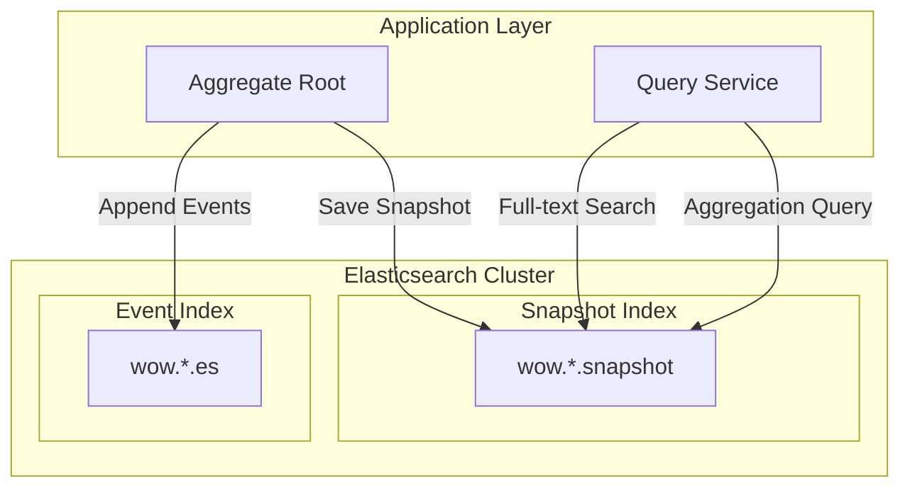

# Elasticsearch

The _Elasticsearch_ extension provides support for _Elasticsearch_, suitable for scenarios requiring full-text search and complex queries. It implements the following interfaces:

- `EventStore` - Event storage
- `EventStreamQueryService` - Event stream query service
- `SnapshotStore` - Snapshot store
- `SnapshotQueryService` - Snapshot query service

## Architecture Overview


```mermaid
flowchart TB
    subgraph Application["Application Layer"]
        AR[Aggregate Root]
        QS[Query Service]
    end
    
    subgraph Elasticsearch["Elasticsearch Cluster"]
        subgraph EventIndex["Event Index"]
            ES["wow.*.es"]
        end
        subgraph SnapshotIndex["Snapshot Index"]
            SS["wow.*.snapshot"]
        end
    end
    
    AR -->|Append Events| ES
    AR -->|Save Snapshot| SS
    QS -->|Full-text Search| SS
    QS -->|Aggregation Query| SS

```

## Installation

::: code-group
```kotlin [Gradle(Kotlin)]
implementation("me.ahoo.wow:wow-elasticsearch")
implementation("org.springframework.boot:spring-boot-starter-data-elasticsearch")
```
```groovy [Gradle(Groovy)]
implementation 'me.ahoo.wow:wow-elasticsearch'
implementation 'org.springframework.boot:spring-boot-starter-data-elasticsearch'
```
```xml [Maven]
<dependency>
    <groupId>me.ahoo.wow</groupId>
    <artifactId>wow-elasticsearch</artifactId>
    <version>${wow.version}</version>
</dependency>
<dependency>
    <groupId>org.springframework.boot</groupId>
    <artifactId>spring-boot-starter-data-elasticsearch</artifactId>
</dependency>
```
:::

## Configuration

### Spring Data Elasticsearch Configuration

```yaml
spring:
  elasticsearch:
    uris:
      - http://localhost:9200
    username: elastic
    password: ${ELASTICSEARCH_PASSWORD}
```

### Wow Configuration

```yaml
wow:
  eventsourcing:
    store:
      storage: elasticsearch
    snapshot:
      storage: elasticsearch
```

- Configuration class: [ElasticsearchProperties](https://github.com/Ahoo-Wang/Wow/blob/main/wow-spring-boot-starter/src/main/kotlin/me/ahoo/wow/spring/boot/starter/elasticsearch/ElasticsearchProperties.kt)
- Query configuration class: [ElasticsearchQueryProperties](https://github.com/Ahoo-Wang/Wow/blob/main/wow-spring-boot-starter/src/main/kotlin/me/ahoo/wow/spring/boot/starter/elasticsearch/ElasticsearchQueryProperties.kt)
- Prefix: `wow.elasticsearch.`

| Name | Data Type | Default Value | Description |
|---|---|---|---|
| `enabled` | `Boolean` | `true` | Whether to enable the Elasticsearch extension |
| `auto-init-template` | `Boolean` | `true` | Install required index templates before startup completes |
| `event-store-batch.enabled` | `Boolean` | `false` | Batch concurrent EventStore appends with Bulk `create` |
| `event-store-batch.max-size` | `Int` | `128` | Maximum event streams per bulk batch |
| `event-store-batch.max-delay` | `Duration` | `1ms` | Maximum wait used to collect a partial batch |
| `event-store-batch.max-pending-appends` | `Int` | `4096` | Maximum accepted appends waiting or being written; must be at least `max-size` |
| `event-store-batch.lane-count` | `Int` | `1` | Number of serial write lanes; appends for the same aggregate stay on one lane |
| `snapshot-store-batch.enabled` | `Boolean` | `false` | Batch concurrent SnapshotStore saves with Bulk scripted upserts |
| `snapshot-store-batch.max-size` | `Int` | `128` | Maximum snapshots per bulk batch |
| `snapshot-store-batch.max-delay` | `Duration` | `1ms` | Maximum wait used to collect a partial snapshot batch |
| `snapshot-store-batch.max-pending-saves` | `Int` | `4096` | Maximum accepted saves waiting or being written; must be at least `max-size` |
| `snapshot-store-batch.lane-count` | `Int` | `1` | Number of serial write lanes; saves for the same aggregate stay on one lane |
| `query.batch-size` | `Int` | `10000` | Internal PIT + `search_after` list-query batch size, in the range `1..10000` |
| `query.keep-alive` | `Duration` | `1m` | PIT keep-alive, which must be greater than `0` |

Required index templates are installed before application startup completes. A failed or unacknowledged request fails
startup. Set `wow.elasticsearch.auto-init-template=false` only when templates are managed externally. The built-in
templates intentionally leave shard and replica counts to the cluster or to a higher-priority operator template.

## Write Batching

EventStore and SnapshotStore write batching is opt-in:

```yaml
wow:
  elasticsearch:
    event-store-batch:
      enabled: true
      max-size: 128
      max-delay: 1ms
      max-pending-appends: 4096
      lane-count: 1
    snapshot-store-batch:
      enabled: true
      max-size: 128
      max-delay: 1ms
      max-pending-saves: 4096
      lane-count: 1
```

EventStore batches use Bulk `create`, so an existing event document is never
overwritten and an individual 409 remains an event-version conflict for only
that append. Bulk partial successes are returned to their corresponding callers.

SnapshotStore batches use Bulk `update` with scripted upserts. Direct saves use
the same atomic script: an incoming snapshot whose version is greater than or
equal to `_source.version` replaces the complete stored source, while a lower
version is a no-op. Equal-version replacement supports snapshot regeneration.
This also keeps pre-upgrade documents safe when their Elasticsearch
`_version` is an internal write counter rather than the aggregate version; no
version-metadata migration is required.

## Index Naming Rules

| Data Type | Index Naming Format | Example |
|---------|------------|------|
| Event Stream | `wow.{contextName}.{aggregateName}.es` | `wow.order-service.order.es` |
| Snapshot | `wow.{contextName}.{aggregateName}.snapshot` | `wow.order-service.order.snapshot` |

## Snapshot Query Field Resolution

On the first snapshot query for an aggregate index, Wow asynchronously loads the current Elasticsearch mapping and
compiles conditions and sorts from its physical field capabilities. The mapping is the only capability source; no
separate `QuerySchema` is maintained. The cache is isolated by index and has no TTL. A missing or incompatible cached
field fails the query without implicitly calling the mapping API; refresh the cache explicitly through the maintenance
endpoint after a mapping change.

Field selection follows these rules:

| Query operation | Mapping requirement |
|---|---|
| `EQ`, `NE`, `IN`, `NOT_IN`, `ALL_IN`, `TRUE`, `FALSE` | Term-query compatible, including supported doc-value-only fields |
| `CONTAINS`, `STARTS_WITH`, `ENDS_WITH` | `keyword` or `wildcard` |
| Range operations | numeric, date, ip, keyword, or `*_range`, including applicable `doc_values=true,index=false` fields |
| `MATCH` | `text`, `match_only_text`, `search_as_you_type`, or `semantic_text` |
| Sort | Sortable field with `doc_values`, indexed `text` with `fielddata`, or a sortable runtime field |

`_score`, `_doc`, and `_shard_doc` are Elasticsearch metadata sort fields. They bypass mapping field resolution and are
passed through unchanged. Because `text.fielddata=true` uses significant heap memory, a `keyword` multi-field is still
preferred in most cases. Sorting on doc-values and runtime fields does not require `index=true`.

Dynamic keys under a flattened field do not have individual mapping entries. For a concrete path such as
`state.labels.release`, the resolver walks up to the nearest flattened parent and preserves the original path for exact
and sort operations. Flattened values use keyword semantics, so sorting is lexicographic. Dynamic keys do not
automatically enable range operations; explicitly mapped typed sub-fields continue to use their own type capabilities.

For example, one logical field can support both full-text and exact operations:

```json
{
  "properties": {
    "state": {
      "properties": {
        "customerName": {
          "type": "text",
          "fields": {
            "keyword": { "type": "keyword" }
          }
        }
      }
    }
  }
}
```

| Query operation | Client field | Resolved field |
|---|---|---|
| `SEARCH` | `state.customerName` | `state.customerName` |
| `EQ`, `IN`, sort | `state.customerName` | `state.customerName.keyword` |
| projection | `state.customerName` | `state.customerName` (unchanged) |

Clients always use the logical field and do not need to hard-code `.keyword` or `.text`.

For a multi-field, Wow tries the current field, `.keyword`/`.text`, `.exact`, and finally a single compatible child.
Multiple compatible children fail as ambiguous rather than silently changing semantics. Projection remains on the
logical field; the parent of `ELEMENT_MATCH` must be mapped as `nested`. A custom
`AbstractElasticsearchConditionConverter` retains ownership of its physical fields and bypasses this rewriting.

A field alias inherits the query and sort capabilities of its target while queries continue to use the alias name.
Runtime fields declared in the mapping also participate according to their type. They are evaluated at query time and
may be rejected by the cluster when `search.allow_expensive_queries=false`. Projection still applies its logical path
to `_source`; it does not rewrite a field alias or runtime field to its target.

Each aggregate must resolve to one physical snapshot index. An alias or data stream that resolves to multiple indices
fails closed. Such a topology must be reduced to one physical index or handled by an application-specific `_field_caps`
query implementation.

## Actively Refresh a Mapping

Non-Spring construction paths can refresh their owned cache directly:

```kotlin
queryService.refreshIndexMapping().block()
queryServiceFactory.refreshIndexMapping(namedAggregate).block()
```

The factory method refreshes the resolver shared by services created from that factory. A directly constructed
`ElasticsearchSnapshotQueryService` refreshes its own resolver through the instance method.

Adding `org.springframework.boot:spring-boot-starter-actuator` registers an optional maintenance endpoint. It has no
access by default. Configure both access and Web exposure, and restrict it to a maintenance role in management endpoint
security:

::: code-group
```kotlin [Gradle(Kotlin)]
implementation("org.springframework.boot:spring-boot-starter-actuator")
```
```xml [Maven]
<dependency>
    <groupId>org.springframework.boot</groupId>
    <artifactId>spring-boot-starter-actuator</artifactId>
</dependency>
```
:::

```yaml
management:
  endpoint:
    wowElasticsearchMapping:
      access: unrestricted
  endpoints:
    web:
      exposure:
        include: health,wowElasticsearchMapping
```

Refresh the mapping for a registered aggregate on the current application instance:

```bash
curl -X POST \
  http://localhost:8080/actuator/wowElasticsearchMapping/order-service/order
```

Example response:

```json
{
  "scope": "LOCAL_INSTANCE",
  "indexName": "wow.order-service.order.snapshot",
  "fieldCount": 24,
  "changed": true,
  "refreshedAt": "2026-08-21T09:00:00Z"
}
```

The endpoint does not accept arbitrary index expressions; it derives the index name from aggregate metadata.
`fieldCount` is the number of parsed field paths, and `changed` reports whether the new capability model differs from
the previous one. The response never contains the full mapping. An unregistered aggregate returns `400 Bad Request`.

Elasticsearch credentials need `view_index_metadata` on the target index. Missing privileges, a missing index, or an
unparseable mapping fails the request without damaging a previously successful cache entry. Refresh only reloads the
query capability cache; it does not modify the Elasticsearch mapping, rebuild the index, or backfill old snapshots.

Refresh is local to the instance that receives the request. In a replicated deployment, operations must call each Pod;
there is no broadcast, scheduled refresh, or refresh-all operation. New queries use the refreshed mapping, while
in-flight queries continue with the mapping obtained when their compilation began.

Publish a mapping change in this order:

1. Update the target index mapping; complete any required reindex or snapshot rebuild first.
2. Call the refresh endpoint on every application Pod and verify the returned `fieldCount` and `changed` values.
3. Run representative exact, full-text, and sort queries against every Pod; reconcile result count, order, and snapshot version before completing the release.

## Configure Event Stream Index Template

The built-in templates disable automatic date detection; map domain date fields explicitly in an aggregate-specific
template. Event entries are `nested`, while `body[].body` remains available in `_source` but is not indexed, preventing
arbitrary payloads from breaking persistence through mapping conflicts. One event stream is limited to 10,000 events,
matching Elasticsearch's default nested-object limit.

Use relative child paths inside `ELEMENT_MATCH`; the resolver qualifies them against the nested parent:

```kotlin
filter {
    "body".elementMatch {
        "name" eq "Created"
    }
}
```

```json
{
  "filter": {
    "op": "ELEMENT_MATCH",
    "field": "body",
    "predicate": { "op": "EQ", "field": "name", "value": "Created" }
  }
}
```

Payload search or custom nested semantics require an application-owned higher-priority template and matching query
converter. That template must reproduce the complete built-in baseline because composable templates do not merge by
priority.

```http request
POST _index_template/wow-event-stream-template
{
  "index_patterns": [
    "wow.*.es"
  ],
  "template": {
    "mappings": {
      "date_detection": false,
      "properties": {
        "aggregateId": {
          "type": "keyword"
        },
        "aggregateName": {
          "type": "keyword"
        },
        "body": {
          "type": "nested",
          "properties": {
            "body": {
              "type": "object",
              "enabled": false
            },
            "bodyType": {
              "type": "keyword"
            },
            "id": {
                "type": "keyword"
            },
            "name": {
              "type": "keyword"
            },
            "revision": {
              "type": "keyword"
            }
          }
        },
        "commandId": {
          "type": "keyword"
        },
        "contextName": {
          "type": "keyword"
        },
        "createTime": {
          "type": "long"
        },
        "header": {
          "properties": {
            "upstream_id": {
              "type": "keyword"
            },
            "upstream_name": {
              "type": "keyword"
            }
          }
        },
        "id": {
          "type": "keyword"
        },
        "requestId": {
          "type": "keyword"
        },
        "tenantId": {
          "type": "keyword"
        },
        "ownerId": {
          "type": "keyword"
        },
        "spaceId": {
          "type": "keyword"
        },
        "version": {
          "type": "integer"
        }
      },
      "dynamic_templates": [
        {
          "string_as_keyword": {
            "match_mapping_type": "string",
            "mapping": {
              "type": "keyword",
              "ignore_above": 8191
            }
          }
        }
      ]
    }
  }
}
```

## Configure Snapshot Index Template

```http request
POST _index_template/wow-snapshot-template
{
  "index_patterns": [
    "wow.*.snapshot"
  ],
  "template": {
    "mappings": {
      "date_detection": false,
      "properties": {
        "contextName": {
          "type": "keyword"
        },
        "aggregateName": {
          "type": "keyword"
        },
        "tenantId": {
          "type": "keyword"
        },
        "aggregateId": {
          "type": "keyword"
        },
        "version": {
          "type": "integer"
        },
        "eventId": {
          "type": "keyword"
        },
        "ownerId": {
          "type": "keyword"
        },
        "spaceId": {
          "type": "keyword"
        },
        "firstOperator": {
          "type": "keyword"
        },
        "operator": {
          "type": "keyword"
        },
        "firstEventTime": {
          "type": "long"
        },
        "eventTime": {
          "type": "long"
        },
        "snapshotTime": {
          "type": "long"
        },
        "deleted": {
          "type": "boolean"
        },
        "tags": {
          "type": "object",
          "dynamic": true
        },
        "state": {
          "properties": {
            "id": {
              "type": "keyword"
            },
            "tenantId": {
              "type": "keyword"
            }
          }
        }
      },
      "dynamic_templates": [
        {
          "tags_strings_as_keyword": {
            "match_mapping_type": "string",
            "path_match": "tags.*",
            "mapping": {
              "type": "keyword",
              "ignore_above": 8191
            }
          }
        },
        {
          "id_string_as_keyword": {
            "match": "id",
            "match_mapping_type": "string",
            "mapping": {
              "type": "keyword",
              "ignore_above": 8191
            }
          }
        },
        {
          "id_suffix_string_as_keyword": {
            "match": "*Id",
            "match_mapping_type": "string",
            "mapping": {
              "type": "keyword",
              "ignore_above": 8191
            }
          }
        }
      ]
    }
  }
}
```

## Full-Text Search

Leverage Elasticsearch's full-text search capabilities for complex queries on snapshot state:

### Add Full-Text Index for State Fields

The following is only the custom `state.properties` fragment; do not submit it as an index template:

```json
{
  "state": {
    "properties": {
      "description": {
        "type": "text",
        "analyzer": "standard"
      },
      "customerName": {
        "type": "text",
        "fields": {
          "keyword": {
            "type": "keyword"
          }
        }
      }
    }
  }
}
```

To publish `wow-order-snapshot-template`, copy the complete built-in snapshot template shown above, merge this fragment
into `mappings.properties`, narrow `index_patterns`, and then set `priority: 100`. A higher-priority composable template
replaces Wow's default template instead of merging with it; never publish the fragment alone. Alternatively, build the
complete mapping from operator-owned baseline and custom component templates.

### Execute Full-Text Search

```kotlin
// Use QueryService for full-text search
listQuery {
    filter {
        search("phone", "state.description")
        "state.totalAmount".between(100, 500)
    }
    sort {
        "state.customerName".asc()
    }
    limit(10)
}.dynamicQuery(snapshotQueryService)
```

## Aggregation Queries

Elasticsearch provides powerful aggregation capabilities:

### Statistical Analysis

```kotlin
// Count orders by status
val aggregation = SearchRequest.of { s ->
    s.index("wow.order-service.order.snapshot")
        .aggregations("status_count") { a ->
            a.terms { t ->
                t.field("state.status")
            }
        }
}
```

### Time Range Aggregation

```kotlin
// Daily order amount statistics
val aggregation = SearchRequest.of { s ->
    s.index("wow.order-service.order.snapshot")
        .aggregations("daily_amount") { a ->
            a.dateHistogram { d ->
                d.field("eventTime")
                    .calendarInterval(CalendarInterval.Day)
            }
            .aggregations("total") { sa ->
                sa.sum { sum ->
                    sum.field("state.totalAmount")
                }
            }
        }
}
```

## Index Design Recommendations

### Sharding Strategy

```http request
PUT wow.order-service.order.snapshot
{
  "settings": {
    "number_of_shards": 5,
    "number_of_replicas": 1
  }
}
```

| Data Volume | Recommended Shards | Recommended Replicas |
|--------|---------|---------|
| < 1M | 1-3 | 1 |
| 1M-10M | 3-5 | 1-2 |
| > 10M | 5-10 | 2 |

### Index Lifecycle Management (ILM)

```http request
PUT _ilm/policy/wow-snapshot-policy
{
  "policy": {
    "phases": {
      "hot": {
        "actions": {
          "rollover": {
            "max_size": "50gb",
            "max_age": "30d"
          }
        }
      },
      "warm": {
        "min_age": "30d",
        "actions": {
          "shrink": {
            "number_of_shards": 1
          }
        }
      },
      "cold": {
        "min_age": "90d",
        "actions": {
          "freeze": {}
        }
      }
    }
  }
}
```

## Performance Optimization

### Bulk Indexing

The Elasticsearch extension supports bulk operations for optimized indexing performance:

```yaml
spring:
  elasticsearch:
    connection-timeout: 5s
    socket-timeout: 30s
```

### Query Optimization

1. **Use Filter Instead of Query**: Use filter for exact matches to improve cache hit rate
2. **Limit Returned Fields**: Use `_source` filtering to return only needed fields
3. **Full List Queries**: `ListQuery.limit=0` streams all matches with PIT + `search_after`; by default, limits from 1 through 10,000 use one request, while larger limits use the same internal pager. The 10,000 value is only the default internal batch size, not a result cap.
4. **Paged Queries**: `PagedQuery` keeps its `from/size` contract and remains subject to Elasticsearch `index.max_result_window`. Use a list query when the complete result set is required.

PIT list queries without an explicit `sort` scan only by `_shard_doc`, and their result order is not part of the contract. Add `_score DESC` explicitly when relevance order is required.

Set `wow.elasticsearch.query.batch-size` no higher than the target index's `index.max_result_window` when it is below 10,000. Increase `wow.elasticsearch.query.keep-alive` above its `1m` default when a slow subscriber may take longer than that to consume one batch.

## Troubleshooting

### Common Issues

#### 1. Query reports an unmapped, incompatible, or ambiguous multi-field

Inspect the current physical mapping with `GET /{indexName}/_mapping`, then call the active refresh endpoint. When
multiple compatible children are ambiguous, use the conventional `.keyword`, `.text`, or `.exact` child name.

#### 2. Refresh endpoint is unavailable or refresh fails

A `404` means the Actuator dependency, endpoint access, or Web exposure should be checked. A `400` means the
`contextName` or `aggregateName` is not registered. For an Elasticsearch error, verify the index and
`view_index_metadata` privilege. A failed refresh does not delete the previous cache entry.

#### 3. An alias or data stream cannot be resolved

Ensure the snapshot alias resolves to exactly one physical index. The resolver does not merge mappings from multiple
indices; applications that require that topology must implement a `_field_caps`-based query strategy.

#### 4. Old data is still unqueryable after updating a template and refreshing

An index template affects only indices created afterward, and mapping refresh only updates Wow's capability cache.
Depending on the mapping change, use `PUT /{indexName}/_mapping`, reindex, or rebuild snapshots, then reconcile result
counts, ordering, and snapshot versions.

#### 5. A runtime-field query is rejected

Check the cluster's `search.allow_expensive_queries` setting. If the restriction must remain, materialize frequently
queried fields in the physical mapping instead of relying on runtime fields.

## Complete Configuration Example

```yaml
spring:
  elasticsearch:
    uris:
      - http://es-node-1:9200
      - http://es-node-2:9200
      - http://es-node-3:9200
    username: elastic
    password: ${ELASTICSEARCH_PASSWORD}
    connection-timeout: 5s
    socket-timeout: 30s

wow:
  elasticsearch:
    query:
      batch-size: 10000
      keep-alive: 1m
  eventsourcing:
    store:
      storage: elasticsearch
    snapshot:
      enabled: true
      strategy: all
      storage: elasticsearch
```

## Best Practices

1. **Pre-define Mappings**: Install a higher-priority aggregate template before the first snapshot write so dynamic mapping cannot lock in the wrong type
2. **Appropriate Sharding**: Set appropriate shard count based on data volume, avoid too many small shards
3. **Limit Alias Topology**: An alias or data stream used by Wow snapshot queries must resolve to one physical index
4. **Reconcile After Rebuilds**: When a mapping change requires reindexing or snapshot rebuilding, verify result counts, ordering, and snapshot versions
5. **Monitor the Cluster**: Monitor cluster health, open PIT contexts, and query latency
