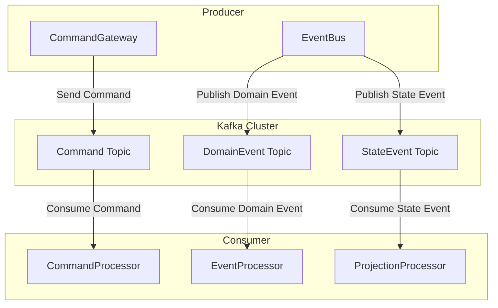

# Kafka

The _Kafka_ extension provides support for Apache Kafka, implementing `CommandBus`, `DomainEventBus`, and `StateEventBus`. It is the recommended message bus implementation for production environments.

## Architecture Overview



## Installation

::: code-group
```kotlin [Gradle(Kotlin)]
implementation("me.ahoo.wow:wow-kafka")
```
```groovy [Gradle(Groovy)]
implementation 'me.ahoo.wow:wow-kafka'
```
```xml [Maven]
<dependency>
    <groupId>me.ahoo.wow</groupId>
    <artifactId>wow-kafka</artifactId>
    <version>${wow.version}</version>
</dependency>
```
:::

## Configuration

- Configuration class: [KafkaProperties](https://github.com/Ahoo-Wang/Wow/blob/main/wow-spring-boot-starter/src/main/kotlin/me/ahoo/wow/spring/boot/starter/kafka/KafkaProperties.kt)
- Prefix: `wow.kafka.`

| Name                  | Data Type               | Description | Default Value |
|---------------------|-----------------------|-------------|---------------|
| `enabled`           | `Boolean`             | Whether to enable | `true` |
| `bootstrap-servers` | `List<String>`        | Kafka server addresses |  |
| `topic-prefix`      | `String`              | Topic prefix | `wow.` |
| `properties`        | `Map<String, String>` | Common configuration |  |
| `producer`          | `Map<String, String>` | Producer configuration |  |
| `consumer`          | `Map<String, String>` | Consumer configuration |  |

**YAML Configuration Example**

```yaml
wow:
  command:
    bus:
      type: kafka
  event:
    bus:
      type: kafka
  eventsourcing:
    state:
      bus:
        type: kafka
  kafka:
    bootstrap-servers: localhost:9092
    topic-prefix: 'wow.'
```

## Topic Naming Rules

The Kafka extension uses the following rules to generate Topic names:

| Message Type | Topic Naming Format | Example |
|---------|--------------|------|
| Command | `{prefix}{contextName}.{aggregateName}.command` | `wow.order-service.order.command` |
| DomainEvent | `{prefix}{contextName}.{aggregateName}.event` | `wow.order-service.order.event` |
| StateEvent | `{prefix}{contextName}.{aggregateName}.state` | `wow.order-service.order.state` |

::: tip
The `topic-prefix` configuration allows you to add a uniform prefix to all Topics, making it easier to distinguish between multiple environments or projects.
:::

## Partition Strategy

The Kafka extension uses the aggregate root ID as the partition key by default, ensuring that all messages for the same aggregate root are sent to the same partition, guaranteeing message ordering.

```mermaid
flowchart LR
    subgraph Messages["Messages"]
        M1["Order-001 Command"]
        M2["Order-002 Command"]
        M3["Order-001 Event"]
    end
    
    subgraph Partitions["Partitions"]
        P0["Partition 0"]
        P1["Partition 1"]
    end
    
    M1 -->|hash(Order-001)| P0
    M2 -->|hash(Order-002)| P1
    M3 -->|hash(Order-001)| P0
```

## Producer Optimization

```yaml
wow:
  kafka:
    producer:
      # Batch configuration
      batch.size: 16384
      linger.ms: 5
      # Compression configuration
      compression.type: lz4
      # Reliability configuration
      acks: all
      retries: 3
      # Idempotence
      enable.idempotence: true
```

| Configuration | Description | Recommended Value |
|-------|------|--------|
| `batch.size` | Batch size (bytes) | 16384 |
| `linger.ms` | Wait time (milliseconds) | 5 |
| `compression.type` | Compression type | lz4 |
| `acks` | Acknowledgment level | all |
| `enable.idempotence` | Idempotence | true |

## Consumer Optimization

```yaml
wow:
  kafka:
    consumer:
      # Fetch configuration
      fetch.min.bytes: 1024
      fetch.max.wait.ms: 500
      max.poll.records: 500
      # Auto commit configuration
      enable.auto.commit: false
      # Session timeout
      session.timeout.ms: 30000
      heartbeat.interval.ms: 10000
```

| Configuration | Description | Recommended Value |
|-------|------|--------|
| `fetch.min.bytes` | Minimum fetch bytes | 1024 |
| `max.poll.records` | Maximum poll records | 500 |
| `enable.auto.commit` | Auto commit | false |
| `session.timeout.ms` | Session timeout | 30000 |

## Consumer Groups

Each processor corresponds to an independent consumer group. The consumer group ID format is:

```
{contextName}.{processorName}
```

For example: `order-service.OrderProjectionProcessor`

## Troubleshooting

### Common Issues

#### 1. Connection Timeout

```
org.apache.kafka.common.errors.TimeoutException: Failed to update metadata
```

**Solutions**:
- Check if `bootstrap-servers` configuration is correct
- Confirm network connectivity
- Check if Kafka service is running normally

#### 2. Topic Does Not Exist

```
org.apache.kafka.common.errors.UnknownTopicOrPartitionException
```

**Solutions**:
- Confirm Kafka configuration allows auto topic creation
- Or manually create the required Topics

#### 3. Frequent Consumer Rebalancing

**Solutions**:
- Increase `session.timeout.ms` and `heartbeat.interval.ms`
- Optimize message processing performance
- Reduce `max.poll.records`

### Monitoring Metrics

The following Kafka metrics should be monitored:

| Metric | Description | Alert Threshold |
|------|------|---------|
| Consumer Lag | Consumption delay | > 10000 |
| Request Rate | Request rate | Based on business |
| Error Rate | Error rate | > 1% |
| Replication ISR | In-sync replicas | < Replication factor |

## Complete Configuration Example

```yaml
wow:
  command:
    bus:
      type: kafka
      local-first:
        enabled: true
  event:
    bus:
      type: kafka
      local-first:
        enabled: true
  eventsourcing:
    state:
      bus:
        type: kafka
        local-first:
          enabled: true
  kafka:
    enabled: true
    bootstrap-servers:
      - kafka-0:9092
      - kafka-1:9092
      - kafka-2:9092
    topic-prefix: 'wow.'
    properties:
      security.protocol: SASL_SSL
      sasl.mechanism: PLAIN
    producer:
      acks: all
      retries: 3
      batch.size: 16384
      linger.ms: 5
      compression.type: lz4
      enable.idempotence: true
    consumer:
      fetch.min.bytes: 1024
      fetch.max.wait.ms: 500
      max.poll.records: 500
      enable.auto.commit: false
      session.timeout.ms: 30000
      heartbeat.interval.ms: 10000
```

## Best Practices

1. **Enable LocalFirst Mode**: Reduce network latency and improve local message processing efficiency
2. **Configure Idempotence**: Enable `enable.idempotence` to ensure exactly-once message delivery
3. **Set Partition Count Appropriately**: Configure partitions based on consumer count and throughput requirements
4. **Monitor Consumer Lag**: Timely detect and handle consumption backlog issues
5. **Use Compression**: Enable LZ4 compression to reduce network transmission and storage overhead