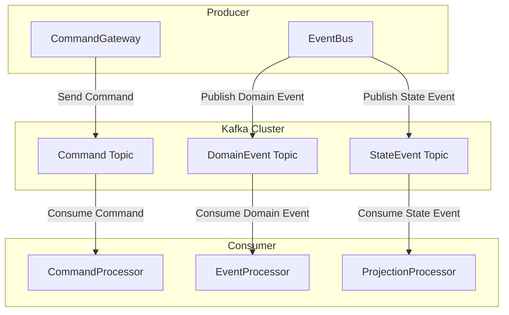
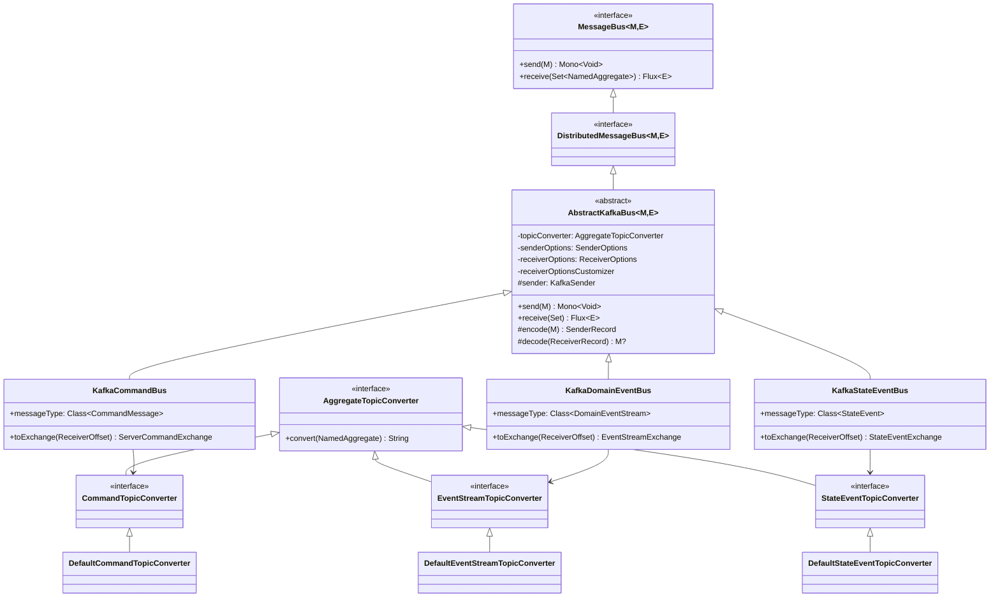
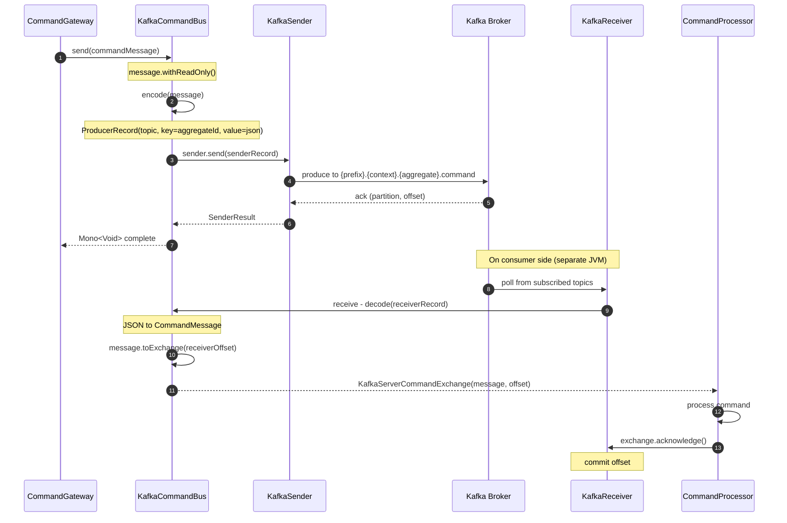
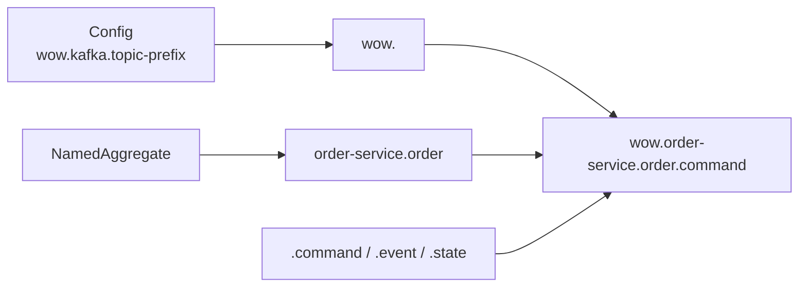
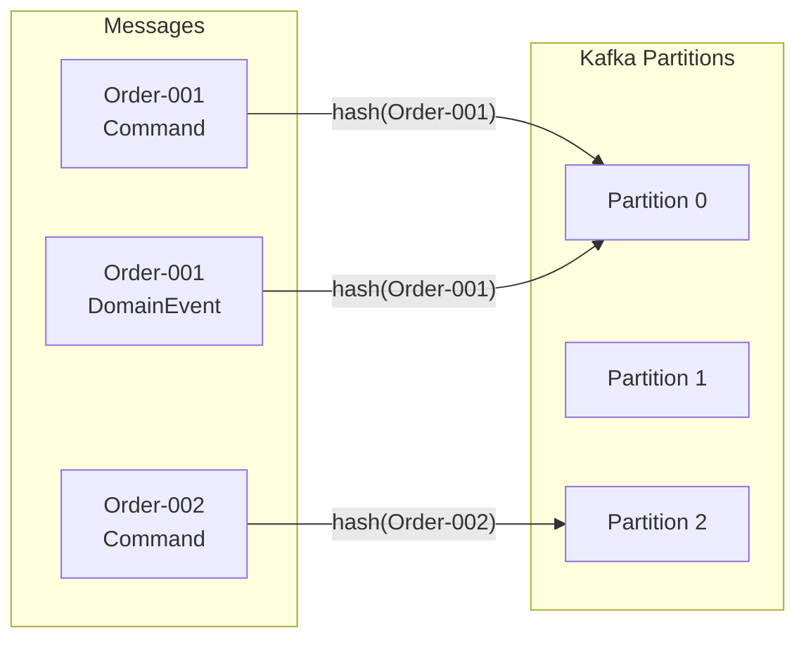
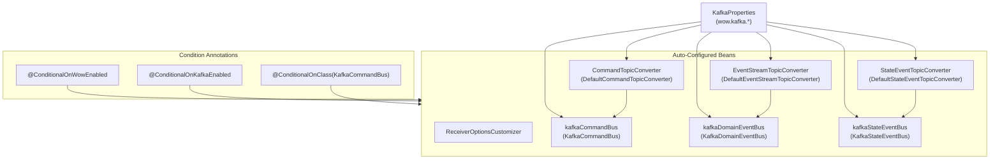

# Kafka

The _Kafka_ extension provides support for Apache Kafka, implementing `CommandBus`, `DomainEventBus`, and `StateEventBus`. It is the **default and recommended distributed message bus** implementation for production environments. All three concrete bus implementations -- `KafkaCommandBus`, `KafkaDomainEventBus`, and `KafkaStateEventBus` -- are built on top of a shared reactive pipeline powered by [reactor-kafka](https://projectreactor.io/docs/kafka/release/reference/).

## Architecture Overview

### High-Level Flow


```mermaid
flowchart TB
    subgraph Producer["Producer"]
        CG[CommandGateway]
        EB[EventBus]
    end
    
    subgraph Kafka["Kafka Cluster"]
        CT[Command Topic]
        DET[DomainEvent Topic]
        SET[StateEvent Topic]
    end
    
    subgraph Consumer["Consumer"]
        CP[CommandProcessor]
        EP[EventProcessor]
        PP[ProjectionProcessor]
    end
    
    CG -->|Send Command| CT
    EB -->|Publish Domain Event| DET
    EB -->|Publish State Event| SET
    
    CT -->|Consume Command| CP
    DET -->|Consume Domain Event| EP
    SET -->|Consume State Event| PP
```

### Class Hierarchy

All three Kafka bus implementations extend `AbstractKafkaBus`, which itself implements the `DistributedMessageBus` interface. Each bus specializes in one message type, producing and consuming from dedicated Kafka topics.


```mermaid
classDiagram
    direction TB
    class MessageBus~M,E~ {
        <<interface>>
        +send(M) Mono~Void~
        +receive(Set~NamedAggregate~) Flux~E~
    }
    class DistributedMessageBus~M,E~ {
        <<interface>>
    }
    class AbstractKafkaBus~M,E~ {
        <<abstract>>
        -topicConverter: AggregateTopicConverter
        -senderOptions: SenderOptions
        -receiverOptions: ReceiverOptions
        -receiverOptionsCustomizer
        #sender: KafkaSender
        +send(M) Mono~Void~
        +receive(Set) Flux~E~
        #encode(M) SenderRecord
        #decode(ReceiverRecord) M?
    }
    class KafkaCommandBus {
        +messageType: Class~CommandMessage~
        +toExchange(ReceiverOffset) ServerCommandExchange
    }
    class KafkaDomainEventBus {
        +messageType: Class~DomainEventStream~
        +toExchange(ReceiverOffset) EventStreamExchange
    }
    class KafkaStateEventBus {
        +messageType: Class~StateEvent~
        +toExchange(ReceiverOffset) StateEventExchange
    }
    class AggregateTopicConverter {
        <<interface>>
        +convert(NamedAggregate) String
    }
    class CommandTopicConverter {
        <<interface>>
    }
    class EventStreamTopicConverter {
        <<interface>>
    }
    class StateEventTopicConverter {
        <<interface>>
    }
    class DefaultCommandTopicConverter
    class DefaultEventStreamTopicConverter
    class DefaultStateEventTopicConverter

    MessageBus~M,E~ <|-- DistributedMessageBus~M,E~
    DistributedMessageBus~M,E~ <|-- AbstractKafkaBus~M,E~
    AbstractKafkaBus~M,E~ <|-- KafkaCommandBus
    AbstractKafkaBus~M,E~ <|-- KafkaDomainEventBus
    AbstractKafkaBus~M,E~ <|-- KafkaStateEventBus
    AggregateTopicConverter <|-- CommandTopicConverter
    AggregateTopicConverter <|-- EventStreamTopicConverter
    AggregateTopicConverter <|-- StateEventTopicConverter
    CommandTopicConverter <|-- DefaultCommandTopicConverter
    EventStreamTopicConverter <|-- DefaultEventStreamTopicConverter
    StateEventTopicConverter <|-- DefaultStateEventTopicConverter
    KafkaCommandBus --> CommandTopicConverter
    KafkaDomainEventBus --> EventStreamTopicConverter
    KafkaStateEventBus --> StateEventTopicConverter
```

The `AbstractKafkaBus` base class centralizes the entire reactive send/receive pipeline using `reactor-kafka`. It wraps a `KafkaSender` for producing messages and configures a `KafkaReceiver` per subscription for consuming them. Each concrete subclass only needs to declare its `messageType` (used for JSON deserialization) and a `toExchange` factory method that constructs the acknowledgment-bearing exchange object.

### Three Buses, Three Topic Kinds

| Bus | Core Interface | Message Type | Exchange Type | Topic Suffix | Source |
|---|---|---|---|---|---|
| `KafkaCommandBus` | `DistributedCommandBus` | `CommandMessage<*>` | `KafkaServerCommandExchange` | `.command` | [KafkaCommandBus.kt](https://github.com/Ahoo-Wang/Wow/blob/main/wow-kafka/src/main/kotlin/me/ahoo/wow/kafka/KafkaCommandBus.kt) |
| `KafkaDomainEventBus` | `DistributedDomainEventBus` | `DomainEventStream` | `KafkaEventStreamExchange` | `.event` | [KafkaDomainEventBus.kt](https://github.com/Ahoo-Wang/Wow/blob/main/wow-kafka/src/main/kotlin/me/ahoo/wow/kafka/KafkaDomainEventBus.kt) |
| `KafkaStateEventBus` | `DistributedStateEventBus` | `StateEvent<*>` | `KafkaStateEventExchange` | `.state` | [KafkaStateEventBus.kt](https://github.com/Ahoo-Wang/Wow/blob/main/wow-kafka/src/main/kotlin/me/ahoo/wow/kafka/KafkaStateEventBus.kt) |

## End-to-End Message Flow

The following sequence diagram traces the lifecycle of a command through the Kafka bus, from the `CommandGateway` through Kafka to the `CommandProcessor` on the receiving end. Domain events and state events follow an identical pattern with their respective topic converters and exchange types.


```mermaid
sequenceDiagram
    autonumber
    participant CG as CommandGateway
    participant KCB as KafkaCommandBus
    participant KS as KafkaSender
    participant K as Kafka Broker
    participant KR as KafkaReceiver
    participant CP as CommandProcessor

    CG->>KCB: send(commandMessage)
    Note over KCB: message.withReadOnly()
    KCB->>KCB: encode(message)
    Note over KCB: ProducerRecord(topic, key=aggregateId, value=json)
    KCB->>KS: sender.send(senderRecord)
    KS->>K: produce to {prefix}.{context}.{aggregate}.command
    K-->>KS: ack (partition, offset)
    KS-->>KCB: SenderResult
    KCB-->>CG: Mono<Void> complete

    Note over KR,K: On consumer side (separate JVM)
    K->>KR: poll from subscribed topics
    KR->>KCB: receive - decode(receiverRecord)
    Note over KCB: JSON to CommandMessage
    KCB->>KCB: message.toExchange(receiverOffset)
    KCB-->>CP: KafkaServerCommandExchange(message, offset)
    CP->>CP: process command
    CP->>KR: exchange.acknowledge()
    Note over KR: commit offset
```

Key behavioral characteristics visible in the flow:

1. **Non-blocking reactive pipeline**: Both `send` and `receive` return reactive types (`Mono<Void>`, `Flux<E>`) -- the sender never blocks.
2. **Read-only marking**: Every message is marked read-only before serialization at [AbstractKafkaBus.kt:57](https://github.com/Ahoo-Wang/Wow/blob/main/wow-kafka/src/main/kotlin/me/ahoo/wow/kafka/AbstractKafkaBus.kt#L57), preventing accidental mutation.
3. **Partition key is aggregate ID**: The record key is always set to `message.aggregateId.id` at [AbstractKafkaBus.kt:106](https://github.com/Ahoo-Wang/Wow/blob/main/wow-kafka/src/main/kotlin/me/ahoo/wow/kafka/AbstractKafkaBus.kt#L106), guaranteeing ordered processing per aggregate.
4. **Manual offset management**: Offsets are acknowledged explicitly via `exchange.acknowledge()` rather than auto-committed, giving the processor full control over at-least-once delivery semantics.

## Installation

::: code-group
```kotlin [Gradle(Kotlin)]
implementation("me.ahoo.wow:wow-kafka")
```
```groovy [Gradle(Groovy)]
implementation 'me.ahoo.wow:wow-kafka'
```
```xml [Maven]
<dependency>
    <groupId>me.ahoo.wow</groupId>
    <artifactId>wow-kafka</artifactId>
    <version>${wow.version}</version>
</dependency>
```
:::

When using `wow-spring-boot-starter`, the Kafka integration is included as an optional feature capability (`kafka-support`). Add it explicitly if the starter is used without the full dependency set:

```kotlin
implementation("me.ahoo.wow:wow-spring-boot-starter")
implementation("me.ahoo.wow:wow-kafka")
```

## Configuration

- Configuration class: [KafkaProperties](https://github.com/Ahoo-Wang/Wow/blob/main/wow-spring-boot-starter/src/main/kotlin/me/ahoo/wow/spring/boot/starter/kafka/KafkaProperties.kt)
- Prefix: `wow.kafka.`

| Name | Data Type | Required | Default Value | Description |
|---|---|---|---|---|
| `enabled` | `Boolean` | No | `true` | Whether to enable |
| `bootstrap-servers` | `List<String>` | **Yes** | -- | Kafka server addresses |
| `topic-prefix` | `String` | No | `wow.` | Topic prefix |
| `properties` | `Map<String, String>` | No | `{}` | Common configuration |
| `producer` | `Map<String, String>` | No | `{}` | Producer configuration |
| `consumer` | `Map<String, String>` | No | `{}` | Consumer configuration |

### Bus Type Selection

Each bus (command, domain event, state event) can independently select its implementation via the `*.bus.type` property. Kafka is the **default** for all three:

| Property | Default |
|---|---|
| `wow.command.bus.type` | `kafka` |
| `wow.event.bus.type` | `kafka` |
| `wow.eventsourcing.state.bus.type` | `kafka` |

Valid values are: `kafka`, `redis`, `in_memory`, `no_op`.

**YAML Configuration Example**

```yaml
wow:
  command:
    bus:
      type: kafka
  event:
    bus:
      type: kafka
  eventsourcing:
    state:
      bus:
        type: kafka
  kafka:
    bootstrap-servers: localhost:9092
    topic-prefix: 'wow.'
```

### SenderOptions and ReceiverOptions

The `KafkaProperties` class provides two builder methods that merge the common `properties` map with the type-specific `producer` or `consumer` maps:

- `buildSenderOptions()` -- merges `properties` + `producer`, auto-sets `KEY_SERIALIZER_CLASS_CONFIG` and `VALUE_SERIALIZER_CLASS_CONFIG` to `StringSerializer`.
- `buildReceiverOptions()` -- merges `properties` + `consumer`, auto-sets deserializers to `StringDeserializer`.

All serialization is performed at the application layer as JSON strings (via `message.toJsonString()` in [AbstractKafkaBus.kt:108](https://github.com/Ahoo-Wang/Wow/blob/main/wow-kafka/src/main/kotlin/me/ahoo/wow/kafka/AbstractKafkaBus.kt#L108)), so the Kafka client only needs to transport raw strings. This avoids coupling the broker to any domain-specific serialization format.

### Receiver Retry Policy

When a `KafkaReceiver` encounters a transient error during polling, it retries up to **3 times with a 10-second backoff** before propagating the error:

```kotlin
internal val DEFAULT_RECEIVE_RETRY_SPEC: RetryBackoffSpec = Retry.backoff(3, Duration.ofSeconds(10))
```

## Topic Naming Rules

Topics are derived from three components: the configurable **prefix**, the **named aggregate** (context + aggregate name), and a **fixed suffix** per bus type.


```mermaid
graph LR
    Config[Config<br>wow.kafka.topic-prefix] --> Prefix["wow."]
    Named[NamedAggregate] --> Ident["order-service.order"]
    Prefix --> Topic
    Ident --> Topic
    Suffix[".command / .event / .state"] --> Topic
    Topic["wow.order-service.order.command"]
```

| Message Type | Topic Naming Format | Example |
|---|---|---|
| Command | `{prefix}{contextName}.{aggregateName}.command` | `wow.order-service.order.command` |
| DomainEvent | `{prefix}{contextName}.{aggregateName}.event` | `wow.order-service.order.event` |
| StateEvent | `{prefix}{contextName}.{aggregateName}.state` | `wow.order-service.order.state` |

::: tip
The `topic-prefix` configuration allows you to add a uniform prefix to all Topics, making it easier to distinguish between multiple environments or projects. The topic prefix defaults to `"wow."` (the `Wow.WOW_PREFIX` constant defined at [Wow.kt:37](https://github.com/Ahoo-Wang/Wow/blob/main/wow-api/src/main/kotlin/me/ahoo/wow/api/Wow.kt#L37)), but can be customized for multi-tenant or multi-environment deployments.
:::

## Partition Strategy

The Kafka extension uses the aggregate root ID as the partition key by default, ensuring that all messages for the same aggregate root are sent to the same partition, guaranteeing message ordering.


```mermaid
flowchart LR
    subgraph Messages["Messages"]
        C1["Order-001<br>Command"]
        C2["Order-002<br>Command"]
        E1["Order-001<br>DomainEvent"]
    end
    subgraph Partitions["Kafka Partitions"]
        P0["Partition 0"]
        P1["Partition 1"]
        P2["Partition 2"]
    end
    C1 -->|"hash(Order-001)"| P0
    C2 -->|"hash(Order-002)"| P2
    E1 -->|"hash(Order-001)"| P0
```

This design is foundational for Event Sourcing: events must be consumed in publish-order to reconstruct aggregate state correctly. The partition key enforcement at the broker level makes this resilient across consumer rebalances.

## Auto-Configuration

The `KafkaAutoConfiguration` class wires all beans when Kafka is enabled and the `wow-kafka` module is on the classpath.

### Bean Wiring


```mermaid
graph TB
    subgraph Conditions["Condition Annotations"]
        C1["@ConditionalOnWowEnabled"]
        C2["@ConditionalOnKafkaEnabled"]
        C3["@ConditionalOnClass(KafkaCommandBus)"]
    end
    subgraph Beans["Auto-Configured Beans"]
        B1["ReceiverOptionsCustomizer"]
        B2["CommandTopicConverter<br>(DefaultCommandTopicConverter)"]
        B3["kafkaCommandBus<br>(KafkaCommandBus)"]
        B4["EventStreamTopicConverter<br>(DefaultEventStreamTopicConverter)"]
        B5["kafkaDomainEventBus<br>(KafkaDomainEventBus)"]
        B6["StateEventTopicConverter<br>(DefaultStateEventTopicConverter)"]
        B7["kafkaStateEventBus<br>(KafkaStateEventBus)"]
    end
    Config["KafkaProperties<br>(wow.kafka.*)"] --> B2
    Config --> B3
    Config --> B4
    Config --> B5
    Config --> B6
    Config --> B7

    B2 --> B3
    B4 --> B5
    B6 --> B7

    C1 --> Beans
    C2 --> Beans
    C3 --> Beans
```

Each bus bean is guarded by a `@ConditionalOnProperty` check against the corresponding `*.bus.type` property. This means you can selectively disable Kafka for specific message types:

```yaml
wow:
  command:
    bus:
      type: kafka       # Commands via Kafka (default)
  event:
    bus:
      type: in_memory   # Domain events locally only
  eventsourcing:
    state:
      bus:
        type: kafka     # State events via Kafka
```

### ConditionalOnKafkaEnabled

The custom `@ConditionalOnKafkaEnabled` annotation is a focused composition that enables/disables the entire `KafkaAutoConfiguration` class. It checks `wow.kafka.enabled = true` (matching if missing).

### ReceiverOptionsCustomizer

The `ReceiverOptionsCustomizer` interface allows injecting custom behavior into the `KafkaReceiver` creation pipeline. Each concrete bus accepts an optional customizer, and the auto-configuration registers a `NoOpReceiverOptionsCustomizer` as the default.

## Producer Optimization

```yaml
wow:
  kafka:
    producer:
      # Batch configuration
      batch.size: 16384
      linger.ms: 5
      # Compression configuration
      compression.type: lz4
      # Reliability configuration
      acks: all
      retries: 3
      # Idempotence
      enable.idempotence: true
```

| Configuration | Description | Recommended Value |
|---|---|---|
| `batch.size` | Batch size (bytes) | 16384 |
| `linger.ms` | Wait time (milliseconds) | 5 |
| `compression.type` | Compression type | lz4 |
| `acks` | Acknowledgment level | all |
| `enable.idempotence` | Idempotence | true |

## Consumer Optimization

```yaml
wow:
  kafka:
    consumer:
      # Fetch configuration
      fetch.min.bytes: 1024
      fetch.max.wait.ms: 500
      max.poll.records: 500
      # Auto commit configuration
      enable.auto.commit: false
      # Session timeout
      session.timeout.ms: 30000
      heartbeat.interval.ms: 10000
```

| Configuration | Description | Recommended Value |
|---|---|---|
| `fetch.min.bytes` | Minimum fetch bytes | 1024 |
| `max.poll.records` | Maximum poll records | 500 |
| `enable.auto.commit` | Auto commit | false |
| `session.timeout.ms` | Session timeout | 30000 |

## Consumer Groups

Each processor corresponds to an independent Kafka consumer group. The consumer group ID format is:

```
{contextName}.{processorName}
```

For example: `order-service.OrderProjectionProcessor`

This is set at [AbstractKafkaBus.kt:81-84](https://github.com/Ahoo-Wang/Wow/blob/main/wow-kafka/src/main/kotlin/me/ahoo/wow/kafka/AbstractKafkaBus.kt#L81-L84), where the `ConsumerConfig.GROUP_ID_CONFIG` property is dynamically injected into the `ReceiverOptions` based on the current processing context. This ensures each processor instance independently tracks its own offset, enabling parallel consumption across processor types while maintaining ordering within each consumer group.

## Key Design Decisions

### 1. String Serialization at the Kafka Layer

The Kafka client always uses `StringSerializer`/`StringDeserializer`. Domain objects are serialized to JSON strings by the application (`message.toJsonString()`) before being handed to the producer. This decouples the Kafka wire format from the domain serialization format -- you can change serialization strategies without touching Kafka configuration.

### 2. Read-Only Message Protection

Before serialization, each message is marked as read-only via `message.withReadOnly()` at [AbstractKafkaBus.kt:57](https://github.com/Ahoo-Wang/Wow/blob/main/wow-kafka/src/main/kotlin/me/ahoo/wow/kafka/AbstractKafkaBus.kt#L57). This prevents accidental mutation of message state during transmission, a critical invariant for Event Sourcing where events must be immutable.

### 3. Manual Offset Acknowledgment

Auto-commit is disabled by the framework. Instead, each `Exchange` implementation wraps a `ReceiverOffset` and exposes an `acknowledge()` method. The processor calls this after successful processing, giving full control over at-least-once semantics. If processing fails, the offset is not acknowledged and the message is re-delivered.

### 4. Correlation Metadata for Send Feedback

When sending, each `SenderRecord` carries a `Sinks.Empty<Void>` as correlation metadata. The send result is either an error-emit or an empty-completion, providing back-pressure-aware send confirmation to the caller.

## Monitoring and Observability

While Kafka broker metrics (consumer lag, request rate, ISR) should be monitored at the infrastructure level, the Wow framework contributes several application-level signals:

| Signal | Source | What It Reveals |
|---|---|---|
| Send errors | `doOnNext` in [AbstractKafkaBus.kt](https://github.com/Ahoo-Wang/Wow/blob/main/wow-kafka/src/main/kotlin/me/ahoo/wow/kafka/AbstractKafkaBus.kt) | Kafka broker unavailability, topic creation issues |
| Decode errors | `decode()` in [AbstractKafkaBus.kt](https://github.com/Ahoo-Wang/Wow/blob/main/wow-kafka/src/main/kotlin/me/ahoo/wow/kafka/AbstractKafkaBus.kt) | Schema/version mismatch, corrupted messages |
| Receiver retry | `DEFAULT_RECEIVE_RETRY_SPEC` | Transient broker/network failures |
| Close events | `close()` in [AbstractKafkaBus.kt](https://github.com/Ahoo-Wang/Wow/blob/main/wow-kafka/src/main/kotlin/me/ahoo/wow/kafka/AbstractKafkaBus.kt) | Graceful shutdown coverage |

## Troubleshooting

### Common Issues

#### 1. Connection Timeout

```
org.apache.kafka.common.errors.TimeoutException: Failed to update metadata
```

**Solutions**:
- Verify `wow.kafka.bootstrap-servers` addresses are reachable from the application host.
- Check network connectivity and firewall rules between the application and Kafka brokers.
- Confirm the Kafka broker process is running and listening on the configured ports.

#### 2. Unknown Topic or Partition

```
org.apache.kafka.common.errors.UnknownTopicOrPartitionException
```

**Solutions**:
- Ensure the Kafka broker has `auto.create.topics.enable=true` (default), or pre-create the required topics manually.
- Verify the `topic-prefix` configuration matches the expected topic names.

#### 3. Frequent Consumer Rebalancing

**Symptom**: Consumer groups experience repeated rebalances, causing processing pauses.

**Solutions**:
- Increase `session.timeout.ms` and `heartbeat.interval.ms` in the consumer configuration.
- Reduce `max.poll.records` to shorten the time between polls.
- Ensure message processing time is consistently below `max.poll.interval.ms` (default 5 minutes).

#### 4. Message Decoding Failures

**Symptom**: Error logs from `decode()` showing `Failed to decode ReceiverRecord`

**Solutions**:
- Verify all producers and consumers are running the same version of `wow-kafka` and domain model classes.
- Check that the domain event or command class has not been modified in a backward-incompatible way.
- Use schema evolution strategies for production deployments.

### Monitoring Metrics

The following Kafka metrics should be monitored:

| Metric | Description | Alert Threshold |
|---|---|---|
| Consumer Lag | Consumption delay | > 10000 |
| Request Rate | Request rate | Based on business |
| Error Rate | Error rate | > 1% |
| Replication ISR | In-sync replicas | < Replication factor |

## Complete Configuration Example

```yaml
wow:
  command:
    bus:
      type: kafka
      local-first:
        enabled: true
  event:
    bus:
      type: kafka
      local-first:
        enabled: true
  eventsourcing:
    state:
      bus:
        type: kafka
        local-first:
          enabled: true
  kafka:
    enabled: true
    bootstrap-servers:
      - kafka-0:9092
      - kafka-1:9092
      - kafka-2:9092
    topic-prefix: 'wow.'
    properties:
      security.protocol: SASL_SSL
      sasl.mechanism: PLAIN
    producer:
      acks: all
      retries: 3
      batch.size: 16384
      linger.ms: 5
      compression.type: lz4
      enable.idempotence: true
    consumer:
      fetch.min.bytes: 1024
      fetch.max.wait.ms: 500
      max.poll.records: 500
      enable.auto.commit: false
      session.timeout.ms: 30000
      heartbeat.interval.ms: 10000
```

## Best Practices

1. **Enable LocalFirst Mode**: The `local-first` bus configuration (enabled by default) routes messages locally within the same JVM when the handler is co-located, reducing Kafka round-trips for intra-service communication.
2. **Enable Idempotent Producer**: Set `enable.idempotence: true` in the producer configuration to guarantee exactly-once delivery at the producer level, preventing duplicate messages during retry scenarios.
3. **Use Compression**: Enable `compression.type: lz4` in the producer configuration to reduce network bandwidth and storage overhead. LZ4 offers an excellent balance of compression ratio and CPU cost.
4. **Match Partition Count to Topology**: Configure the number of Kafka partitions based on the expected consumer parallelism. Since ordering is per-partition (per aggregate ID), a higher partition count increases parallelism but does not affect ordering guarantees.
5. **Monitor Consumer Lag**: Track consumer group lag as a primary health metric. Lag exceeding the business SLA threshold indicates processing bottlenecks that need investigation.
6. **Test with Testcontainers**: The `wow-kafka` test dependencies include `testcontainers-kafka`. Use `wow-tck` (Technology Compatibility Kit) tests as a reference for integration testing patterns.
7. **Customize the Topic Prefix Per Environment**: Use distinct `topic-prefix` values for development, staging, and production to isolate message streams (e.g., `dev.wow.`, `staging.wow.`, `wow.`).

## Related Topics

| Topic | Description |
|---|---|
| [Configuration Reference](../../reference/config/kafka.md) | Complete property reference for `wow.kafka.*` |
| [Spring Boot Starter](spring-boot-starter.md) | Auto-configuration and feature variants |
| [Command Gateway](../command-gateway.md) | Command gateway and wait strategies |
| [Event Processor](../event-processor.md) | Event processing pipeline |
| [Observability](../advanced/observability.md) | Monitoring and tracing integration |
| [Configuration](../configuration.md) | Framework configuration principles |
