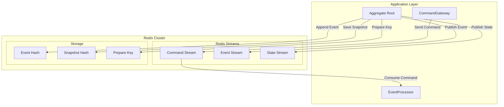

# Redis

The _Redis_ extension provides support for Redis, suitable for scenarios requiring high performance and low latency. It implements the following interfaces:

- `CommandBus` - Command bus
- `DomainEventBus` - Domain event bus
- `StateEventBus` - State event bus
- `EventStore` - Event storage
- `SnapshotRepository` - Snapshot repository
- `PrepareKey` - Prepare key

## Architecture Overview



## Installation

::: code-group
```kotlin [Gradle(Kotlin)]
implementation("me.ahoo.wow:wow-redis")
implementation("org.springframework.boot:spring-boot-starter-data-redis-reactive")
```
```groovy [Gradle(Groovy)]
implementation 'me.ahoo.wow:wow-redis'
implementation 'org.springframework.boot:spring-boot-starter-data-redis-reactive'
```
```xml [Maven]
<dependency>
    <groupId>me.ahoo.wow</groupId>
    <artifactId>wow-redis</artifactId>
    <version>${wow.version}</version>
</dependency>
<dependency>
    <groupId>org.springframework.boot</groupId>
    <artifactId>spring-boot-starter-data-redis-reactive</artifactId>
</dependency>
```
:::

## Configuration

- Configuration class: [RedisProperties](https://github.com/Ahoo-Wang/Wow/blob/main/wow-spring-boot-starter/src/main/kotlin/me/ahoo/wow/spring/boot/starter/redis/RedisProperties.kt)
- Prefix: `wow.redis.`

| Name                  | Data Type               | Description | Default Value |
|---------------------|-----------------------|-------------|---------------|
| `enabled`           | `Boolean`             | Whether to enable | `true` |

**YAML Configuration Example**

```yaml
spring:
  data:
    redis:
      host: localhost
      port: 6379
      password: your-password

wow:
  command:
    bus:
      type: redis
  event:
    bus:
      type: redis
  eventsourcing:
    store:
      storage: redis
    snapshot:
      storage: redis
    state:
      bus:
        type: redis
  redis:
    enabled: true
```

## Command Bus

The Redis command bus uses Redis Streams for message delivery:

### Stream Naming Rules

```
{prefix}{contextName}.{aggregateName}.command
```

Example: `wow.order-service.order.command`

### Consumer Groups

Each processor corresponds to a consumer group:

```
{contextName}.{processorName}
```

## Event Bus

### Domain Event Stream

```
{prefix}{contextName}.{aggregateName}.event
```

### State Event Stream

```
{prefix}{contextName}.{aggregateName}.state
```

## Event Store

Redis event store uses Hash structure for event stream storage:

### Data Structure

```
Key: {prefix}{contextName}.{aggregateName}:{aggregateId}:es
Field: {version}
Value: {eventStreamJson}
```

### Request Idempotency

A separate Key is used to store request IDs for idempotency:

```
Key: {prefix}{contextName}.{aggregateName}:{aggregateId}:req:{requestId}
TTL: Configured expiration time
```

## Snapshot Storage

Snapshots are stored using Hash structure:

```
Key: {prefix}{contextName}.{aggregateName}:{aggregateId}:snapshot
Value: {snapshotJson}
```

## Prepare Key

PrepareKey uses String structure:

```
Key: {prefix}prepare:{keyName}:{key}
Value: {preparedValue}
TTL: Based on configuration or permanent
```

## Connection Pool Configuration

```yaml
spring:
  data:
    redis:
      lettuce:
        pool:
          min-idle: 8
          max-idle: 16
          max-active: 32
          max-wait: 1000ms
```

| Parameter | Description | Recommended Value |
|------|------|--------|
| `min-idle` | Minimum idle connections | 8 |
| `max-idle` | Maximum idle connections | 16 |
| `max-active` | Maximum active connections | 32 |
| `max-wait` | Maximum wait time | 1000ms |

## Cluster Configuration

```yaml
spring:
  data:
    redis:
      cluster:
        nodes:
          - redis-node-1:6379
          - redis-node-2:6379
          - redis-node-3:6379
        max-redirects: 3
      lettuce:
        cluster:
          refresh:
            adaptive: true
            period: 30s
```

## Sentinel Configuration

```yaml
spring:
  data:
    redis:
      sentinel:
        master: mymaster
        nodes:
          - sentinel-1:26379
          - sentinel-2:26379
          - sentinel-3:26379
```

## Performance Optimization

### Pipeline Batch Operations

The Redis extension automatically uses Pipeline to optimize batch operations, reducing network round trips.

### Memory Optimization

1. **Set Reasonable TTL**: Set expiration time for temporary data
2. **Compressed Storage**: Enable data compression to reduce memory usage
3. **Monitor Memory**: Regularly check memory usage

### Recommended Configuration

```yaml
# Redis server configuration recommendations
maxmemory 4gb
maxmemory-policy allkeys-lru
tcp-keepalive 300
timeout 0
```

## Troubleshooting

### Common Issues

#### 1. Connection Timeout

```
org.springframework.data.redis.RedisConnectionFailureException
```

**Solutions**:
- Check Redis service status
- Verify network connectivity
- Adjust connection timeout configuration

#### 2. Out of Memory

```
OOM command not allowed when used memory > 'maxmemory'
```

**Solutions**:
- Increase Redis memory limit
- Configure reasonable eviction policy
- Clean up unnecessary data

#### 3. Stream Consumption Delay

**Solutions**:
- Increase consumer count
- Optimize message processing logic
- Check Redis service performance

## Monitoring Metrics

The following Redis metrics should be monitored:

| Metric | Description | Alert Threshold |
|------|------|---------|
| `used_memory` | Memory usage | > 80% maxmemory |
| `connected_clients` | Connection count | > 1000 |
| `blocked_clients` | Blocked clients | > 10 |
| `keyspace_hits/misses` | Cache hit rate | < 90% |

## Complete Configuration Example

```yaml
spring:
  data:
    redis:
      host: localhost
      port: 6379
      password: your-password
      database: 0
      lettuce:
        pool:
          min-idle: 8
          max-idle: 16
          max-active: 32
          max-wait: 1000ms
        shutdown-timeout: 100ms

wow:
  command:
    bus:
      type: redis
      local-first:
        enabled: true
  event:
    bus:
      type: redis
      local-first:
        enabled: true
  eventsourcing:
    store:
      storage: redis
    snapshot:
      enabled: true
      strategy: all
      storage: redis
    state:
      bus:
        type: redis
        local-first:
          enabled: true
  redis:
    enabled: true
```

## Best Practices

1. **Enable LocalFirst Mode**: Process local messages first to reduce network latency
2. **Use Cluster Mode**: Use Redis cluster in production for high availability and scalability
3. **Configure Connection Pool Properly**: Configure appropriate connection pool size based on concurrency
4. **Monitor Memory Usage**: Regularly monitor Redis memory usage to avoid OOM
5. **Enable Persistence**: Configure RDB or AOF persistence to prevent data loss