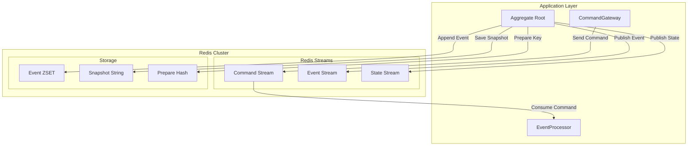

# Redis

The _Redis_ extension provides support for Redis, suitable for scenarios requiring high performance and low latency. It implements the following interfaces:

- `CommandBus` - Command bus
- `DomainEventBus` - Domain event bus
- `StateEventBus` - State event bus
- `EventStore` - Event storage
- `SnapshotStore` - Snapshot store
- `PrepareKey` - Prepare key

## Architecture Overview


```mermaid
flowchart TB
    subgraph Application["Application Layer"]
        CG[CommandGateway]
        EP[EventProcessor]
        AR[Aggregate Root]
    end
    
    subgraph Redis["Redis Cluster"]
        subgraph Streams["Redis Streams"]
            CS["Command Stream"]
            ES["Event Stream"]
            SS["State Stream"]
        end
        subgraph Storage["Storage"]
            EH["Event ZSET"]
            SH["Snapshot String"]
            PK["Prepare Hash"]
        end
    end
    
    CG -->|Send Command| CS
    AR -->|Publish Event| ES
    AR -->|Publish State| SS
    AR -->|Append Event| EH
    AR -->|Save Snapshot| SH
    AR -->|Prepare Key| PK
    CS -->|Consume Command| EP

```

## Installation

::: code-group
```kotlin [Gradle(Kotlin)]
implementation("me.ahoo.wow:wow-redis")
implementation("org.springframework.boot:spring-boot-starter-data-redis-reactive")
```
```groovy [Gradle(Groovy)]
implementation 'me.ahoo.wow:wow-redis'
implementation 'org.springframework.boot:spring-boot-starter-data-redis-reactive'
```
```xml [Maven]
<dependency>
    <groupId>me.ahoo.wow</groupId>
    <artifactId>wow-redis</artifactId>
    <version>${wow.version}</version>
</dependency>
<dependency>
    <groupId>org.springframework.boot</groupId>
    <artifactId>spring-boot-starter-data-redis-reactive</artifactId>
</dependency>
```
:::

## Configuration

- Configuration class: [RedisProperties](https://github.com/Ahoo-Wang/Wow/blob/main/wow-spring-boot-starter/src/main/kotlin/me/ahoo/wow/spring/boot/starter/redis/RedisProperties.kt)
- Prefix: `wow.redis.`

| Name                  | Data Type               | Description | Default Value |
|---------------------|-----------------------|-------------|---------------|
| `enabled`           | `Boolean`             | Whether to enable | `true` |
| `message-bus.recovery.enabled` | `Boolean` | Recover abandoned pending messages | `true` |
| `message-bus.recovery.min-idle-time` | `Duration` | Minimum idle time before recovery | `5m` |
| `message-bus.recovery.interval` | `Duration` | Interval between pending-message sweeps | `30s` |
| `message-bus.recovery.batch-size` | `Long` | Maximum records per `XPENDING` page | `100` |

**YAML Configuration Example**

```yaml
spring:
  data:
    redis:
      host: localhost
      port: 6379
      password: your-password

wow:
  command:
    bus:
      type: redis
  event:
    bus:
      type: redis
  eventsourcing:
    store:
      storage: redis
    snapshot:
      storage: redis
    state:
      bus:
        type: redis
  prepare:
    storage: redis
  redis:
    enabled: true
    message-bus:
      recovery:
        enabled: true
        min-idle-time: 5m
        interval: 30s
        batch-size: 100
```

## Command Bus

The Redis command bus uses Redis Streams for message delivery:

### Stream Naming Rules

```
{contextAlias}.{aggregateName}:command
```

Example: `order-service.order:command`

### Consumer Groups

Each processor corresponds to a consumer group:

```
{contextName}.{processorName}
```

### Pending-message recovery

The Redis message bus recovers records abandoned in an old consumer's Pending Entries List (PEL)
after `min-idle-time`. It uses consumer leases, bounded `XPENDING` scans, and atomic `XCLAIM`.
Recovery failures are isolated from live delivery and retried on the next sweep.

Delivery remains at least once. Handlers must therefore be idempotent, and `min-idle-time` must
cover the longest handler execution, retry, and graceful-shutdown duration. Recovery is enabled by
default. Set `wow.redis.message-bus.recovery.enabled=false` only as a temporary rollback; doing so
restores the previous behavior in which abandoned PEL records can remain stranded.

Pending recovery and live delivery run concurrently. Redis Streams does not guarantee that an older
recovered record is delivered before a newer live record, so handlers must tolerate recovery-time
reordering as well as duplicate delivery.

Records without the `msg` field or with invalid JSON no longer terminate the consumer. They remain
pending for manual diagnosis, while a payload-free error and a `RedisMessageBusObservation.RecordDecodeFailed`
observation are emitted. Applications can register non-blocking `RedisMessageBusObserver` beans for
metrics or alerting.

## Event Bus

### Domain Event Stream

```
{contextAlias}.{aggregateName}:event
```

### State Event Stream

```
{contextAlias}.{aggregateName}:state
```

## Event Store

Redis event store uses bucketed Redis Cluster hash tags so event stream append, request idempotency, and aggregate ID scanning indexes can be updated atomically in one Lua script.

### Data Structure

```
Event stream ZSET key: {{contextAlias}.{aggregateName}:es:{bucket}}:{aggregateId}@{tenantId}
Score: {version}
Member: {eventStreamJson}

Request id SET key: {{contextAlias}.{aggregateName}:es:{bucket}}:{aggregateId}@{tenantId}:req_idx
Member: {requestId}

Aggregate ID ZSET key: {{contextAlias}.{aggregateName}:es:{bucket}}:ids
Score: 0
Member: {aggregateId}\u0000{tenantId}
```

### Request Idempotency

Request IDs are stored in the bucket-aligned SET key shown above.

### Aggregate ID Scanning

`EventStore.scanAggregateId` scans bucketed aggregate ID indexes and merges the results in lexicographical order. Aggregate IDs are globally unique, so the scanner stores one member per aggregate and decodes `tenantId` from the ZSET member.

## Snapshot Storage

Snapshots are stored as String values:

```
Key: {contextAlias}.{aggregateName}:snapshot:{aggregateId}@{tenantId}
Value: {snapshotJson}
```

## Prepare Key

PrepareKey uses a Hash:

```
Key: prepare:{key}
Field: value = {preparedValueJson}
Field: ttlAt = {expirationTimestamp}
```

## Connection Pool Configuration

Connection pooling requires Apache Commons Pool 2 on the application classpath. The
`redis-support` capability does not add that optional dependency; without it, the pool settings
below are not applied.

```yaml
spring:
  data:
    redis:
      lettuce:
        pool:
          min-idle: 8
          max-idle: 16
          max-active: 32
          max-wait: 1000ms
```

| Parameter | Description | Recommended Value |
|------|------|--------|
| `min-idle` | Minimum idle connections | 8 |
| `max-idle` | Maximum idle connections | 16 |
| `max-active` | Maximum active connections | 32 |
| `max-wait` | Maximum wait time | 1000ms |

## Cluster Configuration

```yaml
spring:
  data:
    redis:
      cluster:
        nodes:
          - redis-node-1:6379
          - redis-node-2:6379
          - redis-node-3:6379
        max-redirects: 3
      lettuce:
        cluster:
          refresh:
            adaptive: true
            period: 30s
```

## Sentinel Configuration

```yaml
spring:
  data:
    redis:
      sentinel:
        master: mymaster
        nodes:
          - sentinel-1:26379
          - sentinel-2:26379
          - sentinel-3:26379
```

## Performance Optimization

### Batch Operations

The event store uses Lua scripts for atomic append operations. Snapshot and message-bus operations
are issued individually; the extension does not automatically pipeline arbitrary batch work.

### Memory Optimization

1. **Separate authoritative data from cache data**: Do not apply cache eviction policies to EventStore keys
2. **Capacity-plan Streams**: Acknowledgement removes records from the PEL, not from the Stream; Wow does not automatically trim Streams
3. **Monitor memory and persistence**: Configure persistence, replication, and alerting according to the durability requirement

### Recommended Configuration

```yaml
# Redis server configuration recommendations
maxmemory 4gb
maxmemory-policy noeviction
tcp-keepalive 300
timeout 0
```

`allkeys-lru` can evict event streams, idempotency indexes, aggregate indexes, or snapshots
independently and must not be used when Redis is the authoritative EventStore.

## Troubleshooting

### Common Issues

#### 1. Connection Timeout

```
org.springframework.data.redis.RedisConnectionFailureException
```

**Solutions**:
- Check Redis service status
- Verify network connectivity
- Adjust connection timeout configuration

#### 2. Out of Memory

```
OOM command not allowed when used memory > 'maxmemory'
```

**Solutions**:
- Increase Redis memory limit
- Configure reasonable eviction policy
- Clean up unnecessary data

#### 3. Stream Consumption Delay

**Solutions**:
- Increase consumer count
- Optimize message processing logic
- Check Redis service performance

## Monitoring Metrics

The following Redis metrics should be monitored:

| Metric | Description | Alert Threshold |
|------|------|---------|
| `used_memory` | Memory usage | > 80% maxmemory |
| `connected_clients` | Connection count | > 1000 |
| `blocked_clients` | Blocked clients | > 10 |
| `keyspace_hits/misses` | Cache hit rate | < 90% |

## Complete Configuration Example

```yaml
spring:
  data:
    redis:
      host: localhost
      port: 6379
      password: your-password
      database: 0
      lettuce:
        pool:
          min-idle: 8
          max-idle: 16
          max-active: 32
          max-wait: 1000ms
        shutdown-timeout: 100ms

wow:
  command:
    bus:
      type: redis
      local-first:
        enabled: true
  event:
    bus:
      type: redis
      local-first:
        enabled: true
  eventsourcing:
    store:
      storage: redis
    snapshot:
      enabled: true
      strategy: all
      storage: redis
    state:
      bus:
        type: redis
        local-first:
          enabled: true
  prepare:
    storage: redis
  redis:
    enabled: true
```

## Best Practices

1. **Enable LocalFirst Mode**: Process local messages first to reduce network latency
2. **Use Cluster Mode**: Use Redis cluster in production for high availability and scalability
3. **Configure Connection Pool Properly**: Add Commons Pool 2 and size the pool based on measured concurrency
4. **Monitor Memory Usage**: Regularly monitor Redis memory usage to avoid OOM
5. **Enable Persistence**: Configure RDB or AOF persistence to prevent data loss
