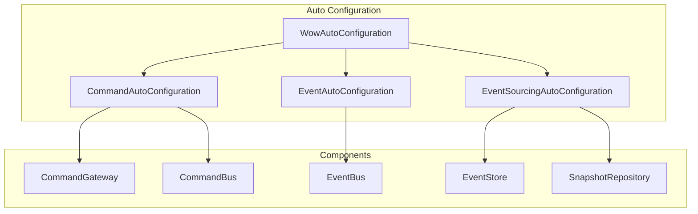

# Spring-Boot-Starter

The _Spring-Boot-Starter_ module integrates all _Wow_ extensions and provides auto-configuration capabilities, making the _Wow_ framework more convenient to use in _Spring Boot_ projects.

::: tip
For the public configuration documentation of this module, please refer to [Configuration](../../reference/config/basic).
:::

## Installation

::: code-group
```kotlin [Gradle(Kotlin)]
implementation("me.ahoo.wow:wow-spring-boot-starter")
```
```groovy [Gradle(Groovy)]
implementation 'me.ahoo.wow:wow-spring-boot-starter'
```
```xml [Maven]
<dependency>
    <groupId>me.ahoo.wow</groupId>
    <artifactId>wow-spring-boot-starter</artifactId>
    <version>${wow.version}</version>
</dependency>
```
:::

## Auto-Configuration Mechanism

Spring Boot Starter uses Spring Boot's auto-configuration mechanism to automatically wire Wow framework components based on the classpath and configuration properties.



## Auto-Configuration Classes

| Configuration Class | Description | Condition |
|-------|------|------|
| `WowAutoConfiguration` | Core auto-configuration | Always enabled |
| `CommandAutoConfiguration` | Command bus configuration | `wow.enabled=true` |
| `EventAutoConfiguration` | Event bus configuration | `wow.enabled=true` |
| `EventSourcingAutoConfiguration` | Event sourcing configuration | `wow.enabled=true` |
| `KafkaAutoConfiguration` | Kafka configuration | Classpath contains Kafka |
| `MongoAutoConfiguration` | MongoDB configuration | Classpath contains MongoDB |
| `RedisAutoConfiguration` | Redis configuration | Classpath contains Redis |
| `R2dbcAutoConfiguration` | R2DBC configuration | Classpath contains R2DBC |
| `WebFluxAutoConfiguration` | WebFlux configuration | Classpath contains WebFlux |

## Complete Configuration Properties

### Core Configuration (wow.*)

| Property | Type | Default | Description |
|------|------|--------|------|
| `wow.enabled` | Boolean | true | Whether to enable Wow framework |
| `wow.context-name` | String | ${spring.application.name} | Bounded context name |

### Command Configuration (wow.command.*)

| Property | Type | Default | Description |
|------|------|--------|------|
| `wow.command.bus.type` | BusType | kafka | Command bus type |
| `wow.command.bus.local-first.enabled` | Boolean | true | Local-first mode |
| `wow.command.idempotency.enabled` | Boolean | true | Enable idempotency check |
| `wow.command.idempotency.bloom-filter.ttl` | Duration | 60s | BloomFilter TTL |
| `wow.command.idempotency.bloom-filter.expected-insertions` | Long | 1000000 | Expected insertions |
| `wow.command.idempotency.bloom-filter.fpp` | Double | 0.00001 | False positive probability |

### Event Configuration (wow.event.*)

| Property | Type | Default | Description |
|------|------|--------|------|
| `wow.event.bus.type` | BusType | kafka | Event bus type |
| `wow.event.bus.local-first.enabled` | Boolean | true | Local-first mode |

### Event Sourcing Configuration (wow.eventsourcing.*)

| Property | Type | Default | Description |
|------|------|--------|------|
| `wow.eventsourcing.store.storage` | EventStoreStorage | mongo | Event store type |
| `wow.eventsourcing.snapshot.enabled` | Boolean | true | Enable snapshots |
| `wow.eventsourcing.snapshot.strategy` | Strategy | all | Snapshot strategy |
| `wow.eventsourcing.snapshot.version-offset` | Int | 5 | Version offset |
| `wow.eventsourcing.snapshot.storage` | SnapshotStorage | mongo | Snapshot storage type |
| `wow.eventsourcing.state.bus.type` | BusType | kafka | State event bus type |

## Bean Wiring

### Core Beans

```kotlin
@Bean
@ConditionalOnMissingBean
fun commandGateway(
    commandBus: CommandBus,
    waitStrategyRegistrar: WaitStrategyRegistrar
): CommandGateway {
    return DefaultCommandGateway(commandBus, waitStrategyRegistrar)
}

@Bean
@ConditionalOnMissingBean
fun stateAggregateRepository(
    stateAggregateFactory: StateAggregateFactory,
    snapshotRepository: SnapshotRepository,
    eventStore: EventStore
): StateAggregateRepository {
    return EventSourcingStateAggregateRepository(
        stateAggregateFactory,
        snapshotRepository,
        eventStore
    )
}
```

### Conditional Wiring

Wow framework uses various conditional annotations to control Bean wiring:

| Annotation | Description |
|------|------|
| `@ConditionalOnMissingBean` | Create only if Bean is missing |
| `@ConditionalOnProperty` | Create based on configuration property |
| `@ConditionalOnClass` | Create based on classpath |
| `@ConditionalOnBean` | Create based on other Bean existence |

## Custom Configuration

### Override Default Beans

```kotlin
@Configuration
class CustomWowConfiguration {
    
    @Bean
    fun customCommandGateway(
        commandBus: CommandBus,
        waitStrategyRegistrar: WaitStrategyRegistrar
    ): CommandGateway {
        // Custom implementation
        return CustomCommandGateway(commandBus, waitStrategyRegistrar)
    }
}
```

### Custom Event Processor

```kotlin
@Configuration
class EventProcessorConfiguration {
    
    @Bean
    fun customEventProcessor(
        eventBus: EventBus
    ): EventProcessor {
        return CustomEventProcessor(eventBus)
    }
}
```

## Multi-Module Project Configuration

### Project Structure

```
my-project/
├── my-project-api/          # API module (commands, events)
├── my-project-domain/       # Domain module (aggregate roots)
├── my-project-server/       # Server module (startup entry)
└── build.gradle.kts
```

### API Module Configuration

```kotlin
// my-project-api/build.gradle.kts
dependencies {
    api("me.ahoo.wow:wow-api")
}
```

### Domain Module Configuration

```kotlin
// my-project-domain/build.gradle.kts
plugins {
    id("com.google.devtools.ksp")
}

dependencies {
    implementation(project(":my-project-api"))
    implementation("me.ahoo.wow:wow-core")
    ksp("me.ahoo.wow:wow-compiler")
    testImplementation("me.ahoo.wow:wow-tck")
}
```

### Server Module Configuration

```kotlin
// my-project-server/build.gradle.kts
dependencies {
    implementation(project(":my-project-domain"))
    implementation("me.ahoo.wow:wow-spring-boot-starter")
    implementation("me.ahoo.wow:wow-kafka")
    implementation("me.ahoo.wow:wow-mongo")
    implementation("me.ahoo.wow:wow-webflux")
}
```

## Metadata Loading

Spring Boot Starter automatically loads metadata generated by the compiler:

```kotlin
@Configuration
class MetadataConfiguration {
    
    init {
        // Automatically scan and load wow-metadata.json
        MetadataSearcher.search()
    }
}
```

Metadata file location: `META-INF/wow/wow-metadata.json`

## Processor Registration

### Aggregate Processor

```kotlin
@AggregateRoot
class Order(private val state: OrderState) {
    // Automatically registered as aggregate processor
}
```

### Saga Processor

```kotlin
@StatelessSaga
class OrderSaga {
    // Automatically registered as Saga processor
}
```

### Projection Processor

```kotlin
@ProjectionProcessor
class OrderProjection {
    // Automatically registered as projection processor
}
```

## Complete Configuration Example

```yaml
spring:
  application:
    name: order-service
  data:
    mongodb:
      uri: mongodb://localhost:27017/order_db

wow:
  enabled: true
  context-name: order-service
  command:
    bus:
      type: kafka
      local-first:
        enabled: true
    idempotency:
      enabled: true
      bloom-filter:
        ttl: PT60S
        expected-insertions: 1000000
        fpp: 0.00001
  event:
    bus:
      type: kafka
      local-first:
        enabled: true
  eventsourcing:
    store:
      storage: mongo
    snapshot:
      enabled: true
      strategy: all
      storage: mongo
    state:
      bus:
        type: kafka
        local-first:
          enabled: true
  kafka:
    bootstrap-servers: localhost:9092
    topic-prefix: 'wow.'
  mongo:
    enabled: true
    auto-init-schema: true
```

## Best Practices

1. **Module Separation**: Separate API, domain, and server modules for better maintainability and reusability
2. **Use Compiler**: Enable wow-compiler to generate metadata and query property navigation
3. **Externalize Configuration**: Use Spring Boot configuration files to externalize configuration
4. **Conditional Wiring**: Use `@ConditionalOnMissingBean` to allow custom overrides
5. **Enable Local-First**: Enable LocalFirst mode to improve performance