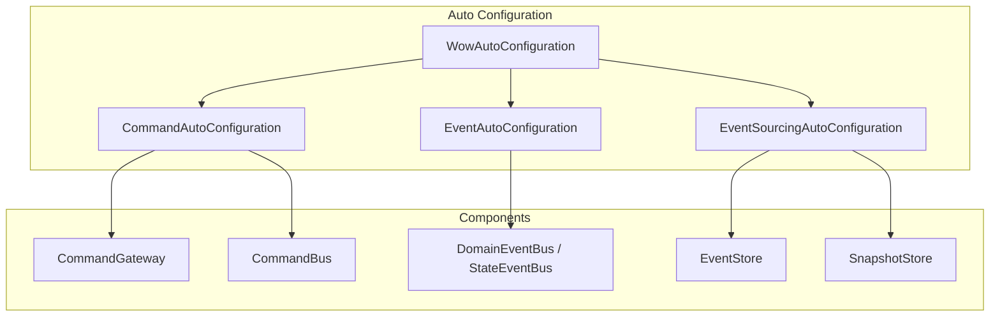

# Spring-Boot-Starter

The _Spring-Boot-Starter_ module integrates all _Wow_ extensions and provides auto-configuration capabilities, making the _Wow_ framework more convenient to use in _Spring Boot_ projects.

::: tip
For the public configuration documentation of this module, please refer to [Configuration](../../reference/config/core).
For an existing Spring Boot service, follow [Existing Project](../existing-project) for the BOM, KSP, first-run configuration, and route verification.
:::

## Installation

::: code-group
```kotlin [Gradle(Kotlin)]
implementation("me.ahoo.wow:wow-spring-boot-starter")
```
```groovy [Gradle(Groovy)]
implementation 'me.ahoo.wow:wow-spring-boot-starter'
```
```xml [Maven]
<dependency>
    <groupId>me.ahoo.wow</groupId>
    <artifactId>wow-spring-boot-starter</artifactId>
    <version>${wow.version}</version>
</dependency>
```
:::

## Auto-Configuration Mechanism

Spring Boot Starter uses Spring Boot's auto-configuration mechanism to automatically wire Wow framework components based on the classpath and configuration properties.

### Gradle Feature Variants

`wow-spring-boot-starter` declares optional Gradle feature capabilities so application modules only pull the infrastructure they need. Request a capability with `capabilities { requireCapability("<group>:<capability>") }`:

| Capability | Pulls in |
|---|---|
| `mongo-support` | `wow-mongo` (MongoDB EventStore / SnapshotStore / PrepareKey / query services) |
| `redis-support` | `wow-redis` (Redis EventStore / SnapshotStore / PrepareKey / message bus) |
| `elasticsearch-support` | `wow-elasticsearch` (Elasticsearch EventStore / SnapshotStore / query services) |
| `kafka-support` | `wow-kafka` (distributed CommandBus / DomainEventBus / StateEventBus) |
| `webflux-support` | `wow-webflux` (WebFlux command/query route handlers, global error handling) |
| `opentelemetry-support` | `wow-opentelemetry` (tracing instrumenters) |
| `openapi-support` | `wow-openapi` (OpenAPI schema/route generation) |
| `cosec-support` | `wow-cosec` (CoSec authorization integration) |
| `mock-support` | `wow-mock` (in-process test doubles) |

The capabilities are optional; you can instead declare the individual `wow-*` dependencies directly, as shown in the extension-specific guides.


```mermaid
flowchart TB
    subgraph AutoConfig["Auto Configuration"]
        WC[WowAutoConfiguration]
        CC[CommandAutoConfiguration]
        EC[EventAutoConfiguration]
        ESC[EventSourcingAutoConfiguration]
    end
    
    subgraph Components["Components"]
        CG[CommandGateway]
        CB[CommandBus]
        EB[DomainEventBus / StateEventBus]
        ES[EventStore]
        SR[SnapshotStore]
    end
    
    WC --> CC
    WC --> EC
    WC --> ESC
    CC --> CG
    CC --> CB
    EC --> EB
    ESC --> ES
    ESC --> SR
```

## Auto-Configuration Classes

| Configuration Class | Description | Condition |
|-------|------|------|
| `WowAutoConfiguration` | Core auto-configuration | Always enabled |
| `CommandAutoConfiguration` | Command bus configuration | `wow.enabled=true` |
| `EventAutoConfiguration` | Event bus configuration | `wow.enabled=true` |
| `EventSourcingAutoConfiguration` | Event sourcing configuration | `wow.enabled=true` |
| `KafkaAutoConfiguration` | Kafka configuration | Classpath contains Kafka |
| `MongoEventSourcingAutoConfiguration` | MongoDB event/snapshot store configuration | Mongo support is on the classpath |
| `RedisEventSourcingAutoConfiguration` / `RedisMessageBusAutoConfiguration` | Redis event sourcing / message bus configuration | Redis support is on the classpath |
| `WebFluxAutoConfiguration` | WebFlux configuration | Classpath contains WebFlux |

## Complete Configuration Properties

### Core Configuration (wow.*)

| Property | Type | Default | Description |
|------|------|--------|------|
| `wow.enabled` | Boolean | true | Whether to enable Wow framework |
| `wow.context-name` | String | ${spring.application.name} | Bounded context name |

### Command Configuration (wow.command.*)

| Property | Type | Default | Description |
|------|------|--------|------|
| `wow.command.bus.type` | BusType | kafka | Command bus type |
| `wow.command.bus.local-first.enabled` | Boolean | true | Local-first mode |
| `wow.command.idempotency.enabled` | Boolean | true | Enable idempotency check |
| `wow.command.idempotency.bloom-filter.ttl` | Duration | 60s | BloomFilter TTL |
| `wow.command.idempotency.bloom-filter.expected-insertions` | Long | 1000000 | Expected insertions |
| `wow.command.idempotency.bloom-filter.fpp` | Double | 0.00001 | False positive probability |

### Event Configuration (wow.event.*)

| Property | Type | Default | Description |
|------|------|--------|------|
| `wow.event.bus.type` | BusType | kafka | Event bus type |
| `wow.event.bus.local-first.enabled` | Boolean | true | Local-first mode |

### Event Sourcing Configuration (wow.eventsourcing.*)

| Property | Type | Default | Description |
|------|------|--------|------|
| `wow.eventsourcing.store.storage` | `StorageType` | mongo | Event store type |
| `wow.eventsourcing.snapshot.enabled` | Boolean | true | Enable snapshots |
| `wow.eventsourcing.snapshot.strategy` | Strategy | all | Snapshot strategy |
| `wow.eventsourcing.snapshot.version-offset` | Int | 5 | Version offset |
| `wow.eventsourcing.snapshot.storage` | `StorageType` | mongo | Snapshot storage type |
| `wow.eventsourcing.state.bus.type` | BusType | kafka | State event bus type |

## Bean Wiring and Overrides

Auto-configuration is split by responsibility: command, event, event sourcing, storage, transport, query, observability, and integrations. Infrastructure configurations are activated by their classpath capability and configuration conditions. Many non-storage extension points use `@ConditionalOnMissingBean`; for example, a custom `CommandGateway` can replace the default when its declaring auto-configuration permits it. Check the specific `@Bean` declaration instead of assuming every interface is replaceable.

`EventStore` and `SnapshotStore` use a different model. Storage capabilities publish `EventStoreBinding` and `SnapshotStoreBinding`, and `StorageRoutingAutoConfiguration` builds the `@Primary` routing stores from those bindings. To integrate a custom backend, register named bindings and select them through `wow.eventsourcing.storage-routing`; when it also serves query routes, provide the matching `EventStreamQueryServiceFactoryBinding` and `SnapshotQueryServiceFactoryBinding`. If replacing a built-in storage capability wholesale, exclude or disable that storage auto-configuration first. A plain `EventStore` or `SnapshotStore` bean does not automatically override an enabled storage capability.

Use the extension-specific guide and [configuration reference](../../reference/config/core) for the exact dependency, properties, and override boundary. Internal constructors are not configuration APIs and may change independently.

## Multi-Module Project Configuration

### Project Structure

```
my-project/
├── my-project-api/          # API module (commands, events)
├── my-project-domain/       # Domain module (aggregate roots)
├── my-project-server/       # Server module (startup entry)
└── build.gradle.kts
```

### API Module Configuration

```kotlin
// my-project-api/build.gradle.kts
dependencies {
    api("me.ahoo.wow:wow-api")
}
```

### Domain Module Configuration

```kotlin
// my-project-domain/build.gradle.kts
plugins {
    id("com.google.devtools.ksp")
}

dependencies {
    implementation(project(":my-project-api"))
    implementation("me.ahoo.wow:wow-core")
    ksp("me.ahoo.wow:wow-compiler")
    testImplementation("me.ahoo.wow:wow-test")
}
```

### Server Module Configuration

```kotlin
// my-project-server/build.gradle.kts
dependencies {
    implementation(project(":my-project-domain"))
    implementation("me.ahoo.wow:wow-spring-boot-starter")
    implementation("me.ahoo.wow:wow-spring-boot-starter") {
        capabilities { requireCapability("me.ahoo.wow:kafka-support") }
    }
    implementation("me.ahoo.wow:wow-spring-boot-starter") {
        capabilities { requireCapability("me.ahoo.wow:mongo-support") }
    }
    implementation("me.ahoo.wow:wow-spring-boot-starter") {
        capabilities { requireCapability("me.ahoo.wow:webflux-support") }
    }
    implementation("org.springframework.boot:spring-boot-starter-data-mongodb-reactive")
}
```

## Metadata Loading

The compiler writes aggregate metadata to `META-INF/wow-metadata.json`. At runtime, `MetadataSearcher` lazily merges all resources with that name from the application classpath. Applications do not need to call `MetadataSearcher.search()` or register a metadata configuration bean.

## Processor Registration

### Aggregate Processor

```kotlin
@AggregateRoot
class Order(private val state: OrderState) {
    // Automatically registered as aggregate processor
}
```

### Saga Processor

```kotlin
@StatelessSaga
class OrderSaga {
    // Automatically registered as Saga processor
}
```

### Projection Processor

```kotlin
@ProjectionProcessor
class OrderProjection {
    // Automatically registered as projection processor
}
```

## Complete Configuration Example

```yaml
spring:
  application:
    name: order-service
  mongodb:
    uri: mongodb://localhost:27017/order_db

wow:
  enabled: true
  context-name: order-service
  command:
    bus:
      type: kafka
      local-first:
        enabled: true
    idempotency:
      enabled: true
      bloom-filter:
        ttl: PT60S
        expected-insertions: 1000000
        fpp: 0.00001
  event:
    bus:
      type: kafka
      local-first:
        enabled: true
  eventsourcing:
    store:
      storage: mongo
    snapshot:
      enabled: true
      strategy: all
      storage: mongo
    state:
      bus:
        type: kafka
        local-first:
          enabled: true
  kafka:
    bootstrap-servers: localhost:9092
    topic-prefix: 'wow.'
  mongo:
    enabled: true
    auto-init-schema: true
```

## Best Practices

1. **Module Separation**: Separate API, domain, and server modules for better maintainability and reusability
2. **Use Compiler**: Enable wow-compiler to generate metadata and query property navigation
3. **Externalize Configuration**: Use Spring Boot configuration files to externalize configuration
4. **Conditional Wiring**: Use `@ConditionalOnMissingBean` to allow custom overrides
5. **Choose Local-First Deliberately**: Keep the default only when local delivery semantics match the deployment topology; validate admission fallback, marked-copy filtering, and duplicate handling
