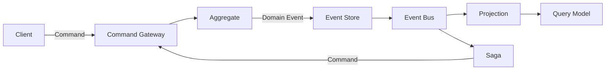

# Wow Documentation Map

You do not need to read the sidebar from top to bottom. Pick the task you need to complete, then read only the pages required for it.

::: tip New to Wow?
Spend 15 minutes on the [Introduction](./introduction.md) and [Core Concepts](./core-concepts.md). To run code immediately, start with [Getting Started](./getting-started.md).
For an existing Spring Boot service, start with [Add Wow to an Existing Project](./existing-project.md).
:::

## The Main Flow in One Diagram

An aggregate makes business decisions, and its domain events are persisted as the authoritative history. Projections build read-optimized models, while sagas react to events by sending commands across aggregate boundaries. See [Core Concepts](./core-concepts.md) and [Data Flow](./advanced/data-flow.md) for the precise semantics.

## Choose an Entry Point by Task

| Task | Read first | Then read | Done when |
| --- | --- | --- | --- |
| Decide whether Wow fits | [Introduction](./introduction.md) | [Production Best Practices](./best-practices.md) | You can explain the benefits, operating costs, and poor-fit cases |
| Run a first application | [Getting Started](./getting-started.md) | [Configuration](./configuration.md) | Domain tests pass, a real command reaches `SNAPSHOT`, and state can be loaded |
| Add Wow to an existing Spring Boot service | [Existing Project](./existing-project.md) | [Spring Boot Starter](./extensions/spring-boot-starter.md) | KSP metadata, generated routes, command handling, and snapshot loading all work |
| Model an aggregate and invariants | [Aggregate Modeling](./modeling.md) | [Test Suite](./test-suite.md) | Commands emit domain events and replay produces verified state |
| Evolve persisted events | [Event Evolution](./advanced/event-evolution.md) | [Event Store](./eventstore.md) | Upgrader registration, ordering, historical replay, and rollback have evidence |
| Expose writes and completion semantics | [Command Gateway](./command-gateway.md) | [OpenAPI](./open-api.md) | You can distinguish `SENT`, `PROCESSED`, `SNAPSHOT`, and `PROJECTED` |
| Build a query model | [Projection](./projection.md) | [Query Service](./query.md) | The projection is retry-safe and idempotent, with a clear query boundary |
| Coordinate across aggregates | [Saga](./saga.md) | [Event Compensation](./event-compensation.md) | Success, retry, and unrecoverable paths are tested |
| Choose messaging and storage | [Module Dependencies](./advanced/module-dependencies.md) | [Extensions](./extensions/spring-boot-starter.md) | Only the required backends and starter capabilities are included |
| Prepare for production | [Production Best Practices](./best-practices.md) | [Backup, Restore, and Replay](./recovery.md) | Idempotency, recovery, capacity, alerts, and rollback have evidence |
| Diagnose a failure or hang | [Troubleshooting](./troubleshooting.md) | The relevant core or extension page | The failed stage is known instead of merely having a larger timeout |
| Migrate a system or version | [Migration Guide](./migration.md) | The selected migration path | Inventory, reconciliation, cutover, and rollback gates are complete |

## Three Suggested Paths

### 15 minutes: build the mental model

1. [Introduction](./introduction.md)
2. [Core Concepts](./core-concepts.md)
3. [Architecture](./advanced/architecture.md)

### 60 minutes: complete a vertical slice

1. [Getting Started](./getting-started.md)
2. For an existing service, use [Existing Project](./existing-project.md) instead
3. [Aggregate Modeling](./modeling.md)
4. [Test Suite](./test-suite.md)
5. [Command Gateway](./command-gateway.md)
6. [Projection](./projection.md) and [Query Service](./query.md)

### Production assessment: start with risk

1. [Production Best Practices](./best-practices.md)
2. [Backup, Restore, and Replay](./recovery.md)
3. [Test Runtime](./test-runtime.md)
4. [Observability](./advanced/observability.md)
5. [Troubleshooting](./troubleshooting.md)
6. [Migration Guide](./migration.md)
7. [Event Evolution](./advanced/event-evolution.md)

## Use Each Documentation Type for Its Job

- **Guide** explains why and how to complete a task.
- **Reference** provides exact configuration, examples, and ecosystem resources.
- **API** is available from the top navigation and provides Kotlin and Java symbols and signatures through Dokka.
- **[Onboarding](../onboarding/)** provides role-specific paths for contributors, architects, executives, and product managers.
- **[Articles](../articles/)** explain trade-offs through concrete problems; they do not replace API or configuration reference.

::: warning Version and source of truth
Documentation explains the repository but does not replace it. If prose differs from the public contracts, configuration classes, tests, or release notes for the tag you selected, follow that version's source.
:::
