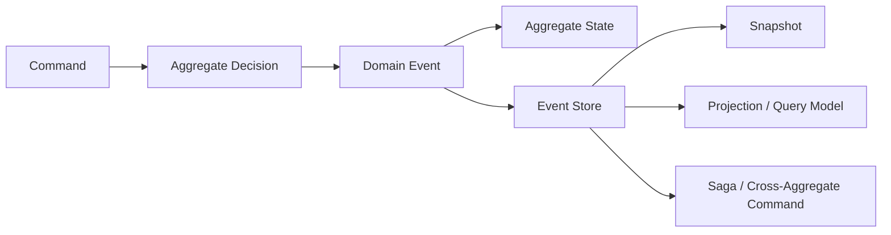

# Introduction

  

::: info Keywords
**<Badge type="tip" text="Domain Driven" />**
**<Badge type="tip" text="Event Driven" />**
**<Badge type="tip" text="Test Driven" />**
**<Badge type="tip" text="Declarative Design" />**
**<Badge type="tip" text="Reactive Programming" />**
**<Badge type="tip" text="CQRS" />**
**<Badge type="tip" text="Event Sourcing" />**
:::

Wow is a modern reactive CQRS framework for Kotlin and Java applications, based on Domain-Driven Design and Event Sourcing and continuously evolved through years of production practice. It combines command dispatch, aggregate loading, event persistence, projections, sagas, completion semantics, and testing support into an explicit runtime pipeline.

Wow aims to help developers build modern, high-performance, maintainable applications while reducing the learning curve and implementation cost of Domain-Driven Design and Event Sourcing.

Its central value is not merely writing fewer CRUD endpoints. It makes business decisions visible, testable, and traceable as **command → domain event → state**. DDD and Event Sourcing are not exclusive to microservices; when the boundaries and operating costs fit, Wow can also support a modular monolith.

::: tip Looking for the next page?
- Run code first: [Getting Started](./getting-started.md)
- Build the mental model first: [Core Concepts](./core-concepts.md)
- Choose a task-specific path: [Documentation Map](./index.md)
:::

## Background

As a business grows, traditional architectures and development practices eventually expose limits. Domain-Driven Design and Event Sourcing can improve flexibility, maintainability, and traceability, but they also introduce modeling, infrastructure, and learning challenges.

Wow aims to integrate those ideas through a consistent application model so developers can focus on business logic and domain behavior instead of rebuilding command dispatch, event persistence, projections, sagas, and test infrastructure for every service.

Years of production practice and continuous evolution shaped the current feature set and also pushed the project to make testing, observability, recovery, and version evolution explicit engineering concerns.

## What Does Wow Mean for Developers?

::: info Author perspective
I once warned my team that if we rely too heavily on data-driven design and ignore domain-driven design, our work can collapse into table-oriented CRUD. The point is not to label developers; it is to move engineering attention back to business value, domain knowledge, and problem-solving ability.
:::

### Business Value

The core value of a software system is its business value. Engineers should not focus only on technical implementation; they should explore business details with domain experts and finish a system with durable knowledge of the domain.

Using Wow means placing domain models and business decisions at the center. Developers write the domain behavior, while the framework connects commands, events, state, OpenAPI, and runtime components with less repeated technical assembly.

_Implementing Domain-Driven Design_ emphasizes concentrating investment in the core domain. Wow seeks to lower modeling and testing costs enough that DDD can also be practical in supporting subdomains when it adds value. The decision still depends on business complexity and long-term maintenance cost.

### Performance and Scalability

As a business grows, systems must address throughput, storage, and scaling. In traditional architectures, relational schemas, sharding rules, and cross-shard transactions can leak into business code. Wow uses aggregate boundaries, event storage, and messaging abstractions to reduce coupling between the domain model and a particular storage topology, so changing backends or scaling horizontally does not require rewriting domain rules directly.

This does not give an application unlimited scalability automatically. Results still depend on aggregate hot spots, event size, storage implementation, messaging, and deployment. Evaluate the current version with the reproducible JMH tasks in [Test Runtime](./test-runtime.md#benchmark-smoke); historical throughput without the matching code revision, hardware, and run parameters is not a current performance guarantee.

### Read-Write Separation and Synchronization Delay

Read-write separation is a common query optimization, but it introduces synchronization delay: an order may be accepted before its query model is updated, or a product edit may complete before Elasticsearch can return it.

A fixed one-second delay wastes time for fast requests and still cannot guarantee that slow work has completed. Wow command wait plans let callers wait for the stage required by the use case, such as `PROCESSED`, `SNAPSHOT`, or `PROJECTED`, before returning. See [Command Wait Plans](./command-gateway.md#wait-plans).

### Engineering Quality

Traditional domain tests are often burdened by database connections, transactions, data cleanup, and full application startup. The Wow Given → When → Expect test suite keeps tests centered on commands, events, and state, allowing developers to focus on whether the domain model behaves as intended.

In the original team practice, the minimum domain-model coverage was commonly set to **85%**, and some modules naturally reached **95%**; API testing also found materially fewer defects in comparable projects. These figures are team experience, not a universal promise. Current quality claims must come from module tests, coverage gates, and CI results. See [Test Suite](./test-suite.md) and [Test Runtime](./test-runtime.md).

## Wow in One Sentence

> A client sends a command; an aggregate makes a business decision from its current state and returns domain events; events are applied to aggregate state and persisted before they drive projections, sagas, and other event processors.

This flow has several meanings of "complete": command accepted by the bus (`SENT`), aggregate processing completed (`PROCESSED`), snapshot processing completed (`SNAPSHOT`), and query model updated (`PROJECTED`). [Command Gateway](./command-gateway.md#wait-plans) lets callers declare the stage they actually need.

## Problems Wow Addresses

| Problem | Wow mechanism | Continue with |
| --- | --- | --- |
| Business rules are spread across controllers, services, and database scripts | Aggregates, command handlers, and sourcing handlers make decision boundaries explicit | [Aggregate Modeling](./modeling.md) |
| A current row cannot explain why state changed | Immutable domain events preserve history and rebuild state through replay | [Event Store](./eventstore.md) |
| A write succeeds before its query model is updated | Declarative wait plans represent different completion stages | [Command Gateway](./command-gateway.md) |
| Write behavior and complex queries constrain each other | Projections build models optimized for specific reads | [Projection](./projection.md), [Query Service](./query.md) |
| Cross-aggregate workflows are hard to observe and recover | Stateless sagas issue commands; retry and compensation manage failures | [Saga](./saga.md), [Event Compensation](./event-compensation.md) |
| Domain tests require a database and the whole application | Given → When → Expect DSL verifies commands, events, and state directly | [Test Suite](./test-suite.md) |

## What Does Wow Mean for Enterprises?

### Business Intelligence

Business Intelligence depends on timely, rich data with business meaning. In addition to current aggregate state, Wow can expose state events (`StateEvent`) and aggregate commands (`Command`) as analytical data sources, allowing analytics systems to see what happened and why instead of only how database fields changed.

  

A traditional CDC pipeline often has to infer business meaning from table changes. Wow commands and events already carry domain semantics, reducing that translation work. The BI capability can generate synchronization scripts for analytical stores such as ClickHouse, while actual latency, data quality, and operational guarantees still depend on application configuration and operations.

See [Wow Business Intelligence](./bi.md) and [Business Intelligence Operations](./bi-operations.md).

### Operation Audit

An operation audit must answer who initiated an action and what business results it produced. Aggregate commands express intent, while domain events express facts that occurred; together they form a clearer audit source than database field changes alone.

Wow provides these data sources and synchronization mechanisms, but it does not automatically satisfy retention, access-control, privacy, or compliance requirements. Those constraints must be designed and verified in the application. See [Wow Operation Audit](./bi.md#aggregate-commands).

## Core Runtime Model

1. **Receive a command**: `CommandGateway` builds and sends a command message while handling validation, idempotency, and its wait plan.
2. **Load the aggregate**: the runtime restores current state from a snapshot plus subsequent events.
3. **Make a decision**: the command handler checks business invariants and returns one or more domain events.
4. **Source and persist**: sourcing handlers apply events to state, then the event stream is appended to `EventStore` under optimistic concurrency.
5. **Dispatch derived work**: the event bus delivers events to projections, sagas, and event processors.
6. **Return the declared result**: the caller can wait for aggregate processing, a snapshot, a specific projection, or a saga function.

See [Data Flow](./advanced/data-flow.md) and [Runtime Lifecycle](./advanced/runtime-lifecycle.md) for component and scheduling details.

## Good Fits and Cases to Evaluate Carefully

| Better fit | Evaluate carefully |
| --- | --- |
| Rich business rules require explicit aggregate invariants | Simple CRUD with almost no business rules |
| State history, replay, or an audit data source matters | Current state is sufficient and a single database transaction already meets the need |
| Write behavior and multiple query models must evolve independently | Every read model must update synchronously in the same database transaction |
| Cross-aggregate workflows need explicit observation and recovery | The team cannot own event evolution, idempotency, and eventual-consistency operations |

::: warning
Wow cannot make unclear domain boundaries clear, and compensation is not equivalent to a database rollback. Define business decisions and ownership boundaries before adding infrastructure.
:::

## Costs You Own After Adopting Wow

- **Event evolution**: persisted events are long-lived contracts; old versions and replay need compatibility tests.
- **Eventual consistency**: projections, sagas, and external processors may finish asynchronously, so product and API behavior must define completion semantics.
- **Idempotency and retries**: distributed buses may redeliver messages; event-handler side effects must be safe to retry.
- **Operational evidence**: local tests do not establish production readiness. Storage, messaging, capacity, backup/restore, alerting, and rollback require separate validation.
- **Reactive boundaries**: core pipelines use Reactor. Blocking I/O must be isolated explicitly rather than hidden inside command or event flows.

## Main Capabilities

- [Aggregate Modeling](./modeling.md): express domain behavior with `@AggregateRoot`, command handlers, and sourcing handlers.
- [Event Store](./eventstore.md) and [Snapshot](./snapshot.md): preserve event history and accelerate aggregate restoration.
- [Command Gateway](./command-gateway.md): idempotency, validation, wait plans, and LocalFirst semantics.
- [Projection](./projection.md) and [Query Service](./query.md): build read-oriented models from events.
- [Saga](./saga.md) and [Event Compensation](./event-compensation.md): coordinate cross-aggregate flows and manage failure recovery.
- [Test Suite](./test-suite.md): verify domain behavior without starting the complete infrastructure stack.
- [OpenAPI](./open-api.md) and [WebFlux](./extensions/webflux.md): expose command and query endpoints from metadata and runtime routes.
- [OpenTelemetry](./extensions/opentelemetry.md) and [Metrics](./advanced/metrics.md): observe command, event, projection, saga, and storage pipelines.

  

## Architecture

  

### Command Processing Chain

  

## Next Steps

- Application developers: [Getting Started](./getting-started.md) → [Aggregate Modeling](./modeling.md) → [Test Suite](./test-suite.md)
- Architecture and operations assessment: [Architecture](./advanced/architecture.md) → [Production Best Practices](./best-practices.md) → [Observability](./advanced/observability.md)
- Role-specific reading: [Onboarding](../onboarding/)
