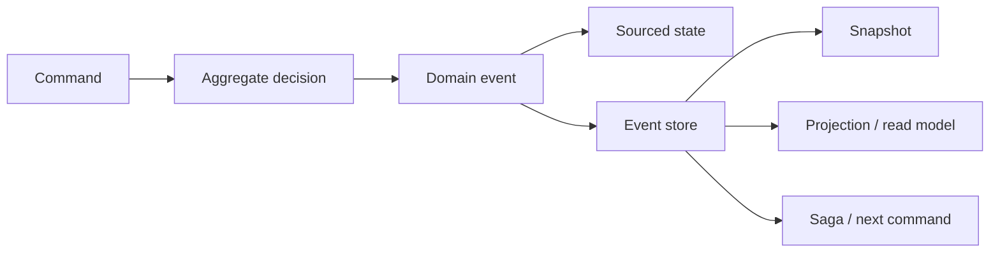

# Introduction

Wow is a reactive CQRS and Event Sourcing framework for Kotlin and Java. It makes a business write explicit as **command → aggregate decision → domain event → sourced state**, then lets projections, sagas, and other processors react to the persisted events.

The framework is not a shortcut around domain modeling. It supplies the runtime and testing mechanics so a team can spend more effort on business rules, while retaining evidence of what was requested, what the domain decided, and how state changed.

::: tip Choose the next page
- Prove a running slice: [Getting Started](./getting-started.md)
- Learn the vocabulary: [Core Concepts](./core-concepts.md)
- Find a task-specific route: [Documentation Map](./index.md)
:::

## Background

As business rules grow, table-oriented CRUD often spreads decisions across controllers, services, database constraints, and scripts. Domain-Driven Design can bring those decisions back into explicit boundaries; Event Sourcing can preserve why state changed. Both also introduce new costs: event evolution, asynchronous completion, replay, idempotency, and operations.

Wow standardizes command dispatch, aggregate loading, event persistence, snapshots, projections, sagas, wait stages, generated routes, and domain tests. It can be used in a microservice or a modular monolith; the deciding factor is the domain and operating model, not deployment topology alone.

## Six Value Claims

These are the six reasons Wow may be worth adopting. Each is a capability boundary, not an unconditional outcome.

### 1. Business Value

Commands name business intent, aggregates protect invariants, and domain events name facts. That keeps the core discussion around domain behavior instead of HTTP or database plumbing. Wow connects those artifacts to metadata and runtime components, but the team must still discover correct boundaries with domain experts.

### 2. Performance and Scalability

Aggregate boundaries, append-oriented event storage, and messaging abstractions reduce direct coupling between domain rules and storage topology. They do not remove hot aggregates, large events, backend limits, or deployment constraints. Evaluate the selected release with the reproducible tasks in [Framework Tests and Benchmarks](./test-runtime.md#benchmarks-have-three-uses); historical throughput without its code revision, hardware, and parameters is not a current guarantee.

### 3. Read-Write Separation and Synchronization Delay

CQRS permits query models optimized for reads, but those models may update after the write. A fixed sleep neither proves completion nor uses fast paths well. Wow wait plans let a caller request the stage it needs—such as `PROCESSED`, `SNAPSHOT`, or `PROJECTED`—and receive the matching signal. See [Completion Semantics](./command/completion.md).

### 4. Engineering Quality

The Given → When → Expect test DSL verifies commands, events, errors, and sourced state without starting the complete infrastructure stack. This removes setup noise; it does not replace HTTP, real-adapter, recovery, security, and upgrade tests. See [Test Suite](./test-suite.md) and [Application Testing](./application-testing.md).

### 5. Business Intelligence

Commands and state events already carry business meaning, so analytical pipelines can consume more than database field changes. Wow BI can generate synchronization scripts for analytical stores such as ClickHouse. Latency, data quality, schema evolution, and operational guarantees remain application responsibilities. See [Wow Business Intelligence](./bi.md) and [BI Operations](./bi-operations.md).

  

### 6. Operation Audit

Commands record intent and domain events record facts, creating a useful audit source for who requested what and what resulted. Wow does not automatically satisfy retention, access-control, privacy, or compliance requirements; applications must design and verify those policies. See [Aggregate Commands](./bi.md#aggregate-commands).

## Runtime Model

[Domain Model](./domain/) owns aggregate boundaries, event history, snapshots, and lifecycle. [Commands](./command/) owns definition, sending, completion, and reliability. [Events and Collaboration](./event/) owns processors, sagas, compensation, and event dispatch. [Projection](./projection.md) and [Query](./query.md) continue to own the read side. See [Data Flow](./advanced/data-flow.md) for cross-capability handoffs and [Runtime Lifecycle](./advanced/runtime-lifecycle.md) for startup and shutdown.

The complete runtime architecture and data flow are shown below:

  

## Fit Boundary

| Better fit | Evaluate carefully |
| --- | --- |
| Rich rules need an explicit aggregate consistency boundary | Simple CRUD has almost no domain decisions |
| State history, replay, or an audit data source matters | Current state and one database transaction are sufficient |
| Write behavior and multiple read models must evolve independently | Every read must change synchronously in the write transaction |
| Cross-aggregate workflows need observable progress and recovery | The team cannot own idempotency, event evolution, and eventual-consistency operations |

::: warning
Wow does not discover a domain boundary, and compensation is not a database rollback. Model business ownership and failure semantics before selecting infrastructure.
:::

## Costs You Own After Adoption

- **Event evolution:** persisted events are long-lived contracts; old versions and replay require compatibility tests.
- **Eventual consistency:** products and APIs must define which completion stage users need.
- **Idempotency and retries:** message redelivery means handler side effects must be safe to repeat.
- **Operations:** capacity, storage, messaging, backup/restore, alerting, compensation, and rollback need environment evidence.
- **Reactive boundaries:** blocking I/O must be isolated from Reactor command and event pipelines.
- **Migration:** changing existing writes requires a cutover and rollback boundary; local tests alone do not prove production readiness.

## Main Capabilities

| Need | Continue with |
| --- | --- |
| Model aggregate decisions and sourced state | [Domain Model](./domain/) |
| Define, send, and declare command completion | [Commands](./command/) |
| Build query-oriented views | [Projection](./projection.md), [Query](./query.md) |
| Process events and coordinate across aggregates | [Events and Collaboration](./event/) |
| Verify domain and application behavior | [Test Suite](./test-suite.md), [Application Testing](./application-testing.md) |
| Expose generated contracts and routes | [OpenAPI](./open-api.md), [WebFlux](./extensions/webflux.md) |
| Observe runtime pipelines | [OpenTelemetry](./extensions/opentelemetry.md), [Metrics](./advanced/metrics.md) |

## Next Steps

- New application: [Getting Started](./getting-started.md) → [Domain Model](./domain/) → [Commands](./command/) → [Test Suite](./test-suite.md)
- Existing application: [Add Wow to an Existing Project](./existing-project.md) → [Spring Boot Starter](./extensions/spring-boot-starter.md)
- Architecture and operations: [Architecture](./advanced/architecture.md) → [Production Best Practices](./best-practices.md) → [Observability](./advanced/observability.md)
- Role-specific route: [Onboarding](../onboarding/)
