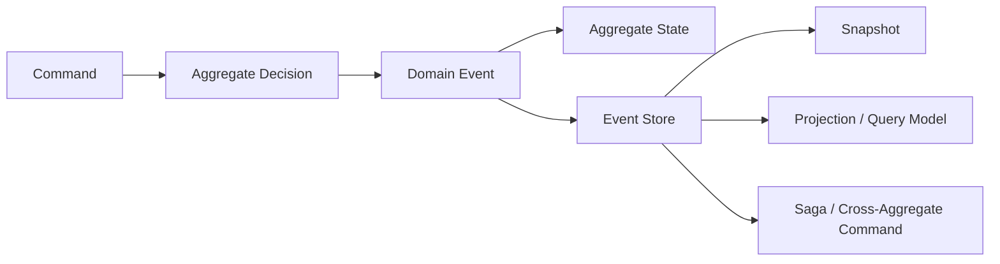

# Introduction

  

Wow is a reactive DDD, CQRS, and Event Sourcing framework for Kotlin and Java applications. It combines command dispatch, aggregate loading, event persistence, projections, sagas, completion semantics, and testing support into an explicit runtime pipeline.

Its central value is not merely writing fewer CRUD endpoints. It makes business decisions visible, testable, and traceable as **command → domain event → state**. DDD and Event Sourcing are not exclusive to microservices; when the boundaries and operating costs fit, Wow can also support a modular monolith.

::: tip Looking for the next page?
- Run code first: [Getting Started](./getting-started.md)
- Build the mental model first: [Core Concepts](./core-concepts.md)
- Choose a task-specific path: [Documentation Map](./index.md)
:::

## Wow in One Sentence

> A client sends a command; an aggregate makes a business decision from its current state and returns domain events; events are applied to aggregate state and persisted before they drive projections, sagas, and other event processors.

This flow has several meanings of "complete": command accepted by the bus (`SENT`), aggregate processing completed (`PROCESSED`), snapshot processing completed (`SNAPSHOT`), and query model updated (`PROJECTED`). [Command Gateway](./command-gateway.md#wait-plans) lets callers declare the stage they actually need.

## Problems Wow Addresses

| Problem | Wow mechanism | Continue with |
| --- | --- | --- |
| Business rules are spread across controllers, services, and database scripts | Aggregates, command handlers, and sourcing handlers make decision boundaries explicit | [Aggregate Modeling](./modeling.md) |
| A current row cannot explain why state changed | Immutable domain events preserve history and rebuild state through replay | [Event Store](./eventstore.md) |
| A write succeeds before its query model is updated | Declarative wait plans represent different completion stages | [Command Gateway](./command-gateway.md) |
| Write behavior and complex queries constrain each other | Projections build models optimized for specific reads | [Projection](./projection.md), [Query Service](./query.md) |
| Cross-aggregate workflows are hard to observe and recover | Stateless sagas issue commands; retry and compensation manage failures | [Saga](./saga.md), [Event Compensation](./event-compensation.md) |
| Domain tests require a database and the whole application | Given → When → Expect DSL verifies commands, events, and state directly | [Test Suite](./test-suite.md) |

## Core Runtime Model

1. **Receive a command**: `CommandGateway` builds and sends a command message while handling validation, idempotency, and its wait plan.
2. **Load the aggregate**: the runtime restores current state from a snapshot plus subsequent events.
3. **Make a decision**: the command handler checks business invariants and returns one or more domain events.
4. **Source and persist**: sourcing handlers apply events to state, then the event stream is appended to `EventStore` under optimistic concurrency.
5. **Dispatch derived work**: the event bus delivers events to projections, sagas, and event processors.
6. **Return the declared result**: the caller can wait for aggregate processing, a snapshot, a specific projection, or a saga function.

See [Data Flow](./advanced/data-flow.md) and [Runtime Lifecycle](./advanced/runtime-lifecycle.md) for component and scheduling details.

## Good Fits and Cases to Evaluate Carefully

| Better fit | Evaluate carefully |
| --- | --- |
| Rich business rules require explicit aggregate invariants | Simple CRUD with almost no business rules |
| State history, replay, or an audit data source matters | Current state is sufficient and a single database transaction already meets the need |
| Write behavior and multiple query models must evolve independently | Every read model must update synchronously in the same database transaction |
| Cross-aggregate workflows need explicit observation and recovery | The team cannot own event evolution, idempotency, and eventual-consistency operations |

::: warning
Wow cannot make unclear domain boundaries clear, and compensation is not equivalent to a database rollback. Define business decisions and ownership boundaries before adding infrastructure.
:::

## Costs You Own After Adopting Wow

- **Event evolution**: persisted events are long-lived contracts; old versions and replay need compatibility tests.
- **Eventual consistency**: projections, sagas, and external processors may finish asynchronously, so product and API behavior must define completion semantics.
- **Idempotency and retries**: distributed buses may redeliver messages; event-handler side effects must be safe to retry.
- **Operational evidence**: local tests do not establish production readiness. Storage, messaging, capacity, backup/restore, alerting, and rollback require separate validation.
- **Reactive boundaries**: core pipelines use Reactor. Blocking I/O must be isolated explicitly rather than hidden inside command or event flows.

## Main Capabilities

- [Aggregate Modeling](./modeling.md): express domain behavior with `@AggregateRoot`, command handlers, and sourcing handlers.
- [Event Store](./eventstore.md) and [Snapshot](./snapshot.md): preserve event history and accelerate aggregate restoration.
- [Command Gateway](./command-gateway.md): idempotency, validation, wait plans, and LocalFirst semantics.
- [Projection](./projection.md) and [Query Service](./query.md): build read-oriented models from events.
- [Saga](./saga.md) and [Event Compensation](./event-compensation.md): coordinate cross-aggregate flows and manage failure recovery.
- [Test Suite](./test-suite.md): verify domain behavior without starting the complete infrastructure stack.
- [OpenAPI](./open-api.md) and [WebFlux](./extensions/webflux.md): expose command and query endpoints from metadata and runtime routes.
- [OpenTelemetry](./extensions/opentelemetry.md) and [Metrics](./advanced/metrics.md): observe command, event, projection, saga, and storage pipelines.

## Architecture

  

### Command Processing Chain

  

## Next Steps

- Application developers: [Getting Started](./getting-started.md) → [Aggregate Modeling](./modeling.md) → [Test Suite](./test-suite.md)
- Architecture and operations assessment: [Architecture](./advanced/architecture.md) → [Production Best Practices](./best-practices.md) → [Observability](./advanced/observability.md)
- Role-specific reading: [Onboarding](../onboarding/)
