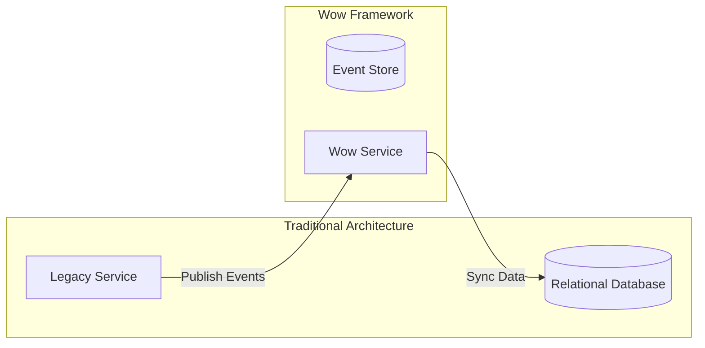

# Migration Guide

This guide helps you migrate from traditional architecture to the Wow framework, as well as upgrade between different versions.

## Version Upgrade Guide

### Upgrade Steps

1. **Backup Data**: Backup event store and snapshot data before upgrading
2. **Read Changelog**: Check [Release Notes](https://github.com/Ahoo-Wang/Wow/releases)
3. **Update Dependency Version**: Modify build.gradle.kts or pom.xml
4. **Run Tests**: Ensure all tests pass
5. **Gradual Rollout**: Gradually upgrade production environment

### Dependency Version Update

::: code-group
```kotlin [Gradle(Kotlin)]
// Update wow version
implementation("me.ahoo.wow:wow-spring-boot-starter:new-version")
```
```xml [Maven]
<dependency>
    <groupId>me.ahoo.wow</groupId>
    <artifactId>wow-spring-boot-starter</artifactId>
    <version>new-version</version>
</dependency>
```
:::

### Breaking Changes Check

Before upgrading, check the following:

1. **API Changes**: Check for interface signature changes
2. **Configuration Changes**: Check for configuration property changes
3. **Metadata Changes**: Regenerate metadata files

## Migrating from Traditional Architecture

### Migration Strategy

#### Gradual Migration

We recommend a gradual migration strategy, progressively migrating functional modules to event sourcing architecture:



#### Migration Steps

1. **Identify Bounded Contexts**: Determine business modules to migrate
2. **Design Domain Model**: Define aggregate roots, commands, and events
3. **Implement Dual Writing**: Write to both old and new systems
4. **Verify Consistency**: Ensure data consistency
5. **Switch Read/Write**: Gradually switch to new system

### Data Migration

#### Write Migration Commands (Recommended)

For data migration, it is recommended to implement dedicated Migration Commands for each migration scenario, instead of performing data conversion logic directly in business services or scripts. Benefits include:

- Decoupling migration logic from business logic for better code management
- Idempotent execution, traceability, easy to test and rollback
- Leverage domain events/command model for standardized migration

**Example:**

```kotlin
// Define a migration command
@CreateAggregate
data class MigrateLegacyOrder(
    val legacyOrderId: String,
    val customerId: String,
    val items: List<OrderItem>,
    val createdAt: Long
)

// Aggregate root handles migration command and emits events
@AggregateRoot
class Order(private val state: OrderState) {

    @OnCommand
    fun onMigrate(command: MigrateLegacyOrder): OrderCreated {
        return OrderCreated(
            orderId = command.legacyOrderId,
            customerId = command.customerId,
            items = command.items,
            createdAt = command.createdAt
        )
    }
}
```

- Standardized process: Migration is fully controlled via command and aggregate.
- Rollbackable: Any failures can be retried or rolled back; data consistency is ensured.

#### Snapshot Initialization

For large amounts of historical data, create snapshots directly:

```kotlin
fun initializeSnapshot(legacyOrder: LegacyOrder) {
    val snapshot = StateAggregate(
        aggregateId = AggregateId(legacyOrder.id),
        version = 1,
        state = OrderState(
            id = legacyOrder.id,
            status = legacyOrder.status,
            // Other field mappings
        )
    )
    
    snapshotRepository.save(snapshot)
}
```

### Code Migration

#### From CRUD to Command Pattern

**Traditional CRUD Code**:

```kotlin
// Traditional service
@Service
class OrderService(private val orderRepository: OrderRepository) {
    
    fun createOrder(request: CreateOrderRequest): Order {
        val order = Order(
            id = UUID.randomUUID().toString(),
            customerId = request.customerId,
            items = request.items,
            status = OrderStatus.CREATED
        )
        return orderRepository.save(order)
    }
    
    fun updateOrderStatus(orderId: String, status: OrderStatus) {
        val order = orderRepository.findById(orderId)
        order.status = status
        orderRepository.save(order)
    }
}
```

**Migrated Wow Code**:

```kotlin
// Command definitions
@CreateAggregate
data class CreateOrder(
    val customerId: String,
    val items: List<OrderItem>
)

@CommandRoute
data class UpdateOrderStatus(
    @AggregateId val id: String,
    val status: OrderStatus
)

// Aggregate root
@AggregateRoot
class Order(private val state: OrderState) {
    
    @OnCommand
    fun onCreate(command: CreateOrder): OrderCreated {
        return OrderCreated(
            customerId = command.customerId,
            items = command.items
        )
    }
    
    @OnCommand
    fun onUpdateStatus(command: UpdateOrderStatus): OrderStatusUpdated {
        return OrderStatusUpdated(command.status)
    }
}

// State aggregate root
class OrderState : Identifier {
    lateinit var id: String
    lateinit var customerId: String
    var items: List<OrderItem> = emptyList()
    var status: OrderStatus = OrderStatus.CREATED
    
    fun onSourcing(event: OrderCreated) {
        this.customerId = event.customerId
        this.items = event.items
    }
    
    fun onSourcing(event: OrderStatusUpdated) {
        this.status = event.status
    }
}
```

#### From Direct Query to Projection

**Traditional Query Code**:

```kotlin
@Repository
interface OrderRepository : JpaRepository<Order, String> {
    fun findByCustomerId(customerId: String): List<Order>
    fun findByStatus(status: OrderStatus): List<Order>
}
```

**Migrated Projection Code**:

```kotlin
@ProjectionProcessor
class OrderListProjection(
    private val orderViewRepository: OrderViewRepository
) {
    
    @OnEvent
    fun onOrderCreated(event: OrderCreated, aggregateId: AggregateId) {
        val view = OrderView(
            id = aggregateId.id,
            customerId = event.customerId,
            status = OrderStatus.CREATED
        )
        orderViewRepository.save(view)
    }
    
    @OnEvent
    fun onOrderStatusUpdated(event: OrderStatusUpdated, aggregateId: AggregateId) {
        orderViewRepository.updateStatus(aggregateId.id, event.status)
    }
}
```

## Compatibility Notes

### Data Format Compatibility

The Wow framework uses JSON serialization for events and snapshot data, ensuring good forward compatibility:

- **Adding Fields**: New fields will be ignored (backward compatible)
- **Removing Fields**: Uses default values (needs handling)
- **Changing Field Types**: Requires event upgrader

### Event Upgrades

Use the `revision` attribute of the `@Event` annotation for event version control:

```kotlin
@Event(revision = "1.0")
data class OrderCreatedV1(
    val orderId: String,
    val items: List<OrderItem>
)

@Event(revision = "2.0")
data class OrderCreated(
    val orderId: String,
    val items: List<OrderItem>,
    val customerId: String // New field
)
```

### Message Format Compatibility

Ensure message format compatibility:

1. **Adding Fields**: Safe, uses default values
2. **Removing Fields**: Need to ensure consumers can handle
3. **Renaming Fields**: Not compatible, requires version control

## Known Issues

### Version-Specific Issues

Please check [GitHub Issues](https://github.com/Ahoo-Wang/Wow/issues) for the latest known issues list.

### Common Migration Issues

1. **Event Replay Order**: Ensure events are appended in version order
2. **Timestamp Handling**: Preserve original timestamps
3. **ID Generation**: Maintain consistent ID format

## Migration Checklist

- [ ] Backup existing data
- [ ] Update dependency version
- [ ] Check breaking changes
- [ ] Update configuration files
- [ ] Regenerate metadata
- [ ] Run unit tests
- [ ] Run integration tests
- [ ] Gradual rollout verification
- [ ] Full rollout
- [ ] Monitoring verification

## Rollback Plan

If migration fails, follow these rollback steps:

1. Stop new service
2. Restore old service
3. Verify data consistency
4. Analyze failure cause
5. Fix issues and retry
