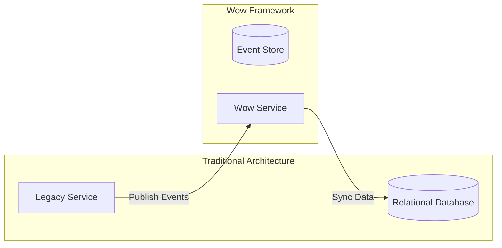

# Migration Guide

This guide helps you migrate from traditional architecture to the Wow framework, as well as upgrade between different versions.

## Version Upgrade Guide

### Upgrade Steps

1. **Backup Data**: Backup event store and snapshot data before upgrading
2. **Read Changelog**: Check [Release Notes](https://github.com/Ahoo-Wang/Wow/releases)
3. **Update Dependency Version**: Modify build.gradle.kts or pom.xml
4. **Run Tests**: Ensure all tests pass
5. **Gradual Rollout**: Gradually upgrade production environment

### Dependency Version Update

::: code-group
```kotlin [Gradle(Kotlin)]
// Update wow version
implementation("me.ahoo.wow:wow-spring-boot-starter:new-version")
```
```xml [Maven]
<dependency>
    <groupId>me.ahoo.wow</groupId>
    <artifactId>wow-spring-boot-starter</artifactId>
    <version>new-version</version>
</dependency>
```
:::

### Breaking Changes Check

Before upgrading, check the following:

1. **API Changes**: Check for interface signature changes
2. **Configuration Changes**: Check for configuration property changes
3. **Metadata Changes**: Regenerate metadata files

## Redis EventStore Canonical v2 Layout (introduced in v8.9.0)

When upgrading from v8.6.x or v8.8.x to v8.9.0, treat Redis persistence as a hard storage-format cutover. Redis
EventStore, Redis SnapshotStore, and Redis PrepareKey read and write canonical v2 keys only. There is no legacy
fallback, dual write, or built-in migrator, and old runtimes cannot read new v2 writes. The new EventStore also
enforces that `AggregateId.id` is unique within a named aggregate across all tenants.

The Spring Boot starter checks the exact sentinel keys created by successful writes in the published v8.6 and v8.8
EventStore layouts. It checks local aggregates resolved to the auto-configured `RedisEventStore`, supports Redis
Cluster without runtime `SCAN`, and blocks startup when incompatible data is found. It does not cover direct-library
usage, independently constructed custom stores, retired aggregate metadata, or snapshot-only Redis routes. A legacy
snapshot has no aggregate-independent exact sentinel. Canonical v2 ignores legacy snapshot keys. A missing v2
snapshot causes aggregate loading to replay events, but normal loading does not persist a rebuilt snapshot
automatically.

The exact-key guard is not a substitute for an offline data audit. A historical alias change, key eviction, or a
manually deleted or corrupted legacy index can hide the sentinel while orphaned streams remain. The resolved context
alias (the configured alias, or `contextName` when no alias is configured) and aggregate name form the persistent v2
key scope. The migration manifest must pin every historical source alias to the target resolved alias. Changing the
resolved alias or aggregate name after a write requires a separate offline key migration.

Use an offline cutover:

1. Stop traffic and every old-version writer, drain in-flight appends to zero, and create a consistent Redis backup
   together with event-count and version baselines. Do not use a mixed-version rolling deployment.
2. Inventory all legacy event ZSETs, v8.6 shared request SETs, v8.8 per-stream request SETs, v8.8 bucketed ID ZSETs,
   and legacy snapshot and PrepareKey hashes in every logical database on every Cluster primary. Record source key,
   Redis type, cardinality, checksum, and target mapping. Use identity embedded in event or snapshot JSON as the
   authority; an ambiguous historical key is only a locator.
3. Audit each named aggregate for duplicate `AggregateId.id` values across tenants. Resolve every collision before
   migration; canonical v2 intentionally cannot represent two owners of one ID.
4. Use an empty v2 target scope on the first run. For disposable data, remove only the inventoried legacy keys from
   the target or use an empty dedicated database. Never use `FLUSHDB` on a database shared with message-bus or
   application data. Keep the complete source dataset immutable for rollback.
5. Run a separately reviewed offline migrator. Its durable manifest must record source key, target keys, source and
   target checksums, status, and last completed batch. Resume may reuse a target only when manifest and checksum
   match; otherwise fail without overwriting. Copy operations must be idempotent, and partial target data must not be
   accepted without manifest-backed re-verification.
6. Preserve every event ZSET member and score, and verify identity consistency plus contiguous score/version order.
   Treat committed event JSON as authoritative for v2 request-ID SETs. For v8.6, compare the shared SET with
   `union(event.requestId)` in both directions and report shared-only and event-only differences separately; never fan
   it out to streams. For v8.8, compute the symmetric difference between each source per-stream SET and that stream's
   event request IDs. A non-empty difference fails migration unless an explicit reviewed disposition is recorded.
7. Rebuild every non-empty aggregate-ID index in the 128-bucket space. The bucket is
   `aggregateId.id.hashCode().mod(128)` using Java/Kotlin UTF-16 `String.hashCode`; keys and members must use the exact
   canonical v2 codec. The runtime does not perform this conversion.
8. Verify ordered member-and-score checksums, first/last versions, request-ID equality, the complete ID index,
   aggregate-ID scan results, and representative state replay. A failed run must retain its manifest and last verified
   cursor, then either clean the partial target or resume from that cursor; the application must not start meanwhile.
9. After full verification, an in-place migration must remove or move every legacy key in the recorded inventory.
   Delete sentinel keys last, rerun inventory, and require zero legacy keys. With a separate target database, keep the
   complete source dataset read-only through the rollback window.
10. Start one new instance against the target and run isolated-ID read/write smoke tests. Explicitly regenerate
    snapshots, then verify snapshot counts and versions before switching traffic and scaling out. Use the single-ID
    regenerate route from the complete inventory. The batch route may be treated as exhaustive only when the audited
    ID domain is strictly above `AggregateIdScanner.FIRST_ID`; otherwise it can omit lower IDs.

Rollback is a coordinated application-and-data operation. Before production v2 writes, reconnect the untouched
legacy dataset and old runtime. After any production v2 write, first stop traffic and v2 writers, then reverse-migrate
or replay those writes before restarting the old runtime; restoring only the cutover backup loses every later v2
write. Prefer a separate target database or namespace.

The mandatory exact-key check is an internal startup invariant. It is intentionally neither optional nor exposed as
a compatibility or migration setting.

Source, JVM binary, and behavioral compatibility are intentionally broken for Redis layout internals. Removed APIs
include `AggregateKeyConverter`, `RedisWrappedKey`, `RedisSnapshotRepository`, `EventStreamKeyConverter`,
`DefaultSnapshotKeyConverter`, `PrepareKeyConverter`, and `RedisEventStore.SCRIPT_EVENT_STEAM_APPEND`; the
`redisSnapshotRepository` bean alias and custom snapshot-key converter constructor are also removed. The new
`SCRIPT_EVENT_STREAM_APPEND` is internal, with no public replacement. Canonical converter outputs changed, PrepareKey
now includes its `name`, and v2 rejects empty aggregate/prepare IDs and unpaired UTF-16 surrogates. Application code
should use `EventStore`, `SnapshotStore`, and `PrepareKey`; reviewed offline tooling must independently implement and
verify the documented v2 codec.

## Mongo Ownership Guard and Snapshot Checkpoints

This upgrade keeps aggregate-name-only Mongo collection names, but adds a durable
`wow_database_metadata` ownership marker. The supported deployment layout is one bounded context per MongoDB
database.

Before rollout:

1. Inspect every configured event-stream, snapshot, and prepare database. Check all `*_event_stream`, `*_snapshot`,
   `*_snapshot_checkpoint`, and `prepare_*` collections.
2. Confirm that each database belongs to only one `wow.context-name`; a mixed database must be split before upgrade.
3. Upgrade the database's real owner first. The first upgraded instance scans legacy aggregate collections before
   atomically claiming the marker. Legacy `prepare_*` records contain no context metadata, so a prepare-only database
   is claimed by the first upgraded context and must be audited before rollout.
4. Audit existing managed indexes. Missing indexes are created, but incompatible key order, uniqueness, TTL,
   partial-filter, collation, sparse, or hidden options block startup and require a controlled migration.

Do not edit the marker to bypass a context mismatch. Move or remove the old data, then remove the marker only when
the database is intentionally reassigned.

Historical snapshot checkpoints are disabled by default:

```yaml
wow:
  eventsourcing:
    snapshot:
      checkpoint:
        enabled: false
        version-interval: 100
```

Enabling the feature creates `<aggregate>_snapshot_checkpoint` sidecars and stores only newly produced matching
versions; it does not backfill history. Roll back by disabling the feature, and retain the sidecars until validation
and retention decisions are complete.

## Migrating from Traditional Architecture

### Migration Strategy

#### Gradual Migration

We recommend a gradual migration strategy, progressively migrating functional modules to event sourcing architecture:


```mermaid
flowchart LR
    subgraph Legacy["Traditional Architecture"]
        LDB[(Relational Database)]
        LS[Legacy Service]
    end
    
    subgraph Wow["Wow Framework"]
        ES[(Event Store)]
        WS[Wow Service]
    end
    
    LS -->|Publish Events| WS
    WS -->|Sync Data| LDB

```

#### Migration Steps

1. **Identify Bounded Contexts**: Determine business modules to migrate
2. **Design Domain Model**: Define aggregate roots, commands, and events
3. **Implement Dual Writing**: Write to both old and new systems
4. **Verify Consistency**: Ensure data consistency
5. **Switch Read/Write**: Gradually switch to new system

### Data Migration

#### Historical Data Import

For scenarios requiring historical data preservation, it is recommended to define migration commands:

```kotlin
// 1. Define Migration Command
@CreateAggregate
data class MigrateOrder(
    val orderId: String,
    val customerId: String,
    val items: List<OrderItem>,
    val createdAt: Long
)

// 2. Handle Migration Command in Aggregate
@AggregateRoot
class Order(private val state: OrderState) {
    @OnCommand
    fun onMigrate(command: MigrateOrder): OrderCreated {
        return OrderCreated(
            orderId = command.orderId,
            customerId = command.customerId,
            items = command.items,
            createdAt = command.createdAt
        )
    }
}

// 3. Send Migration Command
fun migrateHistoricalData(legacyOrders: List<LegacyOrder>) {
    legacyOrders.forEach { order ->
        val command = MigrateOrder(
            orderId = order.id,
            customerId = order.customerId,
            items = order.items.map { /* convert */ },
            createdAt = order.createdAt
        )
        commandGateway.send(command).block()
    }
}
```

### Code Migration

#### From CRUD to Command Pattern

**Traditional CRUD Code**:

```kotlin
// Traditional service
@Service
class OrderService(private val orderRepository: OrderRepository) {
    
    fun createOrder(request: CreateOrderRequest): Order {
        val order = Order(
            id = UUID.randomUUID().toString(),
            customerId = request.customerId,
            items = request.items,
            status = OrderStatus.CREATED
        )
        return orderRepository.save(order)
    }
    
    fun updateOrderStatus(orderId: String, status: OrderStatus) {
        val order = orderRepository.findById(orderId)
        order.status = status
        orderRepository.save(order)
    }
}
```

**Migrated Wow Code**:

```kotlin
// Command definitions
@CreateAggregate
data class CreateOrder(
    val customerId: String,
    val items: List<OrderItem>
)

@CommandRoute
data class UpdateOrderStatus(
    @AggregateId val id: String,
    val status: OrderStatus
)

// Aggregate root
@AggregateRoot
class Order(private val state: OrderState) {
    
    @OnCommand
    fun onCreate(command: CreateOrder): OrderCreated {
        return OrderCreated(
            customerId = command.customerId,
            items = command.items
        )
    }
    
    @OnCommand
    fun onUpdateStatus(command: UpdateOrderStatus): OrderStatusUpdated {
        return OrderStatusUpdated(command.status)
    }
}

// State aggregate root
class OrderState : Identifier {
    lateinit var id: String
    lateinit var customerId: String
    var items: List<OrderItem> = emptyList()
    var status: OrderStatus = OrderStatus.CREATED
    
    fun onSourcing(event: OrderCreated) {
        this.customerId = event.customerId
        this.items = event.items
    }
    
    fun onSourcing(event: OrderStatusUpdated) {
        this.status = event.status
    }
}
```

#### From Direct Queries to Query Snapshots

**Traditional Query Code**:

```kotlin
@Repository
interface OrderRepository : JpaRepository<Order, String> {
    fun findByCustomerId(customerId: String): List<Order>
    fun findByStatus(status: OrderStatus): List<Order>
}
```

**Migrated Query Code**:

Refer to [Query Service](query.md)

```kotlin
class OrderService(
    private val queryService: SnapshotQueryService<OrderState>
) {
    fun getById(id: String): Mono<OrderState> {
        return singleQuery {
            condition {
                id(id)
            }
        }.query(queryService).toState().throwNotFoundIfEmpty()
    }
}
```

## Compatibility Notes

### Data Format Compatibility

The Wow framework uses JSON serialization for events and snapshot data, ensuring good forward compatibility:

- **Adding Fields**: New fields will be ignored (backward compatible)
- **Removing Fields**: Uses default values (needs handling)
- **Changing Field Types**: Requires event upgrader

### Event Upgrades

Use the `revision` attribute of the `@Event` annotation for event version control:

```kotlin
@Event(revision = "1.0")
data class OrderCreatedV1(
    val orderId: String,
    val items: List<OrderItem>
)

@Event(revision = "2.0")
data class OrderCreated(
    val orderId: String,
    val items: List<OrderItem>,
    val customerId: String // New field
)
```

### Message Format Compatibility

Ensure message format compatibility:

1. **Adding Fields**: Safe, uses default values
2. **Removing Fields**: Need to ensure consumers can handle
3. **Renaming Fields**: Not compatible, requires version control

## Known Issues

### Version-Specific Issues

Please check [GitHub Issues](https://github.com/Ahoo-Wang/Wow/issues) for the latest known issues list.

### Common Migration Issues

1. **Event Replay Order**: Ensure events are appended in version order
2. **Timestamp Handling**: Preserve original timestamps
3. **ID Generation**: Maintain consistent ID format

## Migration Checklist

- [ ] Backup existing data
- [ ] Update dependency version
- [ ] Check breaking changes
- [ ] Update configuration files
- [ ] Regenerate metadata
- [ ] Run unit tests
- [ ] Run integration tests
- [ ] Gradual rollout verification
- [ ] Full rollout
- [ ] Monitoring verification

## Rollback Plan

If migration fails, follow these rollback steps:

1. Stop new service
2. Restore old service
3. Verify data consistency
4. Analyze failure cause
5. Fix issues and retry
