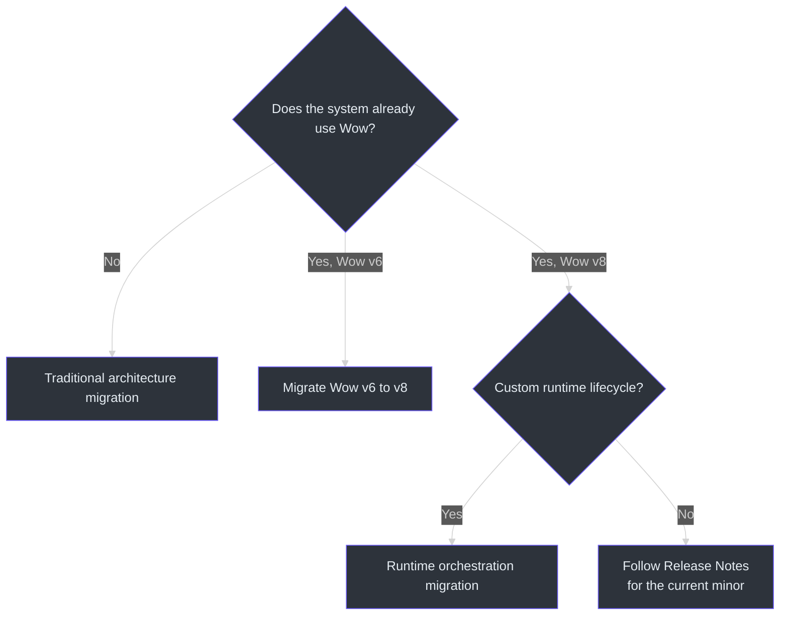
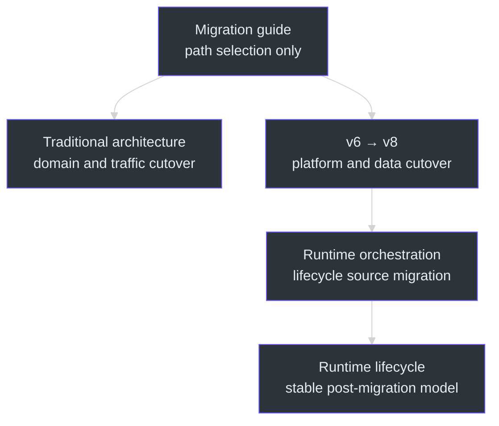
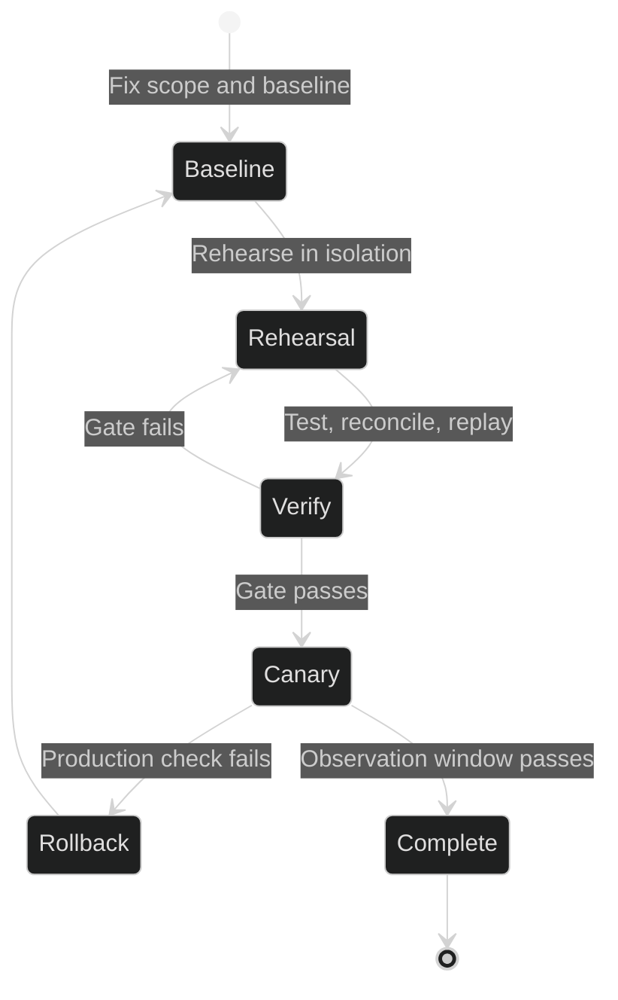

# Migration Guide

There are two primary migration paths. **First-time Wow adoption** is about domain boundaries,
data modeling, and traffic cutover. **Wow v6 → v8** is about the exact source-tag platform delta,
source compatibility, and storage-format cutovers. A system already on Wow v8 with custom runtime lifecycle ownership
also needs the **runtime-orchestration migration track** inside the v8 path; it is not a third
business or data migration. Choose the primary path first; do not combine both into one release.

## Choose a Migration Path

| Current state | Goal | Read | Keep out of scope |
|---|---|---|---|
| Traditional CRUD, transaction scripts, or direct database writes | Adopt Wow CQRS and event sourcing incrementally | [Migrating from Traditional Architecture](./migration/traditional-architecture.md) | Wow v6 version-compatibility assumptions |
| Wow v6 on its exact pinned platform | Wow v8 on its pinned target platform | [Migrate Wow v6 to v8](./migration/v6-to-v8.md) | Redesigning every business boundary |
| Wow v8 with custom Dispatcher, MessageBus, or Spring lifecycle integration | Current unified `WowRuntime` | [Runtime Orchestration Migration](./migration/runtime-orchestration.md) | Rewriting business data |

```mermaid
%%{init: {"theme": "dark"}}%%
flowchart TD
    Start{"Does the system already use Wow?"}
    Start -->|"No"| Traditional["Traditional architecture migration"]
    Start -->|"Yes, Wow v6"| V6["Migrate Wow v6 to v8"]
    Start -->|"Yes, Wow v8"| Custom{"Custom runtime lifecycle?"}
    Custom -->|"Yes"| Runtime["Runtime orchestration migration"]
    Custom -->|"No"| Release["Follow Release Notes<br>for the current minor"]
    classDef route fill:#2d333b,stroke:#6d5dfc,color:#e6edf3
    class Start,Traditional,V6,Custom,Runtime,Release route
```

<!-- Sources:
- README.md:47-49
- documentation/docs/en/guide/migration/traditional-architecture.md
- documentation/docs/en/guide/migration/v6-to-v8.md
- documentation/docs/en/guide/migration/runtime-orchestration.md
-->

## Documentation Boundaries

```mermaid
%%{init: {"theme": "dark"}}%%
graph TD
    Index["Migration guide<br>path selection only"]
    Traditional["Traditional architecture<br>domain and traffic cutover"]
    V6["v6 → v8<br>platform and data cutover"]
    Runtime["Runtime orchestration<br>lifecycle source migration"]
    Lifecycle["Runtime lifecycle<br>stable post-migration model"]
    Index --> Traditional
    Index --> V6
    V6 --> Runtime
    Runtime --> Lifecycle
    classDef doc fill:#2d333b,stroke:#6d5dfc,color:#e6edf3
    class Index,Traditional,V6,Runtime,Lifecycle doc
```

<!-- Sources:
- documentation/docs/en/guide/migration/traditional-architecture.md
- documentation/docs/en/guide/migration/v6-to-v8.md
- documentation/docs/en/guide/migration/runtime-orchestration.md
- documentation/docs/en/guide/advanced/runtime-lifecycle.md
-->

| Page | Answers | Primary source |
|---|---|---|
| Traditional architecture | How do we establish commands, aggregates, events, and state from CRUD, then move traffic safely? | [CreateOrder.kt:31-64](https://github.com/Ahoo-Wang/Wow/blob/main/example/example-api/src/main/kotlin/me/ahoo/wow/example/api/order/CreateOrder.kt#L31-L64), [Order.kt:55-137](https://github.com/Ahoo-Wang/Wow/blob/main/example/example-domain/src/main/kotlin/me/ahoo/wow/example/domain/order/Order.kt#L55-L137) |
| v6 → v8 | How do we align the exact v6 platform baseline with the pinned v8 target and handle storage and API breaks? | [v6.21.5 versions](https://github.com/Ahoo-Wang/Wow/blob/v6.21.5/gradle/libs.versions.toml), [v8.0.0 Release](https://github.com/Ahoo-Wang/Wow/releases/tag/v8.0.0), [current versions](https://github.com/Ahoo-Wang/Wow/blob/main/gradle/libs.versions.toml) |
| Runtime orchestration | How do we converge multiple lifecycle owners on one `WowRuntime`? | [WowAutoConfiguration.kt:118-152](https://github.com/Ahoo-Wang/Wow/blob/main/wow-spring-boot-starter/src/main/kotlin/me/ahoo/wow/spring/boot/starter/WowAutoConfiguration.kt#L118-L152) |

## Shared Completion Gates

Both primary paths and the runtime-orchestration track must advance on evidence. A process that
merely starts is not yet migrated.

```mermaid
%%{init: {"theme": "dark"}}%%
stateDiagram-v2
    [*] --> Baseline: Fix scope and baseline
    Baseline --> Rehearsal: Rehearse in isolation
    Rehearsal --> Verify: Test, reconcile, replay
    Verify --> Rehearsal: Gate fails
    Verify --> Canary: Gate passes
    Canary --> Rollback: Production check fails
    Rollback --> Baseline
    Canary --> Complete: Observation window passes
    Complete --> [*]
```

<!-- Sources:
- wow-core/src/main/kotlin/me/ahoo/wow/command/CommandFactory.kt:60-103
- wow-core/src/main/kotlin/me/ahoo/wow/command/CommandGateway.kt:75-159
- wow-core/src/main/kotlin/me/ahoo/wow/eventsourcing/snapshot/SnapshotStore.kt:57-71
- wow-spring-boot-starter/src/main/kotlin/me/ahoo/wow/spring/boot/starter/WowAutoConfiguration.kt:118-152
-->

- **Scope**: Fix the bounded context, dataset, source version, target version, and explicit exclusions.
- **Baseline**: Record tests, event/snapshot counts, critical business metrics, and a restorable backup.
- **Verification**: Run unit and integration tests, per-aggregate reconciliation, representative replay, and real startup/shutdown.
- **Rollout**: Validate one instance or a small traffic slice first, including rollback after new writes.
- **Closure**: Remove old data, writers, compatibility code, and temporary synchronization only after the observation window.

## Legacy Link Navigation

The topics formerly on this page moved to
[Migrating from Traditional Architecture](./migration/traditional-architecture.md),
[Migrate Wow v6 to v8](./migration/v6-to-v8.md), and
[Runtime Orchestration Migration](./migration/runtime-orchestration.md). The headings and aliases
below retain every deep link from the original page; continue to the linked page after arrival.

### Version Upgrade Guide

See [v6 → v8: General Upgrade Steps](./migration/v6-to-v8.md#general-upgrade-steps).

### Migrating from Traditional Architecture

See [Traditional Architecture: Migration Overview](./migration/traditional-architecture.md#migration-overview).

### Data Migration

See [Traditional Architecture: Import and Catch Up with One Writer](./migration/traditional-architecture.md#_2-import-and-catch-up-with-one-writer).

### Code Migration

See [Traditional Architecture: Migrate the Boundary Before the Tables](./migration/traditional-architecture.md#_1-migrate-the-boundary-before-the-tables)
and [Reconcile, Then Move Reads and Writes Separately](./migration/traditional-architecture.md#_3-reconcile-then-move-reads-and-writes-separately).

### Compatibility Notes

See [Traditional Architecture: Continue Evolving the Domain Model](./migration/traditional-architecture.md#_4-continue-evolving-the-domain-model)
and [v6 → v8: Breaking Changes Check](./migration/v6-to-v8.md#breaking-changes-check).

### Known Issues

See the [Release Notes](https://github.com/Ahoo-Wang/Wow/releases) and
[Troubleshooting](./troubleshooting.md).

### Migration Checklist

See the [Traditional Architecture Completion Checklist](./migration/traditional-architecture.md#completion-checklist)
or the [v6 → v8 Verification Checklist](./migration/v6-to-v8.md#verification-checklist).

### Rollback Plan

See the [Shared Completion Gates](#shared-completion-gates) on this page and the cutover and
rollback steps on the selected migration page.

### Unified Runtime Orchestration

See [Runtime Orchestration Migration](./migration/runtime-orchestration.md).

### Removal of Versioned Snapshot Checkpoints

See [v6 → v8: Versioned Snapshot Checkpoint Removal](./migration/v6-to-v8.md#versioned-snapshot-checkpoint-removal).

### Atomic SnapshotStore Saves

See [v6 → v8: Atomic SnapshotStore Saves](./migration/v6-to-v8.md#atomic-snapshotstore-saves).

### Redis EventStore Canonical v2 Layout (introduced in v8.9.0)

See [v6 → v8: Redis EventStore Canonical v2 Layout](./migration/v6-to-v8.md#redis-eventstore-canonical-v2-layout-introduced-in-v8-9-0).

### Mongo Ownership Guard

See [v6 → v8: Mongo Ownership Guard](./migration/v6-to-v8.md#mongo-ownership-guard).

## Related Pages

| Page | Relationship |
|---|---|
| [Migrating from Traditional Architecture](./migration/traditional-architecture.md) | First-time Wow adoption |
| [Migrate Wow v6 to v8](./migration/v6-to-v8.md) | Platform upgrade for existing Wow systems |
| [Runtime Orchestration Migration](./migration/runtime-orchestration.md) | v8 lifecycle extension migration |
| [Troubleshooting](./troubleshooting.md) | Investigation entry point when verification fails |
