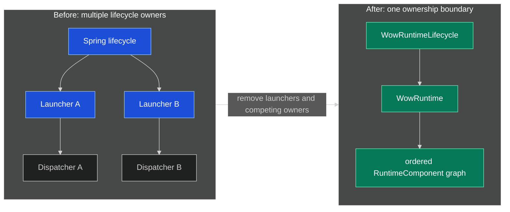
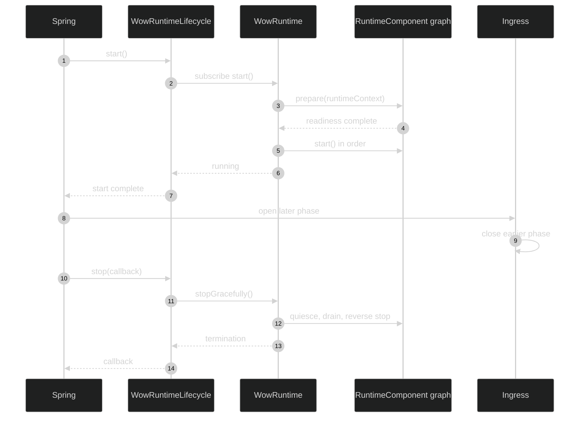
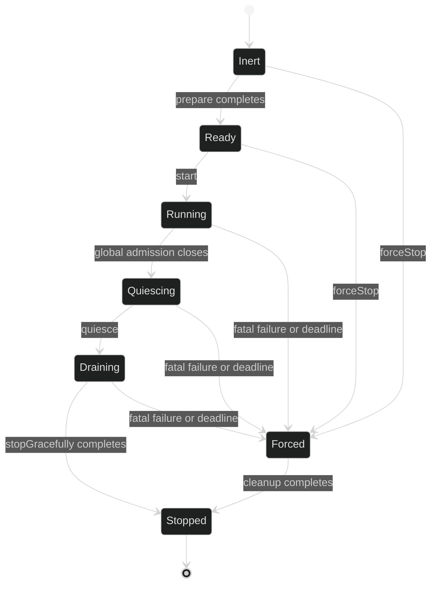

# Runtime Orchestration Migration

This guide covers the breaking migration from independent dispatcher launchers to
the one-shot `WowRuntime`. It owns only the upgrade procedure. For the stable
runtime model and shutdown semantics, see
[Runtime Lifecycle](../advanced/runtime-lifecycle.md).

Event, snapshot, and message formats are unchanged. No data migration is required,
but custom lifecycle integrations must be recompiled and migrated.

## Migration at a Glance

| Previous integration | Required replacement | Source |
|---|---|---|
| Independent `MessageDispatcherLauncher` instances | One `WowRuntime` owns all `RuntimeComponent` instances | [`WowRuntime.kt:47-76`](https://github.com/Ahoo-Wang/Wow/blob/main/wow-core/src/main/kotlin/me/ahoo/wow/runtime/WowRuntime.kt#L47-L76) |
| Generic Wow lifecycle implementation | `RuntimeComponent` for runtime-owned work, or `GracefullyStoppable` for independently owned shutdown only | [`RuntimeComponent.kt:18-62`](https://github.com/Ahoo-Wang/Wow/blob/main/wow-core/src/main/kotlin/me/ahoo/wow/runtime/RuntimeComponent.kt#L18-L62), [`GracefullyStoppable.kt:19-37`](https://github.com/Ahoo-Wang/Wow/blob/main/wow-core/src/main/kotlin/me/ahoo/wow/infra/lifecycle/GracefullyStoppable.kt#L19-L37) |
| Constructor, `@PostConstruct`, or Spring destruction owns resources | Inert construction; acquire in `prepare` or `start`; release only through the runtime | [`RuntimeComponent.kt:18-33`](https://github.com/Ahoo-Wang/Wow/blob/main/wow-core/src/main/kotlin/me/ahoo/wow/runtime/RuntimeComponent.kt#L18-L33) |
| Subscription or demand implies readiness | Explicit `MessageReceiver.readiness` and processing admission callbacks | [`MessageReceiver.kt:20-89`](https://github.com/Ahoo-Wang/Wow/blob/main/wow-core/src/main/kotlin/me/ahoo/wow/messaging/MessageReceiver.kt#L20-L89) |
| Per-dispatcher shutdown timeout | One runtime-wide deadline plus a stable quiet period | [`WowRuntime.kt:103-125`](https://github.com/Ahoo-Wang/Wow/blob/main/wow-core/src/main/kotlin/me/ahoo/wow/runtime/WowRuntime.kt#L103-L125) |



<!-- Sources:
- [WowRuntime.kt:47-76](https://github.com/Ahoo-Wang/Wow/blob/main/wow-core/src/main/kotlin/me/ahoo/wow/runtime/WowRuntime.kt#L47-L76)
- [WowAutoConfiguration.kt:118-152](https://github.com/Ahoo-Wang/Wow/blob/main/wow-spring-boot-starter/src/main/kotlin/me/ahoo/wow/spring/boot/starter/WowAutoConfiguration.kt#L118-L152)
-->

## 1. Replace Lifecycle Ownership

Remove:

- `MessageDispatcherLauncher` beans, factories, injections, and direct dispatcher
  lifecycle calls;
- application-defined `WowRuntimeLifecycle` beans in Starter applications;
- Spring `Lifecycle`, `SmartLifecycle`, `DisposableBean`, `@PreDestroy`, and
  explicit destroy methods from runtime-owned component beans.

Dispatcher lifecycle methods are final templates. Recompile every subclass.
Additional lifecycle ownership belongs in a separate `RuntimeComponent`, not in a
dispatcher override. `MainDispatcher` retains only narrow cleanup hooks for
framework implementations that own schedulers.
[`MainDispatcher.kt:193-357`](https://github.com/Ahoo-Wang/Wow/blob/main/wow-core/src/main/kotlin/me/ahoo/wow/messaging/dispatcher/MainDispatcher.kt#L193-L357)

### Non-Spring applications

Construct exactly one runtime. `start()` returns a cold `Mono<Void>` and must be
subscribed.

```kotlin
val runtime = WowRuntime(components, shutdownTimeout, shutdownQuietPeriod)
runtime.start().block()
// application work
runtime.stop()
```

### Spring Boot applications

The Starter owns the canonical `wowRuntimeLifecycle` bridge. Runtime-owned
components must be singleton beans whose declared return type exposes
`RuntimeComponent` or a subtype. The runtime invokes the Spring-exposed proxy;
there is no target unwrapping.

A custom runtime must be a direct singleton bean named `wowRuntime`, must be the
only local `WowRuntime`, and must disable Spring's inferred
`AutoCloseable.close()` owner:

```kotlin
@Bean(WOW_RUNTIME_BEAN_NAME, destroyMethod = "")
fun customWowRuntime(): WowRuntime =
    WowRuntime(components, shutdownTimeout, shutdownQuietPeriod)
```

A `FactoryBean` product is rejected because the Starter cannot prove exclusive
destruction ownership. When the application provides the canonical runtime, that
runtime owns its component topology; automatic discovery applies only to the
Starter-created default runtime. A child `ApplicationContext` owns only its local
components.
[`WowAutoConfiguration.kt:118-213`](https://github.com/Ahoo-Wang/Wow/blob/main/wow-spring-boot-starter/src/main/kotlin/me/ahoo/wow/spring/boot/starter/WowAutoConfiguration.kt#L118-L213)



<!-- Sources:
- [WowRuntimeLifecycle.kt:27-44](https://github.com/Ahoo-Wang/Wow/blob/main/wow-spring/src/main/kotlin/me/ahoo/wow/spring/WowRuntimeLifecycle.kt#L27-L44)
- [WowRuntimeLifecycle.kt:76-118](https://github.com/Ahoo-Wang/Wow/blob/main/wow-spring/src/main/kotlin/me/ahoo/wow/spring/WowRuntimeLifecycle.kt#L76-L118)
- [WowRuntimeLifecycle.kt:211-258](https://github.com/Ahoo-Wang/Wow/blob/main/wow-spring/src/main/kotlin/me/ahoo/wow/spring/WowRuntimeLifecycle.kt#L211-L258)
-->

If a custom ingress implements `SmartLifecycle`, use a phase greater than
`WOW_RUNTIME_PHASE`: ingress then starts after runtime readiness and stops before
the runtime. If the application replaces `lifecycleProcessor` with a
`DefaultLifecycleProcessor`, Wow derives the runtime phase timeout from the
selected runtime's `shutdownTimeout` and adds the configured completion margin.
[`WowAutoConfiguration.kt:65-89`](https://github.com/Ahoo-Wang/Wow/blob/main/wow-spring-boot-starter/src/main/kotlin/me/ahoo/wow/spring/boot/starter/WowAutoConfiguration.kt#L65-L89)

## 2. Migrate Custom Runtime Participants

Implement `RuntimeComponent` directly:

```kotlin
class CustomRuntimeComponent : RuntimeComponent {
    override fun prepare(runtimeContext: RuntimeContext): Mono<Void> =
        prepareResourcesWithoutOpeningProcessing(runtimeContext)

    override fun start() = openIntake()

    override fun quiesce() = closeIntake()

    override fun stopGracefully(): Mono<Void> = drainAndClose()

    override fun forceStop() {
        closeIntake()
        disposeOwnedResources()
    }
}
```

The lifecycle contract is strict:

- `prepare` completes when the component can retain admitted work without loss,
  while processing remains closed;
- `start` opens processing;
- `quiesce` closes intake promptly, synchronously, and idempotently;
- `stopGracefully` drains accepted work;
- `forceStop` is prompt, non-blocking, repeat-safe, and safe before preparation.

Acquire a `RuntimeActivity` through `RuntimeContext.tryAcquire()` before accepting
each complete asynchronous operation. Close it only when that complete chain
terminates. Report terminal pipeline failures with `reportFailure`.
[`RuntimeContext.kt:16-45`](https://github.com/Ahoo-Wang/Wow/blob/main/wow-core/src/main/kotlin/me/ahoo/wow/runtime/RuntimeContext.kt#L16-L45)



<!-- Sources:
- [RuntimeComponent.kt:18-62](https://github.com/Ahoo-Wang/Wow/blob/main/wow-core/src/main/kotlin/me/ahoo/wow/runtime/RuntimeComponent.kt#L18-L62)
- [WowRuntime.kt:470-565](https://github.com/Ahoo-Wang/Wow/blob/main/wow-core/src/main/kotlin/me/ahoo/wow/runtime/WowRuntime.kt#L470-L565)
-->

Cancelling the `start()` subscription aborts and force-stops this one-shot
runtime. Preparation publishers must therefore release or terminate promptly
when `forceStop` runs. A terminated runtime or Spring context cannot restart;
create a new instance instead.

## 3. Migrate Message Sources

A custom `MessageBus` whose subscription is not immediately able to retain new
work must override `receiver` and return:

1. a single-use message stream;
2. a hot, replayable readiness signal;
3. an idempotent `openProcessing` callback;
4. an idempotent `closeProcessing` callback.

Preserve all four when mapping a receiver. The runtime subscribes before awaiting
readiness, opens processing only during the global start pass, and closes logical
processing before detached physical cancellation.
[`MessageReceiver.kt:20-89`](https://github.com/Ahoo-Wang/Wow/blob/main/wow-core/src/main/kotlin/me/ahoo/wow/messaging/MessageReceiver.kt#L20-L89)

Transport-specific checks:

- Redis readiness creates all consumer groups without starting stream reads
  before processing admission.
  [`AbstractRedisMessageBus.kt:76-146`](https://github.com/Ahoo-Wang/Wow/blob/main/wow-redis/src/main/kotlin/me/ahoo/wow/redis/bus/AbstractRedisMessageBus.kt#L76-L146)
- Kafka readiness persists a conservative assignment boundary before publishing
  readiness. Provision topics before runtime startup.
  [`AbstractKafkaBus.kt:128-185`](https://github.com/Ahoo-Wang/Wow/blob/main/wow-kafka/src/main/kotlin/me/ahoo/wow/kafka/AbstractKafkaBus.kt#L128-L185)
  [`AbstractKafkaBus.kt:260-273`](https://github.com/Ahoo-Wang/Wow/blob/main/wow-kafka/src/main/kotlin/me/ahoo/wow/kafka/AbstractKafkaBus.kt#L260-L273)

For a custom `LocalMessageBus`, the default `sendIfSubscribed` deliberately
returns `false`. Override it only when `true` proves that every targeted local
receiver acquired processing admission; `subscriberCount()` plus `send()` is not
an atomic receipt. Ordinary `receiver()` consumers need no receipt protocol.
Runtime-owned custom consumers of the built-in in-memory bus opt in with
`runtimeReceiver()` and then call `confirmLocalDelivery()` after admission and
handoff, or `rejectLocalDelivery()` when they filter or cannot admit the exchange.
[`MessageBus.kt:54-107`](https://github.com/Ahoo-Wang/Wow/blob/main/wow-core/src/main/kotlin/me/ahoo/wow/messaging/MessageBus.kt#L54-L107)
[`LocalDeliveryReceipt.kt:252-273`](https://github.com/Ahoo-Wang/Wow/blob/main/wow-core/src/main/kotlin/me/ahoo/wow/messaging/LocalDeliveryReceipt.kt#L252-L273)

## 4. Update Adjacent Extensions

- A custom `AggregateSchedulerSupplier` must implement both
  `stopGracefully()` and `forceStop()`. Force stop synchronously disposes every
  scheduler that graceful shutdown could own.
  [`AggregateSchedulerSupplier.kt:40-65`](https://github.com/Ahoo-Wang/Wow/blob/main/wow-core/src/main/kotlin/me/ahoo/wow/scheduler/AggregateSchedulerSupplier.kt#L40-L65)
- `AutoRegistrar` is initialization work and now implements
  `SmartInitializingSingleton`. Remove lifecycle calls and references to the
  deleted `AUTO_REGISTRAR_PHASE`.
  [`AutoRegistrar.kt:20-44`](https://github.com/Ahoo-Wang/Wow/blob/main/wow-spring/src/main/kotlin/me/ahoo/wow/spring/AutoRegistrar.kt#L20-L44)

## 5. Review Shutdown Configuration

- `wow.shutdown-timeout` is one deadline for quiescing and stopping the complete
  runtime, not an allowance per dispatcher.
- `wow.shutdown-quiet-period` defaults to `1s`, must be non-negative, strictly
  shorter than the timeout, and both durations must fit signed 64-bit nanoseconds.
- Runtime termination can carry the original pipeline error. Unexpected fatal
  termination in a Starter application closes the application context.

The runtime closes global admission first, quiesces component intake, waits for a
stable quiet period, and then stops components in reverse order. Deadline expiry
or cleanup failure enters force stop.
[`WowRuntime.kt:325-468`](https://github.com/Ahoo-Wang/Wow/blob/main/wow-core/src/main/kotlin/me/ahoo/wow/runtime/WowRuntime.kt#L325-L468)
[`WowProperties.kt:24-47`](https://github.com/Ahoo-Wang/Wow/blob/main/wow-spring-boot-starter/src/main/kotlin/me/ahoo/wow/spring/boot/starter/WowProperties.kt#L24-L47)

## Deployment and Rollback

Before deployment:

- recompile every custom dispatcher and lifecycle extension;
- verify that each runtime-owned resource has exactly one owner;
- run application-context startup and graceful-shutdown tests with production
  timeout values;
- test fatal failure, startup cancellation, and deadline expiry;
- provision Kafka topics before starting the runtime.

Do not use a mixed lifecycle topology. To roll back, completely stop the new
application context and deploy the previous binaries together with the previous
launcher configuration. Do not restart a context whose runtime has terminated.

## References

| Source | Responsibility |
|---|---|
| [`WowRuntime.kt`](https://github.com/Ahoo-Wang/Wow/blob/main/wow-core/src/main/kotlin/me/ahoo/wow/runtime/WowRuntime.kt) | One-shot orchestration, shared deadline, fatal shutdown |
| [`RuntimeComponent.kt`](https://github.com/Ahoo-Wang/Wow/blob/main/wow-core/src/main/kotlin/me/ahoo/wow/runtime/RuntimeComponent.kt) | Runtime-owned lifecycle contract |
| [`RuntimeContext.kt`](https://github.com/Ahoo-Wang/Wow/blob/main/wow-core/src/main/kotlin/me/ahoo/wow/runtime/RuntimeContext.kt) | Activity admission and fatal failure reporting |
| [`MessageReceiver.kt`](https://github.com/Ahoo-Wang/Wow/blob/main/wow-core/src/main/kotlin/me/ahoo/wow/messaging/MessageReceiver.kt) | Readiness and processing admission |
| [`WowRuntimeLifecycle.kt`](https://github.com/Ahoo-Wang/Wow/blob/main/wow-spring/src/main/kotlin/me/ahoo/wow/spring/WowRuntimeLifecycle.kt) | Spring lifecycle bridge |
| [`WowAutoConfiguration.kt`](https://github.com/Ahoo-Wang/Wow/blob/main/wow-spring-boot-starter/src/main/kotlin/me/ahoo/wow/spring/boot/starter/WowAutoConfiguration.kt) | Starter composition root and ownership validation |

## Related Pages

| Page | Relationship |
|---|---|
| [Migration Guide](../migration.md) | Upgrade overview and other migration topics |
| [Runtime Lifecycle](../advanced/runtime-lifecycle.md) | Stable runtime architecture and shutdown semantics |
| [Configuration](../configuration.md) | Application decisions, environments, and secret boundaries with links to exact references |
| [Spring Boot Starter](../extensions/spring-boot-starter.md) | Starter auto-configuration and application integration |
