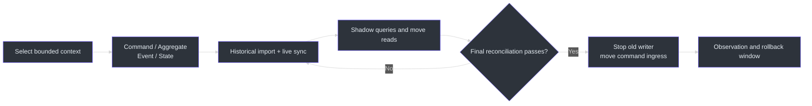
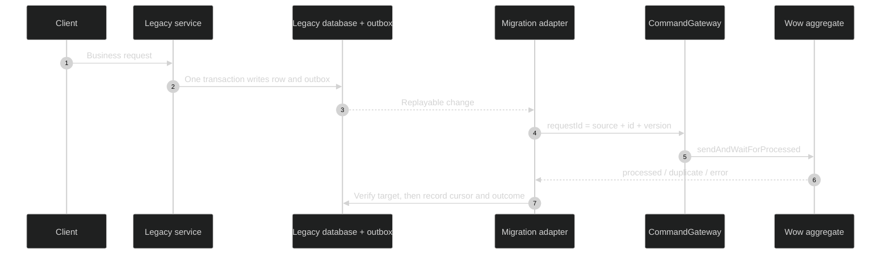
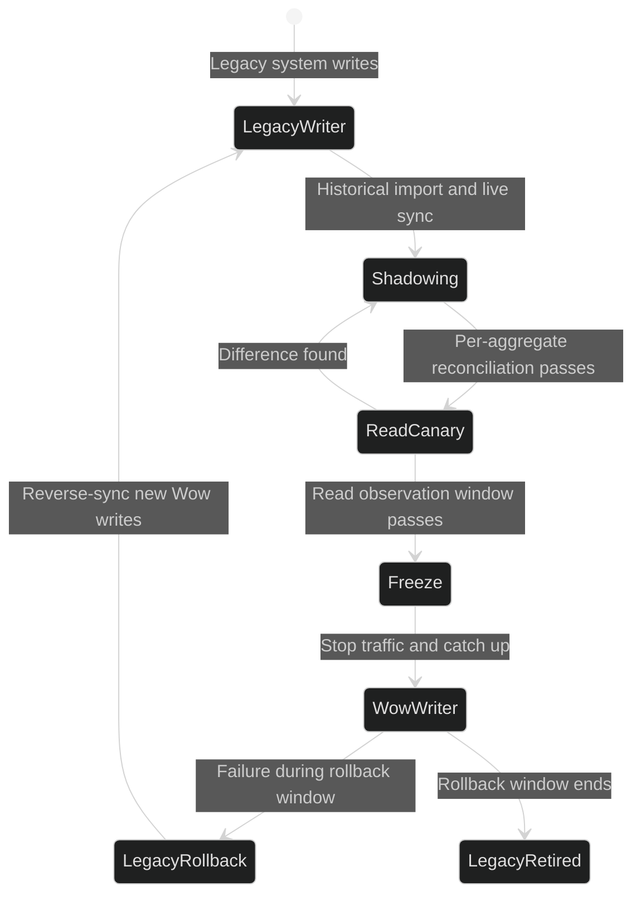

# Migrating from Traditional Architecture

This guide is for traditional CRUD systems that do not yet use Wow. The goal is not a
big-bang rewrite. Migrate one bounded context at a time, import history, catch up live changes,
move reads, and finally move writes while retaining **exactly one authoritative business writer**.

If the system already runs Wow v6, use [Migrate Wow v6 to v8](./v6-to-v8.md).

## Migration Overview

| Stage | Authoritative writer | Work | Exit gate | Source |
|---|---|---|---|---|
| 0. Select a boundary | Legacy system | Choose a low-coupling bounded context; fix ID, tenant, and invariant mappings | Business owners approve the language, aggregate boundary, and acceptance cases | [Modeling](../modeling.md) |
| 1. Build the Wow model | Legacy system | Define commands, aggregates, domain events, and state sourcing | `AggregateSpec` covers success, rejection, and idempotency paths | [CreateOrder.kt:31-64](https://github.com/Ahoo-Wang/Wow/blob/main/example/example-api/src/main/kotlin/me/ahoo/wow/example/api/order/CreateOrder.kt#L31-L64), [OrderSpec.kt:44-113](https://github.com/Ahoo-Wang/Wow/blob/main/example/example-domain/src/test/kotlin/me/ahoo/wow/example/domain/order/OrderSpec.kt#L44-L113) |
| 2. Shadow synchronization | Legacy system | Send replayable synchronization commands through outbox/CDC; Wow takes no production writes | Lag, failure queue, and per-aggregate reconciliation meet their thresholds | [CommandFactory.kt:60-103](https://github.com/Ahoo-Wang/Wow/blob/main/wow-core/src/main/kotlin/me/ahoo/wow/command/CommandFactory.kt#L60-L103) |
| 3. Move reads | Legacy system | Route queries to Wow snapshots/projections while retaining fast rollback | New and old query results agree throughout the observation window | [OrderQueryController.kt:34-45](https://github.com/Ahoo-Wang/Wow/blob/main/example/example-server/src/main/kotlin/me/ahoo/wow/example/server/order/OrderQueryController.kt#L34-L45) |
| 4. Move writes | Wow | Stop traffic, catch up, reconcile, then route command ingress to Wow | The old writer is closed; Wow writes and monitoring are verified | [CommandGateway.kt:75-159](https://github.com/Ahoo-Wang/Wow/blob/main/wow-core/src/main/kotlin/me/ahoo/wow/command/CommandGateway.kt#L75-L159) |
| 5. Retire the legacy model | Wow | Keep old data read-only through the rollback window, then remove the old write path | No rollback dependency or unresolved difference remains | [Event Store](../eventstore.md) |



<!-- Sources:
- documentation/docs/en/guide/modeling.md
- example/example-api/src/main/kotlin/me/ahoo/wow/example/api/order/CreateOrder.kt:31-64
- example/example-domain/src/main/kotlin/me/ahoo/wow/example/domain/order/Order.kt:55-137
- example/example-domain/src/main/kotlin/me/ahoo/wow/example/domain/order/OrderState.kt:39-99
-->

## 1. Migrate the Boundary Before the Tables

A table often carries several business concepts and does not map directly to an aggregate.
Derive commands from use cases, then define the invariants that must remain atomic inside one
aggregate. Coordinate across aggregates with domain events, sagas, or projections. The current
example models `CreateOrder` as a creation command, keeps rules in `Order`, and rebuilds state
through `OrderState.onSourcing` instead of mutating state from command handlers.

- [`CreateOrder.kt:31-64`](https://github.com/Ahoo-Wang/Wow/blob/main/example/example-api/src/main/kotlin/me/ahoo/wow/example/api/order/CreateOrder.kt#L31-L64)
- [`Order.kt:55-137`](https://github.com/Ahoo-Wang/Wow/blob/main/example/example-domain/src/main/kotlin/me/ahoo/wow/example/domain/order/Order.kt#L55-L137)
- [`OrderState.kt:39-99`](https://github.com/Ahoo-Wang/Wow/blob/main/example/example-domain/src/main/kotlin/me/ahoo/wow/example/domain/order/OrderState.kt#L39-L99)

Fix these mappings before migration:

| Legacy model | Wow model | Constraint |
|---|---|---|
| Primary key | `AggregateId.id` | It must be unique across tenants within one `NamedAggregate`; preserve a globally unique key, but audit collisions and define a deterministic mapping for tenant-local keys |
| Tenant column | `tenantId` | Use the same mapping for import, synchronization, and online commands |
| Optimistic-lock/update version | Command `requestId` plus source version | Use both for idempotency and ordering; a consumer offset alone is insufficient |
| Current row state | Domain-event sequence | Express business facts; do not mechanically invent an event history from a row |
| Join-heavy query | Snapshot/projection | Design a separate read model instead of making the aggregate query across boundaries |

The uniqueness scope of `AggregateId.id` is the `NamedAggregate`, not `(tenantId, id)`.
Redis explicitly rejects the same ID across tenants within a named aggregate; the MongoDB
event-stream unique index and Elasticsearch document ID also omit the tenant. If a legacy key
is unique only inside a tenant, derive a compound ID with a versioned, unambiguous deterministic
encoding or UUID v5 and persist the mapping manifest. Historical import, CDC, online commands,
queries, and rollback must all reuse the same mapping rather than generating a fresh ID per run.
[`AggregateId.kt:23-26`](https://github.com/Ahoo-Wang/Wow/blob/main/wow-api/src/main/kotlin/me/ahoo/wow/api/modeling/AggregateId.kt#L23-L26)
[`EventStreamSchemaInitializer.kt:65-70`](https://github.com/Ahoo-Wang/Wow/blob/main/wow-mongo/src/main/kotlin/me/ahoo/wow/mongo/EventStreamSchemaInitializer.kt#L65-L70)
[`ElasticsearchEventStreamAppender.kt:38-43`](https://github.com/Ahoo-Wang/Wow/blob/main/wow-elasticsearch/src/main/kotlin/me/ahoo/wow/elasticsearch/eventsourcing/ElasticsearchEventStreamAppender.kt#L38-L43)

## 2. Import and Catch Up with One Writer

Do not make an HTTP request write the legacy database and then the EventStore. If the second
write fails, the two states cannot be atomically rolled back. Keep the legacy database as the
single writer, publish changes from a transactional outbox or recoverable CDC stream, and let
the migration adapter send idempotent commands.



<!-- Sources:
- wow-core/src/main/kotlin/me/ahoo/wow/command/CommandFactory.kt:60-103
- wow-core/src/main/kotlin/me/ahoo/wow/command/CommandGateway.kt:75-159
- example/example-domain/src/main/kotlin/me/ahoo/wow/example/domain/order/Order.kt:105-137
-->

Historical import also uses the command boundary. Reuse the deterministic business-ID mapping
and derive a stable `requestId` to prevent duplicate writes. A duplicate `requestId` does not
return the previous success result: `sendAndWaitForProcessed` reports `DuplicateRequestId`
through `CommandResultException`. Treat it as already applied only after reconciling the target
event/state and source version, then advance the cursor. Keep the batch reactive. Only the
outermost entry point of a standalone offline process may wait for completion; never call
`block()` in the server request chain or Wow core path.

```kotlin
fun importOrders(rows: Iterable<LegacyOrder>): Mono<Void> =
    Flux.fromIterable(rows)
        .concatMap(::importOrder)
        .then()

private fun importOrder(row: LegacyOrder): Mono<Void> {
    val aggregateId = legacyOrderIdMapping.requireTargetId(row.tenantId, row.id)
    val command = ImportLegacyOrder.from(row).toCommandMessage(
        aggregateId = aggregateId,
        tenantId = row.tenantId,
        requestId = legacyOrderRequestId(row),
    )
    return commandGateway.sendAndWaitForProcessed(command)
        .then()
        .onErrorResume(CommandResultException::class.java) { error ->
            if (error.commandResult.errorCode != ErrorCodes.DUPLICATE_REQUEST_ID) {
                return@onErrorResume Mono.error(error)
            }
            verifyImportedOrder(
                tenantId = row.tenantId,
                aggregateId = aggregateId,
                sourceVersion = row.version,
            )
        }
}
```

`toCommandMessage` accepts explicit `aggregateId`, `tenantId`, `requestId`, and expected
version values. `sendAndWaitForProcessed` completes after the aggregate has processed the
command. The example's `verifyImportedOrder` must load the target event/state and compare the
source version; never swallow `DuplicateRequestId` without that verification.
`legacyOrderRequestId` must use a versioned, unambiguous encoding rather than directly joining
raw fields that may contain the delimiter.
`legacyOrderIdMapping`, `legacyOrderRequestId`, and `verifyImportedOrder` are illustrative
functions that the migration adapter must implement; they are not Wow framework APIs.
[`CommandFactory.kt:60-103`](https://github.com/Ahoo-Wang/Wow/blob/main/wow-core/src/main/kotlin/me/ahoo/wow/command/CommandFactory.kt#L60-L103)
[`CommandGateway.kt:127-143`](https://github.com/Ahoo-Wang/Wow/blob/main/wow-core/src/main/kotlin/me/ahoo/wow/command/CommandGateway.kt#L127-L143)
[`DefaultCommandGateway.kt:86-95`](https://github.com/Ahoo-Wang/Wow/blob/main/wow-core/src/main/kotlin/me/ahoo/wow/command/DefaultCommandGateway.kt#L86-L95)
[`DefaultCommandGateway.kt:228-255`](https://github.com/Ahoo-Wang/Wow/blob/main/wow-core/src/main/kotlin/me/ahoo/wow/command/DefaultCommandGateway.kt#L228-L255)

::: warning Do not fabricate history
Reconstruct historical domain events only when trustworthy business facts and ordering exist.
When only the current row is available, emit an explicit `LegacyOrderImported` or
`OrderBaselineEstablished` event containing the source, source version, and import time. Do
not invent a sequence of business events that never happened.
:::

## 3. Reconcile, Then Move Reads and Writes Separately

At minimum, reconcile existence, critical business fields, status, monetary or quantity
values, source version, and last synchronization time per `(tenantId, aggregateId)`. Equal
totals do not prove per-aggregate equality. Classify every difference as retryable, accepted,
or cutover-blocking.



<!-- Sources:
- example/example-server/src/main/kotlin/me/ahoo/wow/example/server/order/OrderQueryController.kt:34-45
- wow-core/src/main/kotlin/me/ahoo/wow/command/CommandGateway.kt:75-159
- wow-core/src/main/kotlin/me/ahoo/wow/eventsourcing/snapshot/SnapshotStore.kt:35-71
-->

Moving reads first is usually easier to reverse. Route selected tenants, users, or request
percentages to `SnapshotQueryService` or a projection while continuing to compare legacy
results in the background. Moving writes requires a short freeze:

1. Close ingress and drain legacy transactions, outbox/CDC, and the migration adapter.
2. Freeze the source cursor and run final per-aggregate reconciliation.
3. Disable the legacy writer, then open Wow command ingress.
4. Verify creation, update, rejection, query visibility, monitoring, and alerting.
5. Keep legacy data read-only during the rollback window. If Wow has accepted new writes,
   reverse-sync those writes before rolling back.

## 4. Continue Evolving the Domain Model

After migration, new optional fields still need safe defaults. Deleting, renaming, or changing
types cannot rely on permissive JSON parsing alone. Before materializing a domain event, Wow
applies ordered `EventUpgrader` instances to the `DomainEventRecord`, allowing older records
to be transformed to the current shape.
[`DomainEventRecord.kt:71-89`](https://github.com/Ahoo-Wang/Wow/blob/main/wow-core/src/main/kotlin/me/ahoo/wow/serialization/event/DomainEventRecord.kt#L71-L89)
[`EventUpgraderFactory.kt:37-73`](https://github.com/Ahoo-Wang/Wow/blob/main/wow-core/src/main/kotlin/me/ahoo/wow/event/upgrader/EventUpgraderFactory.kt#L37-L73)
[`EventUpgraderFactory.kt:89-115`](https://github.com/Ahoo-Wang/Wow/blob/main/wow-core/src/main/kotlin/me/ahoo/wow/event/upgrader/EventUpgraderFactory.kt#L89-L115)

## Completion Checklist

- [ ] Bounded context, aggregate, cross-tenant-unique ID, tenant, and ownership mappings are fixed
- [ ] Command handlers, state sourcing, and domain tests cover major invariants and failures
- [ ] Historical import and live sync have stable request IDs, duplicate reconciliation, retries, dead letters, and cursors
- [ ] Exactly one business writer exists throughout migration
- [ ] Per-aggregate reconciliation passes and every difference has an explicit disposition
- [ ] Reads and writes are canaried separately; cutover and rollback are rehearsed
- [ ] Legacy data remains read-only in the rollback window, with a plan for reverse-syncing Wow writes
- [ ] Monitoring covers synchronization lag, failures, reconciliation differences, and command outcomes

## Related Pages

| Page | Relationship |
|---|---|
| [Migration Guide](../migration.md) | Choose the correct migration path |
| [Migrate Wow v6 to v8](./v6-to-v8.md) | Version upgrade after Wow adoption |
| [Modeling](../modeling.md) | Aggregate, command, event, and state design |
| [Test Suite](../test-suite.md) | Lock domain behavior with `AggregateSpec` |
| [Query Service](../query.md) | Snapshot/projection read models and query cutover |
| [Event Store](../eventstore.md) | Event-stream persistence and replay |
