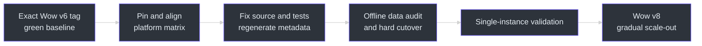
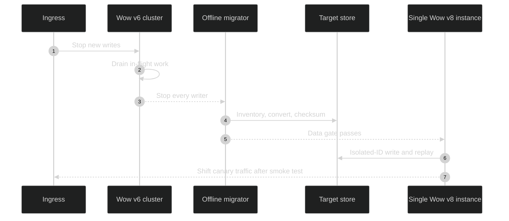
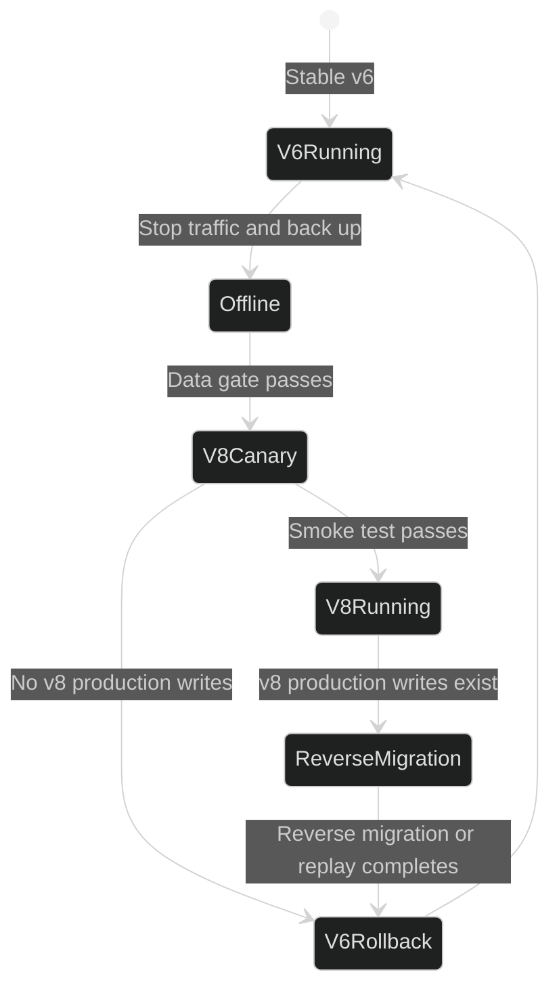

# Migrate Wow v6 to v8

This page is only for systems already running Wow v6 and moving to Wow v8. For a first
adoption from CRUD, use [Migrating from Traditional Architecture](./traditional-architecture.md).

Wow v6 and v8 both require Java 17+, but the platform delta depends on the exact v6 tag.
Earlier v6 lines such as `v6.8.0` use Spring Boot 3.5 and Kotlin 2.2, while the latest
`v6.21.5` already uses Spring Boot 4.0 and Kotlin 2.3. Pin and inspect the source tag rather
than treating “v6” as one platform. The current v8 baseline includes Spring Boot 4.1,
Kotlin 2.4, CosId 3.2, CoAPI 2.1, and CoCache 4.2.
[`v6.8.0 versions`](https://github.com/Ahoo-Wang/Wow/blob/v6.8.0/gradle/libs.versions.toml)
[`v6.21.5 versions`](https://github.com/Ahoo-Wang/Wow/blob/v6.21.5/gradle/libs.versions.toml)
[`gradle/libs.versions.toml:3-18`](https://github.com/Ahoo-Wang/Wow/blob/main/gradle/libs.versions.toml#L3-L18)
[`gradle/libs.versions.toml:32-33`](https://github.com/Ahoo-Wang/Wow/blob/main/gradle/libs.versions.toml#L32-L33)

## Migration Overview

| Stage | Goal | Exit gate | Main risk | Source |
|---|---|---|---|---|
| 0. Stabilize v6 | Move to the latest v6 and remove deprecated API use | Full v6 test suite passes; event, snapshot, and message counts are baselined | Carrying old failures across the platform boundary | [v6.21.5 Release](https://github.com/Ahoo-Wang/Wow/releases/tag/v6.21.5) |
| 1. Align the platform | Diff the exact source tag against the target; upgrade Boot, Jackson, Kotlin, and related dependencies only where required | Compilation, unit tests, and integration tests pass | Assuming every v6 tag is Boot 3, Boot modularization, `tools.jackson`, and incompatible third-party starters | [v6.21.5 versions](https://github.com/Ahoo-Wang/Wow/blob/v6.21.5/gradle/libs.versions.toml), [v8.0.0 Release](https://github.com/Ahoo-Wang/Wow/releases/tag/v8.0.0) |
| 2. Adapt Wow APIs | Resolve source breaks accumulated across v8 minors | Domain, messaging, query, and test DSL code all recompiles | `CommandGateway`, lifecycle extensions, and storage internals changed | [CommandGateway.kt:75-159](https://github.com/Ahoo-Wang/Wow/blob/main/wow-core/src/main/kotlin/me/ahoo/wow/command/CommandGateway.kt#L75-L159) |
| 3. Prepare data | Audit and convert Redis/Mongo data while traffic is stopped | Checksums, versions, ID indexes, and representative replay match | v8.9 Redis canonical v2 is incompatible with legacy layouts | [RedisEventSourcingAutoConfiguration.kt:200-243](https://github.com/Ahoo-Wang/Wow/blob/main/wow-spring-boot-starter/src/main/kotlin/me/ahoo/wow/spring/boot/starter/redis/RedisEventSourcingAutoConfiguration.kt#L200-L243) |
| 4. Isolated cutover | Validate one v8 instance before scaling | Read/write, replay, snapshot, query, and shutdown checks pass | Mixed old/new writers break snapshot and Redis rollback guarantees | [SnapshotStore.kt:57-71](https://github.com/Ahoo-Wang/Wow/blob/main/wow-core/src/main/kotlin/me/ahoo/wow/eventsourcing/snapshot/SnapshotStore.kt#L57-L71) |



<!-- Sources:
- https://github.com/Ahoo-Wang/Wow/releases/tag/v8.0.0
- README.md:47-49
- gradle/libs.versions.toml:3-18
- gradle/libs.versions.toml:32-33
-->

Do not run this as a mixed-version rolling upgrade. Prove the platform and data procedure
in an isolated environment, then stop ingress, drain every old writer, cut over the data,
and start exactly one v8 instance for validation.



<!-- Sources:
- wow-spring-boot-starter/src/main/kotlin/me/ahoo/wow/spring/boot/starter/redis/RedisEventSourcingAutoConfiguration.kt:200-243
- wow-core/src/main/kotlin/me/ahoo/wow/eventsourcing/snapshot/SnapshotStore.kt:57-71
- wow-mongo/src/main/kotlin/me/ahoo/wow/mongo/MongoDatabaseContextGuard.kt:30-65
-->



<!-- Sources:
- wow-redis/src/main/kotlin/me/ahoo/wow/redis/eventsourcing/RedisEventStore.kt
- wow-spring-boot-starter/src/main/kotlin/me/ahoo/wow/spring/boot/starter/redis/RedisEventSourcingAutoConfiguration.kt:236-243
- wow-core/src/main/kotlin/me/ahoo/wow/eventsourcing/snapshot/SnapshotStore.kt:57-71
-->

## Spring Boot 4 and Jackson 3

If the pinned v6 source tag still uses Spring Boot 3 and Jackson 2, the v8 migration must include
the Spring Boot 4 and Jackson 3 source transition. Applications on those tags that directly
reference Jackson `ObjectMapper` or `JsonNode`, Spring Boot auto-configuration types, or custom
starters need explicit source migration. `v6.21.5` already uses Spring Boot 4.0 and the
`tools.jackson` namespace, so from that baseline audit only the exact source/target delta; do not
repeat a platform-major migration that already happened. In either case, do not force Spring Boot
3 or Jackson 2 under the pinned v8 target. Spring Boot's official guidance permits classic
starters as a temporary compilation bridge, followed by convergence on focused starters.

- [Wow v8.0.0 Release](https://github.com/Ahoo-Wang/Wow/releases/tag/v8.0.0)
- [Spring Boot 4.0 Migration Guide](https://github.com/spring-projects/spring-boot/wiki/Spring-Boot-4.0-Migration-Guide)
- [`v6.21.5 JsonSerializer.kt`](https://github.com/Ahoo-Wang/Wow/blob/v6.21.5/wow-core/src/main/kotlin/me/ahoo/wow/serialization/JsonSerializer.kt)
- [`v6.21.5 SerializationAutoConfiguration.kt`](https://github.com/Ahoo-Wang/Wow/blob/v6.21.5/wow-spring-boot-starter/src/main/kotlin/me/ahoo/wow/spring/boot/starter/serialization/SerializationAutoConfiguration.kt)
- [`JsonSerializer.kt:14-51`](https://github.com/Ahoo-Wang/Wow/blob/main/wow-core/src/main/kotlin/me/ahoo/wow/serialization/JsonSerializer.kt#L14-L51)
- [`SerializationAutoConfiguration.kt:14-30`](https://github.com/Ahoo-Wang/Wow/blob/main/wow-spring-boot-starter/src/main/kotlin/me/ahoo/wow/spring/boot/starter/serialization/SerializationAutoConfiguration.kt#L14-L30)

## General Upgrade Steps

### Upgrade Steps

1. **Backup Data**: Backup event store and snapshot data before upgrading
2. **Read Changelog**: Check [Release Notes](https://github.com/Ahoo-Wang/Wow/releases)
3. **Update Dependency Version**: Modify build.gradle.kts or pom.xml
4. **Run Tests**: Ensure all tests pass
5. **Canary after hard cutover**: Stop traffic and finish the data cutover, validate one v8 instance, then shift canary traffic and scale only v8 instances

### Dependency Version Update

::: code-group
```kotlin [Gradle(Kotlin)]
// Update wow version
implementation("me.ahoo.wow:wow-spring-boot-starter:8.10.8")
```
```xml [Maven]
<dependency>
    <groupId>me.ahoo.wow</groupId>
    <artifactId>wow-spring-boot-starter</artifactId>
    <version>8.10.8</version>
</dependency>
```
:::

### Breaking Changes Check

Before upgrading, check the following:

1. **API Changes**: Check for interface signature changes
2. **Configuration Changes**: Check for configuration property changes
3. **Metadata Changes**: Regenerate metadata files

## Unified Runtime Orchestration

The runtime lifecycle migration is now documented separately so this page can
remain an upgrade index:

- [Runtime Orchestration Migration](./runtime-orchestration.md) covers
  source-breaking changes, custom components and message buses, Spring ownership,
  verification, and rollback.
- [Runtime Lifecycle](../advanced/runtime-lifecycle.md) describes the stable
  post-migration architecture and shutdown semantics.

This migration changes lifecycle extension contracts but does not change event,
snapshot, or message formats. No data migration is required.

## Versioned Snapshot Checkpoint Removal

The versioned snapshot checkpoint capability introduced in v8.9.0 has been removed without a compatibility layer.
`VersionedSnapshotStore`, `VersionIntervalCheckpointStrategy`, `CompositeSnapshotStrategy`, their metrics and tracing
decorators, and `SnapshotCheckpointProperties` no longer exist. The `wow.eventsourcing.snapshot.checkpoint.*`
properties are ignored, and the `wow.snapshot.checkpoint.*` metrics and checkpoint spans are no longer emitted.
There is no replacement API; applications should use `SnapshotStore`, which stores and loads only the latest snapshot.

MongoDB `*_snapshot_checkpoint` collections are no longer read, written, scanned, or automatically deleted. Back up
event and snapshot data before upgrading, stop all old-version writers, and remove those collections only after
confirming they are no longer needed. Rollback requires restoring the old runtime and retaining its checkpoint data;
mixed-version deployment is unsupported.

Sources: [`refactor(snapshot): remove versioned checkpoint support (#2831)`](https://github.com/Ahoo-Wang/Wow/pull/2831),
[`SnapshotStore.kt:24-71`](https://github.com/Ahoo-Wang/Wow/blob/main/wow-core/src/main/kotlin/me/ahoo/wow/eventsourcing/snapshot/SnapshotStore.kt#L24-L71).

## Atomic SnapshotStore Saves

`SnapshotStore.save()` keeps the same JVM signature and snapshot formats, but its
storage contract is stronger: each aggregate must use one atomic compare-and-write
operation. A candidate whose aggregate version is greater than or equal to the
stored version replaces the complete snapshot; a lower candidate completes
successfully without writing. Equal-version replacement is intentional so the
snapshot-regeneration routes can repair a stale payload.

Custom `SnapshotStore` implementations must use a backend CAS, conditional update,
transaction, or equivalent atomic primitive. A client-side `load()` followed by an
unconditional write is not conformant. Materialize the candidate once and derive the
comparison version from that same payload. Stop and drain all old writers before
relying on this guarantee: old MongoDB or Redis writers can still regress a newer
snapshot, and an old Elasticsearch writer does not perform equal-version replacement.
No data rewrite is required. Rollback restores the old save behavior, so do not run
old and new writers concurrently.

For `wow-mongo`, the guarded update uses MongoDB MQL expressions that require
MongoDB 5.2 or later; the integration suite verifies MongoDB 6.0.6. Upgrade the
MongoDB server before deploying this runtime when the existing server is older.

Sources: [`SnapshotStore.kt:57-71`](https://github.com/Ahoo-Wang/Wow/blob/main/wow-core/src/main/kotlin/me/ahoo/wow/eventsourcing/snapshot/SnapshotStore.kt#L57-L71),
[`MongoSnapshotStore.kt`](https://github.com/Ahoo-Wang/Wow/blob/main/wow-mongo/src/main/kotlin/me/ahoo/wow/mongo/MongoSnapshotStore.kt),
[`RedisSnapshotStore.kt`](https://github.com/Ahoo-Wang/Wow/blob/main/wow-redis/src/main/kotlin/me/ahoo/wow/redis/eventsourcing/RedisSnapshotStore.kt),
and [`ElasticsearchSnapshotStore.kt`](https://github.com/Ahoo-Wang/Wow/blob/main/wow-elasticsearch/src/main/kotlin/me/ahoo/wow/elasticsearch/eventsourcing/ElasticsearchSnapshotStore.kt).

## Redis EventStore Canonical v2 Layout (introduced in v8.9.0)

When upgrading from v6.x, v8.6.x, or v8.8.x to v8.9.0+, treat Redis persistence as a hard
storage-format cutover. v6.21.5 and v8.6.x use legacy event keys and a shared request-ID SET;
v8.8.x uses per-stream request SETs and bucketed ID indexes. Redis EventStore, Redis
SnapshotStore, and Redis PrepareKey read and write canonical v2 keys only. There is no legacy
fallback, dual write, or built-in migrator, and old runtimes cannot read new v2 writes. The new
EventStore also enforces that `AggregateId.id` is unique within a named aggregate across all
tenants.

The Spring Boot starter checks the exact sentinel keys created by successful writes in the
published v6/v8.6 shared layout and v8.8 bucketed layout. It checks local aggregates resolved to
the auto-configured `RedisEventStore`, supports Redis Cluster without runtime `SCAN`, and blocks
startup when incompatible data is found. It does not cover direct-library usage, independently
constructed custom stores, retired aggregate metadata, or snapshot-only Redis routes. A legacy
snapshot has no aggregate-independent exact sentinel. Canonical v2 ignores legacy snapshot keys.
A missing v2 snapshot causes aggregate loading to replay events, but normal loading does not
persist a rebuilt snapshot automatically.

The exact-key guard is not a substitute for an offline data audit. A historical alias change, key eviction, or a
manually deleted or corrupted legacy index can hide the sentinel while orphaned streams remain. The resolved context
alias (the configured alias, or `contextName` when no alias is configured) and aggregate name form the persistent v2
key scope. The migration manifest must pin every historical source alias to the target resolved alias. Changing the
resolved alias or aggregate name after a write requires a separate offline key migration.

Use an offline cutover:

1. Stop traffic and every old-version writer, drain in-flight appends to zero, and create a consistent Redis backup
   together with event-count and version baselines. Do not use a mixed-version rolling deployment.
2. Inventory all legacy event ZSETs, v6/v8.6 shared request SETs, v8.8 per-stream request SETs, v8.8 bucketed ID ZSETs,
   and legacy snapshot and PrepareKey hashes in every logical database on every Cluster primary. Record source key,
   Redis type, cardinality, checksum, and target mapping. Use identity embedded in event or snapshot JSON as the
   authority; an ambiguous historical key is only a locator.
3. Audit each named aggregate for duplicate `AggregateId.id` values across tenants. Resolve every collision before
   migration; canonical v2 intentionally cannot represent two owners of one ID.
4. Use an empty v2 target scope on the first run. For disposable data, remove only the inventoried legacy keys from
   the target or use an empty dedicated database. Never use `FLUSHDB` on a database shared with message-bus or
   application data. Keep the complete source dataset immutable for rollback.
5. Run a separately reviewed offline migrator. Its durable manifest must record source key, target keys, source and
   target checksums, status, and last completed batch. Resume may reuse a target only when manifest and checksum
   match; otherwise fail without overwriting. Copy operations must be idempotent, and partial target data must not be
   accepted without manifest-backed re-verification.
6. Preserve every event ZSET member and score, and verify identity consistency plus contiguous score/version order.
   Treat committed event JSON as authoritative for v2 request-ID SETs. For v6/v8.6, compare the shared SET with
   `union(event.requestId)` in both directions and report shared-only and event-only differences separately; never
   fan it out to streams. For v8.8, compute the symmetric difference between each source per-stream SET and that
   stream's event request IDs. A non-empty difference fails migration unless an explicit reviewed disposition is
   recorded.
7. Rebuild every non-empty aggregate-ID index in the 128-bucket space. The bucket is
   `aggregateId.id.hashCode().mod(128)` using Java/Kotlin UTF-16 `String.hashCode`; keys and members must use the exact
   canonical v2 codec. The runtime does not perform this conversion.
8. Verify ordered member-and-score checksums, first/last versions, request-ID equality, the complete ID index,
   aggregate-ID scan results, and representative state replay. A failed run must retain its manifest and last verified
   cursor, then either clean the partial target or resume from that cursor; the application must not start meanwhile.
9. After full verification, an in-place migration must remove or move every legacy key in the recorded inventory.
   Delete sentinel keys last, rerun inventory, and require zero legacy keys. With a separate target database, keep the
   complete source dataset read-only through the rollback window.
10. Start one new instance against the target and run isolated-ID read/write smoke tests. Explicitly regenerate
    snapshots, then verify snapshot counts and versions before switching traffic and scaling out. Use the single-ID
    regenerate route from the complete inventory. The batch route may be treated as exhaustive only when the audited
    ID domain is strictly above `AggregateIdScanner.FIRST_ID`; otherwise it can omit lower IDs.

Rollback is a coordinated application-and-data operation. Before production v2 writes, reconnect the untouched
legacy dataset and old runtime. After any production v2 write, first stop traffic and v2 writers, then reverse-migrate
or replay those writes before restarting the old runtime; restoring only the cutover backup loses every later v2
write. Prefer a separate target database or namespace.

The mandatory exact-key check is an internal startup invariant. It is intentionally neither optional nor exposed as
a compatibility or migration setting.

Source, JVM binary, and behavioral compatibility are intentionally broken for Redis layout internals. Removed APIs
include `AggregateKeyConverter`, `RedisWrappedKey`, `RedisSnapshotRepository`, `EventStreamKeyConverter`,
`DefaultSnapshotKeyConverter`, `PrepareKeyConverter`, and `RedisEventStore.SCRIPT_EVENT_STEAM_APPEND`; the
`redisSnapshotRepository` bean alias and custom snapshot-key converter constructor are also removed. The new
`SCRIPT_EVENT_STREAM_APPEND` is internal, with no public replacement. Canonical converter outputs changed, PrepareKey
now includes its `name`, and v2 rejects empty aggregate/prepare IDs and unpaired UTF-16 surrogates. Application code
should use `EventStore`, `SnapshotStore`, and `PrepareKey`; reviewed offline tooling must independently implement and
verify the documented v2 codec.

Sources: [`RedisEventStore.kt`](https://github.com/Ahoo-Wang/Wow/blob/main/wow-redis/src/main/kotlin/me/ahoo/wow/redis/eventsourcing/RedisEventStore.kt),
[`RedisKeyComponentCodec.kt:22-69`](https://github.com/Ahoo-Wang/Wow/blob/main/wow-redis/src/main/kotlin/me/ahoo/wow/redis/RedisKeyComponentCodec.kt#L22-L69),
[`RedisEventSourcingAutoConfiguration.kt:166-185`](https://github.com/Ahoo-Wang/Wow/blob/main/wow-spring-boot-starter/src/main/kotlin/me/ahoo/wow/spring/boot/starter/redis/RedisEventSourcingAutoConfiguration.kt#L166-L185),
[`v6.21.5 EventStreamKeyConverter.kt:21-33`](https://github.com/Ahoo-Wang/Wow/blob/v6.21.5/wow-redis/src/main/kotlin/me/ahoo/wow/redis/eventsourcing/EventStreamKeyConverter.kt#L21-L33),
and [`v6.21.5 event_steam_append.lua:12-27`](https://github.com/Ahoo-Wang/Wow/blob/v6.21.5/wow-redis/src/main/resources/event_steam_append.lua#L12-L27).

## Mongo Ownership Guard

This upgrade keeps aggregate-name-only Mongo collection names, but adds a durable
`wow_database_metadata` ownership marker. The supported deployment layout is one bounded context per MongoDB
database.

Before rollout:

1. Inspect every configured event-stream, snapshot, and prepare database. Check all `*_event_stream`, `*_snapshot`,
   and `prepare_*` collections.
2. Confirm that each database belongs to only one `wow.context-name`; a mixed database must be split before upgrade.
3. Upgrade the database's real owner first. The first upgraded instance scans legacy aggregate collections before
   atomically claiming the marker. Legacy `prepare_*` records contain no context metadata, so a prepare-only database
   is claimed by the first upgraded context and must be audited before rollout.
4. Audit existing managed indexes. Missing indexes are created, but incompatible key order, uniqueness, TTL,
   partial-filter, collation, sparse, or hidden options block startup and require a controlled migration.

Do not edit the marker to bypass a context mismatch. Move or remove the old data, then remove the marker only when
the database is intentionally reassigned.

Source: [`MongoDatabaseContextGuard.kt:30-132`](https://github.com/Ahoo-Wang/Wow/blob/main/wow-mongo/src/main/kotlin/me/ahoo/wow/mongo/MongoDatabaseContextGuard.kt#L30-L132).

## Verification Checklist

- [ ] v6 is on its latest maintenance release and deprecated API use is gone
- [ ] Spring Boot 4, Jackson 3, and every third-party starter have passed compatibility review
- [ ] All domain, server, integration-test, and KSP metadata code has been recompiled
- [ ] Event, snapshot, PrepareKey, Redis key, and Mongo database inventories are complete
- [ ] Migration manifests, checksums, ID indexes, and representative event replay agree
- [ ] One v8 instance passes read/write, query, snapshot regeneration, monitoring, and graceful shutdown tests
- [ ] The rollback window, legacy read-only retention, and reverse migration of v8 writes have been rehearsed

## Related Pages

| Page | Relationship |
|---|---|
| [Migration Guide](../migration.md) | Choose the correct migration path |
| [Migrating from Traditional Architecture](./traditional-architecture.md) | First-time Wow adoption |
| [Runtime Orchestration Migration](./runtime-orchestration.md) | Current v8 lifecycle source breaks and extension migration |
| [Runtime Lifecycle](../advanced/runtime-lifecycle.md) | Stable post-migration runtime model |
| [Redis Extension](../extensions/redis.md) | Redis configuration and the canonical-v2 startup guard |
| [Mongo Extension](../extensions/mongo.md) | Mongo storage and database ownership constraints |
