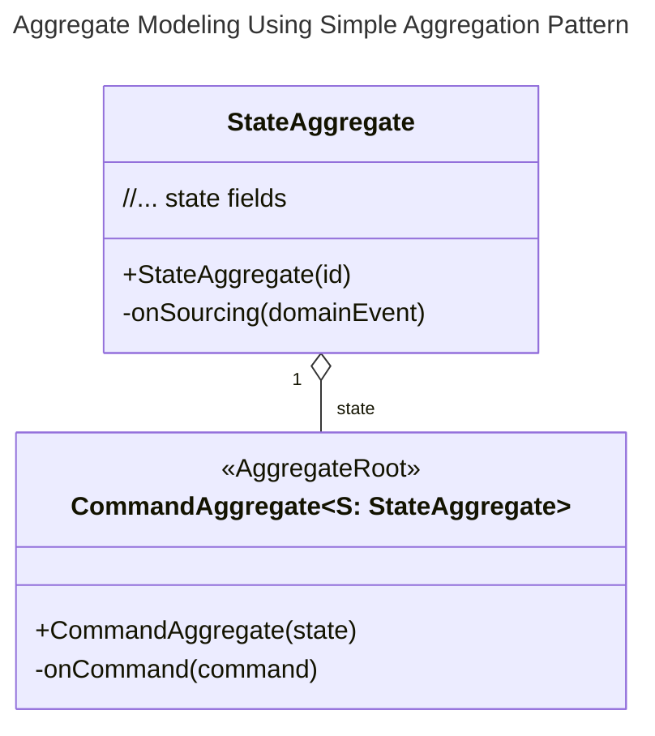
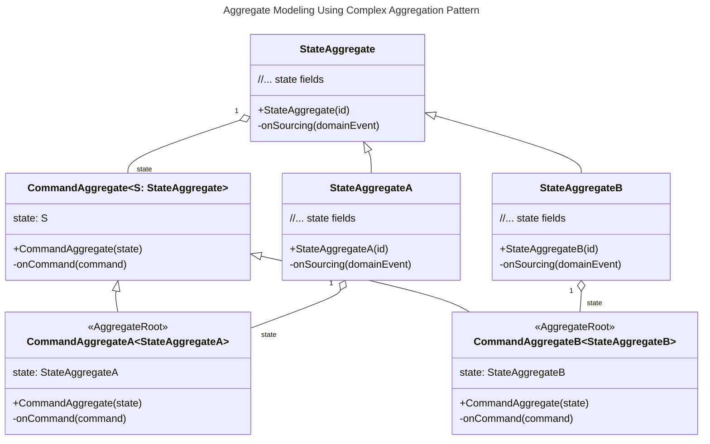
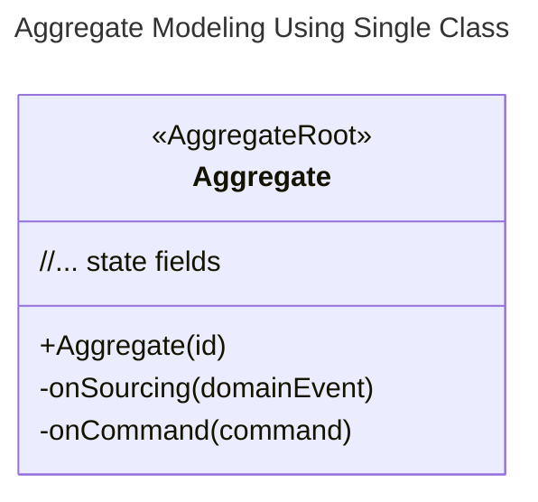
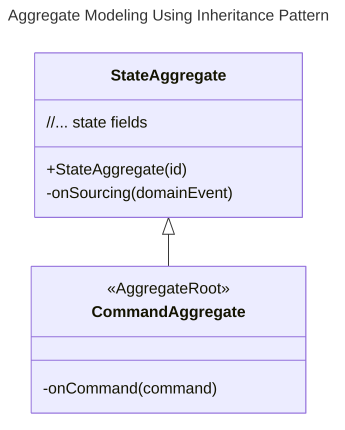

# Aggregate Root Modeling

## Patterns

### Aggregate Pattern (Recommended)

The aggregate pattern places command functions and sourcing functions (containing aggregate state data) in separate classes. This approach avoids the problem of command functions directly modifying aggregate state data (by setting the `setter` accessor to `private`).
At the same time, separation of responsibilities allows the aggregate root's command functions to focus more on command processing, while sourcing functions focus on aggregate state data changes.


#### Simple Aggregation Pattern

<center>



</center>

#### Complex Aggregation Pattern

<center>



</center>

### Single Class Pattern

The single class pattern places command functions, sourcing functions, and aggregate state data together in one class. The advantage is simplicity and directness.

::: danger Violation of Event Sourcing Principles
In the single class pattern, command functions can directly modify aggregate state data, which leads to:
- State changes cannot be traced via events
- Destroys the core value of Event Sourcing
- May result in inconsistent state changes

**Strongly Recommended**: Use this pattern only for simple scenarios or prototype development.
:::

<center>



</center>

### Inheritance Pattern

The inheritance pattern uses the state aggregate root as the base class and sets the `setter` accessor to `private` to prevent command aggregate roots from modifying aggregate state data in command functions.

<center>



</center>


## Conventions

### Command Aggregate Root

The command aggregate root is responsible for defining command handler functions, processing commands to execute corresponding business logic, and finally returning domain events.

- The command aggregate root needs to add the `@AggregateRoot` annotation so that the `wow-compiler` module can generate corresponding metadata definitions.
- The `@OnCommand` annotation for command handler functions is not required. By default, naming a command handler function `onCommand` indicates it is a command handler function.
- The first parameter of command handler functions can be defined as: specific command (`AddCartItem`), command message (`CommandMessage<AddCartItem>`), command message exchange (`CommandExchange<AddCartItem>`).
- The remaining parameters of command handler functions will be obtained from the `IOC` container. If you have injected an instance in the `Spring IOC` container, you can obtain it directly through parameters.
- The return value of command handler functions is one or more domain events. These domain events will first have their state changed to the latest state by the state aggregate root through sourcing functions, then be persisted to the `EventStore`.
  - When the return value type is not clear, it should be specified via `@OnCommand.returns`. Otherwise `wow-compiler` will not be able to identify the returned domain event type.
- After persistence is complete, they will be published to the event bus through the `DomainEventBus`.

```kotlin
@AggregateRoot
class Cart(private val state: CartState) {

    @OnCommand(returns = [CartItemAdded::class, CartQuantityChanged::class])
    fun onCommand(command: AddCartItem): Any {
        require(state.items.size < MAX_CART_ITEM_SIZE) {
            "Shopping cart can only add up to [$MAX_CART_ITEM_SIZE] items."
        }
        state.items.firstOrNull {
            it.productId == command.productId
        }?.let {
            return CartQuantityChanged(
                changed = it.copy(quantity = it.quantity + command.quantity),
            )
        }
        val added = CartItem(
            productId = command.productId,
            quantity = command.quantity,
        )
        return CartItemAdded(
            added = added,
        )
    }
}
```

### State Aggregate Root

The state aggregate root defines aggregate state data and sourcing functions.

- The state aggregate root must define the aggregate root ID field in the constructor.
- The role of sourcing functions is to apply domain events to aggregate state data, thereby changing aggregate state data.
- Sourcing functions are marked with the `@OnSourcing` annotation. However, this annotation is optional. By default, when the function name is `onSourcing`, it indicates that the function is a sourcing function.
- Sourcing functions accept parameters of: specific domain events (`CartItemAdded`), domain events (`DomainEvent<CartItemAdded>`).
- No return value needs to be defined for sourcing functions.

```kotlin
class CartState(val id: String) {
    var items: List<CartItem> = listOf()
        private set

    @OnSourcing
    fun onCartItemAdded(cartItemAdded: CartItemAdded) {
        items = items + cartItemAdded.added
    }
}
```
