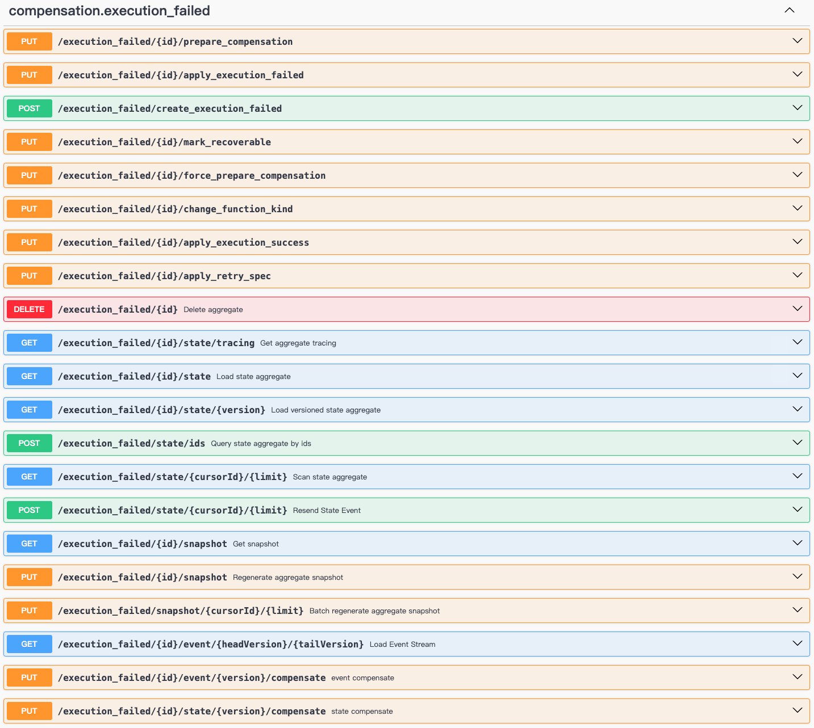

# OpenAPI

> The Wow OpenAPI module provides API interfaces based on the [OpenAPI](https://swagger.io/specification/) specification.

## Installation

::: code-group

```kotlin [Gradle(Kotlin)]
implementation("me.ahoo.wow:wow-openapi")
```

```groovy [Gradle(Groovy)]
implementation 'me.ahoo.wow:wow-openapi'
```

```xml [Maven]

<dependency>
    <groupId>me.ahoo.wow</groupId>
    <artifactId>wow-openapi</artifactId>
    <version>${wow.version}</version>
</dependency>
```

:::

## Swagger-UI

> Swagger-UI is an API documentation tool based on the OpenAPI specification, which can be used to view and test API interfaces through Swagger-UI.



## Aggregate Resource Ownership

An aggregate-root resource can belong to one or more of a tenant, a space, and an owner.

## RESTful URL PATH Spec

`[tenant/{tenantId}]/[owner/{ownerId}]/resource/[{resourceId}]/action`

### Tenant Resources

When an aggregate root is a tenant resource (not marked with static tenant ID), the automatically generated RESTful API adds the `tenant/{tenantId}` path prefix.

### Space Resources

When an aggregate root is marked with space ID, the automatically generated RESTful API adds the `Wow-Space-Id` header parameter.

### Owner Resources

When an aggregate root is marked as an owner resource, the automatically generated RESTful API adds the `owner/{ownerId}` path prefix.

```kotlin
@AggregateRoot
@AggregateRoute(owner = AggregateRoute.Owner.ALWAYS)
class Order(private val state: OrderState)
```

When the aggregate root ID is the same as the owner ID, the automatically generated RESTful API removes the `{resourceId}` path parameter. For example, when the user cart ID is the user ID:

```kotlin
@StaticTenantId
@AggregateRoot
@AggregateRoute(owner = AggregateRoute.Owner.AGGREGATE_ID)
class Cart(private val state: CartState)
```

## Global Routes

### Get Wow Metadata

This route provides the ability to obtain *Wow compile-time metadata* through RESTful API to verify the correctness of Wow metadata (`WowMetadata`) definitions.

::: code-group

```shell [OpenAPI]
curl -X 'GET' \
  'http://localhost:8080/wow/metadata' \
  -H 'accept: application/json'
```

```json [Response]
{
  "contexts": {
    "example-service": {
      "alias": "example",
      "scopes": [
        "me.ahoo.wow.example.server",
        "me.ahoo.wow.example.domain",
        "me.ahoo.wow.example.api"
      ],
      "aggregates": {
        "cart": {
          "scopes": [
            "me.ahoo.wow.example.api.cart"
          ],
          "type": "me.ahoo.wow.example.domain.cart.Cart",
          "tenantId": "(0)",
          "id": null,
          "commands": [
            "me.ahoo.wow.example.api.cart.ChangeQuantity",
            "me.ahoo.wow.example.api.cart.RemoveCartItem",
            "me.ahoo.wow.example.api.cart.AddCartItem"
          ],
          "events": [
            "me.ahoo.wow.example.api.cart.CartItemAdded",
            "me.ahoo.wow.example.api.cart.CartQuantityChanged",
            "me.ahoo.wow.example.api.cart.CartItemRemoved"
          ]
        },
        "order": {
          "scopes": [
            "me.ahoo.wow.example.api.order"
          ],
          "type": "me.ahoo.wow.example.domain.order.Order",
          "tenantId": null,
          "id": null,
          "commands": [
            "me.ahoo.wow.example.api.order.ChangeAddress",
            "me.ahoo.wow.example.api.order.ShipOrder",
            "me.ahoo.wow.example.api.order.PayOrder",
            "me.ahoo.wow.example.api.order.ReceiptOrder",
            "me.ahoo.wow.example.api.order.CreateOrder"
          ],
          "events": [
            "me.ahoo.wow.example.api.order.OrderShipped",
            "me.ahoo.wow.example.api.order.OrderCreated",
            "me.ahoo.wow.example.api.order.AddressChanged",
            "me.ahoo.wow.example.api.order.OrderReceived",
            "me.ahoo.wow.example.api.order.OrderPaid"
          ]
        }
      }
    },
    "compensation-service": {
      "alias": "compensation",
      "scopes": [
        "me.ahoo.wow.compensation"
      ],
      "aggregates": {
        "execution_failed": {
          "scopes": [
            "me.ahoo.wow.compensation.api"
          ],
          "type": null,
          "tenantId": "(0)",
          "id": null,
          "commands": [],
          "events": []
        }
      }
    }
  }
}
```

:::

### Generate BI Sync Script

`POST /wow/bi/script` generates ClickHouse synchronization and expansion SQL for the current local aggregates. It requires an `application/json` request body. The OpenAPI schema lists deployment overrides plus `operation` and `replayFromEarliestConfirmed`; `previousManifest` is no longer part of the contract. Nested cluster fields are only `name` and `installation`. It also lists the enum values `DEPLOY` / `RESET`, `CLUSTER` / `STANDALONE`, and `FAIL` / `RAW_JSON`. A request may lower `maxExpansionDepth`, but cannot exceed the server-configured value, which is the endpoint's safety ceiling.

The same maximum lengths apply to server configuration and every non-null request override: `database` 128 characters, `consumerDatabase` 128, `timezone` 64, `topicPrefix` 128, `kafkaBootstrapServers` 4096, and `topology.cluster.name` and `topology.cluster.installation` 128 each. A value exactly at its limit is accepted. A longer server value fails application startup; a longer override returns `400`.

| Status | `Content-Type` | Body |
|--------|----------------|------|
| `200` | `application/sql` | SQL text only; `Wow-BI-Diagnostic-Count` reports diagnostics omitted from the body |
| `200` | `application/json` | SQL, destructive flag, and diagnostics; `Wow-BI-Diagnostic-Count` reports the same diagnostic count |
| `400` | Error response | Empty or invalid JSON body, over-limit override, another invalid option value, or invalid topology combination |
| `406` | Error response | No requested representation is supported, or every supported representation has `q=0`; runtime `Wow-Error-Code` is `NotAcceptable` |
| `415` | Common `wow.UnsupportedMediaType` response | Missing or unsupported request `Content-Type`; runtime `Wow-Error-Code` is `UnsupportedMediaType` |
| `502` | Error response | The owned ClickHouse catalog is inconsistent across inspected replicas |
| `503` | Error response | ClickHouse catalog inspection is unavailable |
| `504` | Error response | ClickHouse catalog inspection timed out |

`{}` performs `DEPLOY` with the server-side options unchanged; callers do not persist deployment history. The default NoOp inspector returns an unreconciled diagnostic, while a registered ClickHouse inspector restores history from the catalog. `RESET` only carries `replayFromEarliestConfirmed=true`, but returns `400` unless inspection is available. When `topology` is present, `topology.mode` is mandatory. In `CLUSTER` mode, omitted cluster fields inherit the current Cluster server base, or the domain Cluster defaults when the server base is Standalone. `STANDALONE` rejects a `cluster` object. The legacy `GET` method has no route for this path and returns `404`.

::: code-group

```shell [Empty Override Request]
curl -X POST 'http://localhost:8080/wow/bi/script' \
  -H 'content-type: application/json' \
  -H 'accept: application/sql' \
  --data '{}'
```

```json [Standalone Request]
{
  "database": "analytics",
  "topology": {
    "mode": "STANDALONE"
  }
}
```

```json [Partial Cluster Request]
{
  "topology": {
    "mode": "CLUSTER",
    "cluster": {
      "name": "production"
    }
  },
  "kafkaBootstrapServers": "kafka:9092",
  "topicPrefix": "analytics."
}
```

```http [Representative Response Start]
HTTP/1.1 200 OK
Content-Type: application/sql
Wow-BI-Diagnostic-Count: 0

-- global --
CREATE DATABASE IF NOT EXISTS "bi_db" ON CLUSTER '{cluster}';
CREATE DATABASE IF NOT EXISTS "bi_db_consumer" ON CLUSTER '{cluster}';
```

:::

See [Business Intelligence](./bi) for the current expansion schema, structural types, raw-value semantics, and lossless scalar mappings. See [BI Script Configuration](./configuration#bi-script-configuration) for route settings and Kafka/topic precedence.

### Generate Global ID

This route provides the ability to generate *global IDs* through RESTful API.

::: code-group

```shell [OpenAPI]
curl -X 'GET' \
  'http://localhost:8080/wow/id/global' \
  -H 'accept: text/plain'
```

```text [Response]
0U2MNGBQ0001001
```

:::

## Aggregate Routing Specification
