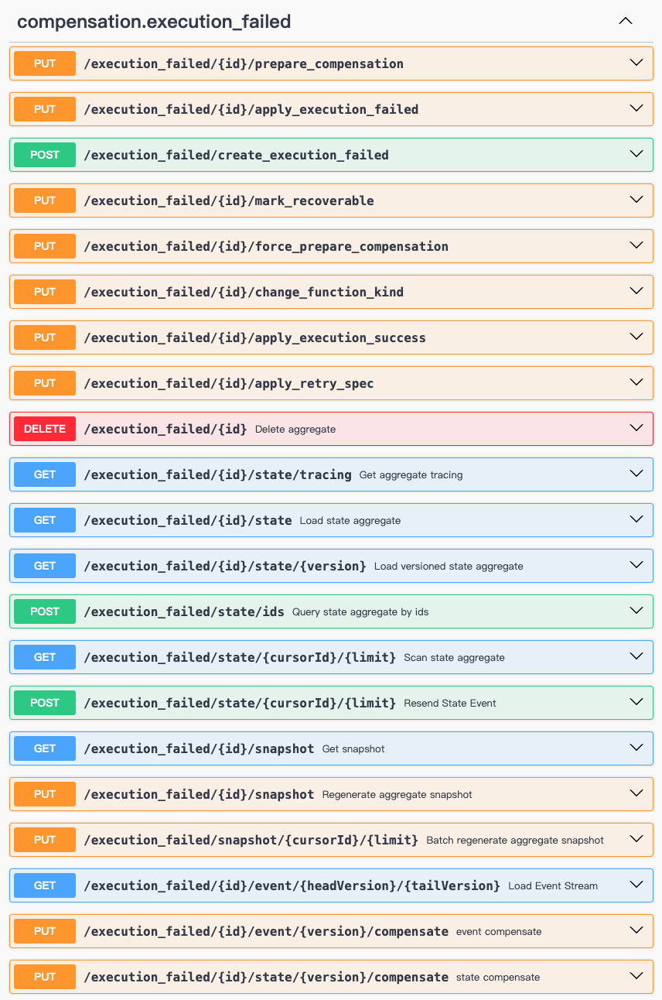

# OpenAPI

> The Wow OpenAPI module provides API interfaces based on the [OpenAPI](https://swagger.io/specification/) specification.

## Installation

::: code-group
```kotlin [Gradle(Kotlin)]
implementation("me.ahoo.wow:wow-openapi")
```
```groovy [Gradle(Groovy)]
implementation 'me.ahoo.wow:wow-openapi'
```
```xml [Maven]
<dependency>
    <groupId>me.ahoo.wow</groupId>
    <artifactId>wow-openapi</artifactId>
    <version>${wow.version}</version>
</dependency>
```
:::

## Swagger-UI

> Swagger-UI is an API documentation tool based on the OpenAPI specification, which can be used to view and test API interfaces through Swagger-UI.



## RESTful URL PATH Spec

`[tenant/{tenantId}]/[space/{spaceId}]/[owner/{ownerId}]/resource/[{resourceId}]/action`

### Tenant Resources

When an aggregate root is a tenant resource (not marked with static tenant ID), the automatically generated RESTful API will add the `tenant/{tenantId}` path prefix.

### Space Resources

When an aggregate root is marked with space ID, the automatically generated RESTful API will add the `space/{spaceId}` path prefix.

### Owner Resources

When an aggregate root is marked as an owner resource, the automatically generated RESTful API will add the `owner/{ownerId}` path prefix.

```kotlin
@AggregateRoot
@AggregateRoute(owner = AggregateRoute.Owner.ALWAYS)
class Order(private val state: OrderState)
```

When the aggregate root ID is the same as the owner ID, the automatically generated RESTful API will remove the `{resourceId}` path parameter. For example, when the user cart ID is the user ID:

```kotlin
@StaticTenantId
@AggregateRoot
@AggregateRoute(owner = AggregateRoute.Owner.AGGREGATE_ID)
class Cart(private val state: CartState)
```

## Global Route Specifications

### GetWowMetadataRouteSpec

`GetWowMetadataRouteSpec` provides the ability to obtain *Wow compile-time metadata* through RESTful API to verify the correctness of Wow metadata (`WowMetadata`) definitions.

::: code-group
```shell [OpenAPI]
curl -X 'GET' \
  'http://localhost:8080/wow/metadata' \
  -H 'accept: application/json'
```
```json [Response]
{
  "contexts": {
    "example-service": {
      "alias": "example",
      "scopes": [
        "me.ahoo.wow.example.server",
        "me.ahoo.wow.example.domain",
        "me.ahoo.wow.example.api"
      ],
      "aggregates": {
        "cart": {
          "scopes": [
            "me.ahoo.wow.example.api.cart"
          ],
          "type": "me.ahoo.wow.example.domain.cart.Cart",
          "tenantId": "(0)",
          "id": null,
          "commands": [
            "me.ahoo.wow.example.api.cart.ChangeQuantity",
            "me.ahoo.wow.example.api.cart.RemoveCartItem",
            "me.ahoo.wow.example.api.cart.AddCartItem"
          ],
          "events": [
            "me.ahoo.wow.example.api.cart.CartItemAdded",
            "me.ahoo.wow.example.api.cart.CartQuantityChanged",
            "me.ahoo.wow.example.api.cart.CartItemRemoved"
          ]
        },
        "order": {
          "scopes": [
            "me.ahoo.wow.example.api.order"
          ],
          "type": "me.ahoo.wow.example.domain.order.Order",
          "tenantId": null,
          "id": null,
          "commands": [
            "me.ahoo.wow.example.api.order.ChangeAddress",
            "me.ahoo.wow.example.api.order.ShipOrder",
            "me.ahoo.wow.example.api.order.PayOrder",
            "me.ahoo.wow.example.api.order.ReceiptOrder",
            "me.ahoo.wow.example.api.order.CreateOrder"
          ],
          "events": [
            "me.ahoo.wow.example.api.order.OrderShipped",
            "me.ahoo.wow.example.api.order.OrderCreated",
            "me.ahoo.wow.example.api.order.AddressChanged",
            "me.ahoo.wow.example.api.order.OrderReceived",
            "me.ahoo.wow.example.api.order.OrderPaid"
          ]
        }
      }
    },
    "compensation-service": {
      "alias": "compensation",
      "scopes": [
        "me.ahoo.wow.compensation"
      ],
      "aggregates": {
        "execution_failed": {
          "scopes": [
            "me.ahoo.wow.compensation.api"
          ],
          "type": null,
          "tenantId": "(0)",
          "id": null,
          "commands": [],
          "events": []
        }
      }
    }
  }
}
```
:::

### GenerateBIScriptRouteSpec

`GenerateBIScriptRouteSpec` provides the ability to generate *BI synchronization scripts* through RESTful API.

::: code-group
```shell [OpenAPI]
curl -X 'GET' \
  'http://localhost:8080/wow/bi/script' \
  -H 'accept: application/sql'
```
```sql [Response]
-- global --
CREATE DATABASE IF NOT EXISTS bi_db ON CLUSTER '{cluster}';
CREATE DATABASE IF NOT EXISTS bi_db_consumer ON CLUSTER '{cluster}';
-- global --
-- clear --
-- example.order.clear --
------------------command------------------
DROP TABLE IF EXISTS bi_db.example_order_command ON CLUSTER '{cluster}' SYNC;
DROP TABLE IF EXISTS bi_db.example_order_command_local ON CLUSTER '{cluster}' SYNC;
DROP TABLE IF EXISTS bi_db_consumer.example_order_command_queue ON CLUSTER '{cluster}' SYNC;
DROP TABLE IF EXISTS bi_db_consumer.example_order_command_consumer ON CLUSTER '{cluster}' SYNC;
------------------command------------------
------------------state------------------
DROP TABLE IF EXISTS bi_db.example_order_state ON CLUSTER '{cluster}' SYNC;
DROP TABLE IF EXISTS bi_db.example_order_state_local ON CLUSTER '{cluster}' SYNC;
DROP TABLE IF EXISTS bi_db_consumer.example_order_state_queue ON CLUSTER '{cluster}' SYNC;
DROP TABLE IF EXISTS bi_db_consumer.example_order_state_consumer ON CLUSTER '{cluster}' SYNC;
------------------state------------------
------------------stateLast------------------
DROP TABLE IF EXISTS bi_db.example_order_state_last ON CLUSTER '{cluster}' SYNC;
DROP TABLE IF EXISTS bi_db.example_order_state_last_local ON CLUSTER '{cluster}' SYNC;
DROP TABLE IF EXISTS bi_db_consumer.example_order_state_last_consumer ON CLUSTER '{cluster}' SYNC;
------------------stateLast------------------
------------------expansion------------------
DROP TABLE IF EXISTS bi_db.example_order_state_last_root ON CLUSTER '{cluster}' SYNC;
DROP TABLE IF EXISTS bi_db.example_order_state_last_root_items ON CLUSTER '{cluster}' SYNC;
------------------expansion------------------
-- example.order.clear --
-- clear --
-- example.order.command --
CREATE TABLE IF NOT EXISTS bi_db.example_order_command_local ON CLUSTER '{cluster}'
(
    id             String,
    context_name   String,
    aggregate_name String,
    name           String,
    header Map(String, String),
    aggregate_id   String,
    tenant_id      String,
    request_id     String,
    aggregate_version Nullable(UInt32),
    is_create      Bool,
    allow_create   Bool,
    body_type      String,
    body           String,
    create_time    DateTime('Asia/Shanghai')
) ENGINE = ReplicatedMergeTree(
        '/clickhouse/{installation}/{cluster}/tables/{shard}/{database}/{table}', '{replica}')
      PARTITION BY toYYYYMM(create_time)
      ORDER BY id
;

CREATE TABLE IF NOT EXISTS bi_db.example_order_command ON CLUSTER '{cluster}'
    AS bi_db.example_order_command_local
        ENGINE = Distributed('{cluster}', bi_db, example_order_command_local, sipHash64(aggregate_id));

CREATE TABLE IF NOT EXISTS bi_db_consumer.example_order_command_queue ON CLUSTER '{cluster}'
(
    data String
) ENGINE = Kafka('localhost:60886', 'wow.example.order.command', 'clickhouse_example_order_command_consumer',
                 'JSONAsString');

CREATE MATERIALIZED VIEW IF NOT EXISTS bi_db_consumer.example_order_command_consumer
            ON CLUSTER '{cluster}'
            TO bi_db.example_order_command
AS
SELECT JSONExtractString(data, 'id')                      AS id,
       JSONExtractString(data, 'contextName')             AS context_name,
       JSONExtractString(data, 'aggregateName')           AS aggregate_name,
       JSONExtractString(data, 'name')                    AS name,
       JSONExtract(data, 'header', 'Map(String, String)') AS header,
       JSONExtractString(data, 'aggregateId')             AS aggregate_id,
       JSONExtractString(data, 'tenantId')                AS tenant_id,
       JSONExtractString(data, 'requestId')               AS request_id,
       JSONExtract(data, 'aggregateVersion',
                   'Nullable(UInt32)')                    AS aggregate_version,
       JSONExtractBool(data, 'isCreate')                  AS is_create,
       JSONExtractBool(data, 'allowCreate')               AS allow_create,
       JSONExtractString(data, 'bodyType')                AS body_type,
       JSONExtractString(data, 'body')                    AS body,
       toDateTime64(
               JSONExtractUInt(data, 'createTime') / 1000.0
           , 3, 'Asia/Shanghai')                          AS create_time
FROM bi_db_consumer.example_order_command_queue
;
-- example.order.command --
-- example.order.stateEvent --
CREATE TABLE IF NOT EXISTS bi_db.example_order_state_local ON CLUSTER '{cluster}'
(
    id               String,
    context_name     String,
    aggregate_name   String,
    header Map(String, String),
    aggregate_id     String,
    tenant_id        String,
    command_id       String,
    request_id       String,
    version          UInt32,
    state            String,
    body             String,
    first_operator   String,
    first_event_time DateTime('Asia/Shanghai'),
    create_time      DateTime('Asia/Shanghai'),
    deleted          Bool
) ENGINE = ReplicatedReplacingMergeTree('/clickhouse/{installation}/{cluster}/tables/{shard}/{database}/{table}',
                                        '{replica}', version)
      PARTITION BY toYYYYMM(create_time)
      ORDER BY (aggregate_id, version)
;

CREATE TABLE IF NOT EXISTS bi_db.example_order_state ON CLUSTER '{cluster}'
    AS bi_db.example_order_state_local
        ENGINE = Distributed('{cluster}', bi_db, example_order_state_local, sipHash64(aggregate_id));

CREATE TABLE IF NOT EXISTS bi_db_consumer.example_order_state_queue ON CLUSTER '{cluster}'
(
    data String
) ENGINE = Kafka('localhost:60886', 'wow.example.order.state', 'clickhouse_example_order_state_consumer',
                 'JSONAsString');

CREATE MATERIALIZED VIEW IF NOT EXISTS bi_db_consumer.example_order_state_consumer
            ON CLUSTER '{cluster}'
            TO bi_db.example_order_state
AS
SELECT JSONExtractString(data, 'id')                      AS id,
       JSONExtractString(data, 'contextName')             AS context_name,
       JSONExtractString(data, 'aggregateName')           AS aggregate_name,
       JSONExtract(data, 'header', 'Map(String, String)') AS header,
       JSONExtractString(data, 'aggregateId')             AS aggregate_id,
       JSONExtractString(data, 'tenantId')                AS tenant_id,
       JSONExtractString(data, 'commandId')               AS command_id,
       JSONExtractString(data, 'requestId')               AS request_id,
       JSONExtractUInt(data, 'version')                   AS version,
       JSONExtractString(data, 'state')                   AS state,
       JSONExtractString(data, 'body')                    AS body,
       JSONExtractString(data, 'firstOperator')           AS first_operator,
       toDateTime64(JSONExtractUInt(data, 'firstEventTime') / 1000.0
           , 3, 'Asia/Shanghai')                          AS first_event_time,
       toDateTime64(JSONExtractUInt(data, 'createTime') / 1000.0
           , 3, 'Asia/Shanghai')                          AS create_time,
       JSONExtractBool(data, 'deleted')                   AS deleted
FROM bi_db_consumer.example_order_state_queue
;
-- example.order.stateEvent --
-- example.order.stateLast --
CREATE TABLE IF NOT EXISTS bi_db.example_order_state_last_local ON CLUSTER '{cluster}'
(
    id               String,
    context_name     String,
    aggregate_name   String,
    header Map(String, String),
    aggregate_id     String,
    tenant_id        String,
    command_id       String,
    request_id       String,
    version          UInt32,
    state            String,
    body             String,
    first_operator   String,
    first_event_time DateTime('Asia/Shanghai'),
    create_time      DateTime('Asia/Shanghai'),
    deleted          Bool
) ENGINE = ReplicatedReplacingMergeTree('/clickhouse/{installation}/{cluster}/tables/{shard}/{database}/{table}',
                                        '{replica}', version)
      PARTITION BY sipHash64(aggregate_id) % 8
      ORDER BY (aggregate_id)
;

CREATE TABLE IF NOT EXISTS bi_db.example_order_state_last ON CLUSTER '{cluster}'
    AS bi_db.example_order_state_last_local
        ENGINE = Distributed('{cluster}', bi_db, example_order_state_last_local, sipHash64(aggregate_id));

CREATE MATERIALIZED VIEW IF NOT EXISTS bi_db_consumer.example_order_state_last_consumer
            ON CLUSTER '{cluster}'
            TO bi_db.example_order_state_last
AS
SELECT *
FROM bi_db.example_order_state
;
-- example.order.stateLast --
-- example.order.expansion --
CREATE VIEW IF NOT EXISTS bi_db.example_order_state_last_root ON CLUSTER '{cluster}' AS
WITH
    JSONExtractString(state, 'address') AS address
SELECT JSONExtract(state, 'id', 'String')                  AS id,
       JSONExtract(state, 'customerId', 'String')          AS customer_id,
       JSONExtractArrayRaw(state, 'items')                 AS items,
       JSONExtract(state, 'totalAmount', 'Decimal(38,18)') AS total_amount,
       JSONExtract(state, 'paidAmount', 'Decimal(38,18)')  AS paid_amount,
       JSONExtract(state, 'status', 'String')              AS status,
       JSONExtract(state, 'payable', 'Decimal(38,18)')     AS payable,
       JSONExtract(address, 'country', 'String')           AS address__country,
       JSONExtract(address, 'province', 'String')          AS address__province,
       JSONExtract(address, 'city', 'String')              AS address__city,
       JSONExtract(address, 'district', 'String')          AS address__district,
       JSONExtract(address, 'detail', 'String')            AS address__detail,
       id                                                  AS __id,
       aggregate_id                                        AS __aggregate_id,
       tenant_id                                           AS __tenant_id,
       command_id                                          AS __command_id,
       request_id                                          AS __request_id,
       version                                             AS __version,
       first_operator                                      AS __first_operator,
       first_event_time                                    AS __first_event_time,
       create_time                                         AS __create_time,
       deleted                                             AS __deleted
FROM bi_db.example_order_state_last;

CREATE VIEW IF NOT EXISTS bi_db.example_order_state_last_root_items ON CLUSTER '{cluster}' AS
WITH
    JSONExtractString(state, 'address') AS address, arrayJoin(JSONExtractArrayRaw(state, 'items')) AS items
SELECT JSONExtract(state, 'id', 'String')                  AS id,
       JSONExtract(state, 'customerId', 'String')          AS customer_id,
       JSONExtract(state, 'totalAmount', 'Decimal(38,18)') AS total_amount,
       JSONExtract(state, 'paidAmount', 'Decimal(38,18)')  AS paid_amount,
       JSONExtract(state, 'status', 'String')              AS status,
       JSONExtract(state, 'payable', 'Decimal(38,18)')     AS payable,
       JSONExtract(address, 'country', 'String')           AS address__country,
       JSONExtract(address, 'province', 'String')          AS address__province,
       JSONExtract(address, 'city', 'String')              AS address__city,
       JSONExtract(address, 'district', 'String')          AS address__district,
       JSONExtract(address, 'detail', 'String')            AS address__detail,
       JSONExtract(items, 'id', 'String')                  AS items__id,
       JSONExtract(items, 'productId', 'String')           AS items__product_id,
       JSONExtract(items, 'price', 'Decimal(38,18)')       AS items__price,
       JSONExtract(items, 'quantity', 'Int32')             AS items__quantity,
       JSONExtract(items, 'totalPrice', 'Decimal(38,18)')  AS items__total_price,
       id                                                  AS __id,
       aggregate_id                                        AS __aggregate_id,
       tenant_id                                           AS __tenant_id,
       command_id                                          AS __command_id,
       request_id                                          AS __request_id,
       version                                             AS __version,
       first_operator                                      AS __first_operator,
       first_event_time                                    AS __first_event_time,
       create_time                                         AS __create_time,
       deleted                                             AS __deleted
FROM bi_db.example_order_state_last;
-- example.order.expansion --
```
:::

### GenerateGlobalIdRouteSpec

`GenerateGlobalIdRouteSpec` provides the ability to generate *global IDs* through RESTful API.

::: code-group
```shell [OpenAPI]
curl -X 'GET' \
  'http://localhost:8080/wow/id/global' \
  -H 'accept: text/plain'
```
```text [Response]
0U2MNGBQ0001001
```
:::

## Aggregate Routing Specification