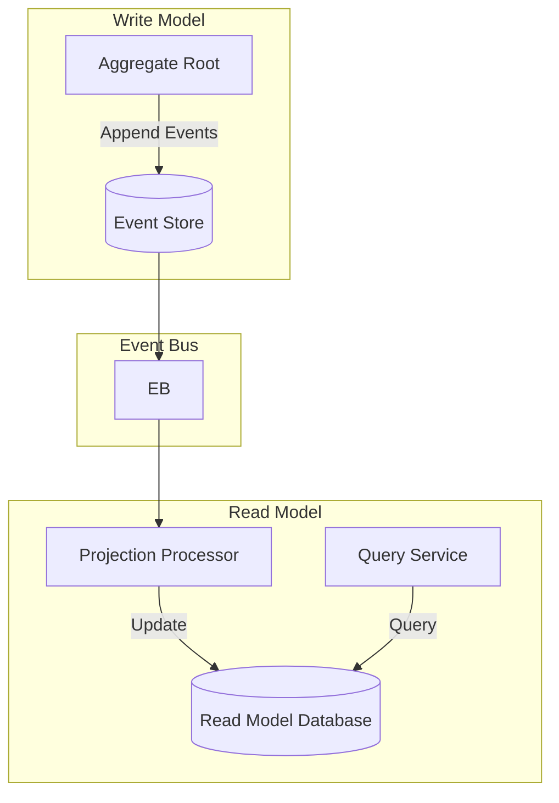

# Projection Processor

The *projection processor* is a core component in the Wow framework for maintaining read models in CQRS architecture. It transforms domain events into optimized projections that are tailored for specific query and display requirements.

## Overview

Projection processors handle domain events and update denormalized read models for efficient querying. They are a key part of the CQRS pattern, separating the write model from the read model for optimized performance.



## When to Use Projections

### Use Projections When

- Complex queries are needed on aggregate data
- Different view representations of the same data are required
- Query performance is critical
- Data needs to be optimized for specific access patterns

### Skip Projections When

- Snapshot mode is set to `all` (aggregate state already available)
- Simple CRUD operations are sufficient
- Data is rarely queried
- Event compensation console uses latest snapshots directly

```kotlin
// When snapshot=all, aggregate state is always available
// No need for separate projections in this case
wow:
  eventsourcing:
    snapshot:
      strategy: all
```

## Creating a Projection Processor

### Basic Structure

Projection processors are annotated with `@ProjectionProcessor` and contain event handler methods:

```kotlin
@ProjectionProcessor
class OrderSummaryProjection(
    private val orderSummaryRepository: OrderSummaryRepository
) {

    @OnEvent
    fun onOrderCreated(event: OrderCreated): Mono<Void> {
        val summary = OrderSummary(
            orderId = event.orderId,
            customerId = event.customerId,
            totalAmount = event.totalAmount,
            status = OrderStatus.CREATED,
            createdAt = event.createdAt
        )
        return orderSummaryRepository.save(summary)
    }

    @OnEvent
    fun onOrderPaid(event: OrderPaid): Mono<Void> {
        return orderSummaryRepository.findById(event.orderId)
            .flatMap { summary ->
                summary.status = OrderStatus.PAID
                summary.paidAt = event.paidAt
                orderSummaryRepository.save(summary)
            }
    }

    @OnEvent
    fun onOrderShipped(event: OrderShipped): Mono<Void> {
        return orderSummaryRepository.findById(event.orderId)
            .flatMap { summary ->
                summary.status = OrderStatus.SHIPPED
                summary.trackingNumber = event.trackingNumber
                orderSummaryRepository.save(summary)
            }
    }
}
```

### State Event Projections

Projections can also receive the aggregate state along with the event:

```kotlin
@ProjectionProcessor
class OrderAnalyticsProjection(
    private val analyticsRepository: AnalyticsRepository
) {

    fun onStateEvent(event: OrderCreated, state: OrderState) {
        val analytics = OrderAnalytics(
            orderId = state.id,
            customerId = state.customerId,
            itemCount = state.items.size,
            totalAmount = state.totalAmount,
            status = state.status
        )
        analyticsRepository.save(analytics)
    }

    fun onStateEvent(event: OrderPaid, state: ReadOnlyStateAggregate<OrderState>) {
        // state provides full aggregate state access
        analyticsRepository.updatePaymentTime(
            orderId = state.aggregateId.id,
            paidAt = state.paidAt
        )
    }
}
```

## Projection Patterns

### Denormalized View Pattern

Create denormalized views optimized for specific queries:

```kotlin
@ProjectionProcessor
class CustomerOrderViewProjection(
    private val customerOrderViewRepository: CustomerOrderViewRepository
) {

    @OnEvent
    fun onOrderCreated(event: OrderCreated): Mono<Void> {
        val view = CustomerOrderView(
            customerId = event.customerId,
            orderId = event.orderId,
            orderDate = event.createdAt,
            totalAmount = event.totalAmount,
            itemCount = event.items.size
        )
        return customerOrderViewRepository.save(view)
    }

    @OnEvent
    fun onOrderItemAdded(event: OrderItemAdded): Mono<Void> {
        return customerOrderViewRepository.incrementItemCount(
            orderId = event.orderId,
            amount = event.item.price * event.item.quantity
        )
    }
}
```

### Materialized View Pattern

Create pre-computed views for complex queries:

```kotlin
@ProjectionProcessor
class MonthlySalesReportProjection(
    private val salesReportRepository: MonthlySalesReportRepository
) {

    @OnEvent
    fun onOrderPaid(event: OrderPaid): Mono<Void> {
        val yearMonth = YearMonth.from(event.paidAt)
        return salesReportRepository.upsert(
            yearMonth = yearMonth,
            orderId = event.orderId,
            amount = event.amount
        )
    }
}
```

### Search Index Projection

Maintain search indexes for full-text search:

```kotlin
@ProjectionProcessor
class ProductSearchIndexProjection(
    private val searchIndexService: SearchIndexService
) {

    @OnEvent
    fun onProductCreated(event: ProductCreated): Mono<Void> {
        return searchIndexService.index(
            id = event.productId,
            name = event.name,
            description = event.description,
            category = event.category,
            price = event.price
        )
    }

    @OnEvent
    fun onProductUpdated(event: ProductUpdated): Mono<Void> {
        return searchIndexService.update(
            id = event.productId,
            changes = mapOf(
                "name" to event.name,
                "description" to event.description
            )
        )
    }

    @OnEvent
    fun onProductDeleted(event: ProductDeleted): Mono<Void> {
        return searchIndexService.delete(event.productId)
    }
}
```

## Blocking Projections

For synchronous blocking operations:

```kotlin
@ProjectionProcessor
class BlockingProjection {

    @Blocking
    @OnEvent
    fun onOrderCreated(event: OrderCreated) {
        // Synchronous blocking operation
        syncService.processOrder(event)
    }
}
```

## Error Handling

### Retry and Compensation

For critical projections, combine with event compensation:

```kotlin
@ProjectionProcessor
class CriticalProjection(
    private val compensationService: CompensationService
) {

    @Retry(maxRetries = 3, minBackoff = 60)
    @OnEvent
    fun onOrderCreated(event: OrderCreated): Mono<Void> {
        return criticalService.processOrder(event)
            .doOnError { error ->
                compensationService.recordFailure(event, error)
            }
    }
}
```

### Idempotency

Ensure projections are idempotent:

```kotlin
@ProjectionProcessor
class IdempotentProjection(
    private val eventStore: EventStore
) {

    @OnEvent
    fun onOrderUpdated(event: OrderUpdated): Mono<Void> {
        // Check if already processed using event ID
        return eventStore.exists(event.eventId)
            .filter { !it }
            .flatMap { processUpdate(event) }
            .then()
    }

    private fun processUpdate(event: OrderUpdated): Mono<Void> {
        // Process the update
    }
}
```

## Performance Considerations

### Batch Processing

Process events in batches for better performance:

```kotlin
@ProjectionProcessor
class BatchProjection(
    private val batchProcessor: BatchProcessor
) {
    private val eventBuffer = mutableListOf<OrderCreated>()

    @OnEvent
    fun onOrderCreated(event: OrderCreated): Mono<Void> {
        synchronized(eventBuffer) {
            eventBuffer.add(event)
            if (eventBuffer.size >= 100) {
                val batch = eventBuffer.toList()
                eventBuffer.clear()
                return batchProcessor.processBatch(batch)
            }
        }
        return Mono.empty()
    }
}
```

### Async Processing

Use reactive programming for non-blocking operations:

```kotlin
@ProjectionProcessor
class AsyncProjection(
    private val asyncService: AsyncService
) {

    @OnEvent
    fun onOrderCreated(event: OrderCreated): Mono<Void> {
        return asyncService.processAsync(event)
            .subscribeOn(Schedulers.boundedElastic())
    }
}
```

## Testing Projections

```kotlin
class OrderProjectionSpec : ProjectionSpec<OrderProjection>({
    on {
        val event = mockk<OrderCreated> {
            every { orderId } returns "order-001"
            every { customerId } returns "customer-001"
            every { totalAmount } returns BigDecimal(100)
        }
        whenEvent(event) {
            expectNoError()
            expectSaved<OrderSummary> {
                orderId.assert().isEqualTo("order-001")
                totalAmount.assert().isEqualTo(BigDecimal(100))
            }
        }
    }
})
```

## Configuration

Projection processors are automatically discovered via Spring component scanning. No additional configuration is required, but you can control event processing:

```yaml
wow:
  event:
    bus:
      type: kafka
      local-first:
        enabled: true  # Process events locally first
```

## Best Practices

1. **Keep Projections Focused**: Each projection should serve a specific query or view purpose
2. **Design for Idempotency**: Handle duplicate events gracefully
3. **Optimize for Query Patterns**: Denormalize data based on how it's queried
4. **Monitor Performance**: Track projection processing latency
5. **Handle Errors Gracefully**: Implement retry and compensation logic for critical projections
6. **Consider Eventual Consistency**: Design for the level of consistency your use case requires

## Related Topics

- [Event Processor](./event-processor) - For general event handling
- [Query Service](./query) - For querying read models
- [CQRS Pattern](./reference/awesome/cqrs) - For understanding CQRS architecture
- [Event Sourcing](./eventstore) - For understanding event storage
