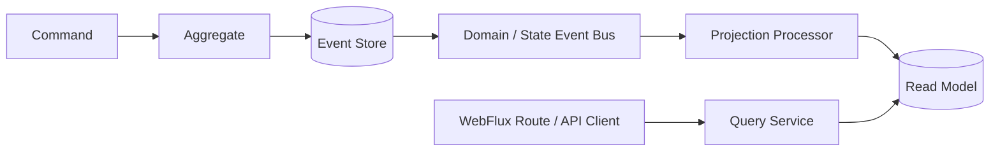

# Projection Processor

A projection processor consumes events and updates a read model. It is the bridge between the event-sourced write side and an application-specific query model:

```text
command -> domain event -> projection processor -> read model -> query/API client
```

Wow dispatches domain events and state events to registered processors. The processor owns the write to its read store; `wow-query` owns query contracts and backend compilation. A projection annotation does not create a repository, collection, index, HTTP route, or authorization policy.

::: tip Default decision: start with live snapshots
A projection is not required in a Wow application. For most screens and APIs that read the current state of one aggregate, configure `snapshot.strategy: all` first and use a snapshot store that supports dynamic queries. The latest snapshot can serve directly as the read model, without copying the same aggregate state into a dedicated projection.
:::

Skipping a projection also removes its processor, separate read model and storage shape, plus the associated idempotency, replay, compensation, lag monitoring, and integration testing. This can greatly reduce development and operating cost. Pay that cost only when the read requirement truly exceeds current aggregate state. See [Snapshots as the Default Read Model](./snapshot#snapshots-as-the-default-read-model).

“Live” remains bounded by the selected strategy and backend contract: `all` runs snapshot persistence for every state event, while waiting for `SNAPSHOT` proves only that the strategy's returned reactive chain completed. Verify cache, replica, and actual query visibility with a real query.

## Overview


```mermaid
flowchart LR
    C[Command] --> A[Aggregate]
    A --> E[(Event Store)]
    E --> B[Domain / State Event Bus]
    B --> P[Projection Processor]
    P --> R[(Read Model)]
    Q[Query Service] --> R
    H[WebFlux Route / API Client] --> Q
```

`ProjectionDispatcher` subscribes to both `DomainEventBus` and `StateEventBus`. `ProjectionProcessorAutoRegistrar` discovers Spring beans annotated with `@ProjectionProcessor`, and `ProjectionFunctionRegistrar` registers their handler functions.

This path is eventually consistent unless the caller explicitly waits for a projection stage. A successful command result at `PROCESSED` means command processing completed; it does not prove that an external read model has been updated.

## When to Use Projections

Skip the projection by default and add one only after a live snapshot cannot satisfy the read requirement. A projection solves the need for a different read model; it is not a mandatory Event Sourcing step.

### Use Projections When

- the read shape differs from aggregate state;
- a screen or report needs denormalized data from several events;
- the read store needs its own indexes, lifecycle, or backend;
- a search or analytical view should not load and replay aggregates.

### Skip Projections When

- the stored snapshot already has the exact read shape;
- the use case is a point lookup by aggregate ID;
- no durable read model is required;
- another consumer already maintains the required view.

Snapshot strategy and projection design are separate decisions. A snapshot accelerates aggregate recovery and can also be queried, while a dedicated projection is an application-owned view. `snapshot = all` does not automatically replace every projection, and disabling snapshots does not prevent a projection processor from consuming events.

## Creating a Projection Processor

### Basic Structure

Annotate a Spring bean with `@ProjectionProcessor`. Handler discovery supports the `onEvent` naming convention and `@OnEvent`; return a Reactor type for non-blocking work:

```kotlin
@ProjectionProcessor
class OrderSummaryProjector(
    private val repository: OrderSummaryRepository,
) {
    @OnEvent
    fun projectCreated(event: DomainEvent<OrderCreated>): Mono<Void> =
        repository.save(
            OrderSummary(
                id = event.aggregateId.id,
                status = "CREATED",
                totalAmount = event.body.items.sumOf { it.totalPrice },
            ),
        ).then()

    @OnEvent
    fun projectPaid(event: DomainEvent<OrderPaid>): Mono<Void> =
        repository.markPaid(event.aggregateId.id)
}
```

`OrderSummaryRepository` is application code. It may use MongoDB, Elasticsearch, R2DBC, or another reactive adapter; Wow does not infer that storage contract from the processor class.

Use `@OnEvent("order")` when an explicit aggregate-name filter is useful. Otherwise, the event parameter type and the conventional method name are enough for ordinary handlers.

### State Event Projections

A state-event handler receives the event plus the materialized aggregate state. Use the state value when rebuilding the projection from the latest aggregate view is simpler than applying a delta:

```kotlin
@ProjectionProcessor
class OrderStateProjector(
    private val repository: OrderSummaryRepository,
) {
    @OnStateEvent
    @Suppress("UnusedParameter")
    fun projectPaid(event: DomainEvent<OrderPaid>, state: OrderState): Mono<Void> =
        repository.replace(
            OrderSummary(
                id = state.id,
                status = state.status.name,
                totalAmount = state.totalAmount,
            ),
        ).then()
}
```

The second parameter may also be `ReadOnlyStateAggregate<OrderState>` when metadata such as aggregate ID, tenant, owner, space, version, tags, or deletion state is required. `@OnStateEvent` can be used instead of the naming convention.

## Projection Patterns

### Denormalized View Pattern

Store the fields a query actually needs, under stable logical names. Keep event application idempotent and update one application-owned record atomically where the backend supports it.

```kotlin
@OnEvent
fun projectAddress(event: DomainEvent<AddressChanged>): Mono<Void> =
    repository.updateAddress(event.aggregateId.id, event.body.shippingAddress).then()
```

Do not expose event payload layout as an accidental public query contract. The read model and its query schema are the contract consumed by REST clients.

### Materialized View Pattern

For counters or summaries, update a precomputed row rather than scanning event history on every request:

```kotlin
@OnEvent
fun projectPaid(event: DomainEvent<OrderPaid>): Mono<Void> =
    monthlySales.increment(
        Instant.ofEpochMilli(event.createTime).atZone(ZoneOffset.UTC).toLocalDate(),
        event.body.amount,
    )
```

Choose an atomic backend operation when duplicate or concurrent delivery matters. If the store cannot guarantee the required update semantics, record the consumed event ID with the update in the same transaction or equivalent atomic unit.

### Search Index Projection

A projector may maintain an Elasticsearch document or another search index. That index is still an eventually consistent projection; schema mappings and full-text behavior belong to the selected backend, not to `@ProjectionProcessor`.

```kotlin
@OnEvent
fun projectName(event: DomainEvent<ProductRenamed>): Mono<Void> =
    searchIndex.rename(event.aggregateId.id, event.body.name).then()
```

## Blocking Projections

Synchronous handlers must be marked `@Blocking` so Wow can treat them as blocking functions:

```kotlin
@ProjectionProcessor
class LegacyProjector(private val repository: LegacyRepository) {
    @Blocking
    @OnEvent
    fun projectCreated(event: DomainEvent<OrderCreated>) {
        repository.save(event.aggregateId.id)
    }
}
```

Prefer reactive adapters in normal projection paths. Do not call `block()` inside a reactive handler; isolate a genuinely blocking dependency behind a `@Blocking` handler instead.

## Error Handling

### Retry and Compensation

Projection execution runs through the projection filter chain. The starter's default `projectionErrorHandler` is `LogResumeErrorHandler`: it logs a failed exchange and allows dispatching to continue. Register a named `projectionErrorHandler` bean when the application requires a different failure policy.

`@Retry` controls retry metadata for the handler function; it does not make a non-idempotent write safe. Event compensation can resend failed domain or state-event processing, but it does not roll back an already committed external side effect. Design the write so replay is safe before enabling retries or compensation.

### Idempotency

Use the event identity available from `DomainEvent<T>` or `ReadOnlyStateAggregate` when a projection must deduplicate delivery:

```kotlin
fun onEvent(event: DomainEvent<OrderPaid>): Mono<Void> =
    repository.upsertOnce(event.id, event.aggregateId.id, event.body.amount)
```

The event store persists aggregate streams; it is not a processed-event registry for an application projection. Deduplication belongs in the projection store and should be atomic with the projected update.

## Performance Considerations

### Batch Processing

Do not keep a mutable in-memory buffer inside a singleton processor: a crash loses buffered work and parallel dispatch complicates ordering. Prefer a backend batch API, broker consumer batching, or a dedicated durable staging table when measurement shows single-event writes are insufficient.

### Async Processing

Return the complete reactive chain and let Wow subscribe to it:

```kotlin
@OnEvent
fun projectPaid(event: DomainEvent<OrderPaid>): Mono<Void> =
    repository.markPaid(event.aggregateId.id)
        .then(metrics.recordProjection(event.aggregateId.id))
```

Do not call `subscribe()` in the handler. An inner subscription escapes Wow's acknowledgement, retry, error, and wait-stage lifecycle.

## Testing Projections

Wow does not provide a `ProjectionSpec` DSL. Unit-test the processor as a normal class and verify the returned publisher:

```kotlin
@ExtendWith(MockKExtension::class)
class OrderSummaryProjectorTest {
    @MockK
    private lateinit var repository: OrderSummaryRepository

    @Test
    fun `projects created order`() {
        every { repository.save(any()) } returns Mono.empty()
        val projector = OrderSummaryProjector(repository)

        StepVerifier.create(projector.projectCreated(orderCreated))
            .verifyComplete()

        verify(exactly = 1) {
            repository.save(match { it.id == orderCreated.aggregateId.id })
        }
    }
}
```

Add an integration test when the contract depends on the event bus, real serialization, backend atomicity, query-schema resolution, or the HTTP route. A handler unit test alone does not prove the complete event -> projection -> query path.

## Configuration

With `wow-spring-boot-starter`, projection infrastructure is auto-configured when Wow is enabled. The application supplies `@ProjectionProcessor` beans and any repository beans. Event-bus selection controls where domain and state events are consumed; it does not generate the projection store.

For a command that must wait for projection processing, use a command wait plan with `CommandStage.PROJECTED` and, when needed, the exact projection context and processor name. That wait observes Wow processor acknowledgement; it is not a read-after-write guarantee for work started outside the returned reactive chain.

## Best Practices

1. Prove that a live snapshot is insufficient first; then give each projection one explicit read purpose.
2. Keep external writes reactive, acknowledged, and replay-safe.
3. Store or atomically enforce event identity when duplicates matter.
4. Treat projection lag and failures as observable production signals.
5. Publish logical query fields through the query-model schema instead of exposing physical mappings.
6. Test the real backend for mapping, atomicity, and query behavior that mocks cannot prove.

## Related Topics

- [Snapshot](./snapshot) — default current-state read model, strategies, and query boundaries
- [Event Processor](./event-processor) — general event processing
- [Query](./query) — query models, DSL, aggregation, and HTTP guards
- [Data Access Control](./data-access) — request scopes, query filters, and authorization boundary
- [OpenAPI](./open-api) — runtime route and interface publication
- [Event Sourcing](./eventstore) — event persistence and aggregate recovery
