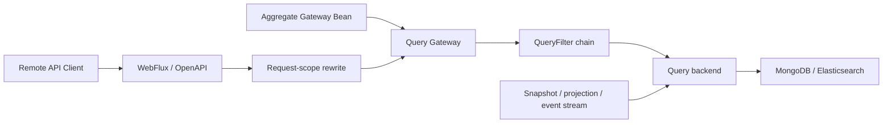

<a id="query-service"></a>

# Query

In Wow, “Query” covers query models, the server-side Query Gateway, JVM query backends, HTTP/OpenAPI contracts, and remote API clients. Together they form the read path, while retaining separate model, policy, execution, protocol, and caller responsibilities.

## Choose a Query Model and Result

Choose by data source and result shape first, then select an entry point:

| Model and capability | JVM | HTTP / OpenAPI | API Client |
| --- | --- | --- | --- |
| Snapshot data query | Supported | Supported | Supported |
| Snapshot aggregation query | Supported | Supported | Supported through a separate aggregation API |
| Event-stream data query | Supported | list, paged, count, and load by version only | Not supported |
| Event-stream aggregation query | Supported | Supported with JSON/SSE | Not supported |

Data queries return snapshot or event-stream documents. Aggregation queries return dynamic tabular rows composed from groups and metrics. See [Data Queries](./query/data-query.md) and [Aggregation Queries](./query/aggregation-query.md) for the two result contracts.

## Three Entry Points

1. [Query Gateway](./query/query-gateway.md): the server-side policy entry point for query rewriting, filter chains, and result handling.
2. [Query Backend](./query/query-backend.md): the trusted low-level SPI for aggregate-bound `ObjectNode` Backends and Factories.
3. [Query API Client](./query/query-api-client.md): the remote snapshot-query entry point with reactive and synchronous interfaces; it currently has no event-stream client.

## Execution Chain



The Gateway is the policy boundary for managed queries; calling a Factory directly bypasses it. See [Query Gateway](./query/query-gateway.md) for filter applicability, the WebFlux request context, and bypass conditions.

## FilterExpression

`FilterExpression` describes predicates with logical fields; backend adapters own physical paths and capabilities:

```json
{"op": "EQ", "field": "state.status", "value": "CREATED"}
```

See [Filter Expressions](./query/filter-expression.md) for all operators, Element scope, relative time, and backend differences.

## Kotlin DSL

```kotlin
val query = pagedQuery {
    filter { pathState { "status" eq "CREATED" } }
    pagination { index(1); size(20) }
}
```

See [Data Queries](./query/data-query.md) for query DTOs, projection, sort, pagination, and count. Model-specific paths are documented in [Snapshot Queries](./query/snapshot-query.md) and [Event Stream Queries](./query/event-stream-query.md).

## REST API

Snapshots publish data queries and `snapshot/aggregation`. Event streams publish list, paged, count, load by version, and JSON/SSE `event/aggregation`. Use the running instance's OpenAPI document for exact paths and scope variants.

```http
POST /sales-order/snapshot/paged
Content-Type: application/json
```

See [Snapshot Queries](./query/snapshot-query.md), [Event Stream Queries](./query/event-stream-query.md), [Snapshot Aggregation](./query/snapshot-aggregation.md), and [Event Stream Aggregation](./query/event-stream-aggregation.md) for their routes.

## Compatibility and Migration

`Condition`, `Operator`, and `ConditionDsl` are deprecated compatibility inputs; the canonical contract uses `FilterExpression`. See [V9 Query Migration](./query/v9-query-migration.md) for the breaking Gateway/Backend JVM type mapping, the no-bridge policy, and unchanged transport contracts.

## JSON Schema

Generic JSON Schema defines the wire protocol, OpenAPI describes published requests, and runtime Query Model Schema proves logical-field backend capabilities. Snapshots and event streams publish `snapshot/schema` and `event/schema`, plus their refresh routes. See [Query Model Schema](./query/query-model-schema.md) for sources, validation modes, and Provider differences.

<a id="query-service-registrar"></a>

## Query Gateway Registrars

`SnapshotQueryGatewayRegistrar` registers `SnapshotQueryGateway<STATE>` by state type. `EventStreamQueryGatewayRegistrar` registers aggregate-scoped Gateways without a state type parameter, so multiple candidates are distinguished by Bean name. See [Query Backend](./query/query-backend.md) for exact naming, Backend binding, and raw Factory boundaries.

## Next Steps

1. [Query Gateway](./query/query-gateway.md)
2. [Query Backend](./query/query-backend.md)
3. [Query API Client](./query/query-api-client.md)
4. [Filter Expressions](./query/filter-expression.md)
5. [Data Queries](./query/data-query.md)
6. [Snapshot Queries](./query/snapshot-query.md)
7. [Event Stream Queries](./query/event-stream-query.md)
8. [Aggregation Queries](./query/aggregation-query.md)
9. [Snapshot Aggregation](./query/snapshot-aggregation.md)
10. [Event Stream Aggregation](./query/event-stream-aggregation.md)
11. [V9 Query Migration](./query/v9-query-migration.md)
11. [Query Model Schema](./query/query-model-schema.md)
