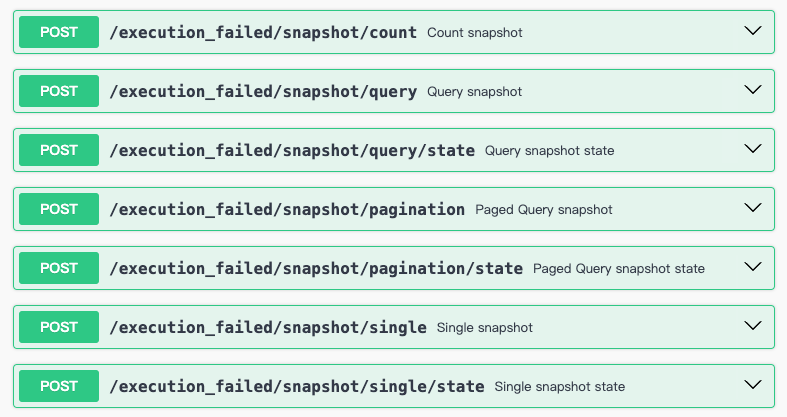

# Query Service

:::tip
Currently the `wow-mongo` module and `wow-elasticsearch` module support query services.
:::

## Operators

| Operator           | Description                                                                                                                                                                                                                                                             |
|---------------|-------------------------------------------------------------------------------------------------------------------------------------------------------------------------------------------------------------------------------------------------------------------------|
| AND           | Performs logical AND on the provided list of conditions                                                                                                                                                                                                                 |
| OR            | Performs logical OR on the provided list of conditions                                                                                                                                                                                                                  |
| NOR           | Performs logical NOR on the provided list of conditions                                                                                                                                                                                                                 |
| ID            | Matches all documents where the `id` field value equals the specified value                                                                                                                                                                                             |
| IDS           | Matches all documents where the `id` field value equals any value in the specified list                                                                                                                                                                                 |
| AGGREGATE_ID  | Matches documents where the aggregate root ID equals the specified value                                                                                                                                                                                                |
| AGGREGATE_IDS | Matches all documents where the aggregate root ID equals any value in the specified list                                                                                                                                                                                |
| TENANT_ID     | Matches all documents where the `tenantId` field value equals the specified value                                                                                                                                                                                       |
| OWNER_ID      | Matches all documents where the `ownerId` field value equals the specified value                                                                                                                                                                                        |
| SPACE_ID      | Matches all documents where the `spaceId` field value equals the specified value                                                                                                                                                                                        |
| DELETED       | Matches all documents where the `deleted` field value equals the specified value                                                                                                                                                                                        |
| ALL           | Matches all documents                                                                                                                                                                                                                                                   |
| EQ            | Matches all documents where the field name value equals the specified value                                                                                                                                                                                             |
| NE            | Matches all documents where the field name value does not equal the specified value                                                                                                                                                                                     |
| GT            | Matches all documents where the value of the given field is greater than the specified value                                                                                                                                                                            |
| LT            | Matches all documents where the value of the given field is less than the specified value                                                                                                                                                                               |
| GTE           | Matches all documents where the value of the given field is greater than or equal to the specified value                                                                                                                                                                |
| LTE           | Matches all documents where the value of the given field is less than or equal to the specified value                                                                                                                                                                   |
| CONTAINS      | Matches all documents where the value of the given field contains the specified value                                                                                                                                                                                   |
| IN            | Matches all documents where the field value equals any value in the specified list                                                                                                                                                                                      |
| NOT_IN        | Matches all documents where the field value does not equal any specified value or does not exist                                                                                                                                                                        |
| BETWEEN       | Matches all documents where the field value is within the specified range                                                                                                                                                                                               |
| ALL_IN        | Matches all documents where the field value is an array containing all specified values                                                                                                                                                                                 |
| STARTS_WITH   | Matches documents where the field value starts with the specified string                                                                                                                                                                                                |
| ENDS_WITH     | Matches documents where the field value ends with the specified string                                                                                                                                                                                                  |
| MATCH         | Full-text match. Backend-specific: MongoDB uses `text` search over the configured text index; Elasticsearch uses `match` on the specified field                                                                                                                        |
| ELEM_MATCH    | Matches all documents with array fields where at least one member of the array matches the given condition.                                                                                                                                                             |
| NULL          | Matches all documents where the field value is `null`                                                                                                                                                                                                                   |
| NOT_NULL      | Matches all documents where the field value is not `null`                                                                                                                                                                                                               |
| TRUE          | Matches all documents where the field value is `true`                                                                                                                                                                                                                   |
| FALSE         | Matches all documents where the field value is `false`                                                                                                                                                                                                                  |
| EXISTS        | Matches documents where the field exists                                                                                                                                                                                                                                |
| RAW           | Raw operator, uses the condition value directly as the original database query condition                                                                                                                                                                                |
| TODAY         | Matches all documents where the field is within today's range. For example: `today` is `2024-06-06`, matches range `2024-06-06 00:00:00.000` ~ `2024-06-06 23:59:59.999`                                                                                                |
| BEFORE_TODAY  | Matches all documents where the field is before today                                                                                                                                                                                                                   |
| TOMORROW      | Matches all documents where the field is within tomorrow's range. For example: `today` is `2024-06-06`, matches range `2024-06-07 00:00:00.000` ~ `2024-06-07 23:59:59.999`                                                                                            |
| THIS_WEEK     | Matches all documents where the field is within this week's range                                                                                                                                                                                                       |
| NEXT_WEEK     | Matches all documents where the field is within next week's range                                                                                                                                                                                                       |
| LAST_WEEK     | Matches all documents where the field is within last week's range                                                                                                                                                                                                       |
| THIS_MONTH    | Matches all documents where the field is within this month's range. For example: `today`: `2024-06-06`, matches range: `2024-06-01 00:00:00.000` ~ `2024-06-30 23:59:59.999`                                                                                            |
| LAST_MONTH    | Matches all documents where the field is within last month's range. For example: `today`: `2024-06-06`, matches range: `2024-05-01 00:00:00.000` ~ `2024-05-31 23:59:59.999`                                                                                            |
| RECENT_DAYS   | Matches all documents where the field is within the specified number of recent days range. For example: `today`: `2024-06-06`, recent 3 days, matches range: `2024-06-04 00:00:00.000` ~ `2024-06-06 23:59:59.999`. That is: today, yesterday, the day before yesterday |
| EARLIER_DAYS  | Matches all documents where the field is within the specified number of days before the specified value. For example: `today`: `2024-06-06`, 3 days ago, matches range: less than `2024-06-04 00:00:00.000`                                                             |

:::info Elasticsearch string fields
`CONTAINS`, `STARTS_WITH`, and `ENDS_WITH` are literal operations. In Elasticsearch, use them with term-level fields such as `keyword` and `wildcard`; `*`, `?`, and `\` are matched as ordinary characters, and all three support `ignoreCase`. Use `MATCH` for full-text search.
:::

## Query DSL

The `Query DSL` aims to provide a concise and flexible way to build query conditions.

### ConditionDsl

```kotlin
condition {
    deleted(DeletionState.ALL)
    and {
        tenantId("tenantId")
        all()
    }
    nor {
        all()
    }
    id("id")
    ids("id", "id2")
    "field1" eq "value1"
    "field2" ne "value2"
    "filed3" gt 1
    "field4" lt 1
    "field5" gte 1
    "field6" lte 1
    "field7" contains "value7"
    "field8" isIn listOf("value8")
    "field9" notIn listOf("value9")
    "field10" between (1 to 2)
    "field100" between 1 to 2
    "field11" all listOf("value11")
    "field12" startsWith "value12"
    "field12" endsWith "value12"
    "field13" elemMatch {
        "field14" eq "value14"
    }
    "field15".isNull()
    "field16".notNull()
    "field17".isTrue()
    "field18".isFalse()
    and {
        "field3" eq "value3"
        "field4" eq "value4"
    }
    or {
        "field3" eq "value3"
        "field4" eq "value4"
    }
    "field19".today()
    "field20".tomorrow()
    "field21".thisWeek()
    "field22".nextWeek()
    "field23".lastWeek()
    "field24".thisMonth()
    "field25".lastMonth()
    "field26".recentDays(1)
    raw("1=1")
    "state" nested {
        "field27" eq "value27"
        "field28" eq "value28"
        "child" nested {
            "field29" eq "value29"
        }
        nested("")
        "field30" eq "value30"
    }
}
```

### SortDsl

```kotlin
sort {
    "field1".asc()
    "field2".desc()
}
```

### PaginationDsl

```kotlin
pagination {
    index(1)
    size(1)
}
```

### ProjectionDsl

```kotlin
projection {
    include("field1")
    exclude("field2")
}
```

### ListQueryDsl

```kotlin
listQuery {
    limit(1)
    sort {
        "field1".asc()
    }
    condition {
        "field1" eq "value1"
        "field2" eq "value2"
        and {
            "field3" eq "value3"
        }
        or {
            "field4" eq "value4"
        }
    }
}
```

### PagedQueryDsl

```kotlin
pagedQuery {
    pagination {
        index(1)
        size(10)
    }
    sort {
        "field1".asc()
    }
    condition {
        "field1" eq "value1"
        "field2" ne "value2"
        "filed3" gt 1
        "field4" lt 1
        "field5" gte 1
        "field6" lte 1
        "field7" contains "value7"
        "field8" isIn listOf("value8")
        "field9" notIn listOf("value9")
        "field10" between (1 to 2)
        "field11" all listOf("value11")
        "field12" startsWith "value12"
        "field13" elemMatch {
            "field14" eq "value14"
        }
        "field15".isNull()
        "field16".notNull()
        and {
            "field3" eq "value3"
            "field4" eq "value4"
        }
        or {
            "field3" eq "value3"
            "field4" eq "value4"
        }
    }
}
```

## Execute Query

```kotlin
listQuery {
    limit(1)
    sort {
        "field1".asc()
    }
    condition {
        "field1" eq "value1"
        and {
            "field3" eq "value3"
        }
        or {
            "field4" eq "value4"
        }
    }
}.query(queryService)
```

## Execute Paged Query

```kotlin
pagedQuery {
    pagination {
        index(1)
        size(10)
    }
    sort {
        "field1".asc()
    }
    condition {
        and {
            "field3" eq "value3"
            "field4" startsWith "value4"
        }
        or {
            "field3" eq "value3"
            "field4" startsWith "value4"
        }
    }
}.query(queryService)
```

## Rewrite Query

```kotlin
@Component
@Order(ORDER_FIRST)
@FilterType(SnapshotQueryHandler::class)
class DataFilterSnapshotQueryFilter : SnapshotQueryFilter {

    override fun filter(
        context: QueryContext<*, *>,
        next: FilterChain<QueryContext<*, *>>,
    ): Mono<Void> {

        return Mono.deferContextual {
            /**
             * Rewrite query, append warehouse ID to query conditions.
             */
            context.asRewritableQuery().rewriteQuery { query ->
                val warehouseIdCondition = condition {
                    nestedState()
                    WarehouseIdCapable::warehouseId.name eq warehouseId
                }
                query.appendCondition(warehouseIdCondition)
            }
            next.filter(context)
        }
    }
}
```

## OpenAPI

**Wow** not only automatically generates _OpenAPI_ endpoints for commands (`Command`), but also provides query (`Query`) _OpenAPI_ endpoints.
This means developers usually only need to focus on writing domain models to complete service development, without worrying about implementing query logic, greatly improving development efficiency.

The examples below query the `sales-order` aggregate for `tenant-1`. All four requests describe the same synthetic snapshot, so their conditions and response counts stay consistent.



### Paged Query

::: code-group

```shell [OpenAPI]
  curl -X 'POST' \
  'http://localhost:8080/tenant/tenant-1/sales-order/snapshot/paged' \
  -H 'accept: application/json' \
  -H 'Content-Type: application/json' \
  -H 'Wow-Space-Id: space-1' \
  -d '{
  "sort": [
    {
      "field": "_id",
      "direction": "DESC"
    }
  ],
  "pagination": {
    "index": 1,
    "size": 10
  },
  "condition": {
    "field": "state.status",
    "operator": "EQ",
    "value": "CREATED",
    "children": []
  }
}'
```

```json [Response (abridged)]
{
  "total": 1,
  "list": [
    {
      "aggregateId": "order-1",
      "tenantId": "tenant-1",
      "version": 3,
      "state": {
        "id": "order-1",
        "status": "CREATED"
      }
    }
  ]
}
```

```typescript [Typescript]
import { eq } from "@ahoo-wang/fetcher-wow";

eq("state.status", "CREATED")
```

:::

### Query

::: code-group

```shell [OpenAPI]
  curl -X 'POST' \
  'http://localhost:8080/tenant/tenant-1/sales-order/snapshot/list' \
  -H 'accept: application/json' \
  -H 'Content-Type: application/json' \
  -H 'Wow-Space-Id: space-1' \
  -d '{
  "sort": [
    {
      "field": "_id",
      "direction": "DESC"
    }
  ],
  "limit": 1,
  "condition": {
    "field": "state.status",
    "operator": "EQ",
    "value": "CREATED",
    "children": []
  }
}'
```

```json [Response (abridged)]
[
  {
    "aggregateId": "order-1",
    "tenantId": "tenant-1",
    "version": 3,
    "state": {
      "id": "order-1",
      "status": "CREATED"
    }
  }
]
```

:::

### Count

::: code-group

```shell [OpenAPI]
  curl -X 'POST' \
  'http://localhost:8080/tenant/tenant-1/sales-order/snapshot/count' \
  -H 'accept: application/json' \
  -H 'Content-Type: application/json' \
  -H 'Wow-Space-Id: space-1' \
  -d '{
    "field": "state.status",
    "operator": "EQ",
    "value": "CREATED",
    "children": []
  }'
```

```json [Response]
1
```

:::

### Get Single Model

::: code-group

```shell [OpenAPI]
  curl -X 'POST' \
  'http://localhost:8080/tenant/tenant-1/sales-order/snapshot/single' \
  -H 'accept: application/json' \
  -H 'Content-Type: application/json' \
  -H 'Wow-Space-Id: space-1' \
  -d '{
  "sort": [],
  "condition": {
    "field": "_id",
    "operator": "EQ",
    "value": "order-1",
    "children": []
  }
}'
```

```json [Response (abridged)]
{
  "aggregateId": "order-1",
  "tenantId": "tenant-1",
  "version": 3,
  "state": {
    "id": "order-1",
    "status": "CREATED"
  }
}
```

:::


## Query Service Registrar

`SnapshotQueryServiceRegistrar` is used to automatically register all local aggregate root query services into the `Spring` container.
Developers can obtain the corresponding `SnapshotQueryService` from the `BeanFactory` using the specified `Bean Name`.

> `Bean Name` naming convention: `Aggregate Root Name + ".SnapshotQueryService"`.

Usage examples:

::: code-group

```kotlin [Constructor Injection]
class OrderService(
    private val queryService: SnapshotQueryService<OrderState>
) {
    fun getById(id: String): Mono<OrderState> {
        return singleQuery {
            condition {
                id(id)
            }
        }.query(queryService).toState().throwNotFoundIfEmpty()
    }
}
```

```kotlin [Field Injection]
@Autowired
private lateinit var queryService: SnapshotQueryService<OrderState>
```

```kotlin [Manual Retrieval by Bean Name]
val queryService = applicationContext.getBean("example.order.SnapshotQueryService") as SnapshotQueryService<OrderState>
```

:::
