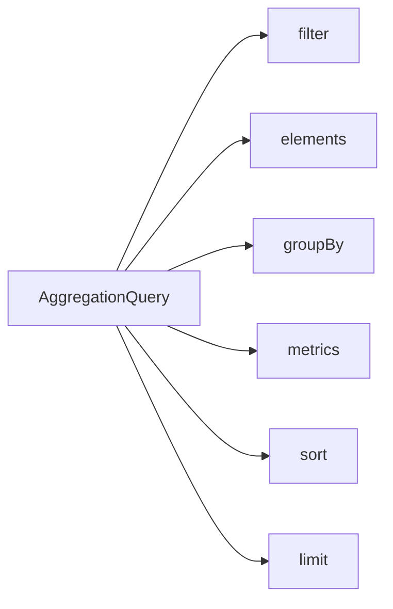

# Aggregation Queries

`AggregationQuery` creates dynamic table rows from filtered records. It always requires at least one metric; fields are logical fields, and the chosen query model and backend resolve their capability. This page defines the shared AST and does not treat MongoDB and Elasticsearch implementations as identical semantics.

## AggregationQuery



`filter`, ordered `elements`, `groupBy`, `metrics`, `sort`, and `limit` together determine the result. `metrics` cannot be empty; `elements`, `groupBy`, and `sort` can be empty. With no group, the result is a whole-input summary rather than dimension buckets.

## Root Filter

`filter` is the root-level `FilterExpression`; when omitted, it is `MATCH_ALL`. It uses absolute logical paths for the selected query model. The snapshot and event-stream pages define their respective field roots. See [Filter Expressions](./filter-expression.md) for filter JSON shapes and the Kotlin DSL.

## Elements: Expand Collections

Each `AggregationElement` has a `path` and an optional `filter`. Elements are one ordered parent-to-child expansion chain, not a list of sibling collections:

- the first `path` is relative to the query-model root and uses an absolute logical path;
- each later `path` is relative to the current expanded element;
- an Element `filter` is relative to its own single element and cannot contain root-only filters;
- with Elements, group, metric, and numeric-expression fields are relative to the innermost element; without them, they are relative to the query-model root.

For example, `state.orders` → `lines` first expands root `state.orders`, then expands `lines` inside each order. It does not expand two root arrays independently.

## Groups

`groupBy` uses aliases as result-column names. The current Group AST is limited to:

| Type | Field | Additional arguments |
| --- | --- | --- |
| `TERMS` | `field` | None |
| `HISTOGRAM` | `field` | Positive, finite `interval` |
| `DATE_HISTOGRAM` | `field` | `unit`, optional `timeZone` (defaults to `UTC`) |

`DATE_HISTOGRAM` date units are `YEAR`, `QUARTER`, `MONTH`, `WEEK`, `DAY`, `HOUR`, `MINUTE`, and `SECOND`. Bucket boundaries, temporal values, and field capability come from the actual query entry and backend; the shared AST does not promise complete backend equivalence.

## Metrics

Every Metric also has a unique alias, used as a result-column name.

| Type | Shape |
| --- | --- |
| `COUNT` | Counts records in the current scope |
| `NUMERIC` | Applies `SUM`, `AVG`, `MIN`, or `MAX` to an Expression |
| `ANY` | Selects one field value |

`ANY` is not a substitute for a deterministic group key: its selected non-null value is not guaranteed to be stable across executions or backends. Contributing numeric values, nulls, and finite-value handling follow the actual entry point.

## Arithmetic and Temporal Expressions

The `NUMERIC` Expression AST has only `FIELD`, finite `CONSTANT`, and `BINARY`. `BINARY` operators are `ADD`, `SUBTRACT`, `MULTIPLY`, and `DIVIDE`; they can nest to express arithmetic. The Kotlin DSL provides `field(...)`, `constant(...)`, `+`, `-`, `*`, `/`, and `sum`, `avg`, `min`, `max`.

Temporal bucketing is not a numeric Expression. It is a `DATE_HISTOGRAM` Group whose units are listed above.

## Sort, Aliases, and Limits

`sort` can reference only group or metric aliases; sorting requires at least one group. Each alias must be unique, be a one-segment logical field, and not start with `__wow`. Explicit sort fields cannot repeat. Missing group aliases are appended as `ASC` in group declaration order to form the effective sort.

`limit` caps the returned result rows and defaults to `100`. The following limits are checked while constructing `AggregationQuery`:

| Item | Maximum |
| --- | ---: |
| `elements` | 5 |
| `groups` | 32 |
| `metrics` | 64 |
| Effective `sorts` | 32 |
| Expression `depth` | 8 |
| Expression `nodes` | 256 |
| Default `limit` | 100 |
| Maximum `limit` | 10000 |

## Aggregation Results

Rows are dynamic maps whose keys are aliases. The reactive snapshot aggregation API Client returns `Flux<Map<String, Any?>>`; its synchronous counterpart collects `List<Map<String, Any?>>`. JVM `QueryService.aggregate` returns the equivalent map-like `Flux<DynamicDocument>`.

This is the smallest shared-contract example: a root filter, one group, a `COUNT`, a metric alias, and sorting. The fields do not assume `state.*` or `body.*`; replace them with valid logical paths after selecting the model.

```kotlin
val query = aggregation {
    filter { "status" eq "READY" }
    terms("status", "status")
    count("recordCount")
    sort { "recordCount".desc() }
    limit(10)
}
```

The equivalent JSON applies only to an entry that actually exposes this protocol; it does not imply HTTP aggregation for event streams.

```json
{
  "filter": { "op": "EQ", "field": "status", "value": "READY" },
  "groupBy": [{ "type": "TERMS", "field": "status", "alias": "status" }],
  "metrics": [{ "type": "COUNT", "alias": "recordCount" }],
  "sort": [{ "field": "recordCount", "direction": "DESC" }],
  "limit": 10
}
```

The result columns use the group and metric aliases exactly:

```json
[
  { "status": "READY", "recordCount": 12 },
  { "status": "PENDING", "recordCount": 4 }
]
```

For empty input, whether an ungrouped summary emits a row, and how a row represents null, follow the selected `QueryService` or transport entry's actual behavior. Do not generalize one entry's empty-result semantics to another.

## Decide the Counting Unit First

First ask what counts as one record. Without `elements`, each root document is one record. After expansion, each array element is one record. Root-level `COUNT` and element-level `COUNT` therefore are not equivalent, even with the same root filter. With nested Elements, the counting unit becomes the innermost expanded element.

The Elements chain defines the counting unit; Groups only bucket those records, and Metrics decide what to calculate inside each bucket. Choose the data source and counting unit before choosing fields, groups, and metrics.

## Structural Limits

In addition to the capacity limits above, `metrics` has a minimum of 1, `limit` must be in `1..10000`, and aliases and sort fields cannot repeat. `HISTOGRAM.interval` must be positive and finite; `DATE_HISTOGRAM.timeZone` must be a valid `ZoneId`. These are AST shape checks, not replacements for Schema, HTTP guards, authorization, or backend capability checks.

## Choose Snapshot or Event Stream

| What to count | Temporary entry | Why choose it |
| --- | --- | --- |
| Current aggregate state and state collections | [aggregation section in the query overview](../query.md#snapshot-aggregation) | Snapshot is the source of truth for current state |
| Complete event history and event arrays | [aggregation section in the query overview](../query.md#snapshot-aggregation) | Event stream is the source of truth for historical events and currently has a JVM aggregation contract only |

Dedicated snapshot- and event-stream-aggregation pages have not been created yet, so these links temporarily return to the existing aggregation explanation. Do not infer an event-stream HTTP aggregation entry from the JSON example.
