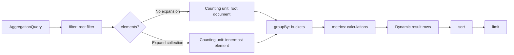

# Aggregation Queries

`AggregationQuery` creates dynamic table rows from filtered records. It always requires at least one metric; fields are logical fields, and the chosen query model and backend resolve their capability. This page defines the shared AST and does not treat MongoDB and Elasticsearch implementations as identical semantics.

## AggregationQuery



`filter`, ordered `elements`, `groupBy`, `metrics`, `sort`, and `limit` together determine the result. `metrics` cannot be empty; `elements`, `groupBy`, and `sort` can be empty. With no group, the result is a whole-input summary rather than dimension buckets.

## Root Filter

`filter` is the root-level `FilterExpression`; when omitted, it is `MATCH_ALL`. It uses absolute logical paths for the selected query model. The snapshot and event-stream pages define their respective field roots. See [Filter Expressions](./filter-expression.md) for filter JSON shapes and the Kotlin DSL.

## Elements: Expand Collections

Each `AggregationElement` has a `path` and an optional `filter`. Elements are one ordered parent-to-child expansion chain, not a list of sibling collections:

- the first `path` is relative to the query-model root and uses an absolute logical path;
- each later `path` is relative to the current expanded element;
- an Element `filter` is relative to its own single element and cannot contain root-only filters;
- with Elements, group, metric, and numeric-expression fields are relative to the innermost element; without them, they are relative to the query-model root.

For example, `state.orders` → `lines` first expands root `state.orders`, then expands `lines` inside each order. It does not expand two root arrays independently.

## Groups

`groupBy` uses aliases as result-column names. The current Group AST is limited to:

| Type | Field | Additional arguments |
| --- | --- | --- |
| `TERMS` | `field` | None |
| `HISTOGRAM` | `field` | Positive, finite `interval` |
| `DATE_HISTOGRAM` | `field` | `unit`, optional `timeZone` (defaults to `UTC`) |

`DATE_HISTOGRAM` date units are `YEAR`, `QUARTER`, `MONTH`, `WEEK`, `DAY`, `HOUR`, `MINUTE`, and `SECOND`. Bucket boundaries, temporal values, and field capability come from the actual query entry and backend; the shared AST does not promise complete backend equivalence.

## Metrics

Every Metric also has a unique alias, used as a result-column name.

| Type | Shape |
| --- | --- |
| `COUNT` | Counts records in the current scope |
| `NUMERIC` | Applies `SUM`, `AVG`, `MIN`, `MAX`, `STDDEV`, or `VARIANCE` to an Expression |
| `DISTINCT_COUNT` | Counts the distinct non-null contribution values of an Expression as an integer; an empty set yields `0` |
| `PERCENTILE` | Computes `PERCENTILE(p)` over a numeric Expression, `0 < p < 100`; the DSL's `median` equals `p=50` |
| `ANY` | Selects one field value |
| `DERIVED` | Computes arithmetic over declared metric results after aggregation (see [Derived Metrics](#derived-metrics)) |

`ANY` is not a substitute for a deterministic group key: its selected non-null value is not guaranteed to be stable across executions or backends.

### Metric Filter {#metric-filter}

Every Metric also accepts an optional record-level `filter`, written in the DSL as a trailing lambda and defaulting to `MATCH_ALL`. It applies to the records of the current scope (root document or innermost Element): a record that fails the `filter` contributes nothing to that metric only, without affecting other metrics in the same query and without replacing the root `filter` or an Element `filter`. The JSON shape matches [Filter Expressions](./filter-expression.md):

```kotlin
count("paid") { "status" eq "PAID" }
sum("total", "paidTotal") { "status" eq "PAID" }
```

```json
{"type": "COUNT", "alias": "paid", "filter": {"op": "EQ", "field": "status", "value": "PAID"}}
```

An empty match keeps each metric's empty-set semantics: `COUNT` and `DISTINCT_COUNT` return `0`, while numeric metrics, `ANY`, and `PERCENTILE` return `null`.

The following limits are shared by both backends and enforced at compile time:

- fields referenced by a metric filter must be scalar; array fields and unions containing arrays are unsupported, and conditions that necessarily target array fields — such as `IS_EMPTY`/`$size` — are rejected as well: their semantics could be preserved, but they are refused in favor of one uniform contract;
- full-text `SEARCH`, `ELEMENT_MATCH`, and `CONTAINS_ALL` (`$all` semantics) are unsupported;
- scoping follows the Element filter rule: a metric filter inside an Element scope must not reference root-level fields or root-only filters.

Versions and known boundaries:

- metric filters on the MongoDB backend require server 5.0+ (`$not` inside the guard expression); the `PERCENTILE` metric itself still requires 7.0+. Older servers return their native error.
- the `$gt`/`$lt` family in MongoDB guard expressions compares by the BSON total order rather than `$match` type bracketing, so counts over mixed-type data may run high; this is an edge case and does not promise bitwise cross-backend equality.
- the HTTP query guard does not gate the metric filter construct itself as an expensive operator; operators inside a metric filter are subject to the same `wow.webflux.query.allow-expensive-operators` switch as root/element filters, and their filter value counts feed the same `wow.webflux.query.max-filter-values` cap as other filters.

### Derived Metrics {#derived-metrics}

A `DERIVED` metric computes arithmetic over the results of metrics declared in the same query, after aggregation finishes, producing one derived value per row (an AOV or an attainment ratio, for example). Its expression AST has only `METRIC_REF`, finite `CONSTANT`, and `BINARY`; the `BINARY` operators match the numeric expression set (`ADD`, `SUBTRACT`, `MULTIPLY`, `DIVIDE`) and can nest. The DSL is `derived(alias) { ... }`, with `ref(metric)` referencing a metric and `constant(value)` providing a constant:

```kotlin
aggregation {
    terms("state.status", "status")
    count("paid") { "status" eq "PAID" }
    sum("amount", "paidAmount") { "status" eq "PAID" }
    derived("paidAov") { ref("paidAmount") / ref("paid") }
    sum("amount", "targetAmount")
    derived("attainment") { ref("paidAmount") / ref("targetAmount") }
    sort { "paidAov".desc() }
}
```

`paidAov` divides two metric-filtered metrics into a paid AOV; `attainment` compares the paid amount against the target amount. A single derived metric has the following JSON shape, with `expression` reusing the recursive `DerivedExpression` schema:

```json
{
  "type": "DERIVED",
  "alias": "paidAov",
  "expression": {
    "type": "BINARY",
    "operator": "DIVIDE",
    "left": {"type": "METRIC_REF", "metric": "paidAmount"},
    "right": {"type": "METRIC_REF", "metric": "paid"}
  }
}
```

Reference rules are enforced while constructing the `AggregationQuery`; violations throw `IllegalArgumentException`:

- a `METRIC_REF` may reference only metrics declared before the derived metric in the same query (earlier derived metrics included); declaration order is evaluation order, so the reference graph is acyclic by construction. Unknown and group aliases are rejected;
- referencing an `ANY` metric is rejected: its value is unstable across executions and backends;
- constants must be finite; derived expressions share the numeric-expression depth cap of 8, and all derived expressions in one query share at most 256 nodes.

Computation semantics:

- null propagation: any null operand yields `null`; a reference to an empty-set `NUMERIC`/`PERCENTILE` (whose result is `null`) propagates `null` as well. `COUNT` references are never `null` (an empty set is `0`), but dividing by that `0` still yields `null`;
- division by zero yields `null`, and the derived result must be finite;
- a derived metric cannot carry a metric filter itself: filter is a record-level concept, and derived computes after aggregation. Its combination with the [Metric Filter](#metric-filter) is to reference filtered metrics — `paidAov` above is exactly "paid amount / paid count". The OpenAPI schema still shows the inherited optional `filter` property on `DERIVED` for shape compatibility — values sent there are ignored at deserialization, and the DSL/constructors cannot set it;
- sort may reference a derived alias; the example sorts by `paidAov` descending.

Implementation and guardrails:

- MongoDB evaluates derived metrics in additional `$project` stages after the aggregation projection, one stage per derived metric in declaration order; Elasticsearch uses `bucket_script` pipeline aggregations inside the bucket. Neither adds storage version requirements (`$project` and `bucket_script` both predate the supported MongoDB 7.0 / Elasticsearch 9.x baselines);
- the HTTP query guard treats derived metrics as arithmetic expressions: they are rejected when `wow.webflux.query.allow-expensive-operators=false`, consistent with the existing metric arithmetic gating.

### HAVING: Filter Groups by Aggregated Values {#having}

`having` filters grouped rows by their per-row metric results after aggregation, mirroring SQL's `HAVING`: the root `filter` and metric filters act on records, while having acts on aggregated values. Omitting having disables filtering. Its AST is the recursive, polymorphic `HavingExpression`:

| Type | Shape |
| --- | --- |
| `CONDITION` | `metric` + `EQ`/`NE`/`GT`/`GTE`/`LT`/`LTE` + finite `value` |
| `BETWEEN` | closed interval `lower ≤ upper` |
| `IN` | non-empty value set |
| `IS_NULL` | captures rows whose metric value is `null`; `negated` inverts it into `isNotNull()` |
| `AND` / `OR` | non-empty operands, recursively nested |

The DSL writes comparisons directly on metric aliases inside `having { }`, composed with infix `and`/`or`:

```kotlin
aggregation {
    terms("state.status", "status")
    count("paid") { "status" eq "PAID" }
    sum("amount", "paidAmount") { "status" eq "PAID" }
    derived("attainment") { ref("paidAmount") / constant(6000.0) }
    having {
        ("attainment" gte 0.8) and ("paid" gt 10)
    }
    sort { "attainment".desc() }
    limit(20)
}
```

The example keeps only the states whose attainment is at least `0.8` and whose paid count exceeds `10`; both `sort` and `limit` apply to the filtered rows. Beyond the six comparisons, the DSL also provides `between(lower, upper)`, `isIn(values)`, `isNull()`, and `isNotNull()`. `having` is optional and omitted from the JSON when absent, so existing query JSON shapes are unchanged:

```json
"having": {"type": "AND", "operands": [
  {"type": "CONDITION", "metric": "attainment", "operator": "GTE", "value": 0.8},
  {"type": "CONDITION", "metric": "paid", "operator": "GT", "value": 10}
]}
```

The semantics follow the SQL HAVING convention:

- null fails: a row whose metric value is `null` (an empty-set `NUMERIC`/`PERCENTILE`, or a derived metric with null propagation) fails every comparison, `BETWEEN`, and `IN`; `isNull()` captures exactly those rows, and `isNotNull()` excludes them;
- numeric comparisons unify into IEEE double space;
- `limit` caps the result rows after filtering, and `sort` applies to the filtered rows.

Reference and value rules are enforced while constructing the `AggregationQuery`; violations throw `IllegalArgumentException`:

- having requires at least one `groupBy`;
- a referenced alias must be a declared metric alias: unknown names and group aliases are rejected;
- referencing an `ANY` metric is rejected: its value is unstable across executions and backends;
- unlike `METRIC_REF`, having carries no declaration-order restriction and may reference derived metrics anywhere in the list;
- comparison values must be finite; `BETWEEN` requires `lower ≤ upper`; `IN` values cannot be empty; `AND`/`OR` operands cannot be empty;
- having expressions share the derived-expression depth cap of 8.

Implementation and backend conventions:

- MongoDB compiles having into one additional `$match` stage after the aggregation projection chain: comparisons run over the projected metric values, unified into IEEE double space (Decimal128-stored values convert safely);
- Elasticsearch has no `bucket_selector` under composite aggregations, so having evaluates client-side: metric-sort queries filter rows before the top-N truncation, and group-sort queries over-fetch pages until `limit` surviving rows are collected or buckets are exhausted;
- performance guidance: aggregated values carry no index selectivity, so having cannot push down to an index the way a root filter can; prefer metric-sort + having on large data, and expect group-sort + having with poor selectivity to scan every bucket in the worst case;
- neither backend adds storage version requirements.

HTTP query guardrails:

- having nodes count toward `wow.webflux.query.max-filter-nodes`, and comparison values count toward `wow.webflux.query.max-filter-values` — `CONDITION` counts 1, `BETWEEN` counts 2, and `IN` counts its number of values;
- having comparisons are not treated as expensive operators and are not gated by `wow.webflux.query.allow-expensive-operators`; arithmetic/derived metrics referenced by having still follow their own rules under that switch.

### Numeric Contributions and Precision {#numeric-contributions}

`NUMERIC` contributes at most one value per current record, which is a root document or the innermost expanded Element. A direct `FIELD` and each field leaf in `BINARY` use the same rule: after ignoring null/missing entries, exactly one stored numeric value contributes; zero or multiple values contribute `null`. Duplicate numeric entries count separately; `[7,7]` is not a singleton.

| Field value in the current record | `FIELD` contribution | `FIELD + 0` contribution |
| --- | ---: | ---: |
| `7`, `[7]`, `[null,7]` | `7` | `7` |
| Missing, `null`, `[]`, `[null]` | `null` | `null` |
| `[1,2]`, `[7,7]` | `null` | `null` |

`COUNT` still counts records that pass the filter, including records with no numeric contribution. It is not the number of contributing numeric values. `AVG` averages valid contributions only; all four numeric metrics return `null` when none contribute. Use supported Elements expansion to count individual array elements. Expressions do not zip arrays, form Cartesian products, or scan source to reconstruct element pairing.

A declared scalar `FIELD` retains native aggregation and its precision; array or scalar/array-union `FIELD` inputs are normalized with the rule above. `BINARY` uses finite Double arithmetic; an unavailable operand, division by zero, or non-finite result contributes no value. This does not promise bitwise equality between `SUM(x)` and `SUM(x+0)` for large integers, Decimal128, or rounding boundaries. Elasticsearch numeric aggregations use double, so integers above `2^53` may be approximate; MongoDB native accumulators retain their type and promotion rules. See [Elasticsearch aggregation precision](https://www.elastic.co/docs/explore-analyze/query-filter/aggregations) and [MongoDB $sum](https://www.mongodb.com/docs/manual/reference/operator/aggregation/sum/).

These rules assume that stored values and runtime-field output obey the logical numeric model; they do not promise per-row validation of arbitrary malformed data. Elasticsearch numeric doc values preserve duplicates but do not preserve source-array positions; see [doc_values](https://www.elastic.co/docs/reference/elasticsearch/mapping-reference/doc-values). `HISTOGRAM` and `DATE_HISTOGRAM` retain their separate bucket contracts and do not inherit these NUMERIC contribution rules.

`STDDEV` and `VARIANCE` use the population convention and share the numeric-contribution rule of `SUM`/`AVG`: they are `null` when no value contributes and return `0` for a single contributing value. `PERCENTILE` follows the same contribution rule and is `null` when nothing contributes; MongoDB and Elasticsearch both use the t-digest approximation: results are near-exact for small inputs, while large or skewed groups carry rank-space (quantile) error — bitwise equality is not promised, nor containment within any exact order-statistic interval. `DISTINCT_COUNT` participates differently from `NUMERIC`: an array field referenced by `FIELD` contributes element by element to the distinct set (no prior Elements expansion required), and null/missing entries do not participate; `CONSTANT`/`BINARY` expressions still contribute at most one value per record. Elasticsearch `cardinality` is near-exact within its default precision threshold (about 3000 distinct values); above the threshold, large cardinalities may be undercounted. MongoDB counts the set of contributing values exactly.

**Version requirement**: `PERCENTILE` on the MongoDB backend requires server 7.0+ (the `$percentile` operator); the other new metrics have no additional version requirement. Older servers return their native error.

## Arithmetic and Temporal Expressions

The `NUMERIC` Expression AST has only `FIELD`, finite `CONSTANT`, and `BINARY`. `BINARY` operators are `ADD`, `SUBTRACT`, `MULTIPLY`, and `DIVIDE`; they can nest to express arithmetic. The Kotlin DSL provides `field(...)`, `constant(...)`, `+`, `-`, `*`, `/`, and `sum`, `avg`, `min`, `max`, `stddev`, `variance`, `percentile`, `median`, and `distinctCount`.

Temporal bucketing is not a numeric Expression. It is a `DATE_HISTOGRAM` Group whose units are listed above.

## Sort, Aliases, and Limits

`sort` can reference only group or metric aliases; sorting requires at least one group. Each alias must be unique, be a one-segment logical field, and not start with `__wow`. Explicit sort fields cannot repeat. Missing group aliases are appended as `ASC` in group declaration order to form the effective sort.

`limit` caps the returned result rows and defaults to `100`. The following limits are checked while constructing `AggregationQuery`:

| Item | Maximum |
| --- | ---: |
| `elements` | 5 |
| `groups` | 32 |
| `metrics` | 64 |
| Effective `sorts` | 32 |
| Expression `depth` | 8 |
| Expression `nodes` | 256 |
| Default `limit` | 100 |
| Maximum `limit` | 10000 |

## Aggregation Results

Rows use aliases as keys. The reactive snapshot aggregation API Client returns `Flux<Map<String, Any?>>`; its synchronous counterpart collects `List<Map<String, Any?>>`. JVM `QueryGateway.aggregate` returns `Flux<ObjectNode>`.

This is the smallest shared-contract example: a root filter, one group, a `COUNT`, a metric alias, and sorting. The fields do not assume `state.*` or `body.*`; replace them with valid logical paths after selecting the model.

```kotlin
val query = aggregation {
    filter { "status" eq "READY" }
    terms("status", "status")
    count("recordCount")
    sort { "recordCount".desc() }
    limit(10)
}
```

The equivalent JSON applies to Snapshot and EventStream HTTP entries that expose the aggregation protocol. Field roots and capabilities still come from the Query Model Schema for the selected model.

```json
{
  "filter": { "op": "EQ", "field": "status", "value": "READY" },
  "groupBy": [{ "type": "TERMS", "field": "status", "alias": "status" }],
  "metrics": [{ "type": "COUNT", "alias": "recordCount" }],
  "sort": [{ "field": "recordCount", "direction": "DESC" }],
  "limit": 10
}
```

The result columns use the group and metric aliases exactly:

```json
[
  { "status": "READY", "recordCount": 12 },
  { "status": "PENDING", "recordCount": 4 }
]
```

When a query succeeds and has no group, aggregation returns one summary row: for empty input, `COUNT = 0`, `ANY = null`, and numeric metrics are `null`. With groups, empty input produces no rows. A custom `QueryBackend` that differs from the shared TCK must declare and verify that behavior independently; the difference is not the framework's shared contract.

Elasticsearch executes an ungrouped summary in one search and rejects partial results. Unavailable shards, shard execution failures, or search timeouts fail the query instead of returning a partial summary or an empty-input row. This policy applies only to ungrouped Elasticsearch summaries; MongoDB and grouped queries retain their own backend failure behavior.

## Decide the Counting Unit First

First ask what counts as one record. Without `elements`, each root document is one record. After expansion, each array element is one record. Root-level `COUNT` and element-level `COUNT` therefore are not equivalent, even with the same root filter. With nested Elements, the counting unit becomes the innermost expanded element.

The Elements chain defines the counting unit; Groups only bucket those records, and Metrics decide what to calculate inside each bucket. Choose the data source and counting unit before choosing fields, groups, and metrics.

## Structural Limits

In addition to the capacity limits above, `metrics` has a minimum of 1, `limit` must be in `1..10000`, and aliases and sort fields cannot repeat. `HISTOGRAM.interval` must be positive and finite; `DATE_HISTOGRAM.timeZone` must be a valid `ZoneId`. These are AST shape checks, not replacements for Schema, HTTP guards, authorization, or backend capability checks.

## Choose Snapshot or Event Stream

| What to count | Topic | Why choose it |
| --- | --- | --- |
| Current aggregate state and state collections | [Snapshot Aggregation](./snapshot-aggregation.md) | Snapshot is the source of truth for current state |
| Complete event history and event arrays | [Event Stream Aggregation](./event-stream-aggregation.md) | Event stream is the source of truth for historical events and supports JVM and HTTP/OpenAPI aggregation with JSON/SSE; there is still no EventStream API Client |
