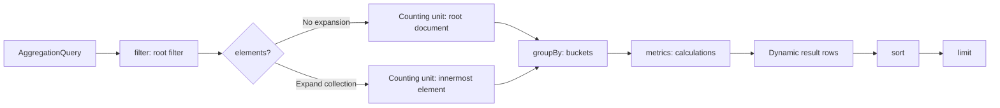

# Aggregation Queries

`AggregationQuery` creates dynamic table rows from filtered records. It always requires at least one metric; fields are logical fields, and the chosen query model and backend resolve their capability. This page defines the shared AST and does not treat MongoDB and Elasticsearch implementations as identical semantics.

## AggregationQuery



`filter`, ordered `elements`, `groupBy`, `metrics`, `sort`, and `limit` together determine the result. `metrics` cannot be empty; `elements`, `groupBy`, and `sort` can be empty. With no group, the result is a whole-input summary rather than dimension buckets.

## Root Filter

`filter` is the root-level `FilterExpression`; when omitted, it is `MATCH_ALL`. It uses absolute logical paths for the selected query model. The snapshot and event-stream pages define their respective field roots. See [Filter Expressions](./filter-expression.md) for filter JSON shapes and the Kotlin DSL.

## Elements: Expand Collections

Each `AggregationElement` has a `path` and an optional `filter`. Elements are one ordered parent-to-child expansion chain, not a list of sibling collections:

- the first `path` is relative to the query-model root and uses an absolute logical path;
- each later `path` is relative to the current expanded element;
- an Element `filter` is relative to its own single element and cannot contain root-only filters;
- with Elements, group, metric, and numeric-expression fields are relative to the innermost element; without them, they are relative to the query-model root.

For example, `state.orders` → `lines` first expands root `state.orders`, then expands `lines` inside each order. It does not expand two root arrays independently.

## Groups

`groupBy` uses aliases as result-column names. The current Group AST is limited to:

| Type | Field | Additional arguments |
| --- | --- | --- |
| `TERMS` | `field` | None |
| `HISTOGRAM` | `field` | Positive, finite `interval` |
| `DATE_HISTOGRAM` | `field` | `unit`, optional `timeZone` (defaults to `UTC`) |

`DATE_HISTOGRAM` date units are `YEAR`, `QUARTER`, `MONTH`, `WEEK`, `DAY`, `HOUR`, `MINUTE`, and `SECOND`. Bucket boundaries, temporal values, and field capability come from the actual query entry and backend; the shared AST does not promise complete backend equivalence.

## Metrics

Every Metric also has a unique alias, used as a result-column name.

| Type | Shape |
| --- | --- |
| `COUNT` | Counts records in the current scope |
| `NUMERIC` | Applies `SUM`, `AVG`, `MIN`, `MAX`, `STDDEV`, or `VARIANCE` to an Expression |
| `DISTINCT_COUNT` | Counts the distinct non-null contribution values of an Expression as an integer; an empty set yields `0` |
| `PERCENTILE` | Computes `PERCENTILE(p)` over a numeric Expression, `0 < p < 100`; the DSL's `median` equals `p=50` |
| `ANY` | Selects one field value |

`ANY` is not a substitute for a deterministic group key: its selected non-null value is not guaranteed to be stable across executions or backends.

### Numeric Contributions and Precision {#numeric-contributions}

`NUMERIC` contributes at most one value per current record, which is a root document or the innermost expanded Element. A direct `FIELD` and each field leaf in `BINARY` use the same rule: after ignoring null/missing entries, exactly one stored numeric value contributes; zero or multiple values contribute `null`. Duplicate numeric entries count separately; `[7,7]` is not a singleton.

| Field value in the current record | `FIELD` contribution | `FIELD + 0` contribution |
| --- | ---: | ---: |
| `7`, `[7]`, `[null,7]` | `7` | `7` |
| Missing, `null`, `[]`, `[null]` | `null` | `null` |
| `[1,2]`, `[7,7]` | `null` | `null` |

`COUNT` still counts records that pass the filter, including records with no numeric contribution. It is not the number of contributing numeric values. `AVG` averages valid contributions only; all four numeric metrics return `null` when none contribute. Use supported Elements expansion to count individual array elements. Expressions do not zip arrays, form Cartesian products, or scan source to reconstruct element pairing.

A declared scalar `FIELD` retains native aggregation and its precision; array or scalar/array-union `FIELD` inputs are normalized with the rule above. `BINARY` uses finite Double arithmetic; an unavailable operand, division by zero, or non-finite result contributes no value. This does not promise bitwise equality between `SUM(x)` and `SUM(x+0)` for large integers, Decimal128, or rounding boundaries. Elasticsearch numeric aggregations use double, so integers above `2^53` may be approximate; MongoDB native accumulators retain their type and promotion rules. See [Elasticsearch aggregation precision](https://www.elastic.co/docs/explore-analyze/query-filter/aggregations) and [MongoDB $sum](https://www.mongodb.com/docs/manual/reference/operator/aggregation/sum/).

These rules assume that stored values and runtime-field output obey the logical numeric model; they do not promise per-row validation of arbitrary malformed data. Elasticsearch numeric doc values preserve duplicates but do not preserve source-array positions; see [doc_values](https://www.elastic.co/docs/reference/elasticsearch/mapping-reference/doc-values). `HISTOGRAM` and `DATE_HISTOGRAM` retain their separate bucket contracts and do not inherit these NUMERIC contribution rules.

`STDDEV` and `VARIANCE` use the population convention and share the numeric-contribution rule of `SUM`/`AVG`: they are `null` when no value contributes and return `0` for a single contributing value. `PERCENTILE` follows the same contribution rule and is `null` when nothing contributes; MongoDB and Elasticsearch both use the t-digest approximation, so the result falls inside the rank interval of the sorted contributions (linear interpolation convention `(n-1)·p`) and bitwise equality is not promised. `DISTINCT_COUNT` participates differently from `NUMERIC`: an array field referenced by `FIELD` contributes element by element to the distinct set (no prior Elements expansion required), and null/missing entries do not participate; `CONSTANT`/`BINARY` expressions still contribute at most one value per record. Elasticsearch `cardinality` is near-exact within its precision threshold; MongoDB counts the set of contributing values exactly.

**Version requirement**: `PERCENTILE` on the MongoDB backend requires server 7.0+ (the `$percentile` operator); the other new metrics have no additional version requirement. Older servers return their native error.

## Arithmetic and Temporal Expressions

The `NUMERIC` Expression AST has only `FIELD`, finite `CONSTANT`, and `BINARY`. `BINARY` operators are `ADD`, `SUBTRACT`, `MULTIPLY`, and `DIVIDE`; they can nest to express arithmetic. The Kotlin DSL provides `field(...)`, `constant(...)`, `+`, `-`, `*`, `/`, and `sum`, `avg`, `min`, `max`, `stddev`, `variance`, `percentile`, `median`, and `distinctCount`.

Temporal bucketing is not a numeric Expression. It is a `DATE_HISTOGRAM` Group whose units are listed above.

## Sort, Aliases, and Limits

`sort` can reference only group or metric aliases; sorting requires at least one group. Each alias must be unique, be a one-segment logical field, and not start with `__wow`. Explicit sort fields cannot repeat. Missing group aliases are appended as `ASC` in group declaration order to form the effective sort.

`limit` caps the returned result rows and defaults to `100`. The following limits are checked while constructing `AggregationQuery`:

| Item | Maximum |
| --- | ---: |
| `elements` | 5 |
| `groups` | 32 |
| `metrics` | 64 |
| Effective `sorts` | 32 |
| Expression `depth` | 8 |
| Expression `nodes` | 256 |
| Default `limit` | 100 |
| Maximum `limit` | 10000 |

## Aggregation Results

Rows use aliases as keys. The reactive snapshot aggregation API Client returns `Flux<Map<String, Any?>>`; its synchronous counterpart collects `List<Map<String, Any?>>`. JVM `QueryGateway.aggregate` returns `Flux<ObjectNode>`.

This is the smallest shared-contract example: a root filter, one group, a `COUNT`, a metric alias, and sorting. The fields do not assume `state.*` or `body.*`; replace them with valid logical paths after selecting the model.

```kotlin
val query = aggregation {
    filter { "status" eq "READY" }
    terms("status", "status")
    count("recordCount")
    sort { "recordCount".desc() }
    limit(10)
}
```

The equivalent JSON applies to Snapshot and EventStream HTTP entries that expose the aggregation protocol. Field roots and capabilities still come from the Query Model Schema for the selected model.

```json
{
  "filter": { "op": "EQ", "field": "status", "value": "READY" },
  "groupBy": [{ "type": "TERMS", "field": "status", "alias": "status" }],
  "metrics": [{ "type": "COUNT", "alias": "recordCount" }],
  "sort": [{ "field": "recordCount", "direction": "DESC" }],
  "limit": 10
}
```

The result columns use the group and metric aliases exactly:

```json
[
  { "status": "READY", "recordCount": 12 },
  { "status": "PENDING", "recordCount": 4 }
]
```

When a query succeeds and has no group, aggregation returns one summary row: for empty input, `COUNT = 0`, `ANY = null`, and numeric metrics are `null`. With groups, empty input produces no rows. A custom `QueryBackend` that differs from the shared TCK must declare and verify that behavior independently; the difference is not the framework's shared contract.

Elasticsearch executes an ungrouped summary in one search and rejects partial results. Unavailable shards, shard execution failures, or search timeouts fail the query instead of returning a partial summary or an empty-input row. This policy applies only to ungrouped Elasticsearch summaries; MongoDB and grouped queries retain their own backend failure behavior.

## Decide the Counting Unit First

First ask what counts as one record. Without `elements`, each root document is one record. After expansion, each array element is one record. Root-level `COUNT` and element-level `COUNT` therefore are not equivalent, even with the same root filter. With nested Elements, the counting unit becomes the innermost expanded element.

The Elements chain defines the counting unit; Groups only bucket those records, and Metrics decide what to calculate inside each bucket. Choose the data source and counting unit before choosing fields, groups, and metrics.

## Structural Limits

In addition to the capacity limits above, `metrics` has a minimum of 1, `limit` must be in `1..10000`, and aliases and sort fields cannot repeat. `HISTOGRAM.interval` must be positive and finite; `DATE_HISTOGRAM.timeZone` must be a valid `ZoneId`. These are AST shape checks, not replacements for Schema, HTTP guards, authorization, or backend capability checks.

## Choose Snapshot or Event Stream

| What to count | Topic | Why choose it |
| --- | --- | --- |
| Current aggregate state and state collections | [Snapshot Aggregation](./snapshot-aggregation.md) | Snapshot is the source of truth for current state |
| Complete event history and event arrays | [Event Stream Aggregation](./event-stream-aggregation.md) | Event stream is the source of truth for historical events and supports JVM and HTTP/OpenAPI aggregation with JSON/SSE; there is still no EventStream API Client |
