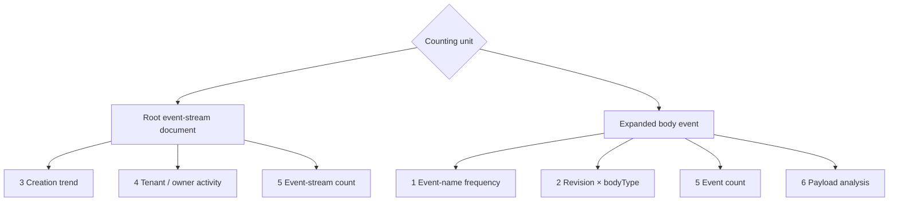

# Event Stream Aggregation

Event-stream aggregation is supported through the JVM `EventStreamQueryGateway` / `EventStreamQueryService` and WebFlux HTTP/OpenAPI. There is no EventStream API Client; HTTP callers use the shared `AggregationQuery` JSON contract directly.

## Capabilities and Entry Points

- **JVM Gateway**: `EventStreamQueryGateway.aggregate(namedAggregate, query)` executes aggregation through the policy chain.
- **JVM Service**: an aggregate-specific `EventStreamQueryService` executes `query.query(queryService)`. A Spring-managed service normally enters the policy chain through [Query Gateway](./query-gateway.md); see [Query Backends](./query-backend.md) for direct-Factory and custom-Bean bypass boundaries.
- **WebFlux HTTP/OpenAPI**: current `sales-order` OpenAPI proves `POST /sales-order/event/aggregation`, `POST /tenant/{tenantId}/sales-order/event/aggregation`, and `POST /owner/{ownerId}/sales-order/event/aggregation`. The base route contains no tenant/owner path scope; tenant/owner variants provide the corresponding scope through path parameters.
- **Schema HTTP**: `GET /sales-order/event/schema` and `POST /sales-order/event/schema/refresh` are separate model-level routes without tenant/owner variants.
- **Shared contract**: see [Aggregation Queries](./aggregation-query.md) for Elements, groups, metrics, aliases, sorting, and limits; see [Filter Expressions](./filter-expression.md) for the root-filter Kotlin DSL; field capabilities come from [Query Model Schema (current reference)](./query-model-schema.md).

After strict request decoding, `RewriteRequestFilter` merges tenant/owner/space scope from aggregate metadata, path variables, and the `Command-Tenant-Id`, `Command-Owner-Id`, and `Wow-Space-Id` request headers before entering `EventStreamQueryGateway`. The Gateway policy chain applies the HTTP guard, its tail filter invokes the selected QueryService, and the Schema resolver validates and resolves the query before backend aggregation. The response negotiates a JSON array or SSE through `Accept`. JVM aggregation returns `Flux<DynamicDocument>`. The results below are representative dynamic rows, not fixed business data.

## Root Documents, body, and Counting Units

Without Elements, one record is one root `DomainEventStream` document. Root filters, groups, and metrics use absolute paths such as `tenantId`, `ownerId`, and `createTime`.

`body` is the event array. After `expand("body")`, one record becomes one expanded event. Element filters, groups, metrics, and expression fields are relative to that event, so use `name`, `revision`, `bodyType`, and `body.data`, not the repeated root-prefixed forms `body.name` or `body.body.data`. The root filter still uses absolute root-document paths. `COUNT` counts the current scope, so root event-stream count and expanded event count are different metrics.



## Scenario 1: Event Name Frequency

**Business question**

How often does each event name occur in the history of `tenant-a`?

**Counting unit**

One expanded event. Multiple events in the same event stream are counted separately.

**Kotlin DSL**

```kotlin
import me.ahoo.wow.query.dsl.aggregation
import me.ahoo.wow.query.event.EventStreamQueryService
import me.ahoo.wow.query.event.query

fun eventNameFrequency(queryService: EventStreamQueryService) = aggregation {
    filter { tenantId("tenant-a") }
    expand("body")
    terms("name", "eventName")
    count("eventCount")
    sort { "eventCount".desc() }
    limit(10)
}.query(queryService)
```

**HTTP JSON**

```json
{
  "filter": {"op": "TENANT_ID", "value": "tenant-a"},
  "elements": [
    {"path": "body"}
  ],
  "groupBy": [
    {"type": "TERMS", "field": "name", "alias": "eventName"}
  ],
  "metrics": [
    {"type": "COUNT", "alias": "eventCount"}
  ],
  "sort": [
    {"field": "eventCount", "direction": "DESC"}
  ],
  "limit": 10
}
```

**Result interpretation**

```json
[
  {"eventName": "OrderCreated", "eventCount": 84},
  {"eventName": "OrderPaid", "eventCount": 61}
]
```

`eventName` is the event-name group and `eventCount` is the number of events in each group; sorting references the metric alias.

**Boundary**

`body` must support Element scope, and the expanded `name` field must support TERMS aggregation.

## Scenario 2: Revision and Message Type

**Business question**

How are historical events distributed across the “revision × message type” dimensions?

**Counting unit**

One expanded event. Each event enters one `revision` and `bodyType` combination.

**Kotlin DSL**

```kotlin
val query = aggregation {
    expand("body")
    terms("revision", "revision")
    terms("bodyType", "bodyType")
    count("eventCount")
}
```

**HTTP JSON**

```json
{
  "elements": [
    {"path": "body"}
  ],
  "groupBy": [
    {"type": "TERMS", "field": "revision", "alias": "revision"},
    {"type": "TERMS", "field": "bodyType", "alias": "bodyType"}
  ],
  "metrics": [
    {"type": "COUNT", "alias": "eventCount"}
  ]
}
```

**Result interpretation**

```json
[
  {"revision": "0.0.1", "bodyType": "me.ahoo.wow.example.api.order.OrderCreated", "eventCount": 132},
  {"revision": "0.0.2", "bodyType": "me.ahoo.wow.example.api.order.OrderCreated", "eventCount": 27}
]
```

The two group aliases form a two-level grouping, and `eventCount` counts events in each combination.

**Boundary**

The relative paths after expansion are `revision` and `bodyType`. Actual field paths, value types, and TERMS capabilities must match the current Query Model Schema; the example values are not a fixed protocol.

## Scenario 3: Event-Stream Creation Trend

**Business question**

How many event streams were created each day?

**Counting unit**

One root event-stream document. `body` is not expanded, so one event stream produced by one command is counted once.

**Kotlin DSL**

```kotlin
val query = aggregation {
    dateHistogram(
        "createTime",
        AggregationDateUnit.DAY,
        "day",
        ZoneOffset.UTC,
    )
    count("streamCount")
}
```

**HTTP JSON**

```json
{
  "groupBy": [
    {
      "type": "DATE_HISTOGRAM",
      "field": "createTime",
      "alias": "day",
      "unit": "DAY",
      "timeZone": "UTC"
    }
  ],
  "metrics": [
    {"type": "COUNT", "alias": "streamCount"}
  ]
}
```

**Result interpretation**

```json
[
  {"day": 1787846400000, "streamCount": 31},
  {"day": 1787932800000, "streamCount": 24}
]
```

`day` is the UTC date-bucket start in epoch milliseconds, and `streamCount` is the root event-stream count whose first-event creation time falls in that bucket.

**Boundary**

`createTime` is a root field, not an expanded-event field. `DomainEventStream.createTime` comes from `body.first().createTime`; it is not the backend append or ingestion time. Date-histogram execution depends on the temporal aggregation capability exposed by Schema and the backend's actual mapping for the field.

## Scenario 4: Tenant and Owner Activity

**Business question**

How many historical event streams did each tenant and owner produce?

**Counting unit**

One root event-stream document. Each stream enters one `tenantId` and `ownerId` combination; this is not an event count.

**Kotlin DSL**

```kotlin
val query = aggregation {
    terms("tenantId", "tenantId")
    terms("ownerId", "ownerId")
    count("streamCount")
}
```

**HTTP JSON**

```json
{
  "groupBy": [
    {"type": "TERMS", "field": "tenantId", "alias": "tenantId"},
    {"type": "TERMS", "field": "ownerId", "alias": "ownerId"}
  ],
  "metrics": [
    {"type": "COUNT", "alias": "streamCount"}
  ]
}
```

**Result interpretation**

```json
[
  {"tenantId": "tenant-a", "ownerId": "user-1", "streamCount": 48},
  {"tenantId": "tenant-a", "ownerId": "user-2", "streamCount": 19}
]
```

`streamCount` represents event-stream writes in the historical activity.

**Boundary**

This query does not expand `body`; a stream containing multiple events is still counted once. `tenantId` and `ownerId` must support TERMS aggregation, and authorization and scope policies must run before aggregation.

## Scenario 5: Event-Stream Count Versus Event Count

**Business question**

How many event streams did one tenant write, and how many events do those streams contain?

**Counting unit**

The first query counts root event-stream documents; the second counts individual expanded events.

**Kotlin DSL**

```kotlin
val streamCountQuery = aggregation {
    filter { tenantId("tenant-a") }
    count("streamCount")
}

val eventCountQuery = aggregation {
    filter { tenantId("tenant-a") }
    expand("body")
    count("eventCount")
}
```

**HTTP JSON request 1**

```json
{
  "filter": {"op": "TENANT_ID", "value": "tenant-a"},
  "metrics": [
    {"type": "COUNT", "alias": "streamCount"}
  ]
}
```

**HTTP JSON request 2**

```json
{
  "filter": {"op": "TENANT_ID", "value": "tenant-a"},
  "elements": [
    {"path": "body"}
  ],
  "metrics": [
    {"type": "COUNT", "alias": "eventCount"}
  ]
}
```

**Result interpretation**

`streamCountQuery` returns:

```json
[{"streamCount": 120}]
```

`eventCountQuery` returns:

```json
[{"eventCount": 438}]
```

The same root filter produces `120` event streams containing `438` events.

**Boundary**

Elements define the counting unit, so these values cannot be expressed by one ambiguous `COUNT`. Run two queries and combine their explicitly named results at the caller when both metrics are required.

## Scenario 6: Event Payload Analysis

**Business question**

How often does each `data` value occur in the example event payload?

**Counting unit**

One expanded event. Each event with an aggregatable `data` value participates in grouping.

**Kotlin DSL**

The payload field's root path in the example Query Model Schema is `body.body.data`. After expanding `body`, the group field must use the relative path:

```kotlin
val query = aggregation {
    expand("body")
    terms("body.data", "data")
    count("eventCount")
}
```

**HTTP JSON**

```json
{
  "elements": [
    {"path": "body"}
  ],
  "groupBy": [
    {"type": "TERMS", "field": "body.data", "alias": "data"}
  ],
  "metrics": [
    {"type": "COUNT", "alias": "eventCount"}
  ]
}
```

**Result interpretation**

```json
[
  {"data": "APPROVED", "eventCount": 73},
  {"data": "REJECTED", "eventCount": 11}
]
```

`data` is the payload-value group and `eventCount` is the event count for each value.

**Boundary**

`body.body.data` is not a wildcard promise from the system fields. The actual Query Model Schema must declare it and prove TERMS capability. MongoDB must also store the payload in a queryable form. In Elasticsearch, the outer `body` must remain nested to preserve fields from the same event, and `body.body.data` must also have an aggregatable mapping.

## Field Availability and Backend Boundaries

- System Schema declares root `createTime`, `tenantId`, and `ownerId`, plus event metadata `body.name`, `body.revision`, and `body.bodyType`. Runtime Schema and the MongoDB or Elasticsearch adapter still resolve the concrete operation capabilities.
- After expanding `body`, Element filters, groups, metrics, and expression fields are relative to one event. Payload Schema root paths remain `body.body.*`, while relative query paths become `body.*`.
- MongoDB and Elasticsearch share the public AST but do not promise identical physical pipelines, mappings, null behavior, or bucket details. Elasticsearch's outer `body` must remain nested to preserve fields from the same event; each `body.body.*` payload field also needs mapping capabilities for the operation being used.
- A custom `EventStreamQueryService` may retain the default unsupported aggregation implementation. Working event-stream data queries alone do not prove that such a custom backend executes aggregation.
- EventStream aggregation HTTP/OpenAPI and separate Schema HTTP routes exist. There is still no EventStream API Client. HTTP availability also does not prove that a specific backend supports an example field; actual capability comes from runtime Query Model Schema and backend mapping.
