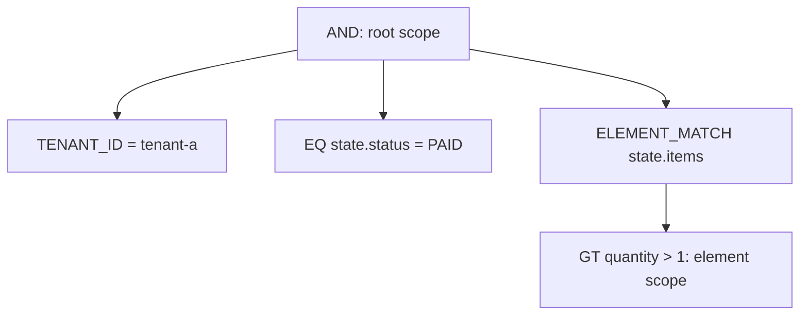

# Filter Expressions

`FilterExpression` is the current filter contract. JSON uses `op` to discriminate filter types; nested filters must use `op` too. A logical field is a dot-separated path: the first segment must be a named segment, and later segments can be named segments or decimal array indexes. A named segment can have an `@` prefix; its name starts with an ASCII letter or `_`, followed by ASCII letters, digits, `_`, or `-`.

## FilterExpression Structure

Every filter is an object. Field filters use `field`, values use `value`, `values`, or range bounds; logical filters use non-empty `operands`.

```json
{
  "op": "AND",
  "operands": [
    { "op": "EQ", "field": "state.status", "value": "PAID" },
    { "op": "GTE", "field": "state.total", "value": 100 }
  ]
}
```

HTTP JSON values for `EQ` and `NE` must be scalars; the canonical shapes of the individual filters define the other scalar restrictions for ranges and collections. Empty `AND`, `OR`, and `NOR` are invalid.

## Logical and Constant Operators

| Operator | JSON shape | Kotlin DSL |
| --- | --- | --- |
| `MATCH_ALL` / `MATCH_NONE` | `{ "op": "MATCH_ALL" }` | `matchAll()` / `matchNone()` |
| `AND` / `OR` / `NOR` | `{ "op": "AND", "operands": [ ... ] }` | `and { ... }` / `or { ... }` / `nor { ... }` |

Sibling expressions in one `filterExpression { ... }` block form an implicit `AND`; use explicit `and`, `or`, or `nor` when the composition must change.

## Identity and Tenant Operators

| Operator | JSON shape | Kotlin DSL |
| --- | --- | --- |
| `ID` / `IDS` | `{ "op": "ID", "value": "..." }` / `{ "op": "IDS", "values": ["..."] }` | `id("...")` / `ids("...")` |
| `AGGREGATE_ID` / `AGGREGATE_IDS` | `{ "op": "AGGREGATE_ID", "value": "..." }` | `aggregateId("...")` / `aggregateIds("...")` |
| `TENANT_ID` / `OWNER_ID` / `SPACE_ID` | `{ "op": "TENANT_ID", "value": "..." }` | `tenantId("...")` / `ownerId("...")` / `spaceId("...")` |

Use these dedicated operators for system identities, tenant, owner, and space. Do not hand-write apparently equivalent field paths to bypass their semantics.

## Comparison and String Operators

| Operator | JSON shape | Kotlin DSL |
| --- | --- | --- |
| `EQ` / `NE` | `{ "op": "EQ", "field": "state.status", "value": "PAID" }` | `"status" eq "PAID"` / `"status" ne "CANCELLED"` |
| `GT` / `GTE` / `LT` / `LTE` | `{ "op": "GTE", "field": "state.total", "value": 100 }` | `"total" gte 100` |
| `CONTAINS` / `STARTS_WITH` / `ENDS_WITH` | `{ "op": "CONTAINS", "field": "state.note", "value": "vip", "stringComparison": "CASE_INSENSITIVE" }` | `"note".contains("vip", StringComparison.CASE_INSENSITIVE)` |

String comparison defaults to `CASE_SENSITIVE`. Comparison and string capabilities depend on the backend and the Schema it publishes.

## Collection and Presence Operators

| Operator | JSON shape | Kotlin DSL |
| --- | --- | --- |
| `IN` / `NOT_IN` | `{ "op": "IN", "field": "state.status", "values": ["PAID", "SHIPPED"] }` | `"status" isIn listOf("PAID", "SHIPPED")` |
| `BETWEEN` | `{ "op": "BETWEEN", "field": "state.total", "lowerBound": 100, "upperBound": 200 }` | `"total".between(100, 200)` |
| `CONTAINS_ALL` | `{ "op": "CONTAINS_ALL", "field": "state.tags", "values": ["vip", "new"] }` | `"tags" containsAll listOf("vip", "new")` |
| `IS_EMPTY` | `{ "op": "IS_EMPTY", "field": "state.items" }` | `"items".isEmptyCollection()` |
| `IS_NULL` / `IS_NOT_NULL` | `{ "op": "IS_NULL", "field": "state.note" }` | `"note".isNull()` / `"note".isNotNull()` |
| `EXISTS` / `NOT_EXISTS` | `{ "op": "EXISTS", "field": "state.note" }` | `"note".exists()` / `"note".notExists()` |

`GT`, `GTE`, `LT`, `LTE`, and both `BETWEEN` bounds require comparable values and reject `null`. `IN`, `NOT_IN`, and `CONTAINS_ALL` require non-empty `values` that contain no `null`. To test null, presence, or an empty collection, use the dedicated operand-free `IS_NULL`, `IS_NOT_NULL`, `EXISTS`, `NOT_EXISTS`, or `IS_EMPTY` operator.

## Array Element Matching

`ELEMENT_MATCH` requires one array element to satisfy its `predicate`. Predicate fields are rooted at the element, not at the complete array path:

```json
{
  "op": "ELEMENT_MATCH",
  "field": "state.items",
  "predicate": { "op": "GT", "field": "quantity", "value": 1 }
}
```

```kotlin
"items".elementMatch {
    "quantity" gt 1
}
```

An element predicate cannot contain the root-only `ID`, `IDS`, `AGGREGATE_ID`, `AGGREGATE_IDS`, `TENANT_ID`, `OWNER_ID`, `SPACE_ID`, `DELETION`, or `SEARCH`, even when nested in `AND`, `OR`, `NOR`, or another `ELEMENT_MATCH`.

## Deletion Markers and Full-text Search

| Operator | JSON shape | Kotlin DSL |
| --- | --- | --- |
| `DELETION` | `{ "op": "DELETION", "state": "ACTIVE" }` | `deletion(DeletionState.ACTIVE)` |
| `SEARCH` | `{ "op": "SEARCH", "query": "wireless", "fields": ["state.note"], "mode": "TERMS" }` | `search("wireless", "note")` |

Use `DELETION` for deletion state instead of emulating it with a field path. Snapshot queries append `DELETION = ACTIVE` by default; event-stream queries retain the full history and do not append that guard. `SEARCH` requires a non-blank `query`; its `mode` is `TERMS` or `PHRASE`. Searchable fields, analysis, and result semantics depend on the backend.

## Relative-time Operators

| Operator | JSON shape | Kotlin DSL |
| --- | --- | --- |
| `TODAY` / `YESTERDAY` / `BEFORE_TODAY` / `TOMORROW` | `{ "op": "TODAY", "field": "state.createTime", "zoneId": "Asia/Shanghai", "timeUnit": "MILLISECONDS" }`; `BEFORE_TODAY` also has `time` | `"createTime".today()` / `.yesterday()` / `.beforeToday(LocalTime.NOON)` / `.tomorrow()` |
| `THIS_WEEK` / `NEXT_WEEK` / `LAST_WEEK` | `{ "op": "THIS_WEEK", "field": "state.createTime" }` | `"createTime".thisWeek()` / `.nextWeek()` / `.lastWeek()` |
| `THIS_MONTH` / `NEXT_MONTH` / `LAST_MONTH` | `{ "op": "THIS_MONTH", "field": "state.createTime" }` | `"createTime".thisMonth()` / `.nextMonth()` / `.lastMonth()` |
| `LAST_YEAR` / `THIS_YEAR` / `NEXT_YEAR` | `{ "op": "THIS_YEAR", "field": "state.createTime" }` | `"createTime".lastYear()` / `.thisYear()` / `.nextYear()` |
| `RECENT_DAYS` / `EARLIER_DAYS` | `{ "op": "RECENT_DAYS", "field": "state.createTime", "days": 7 }` | `"createTime".recentDays(7)` / `.earlierDays(7)` |

Optional `zoneId`, `datePattern`, and `timeUnit` apply to relative-time filters; `timeUnit` defaults to `MILLISECONDS` and is ignored when `datePattern` is configured. `RECENT_DAYS` and `EARLIER_DAYS` require `days >= 1`. Time zones, date formats, and physical time-field capabilities remain Schema and backend concerns.

## JSON and Kotlin DSL Side by Side

This snapshot query limits the same logical `AND` by tenant, status, and an item quantity:

```json
{
  "op": "AND",
  "operands": [
    { "op": "TENANT_ID", "value": "tenant-a" },
    { "op": "EQ", "field": "state.status", "value": "PAID" },
    {
      "op": "ELEMENT_MATCH",
      "field": "state.items",
      "predicate": { "op": "GT", "field": "quantity", "value": 1 }
    }
  ]
}
```

```kotlin
import me.ahoo.wow.query.dsl.filterExpression
import me.ahoo.wow.query.snapshot.pathState

val filter = filterExpression {
    tenantId("tenant-a")
    pathState {
        "status" eq "PAID"
        "items".elementMatch {
            "quantity" gt 1
        }
    }
}
```

`pathState` expands its inner fields to `state.*`, while `items.elementMatch` creates an independent single-element scope, so `quantity` is not expanded to `state.items.quantity`. Multiple expressions in `path { ... }` likewise form one implicit `AND`.



## Field Path Rules

`field` is a logical path, not an arbitrary backend physical field name. The root depends on the query model: snapshot business fields are under `state`; event-stream root fields and expanded event fields are different, and event payload is under `body.body`. Do not copy snapshot `state.*` paths into event-stream queries or infer logical fields from physical mappings.

`path` provides lexical path scope only: `"state".path { "status" eq "PAID" }` produces `state.status`; a path that already starts with the current prefix is unchanged. `elementMatch` instead creates an independent element scope whose predicate fields are relative to that element.

## Security and Compatibility Boundaries

The query-model Schema resolves logical fields into backend-proven capabilities; see the [Schema section in the query overview](./query-model-schema.md). MongoDB, Elasticsearch, and custom backends can support different comparison, presence, full-text, or time semantics; the shared operator list does not promise cross-backend equivalence.

HTTP requests with a WebFlux `ServerRequest` context pass through `HttpQueryGuardFilter`. When `wow.webflux.query.allow-expensive-operators=false`, it rejects `NE`, `NOT_IN`, `NOR`, `IS_NULL`, `IS_NOT_NULL`, `NOT_EXISTS`, `IS_EMPTY`, `CONTAINS`, `ENDS_WITH`, and `STARTS_WITH` when empty or case-insensitive; the HTTP guard also caps filter nodes and values. Its compatibility default is not capacity evidence; see [infrastructure configuration](../../reference/config/infrastructure). In-process queries do not gain or lose backend capabilities because of this HTTP-only protection.

`Condition`, `Operator`, and `ConditionDsl` remain deprecated compatibility inputs; new code uses `FilterExpression` and `FilterDsl`. Compatibility deserialization accepts the legacy `operator` shape, but `op` and `operator` cannot appear together; canonical JSON and OpenAPI publish only `op`.
