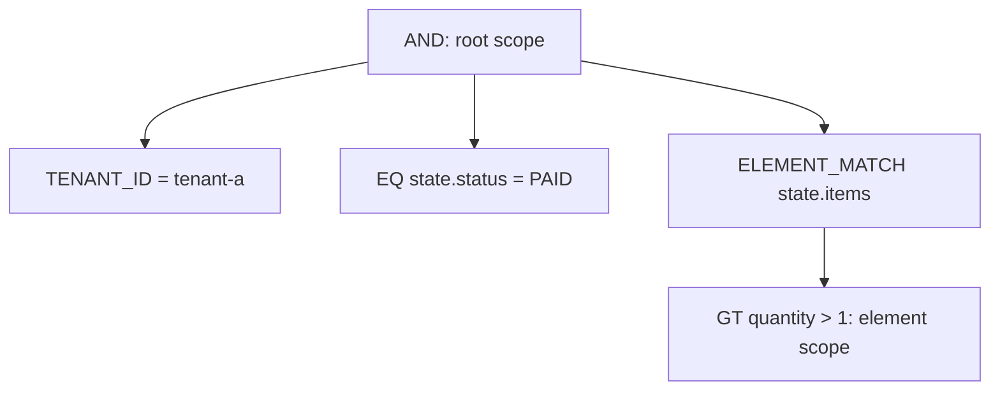

# Filter Expressions

`FilterExpression` is the current filter contract. JSON uses `op` to discriminate filter types; nested filters must use `op` too. A logical field is a dot-separated path: the first segment must be a named segment, and later segments can be named segments or decimal array indexes. A named segment can have an `@` prefix; its name starts with an ASCII letter or `_`, followed by ASCII letters, digits, `_`, or `-`.

## FilterExpression Structure

Every filter is an object. Field filters use `field`, values use `value`, `values`, or range bounds; logical filters use non-empty `operands`.

```json
{
  "op": "AND",
  "operands": [
    { "op": "EQ", "field": "state.status", "value": "PAID" },
    { "op": "GTE", "field": "state.total", "value": 100 }
  ]
}
```

HTTP JSON values for `EQ` and `NE` must be scalars; the canonical shapes of the individual filters define the other scalar restrictions for ranges and collections. Empty `AND`, `OR`, and `NOR` are invalid.

## Logical and Constant Operators

| Operator | JSON shape | Kotlin DSL |
| --- | --- | --- |
| `MATCH_ALL` / `MATCH_NONE` | `{ "op": "MATCH_ALL" }` | `matchAll()` / `matchNone()` |
| `AND` / `OR` / `NOR` | `{ "op": "AND", "operands": [ ... ] }` | `and { ... }` / `or { ... }` / `nor { ... }` |

Sibling expressions in one `filterExpression { ... }` block form an implicit `AND`; use explicit `and`, `or`, or `nor` when the composition must change.

`AND` requires every operand to match; `OR` requires at least one operand to match; `NOR` requires none of the operands to match. `MATCH_ALL` and `MATCH_NONE` represent all and no results in the current query scope. Filters are normalized before execution: for example, `MATCH_ALL` is an identity for `AND`, while `MATCH_NONE` absorbs an `AND`; the corresponding identity and absorbing rules also apply to `OR` and `NOR`.

## Identity and Tenant Operators

| Operator | JSON shape | Kotlin DSL |
| --- | --- | --- |
| `ID` / `IDS` | `{ "op": "ID", "value": "..." }` / `{ "op": "IDS", "values": ["..."] }` | `id("...")` / `ids("...")` |
| `AGGREGATE_ID` / `AGGREGATE_IDS` | `{ "op": "AGGREGATE_ID", "value": "..." }` | `aggregateId("...")` / `aggregateIds("...")` |
| `TENANT_ID` / `OWNER_ID` / `SPACE_ID` | `{ "op": "TENANT_ID", "value": "..." }` | `tenantId("...")` / `ownerId("...")` / `spaceId("...")` |

Use these dedicated operators for system identities, tenant, owner, and space. Do not hand-write apparently equivalent field paths to bypass their semantics.

`ID`/`IDS` filter by storage-record identity, while `AGGREGATE_ID`/`AGGREGATE_IDS` filter by aggregate identity. In Snapshot queries both usually address the aggregate document identity; in EventStream queries, `ID` addresses the event record and `AGGREGATE_ID` addresses its owning aggregate. `IDS` and `AGGREGATE_IDS` require non-empty `values`; if the application collection can be empty, choose `MATCH_NONE` or `MATCH_ALL` explicitly before constructing the filter.

## Comparison and String Operators

| Operator | JSON shape | Kotlin DSL |
| --- | --- | --- |
| `EQ` / `NE` | `{ "op": "EQ", "field": "state.status", "value": "PAID" }` | `"status" eq "PAID"` / `"status" ne "CANCELLED"` |
| `GT` / `GTE` / `LT` / `LTE` | `{ "op": "GTE", "field": "state.total", "value": 100 }` | `"total" gte 100` |
| `CONTAINS` / `STARTS_WITH` / `ENDS_WITH` | `{ "op": "CONTAINS", "field": "state.note", "value": "vip", "stringComparison": "CASE_INSENSITIVE" }` | `"note".containsText("vip", StringComparison.CASE_INSENSITIVE)` |
| `IS_EMPTY_STRING` / `IS_NOT_EMPTY_STRING` | `{ "op": "IS_EMPTY_STRING", "field": "state.note" }` | `"note".isEmptyString()` / `"note".isNotEmptyString()` |

String comparison defaults to `CASE_SENSITIVE`. Comparison and string capabilities depend on the backend and the Schema it publishes.
The operand-free empty-string operators apply only to single-value string fields with exact-match capability. `IS_EMPTY_STRING` matches exactly `""`; `IS_NOT_EMPTY_STRING` requires the field to exist, be non-null, and differ from `""`. Whitespace-only strings are not empty.

`CONTAINS`, `STARTS_WITH`, and `ENDS_WITH` are literal matches and do not use a full-text analyzer: MongoDB uses escaped regular expressions, while Elasticsearch uses wildcard/prefix queries. `CASE_INSENSITIVE` changes the backend query option and can be more expensive; when the HTTP guard disables expensive operators, some forms of these operators are rejected.

## Collection and Presence Operators

| Operator | JSON shape | Kotlin DSL |
| --- | --- | --- |
| `IN` / `NOT_IN` | `{ "op": "IN", "field": "state.status", "values": ["PAID", "SHIPPED"] }` | `"status" isIn listOf("PAID", "SHIPPED")` |
| `BETWEEN` | `{ "op": "BETWEEN", "field": "state.total", "lowerBound": 100, "upperBound": 200 }` | `"total".between(100, 200)` |
| `CONTAINS_ALL` | `{ "op": "CONTAINS_ALL", "field": "state.tags", "values": ["vip", "new"] }` | `"tags" containsAll listOf("vip", "new")` |
| `IS_EMPTY` | `{ "op": "IS_EMPTY", "field": "state.items" }` | `"items".isEmptyCollection()` |
| `IS_NULL` / `IS_NOT_NULL` | `{ "op": "IS_NULL", "field": "state.note" }` | `"note".isNull()` / `"note".isNotNull()` |
| `EXISTS` / `NOT_EXISTS` | `{ "op": "EXISTS", "field": "state.note" }` | `"note".exists()` / `"note".notExists()` |

`GT`, `GTE`, `LT`, `LTE`, and both `BETWEEN` bounds require comparable values and reject `null`. `BETWEEN` includes both its lower and upper bounds; relative-time filters generally normalize to an exclusive upper bound. `IN`, `NOT_IN`, and `CONTAINS_ALL` require non-empty `values` that contain no `null`. To test null, presence, or an empty collection, use the dedicated operand-free `IS_NULL`, `IS_NOT_NULL`, `EXISTS`, `NOT_EXISTS`, or `IS_EMPTY` operator.

In `FilterDsl`, `"field" eq null` and `"field" ne null` directly construct `IS_NULL` and `IS_NOT_NULL`. These operators retain the backend's native null, missing-field, and presence semantics:

| Operator | MongoDB compilation | Elasticsearch compilation |
| --- | --- | --- |
| `IS_NULL` | `field = null` | `must_not exists` |
| `IS_NOT_NULL` | `field != null` | `exists` |
| `EXISTS` | `exists(field)` | `exists` |
| `NOT_EXISTS` | `exists(field, false)` | `must_not exists` |
| `IS_EMPTY` | `size(field, 0)` | `must_not exists` |

In MongoDB, `IS_NULL` uses `field = null` and matches null or missing fields; `IS_NOT_NULL` uses `field != null` and matches existing, non-null fields; `EXISTS` includes fields whose value is null; `NOT_EXISTS` matches only missing fields; and `IS_EMPTY` uses `$size: 0`, which matches only an actual empty array. See [MongoDB's null and missing-field semantics](https://www.mongodb.com/docs/manual/tutorial/query-for-null-fields/) and [$size](https://www.mongodb.com/docs/manual/reference/operator/query/size/).

Consequently, Elasticsearch gives `IS_NULL` and `NOT_EXISTS` the same result, and likewise gives `IS_NOT_NULL` and `EXISTS` the same result. Without special mapping such as `null_value`, `null` and empty arrays produce no searchable indexed value there, so `IS_EMPTY` can also match missing or null fields. See the [Elasticsearch exists query](https://www.elastic.co/docs/reference/query-languages/query-dsl/query-dsl-exists-query). Special mappings or ignored values can change the result of `exists`.

## Array Element Matching

`ELEMENT_MATCH` requires one array element to satisfy its `predicate`. Predicate fields are rooted at the element, not at the complete array path:

```json
{
  "op": "ELEMENT_MATCH",
  "field": "state.items",
  "predicate": { "op": "GT", "field": "quantity", "value": 1 }
}
```

```kotlin
"items".elementMatch {
    "quantity" gt 1
}
```

An element predicate cannot contain the root-only `ID`, `IDS`, `AGGREGATE_ID`, `AGGREGATE_IDS`, `TENANT_ID`, `OWNER_ID`, `SPACE_ID`, `DELETION`, or `SEARCH`, even when nested in `AND`, `OR`, `NOR`, or another `ELEMENT_MATCH`.

MongoDB compiles `ELEMENT_MATCH` to `$elemMatch`; Elasticsearch compiles it to a `nested` query, so the corresponding Elasticsearch field must use a `nested` mapping. Whether an element scope is available is determined by the Query Schema's `ELEMENT_SCOPE` capability; an ordinary object array cannot be assumed to behave like a nested array.

## Deletion Markers and Full-text Search

| Operator | JSON shape | Kotlin DSL |
| --- | --- | --- |
| `DELETION` | `{ "op": "DELETION", "state": "ACTIVE" }` | `deletion(DeletionState.ACTIVE)` |
| `SEARCH` | `{ "op": "SEARCH", "query": "wireless", "fields": ["state.note"], "mode": "TERMS" }` | `search("wireless", "note")` |

Use `DELETION` for deletion state instead of emulating it with a field path. Snapshot queries append `DELETION = ACTIVE` by default; event-stream queries retain the full history and do not append that guard.

The `DELETION` state can also be `DELETED` or `ALL`, to select only deleted data or both deleted and active data. In Snapshot queries, an explicit deletion condition overrides the default `ACTIVE` scope only when it is at the root or within the root `AND` conjunction tree; a deletion condition inside `OR` or `NOR` does not remove the default scope.

### SearchFilter

`SearchFilter` represents full-text search, not a literal string `CONTAINS` match. The query is processed by the backend's full-text index and analyzer, so matching, analysis, and result ordering depend on the backend configuration.

| Property | Description |
| --- | --- |
| `query` | Search text; it cannot be empty or blank. |
| `fields` | Optional set of logical fields. When empty, the backend's default full-text fields are used; when present, the search requests those fields, subject to Schema validation. |
| `mode` | `TERMS` or `PHRASE`; defaults to `TERMS`. |

Construct it directly or with the DSL:

```kotlin
import me.ahoo.wow.api.query.QueryField
import me.ahoo.wow.api.query.SearchFilter
import me.ahoo.wow.api.query.SearchMode
import me.ahoo.wow.query.dsl.filterExpression

SearchFilter("wireless")

SearchFilter(
    query = "event sourcing",
    fields = setOf(QueryField("state.description")),
    mode = SearchMode.PHRASE,
)

filterExpression {
    search("wireless", "state.title", "state.description")
    search("event sourcing", SearchMode.PHRASE, "state.description")
}
```

The corresponding JSON is:

```json
{
  "op": "SEARCH",
  "query": "event sourcing",
  "fields": ["state.description"],
  "mode": "PHRASE"
}
```

`TERMS` is ordinary full-text search over analyzed terms; it does not require the original string to occur as one contiguous value. `event sourcing` can participate in matching as two terms. `PHRASE` is phrase search: analyzed terms must match in order and position, but the result still depends on the analyzer and is not raw-string equality.

Before backend compilation, Query Schema resolves `fields`. When every field resolves exactly, the field scope is preserved, with a rewrite to physical backend paths when necessary. If fields cannot all resolve exactly but the model supports the requested full-text capability, compatible validation clears `fields`, falls back to the backend's default scope, and marks the result `COMPATIBLE`. This can broaden the search scope; strict validation accepts only `EXACT` and rejects that request.

#### Backend implementation

- **MongoDB**: Compiles to MongoDB `$text`. `TERMS` uses the query text directly; `PHRASE` wraps it in double quotes, so the query text itself cannot contain double quotes. The collection must have a text index, whose definition determines the searchable fields. The current MongoDB converter does not compile `fields` into a per-field restriction; explicit fields normally fall back to an unscoped `$text` query as `COMPATIBLE` at the Schema layer, while strict validation rejects it.
- **Elasticsearch**: Compiles to `multi_match`. When `fields` is present and resolves exactly, they are mapped to Elasticsearch physical field paths; when it is empty, Elasticsearch's `index.query.default_field` determines the fields and Wow sets `lenient`. If explicit fields do not resolve exactly, compatible validation can clear them before compilation and search the default field scope instead. `TERMS` uses the default `best_fields` semantics: each field runs a `match` query and the best field supplies the relevance score. `PHRASE` sets `type: phrase`, equivalent to running `match_phrase` per field. Field support for term and phrase search is determined by the Elasticsearch mapping and Query Schema.

`SEARCH` is a root-only filter and cannot be used inside an `ELEMENT_MATCH` predicate. For literal substring, prefix, or suffix matching, use `CONTAINS`, `STARTS_WITH`, or `ENDS_WITH` instead.

## Relative-time Operators

| Operator | JSON shape | Kotlin DSL |
| --- | --- | --- |
| `TODAY` / `YESTERDAY` / `BEFORE_TODAY` / `TOMORROW` | `{ "op": "TODAY", "field": "state.createTime", "zoneId": "Asia/Shanghai", "timeUnit": "MILLISECONDS" }`; `BEFORE_TODAY` also has `time` | `"createTime".today()` / `.yesterday()` / `.beforeToday(LocalTime.NOON)` / `.tomorrow()` |
| `THIS_WEEK` / `NEXT_WEEK` / `LAST_WEEK` | `{ "op": "THIS_WEEK", "field": "state.createTime" }` | `"createTime".thisWeek()` / `.nextWeek()` / `.lastWeek()` |
| `THIS_MONTH` / `NEXT_MONTH` / `LAST_MONTH` | `{ "op": "THIS_MONTH", "field": "state.createTime" }` | `"createTime".thisMonth()` / `.nextMonth()` / `.lastMonth()` |
| `LAST_YEAR` / `THIS_YEAR` / `NEXT_YEAR` | `{ "op": "THIS_YEAR", "field": "state.createTime" }` | `"createTime".lastYear()` / `.thisYear()` / `.nextYear()` |
| `RECENT_DAYS` / `EARLIER_DAYS` | `{ "op": "RECENT_DAYS", "field": "state.createTime", "days": 7 }` | `"createTime".recentDays(7)` / `.earlierDays(7)` |

Optional `zoneId`, `datePattern`, and `timeUnit` apply to relative-time filters; `timeUnit` defaults to `MILLISECONDS` and is ignored when `datePattern` is configured. `RECENT_DAYS` and `EARLIER_DAYS` require `days >= 1`. Time zones, date formats, and physical time-field capabilities remain Schema and backend concerns.

Relative-time filters with a defined window are normalized before backend compilation into half-open `[start, end)` ranges; `BEFORE_TODAY` and `EARLIER_DAYS` use an exclusive upper bound:

- `TODAY`, `YESTERDAY`, and `TOMORROW` refer to calendar days in the selected time zone; `BEFORE_TODAY(time)` means before today's specified time.
- `THIS_WEEK`, `NEXT_WEEK`, and `LAST_WEEK` use Monday as the start of the week; month and year filters use calendar months and years.
- `RECENT_DAYS(7)` includes today and the six preceding calendar days; `EARLIER_DAYS(7)` means earlier than that seven-day window.
- When `zoneId` is omitted, the process default time zone is used. `datePattern` applies only to fields declared by Schema as formatted temporal fields, and must equal the Schema pattern; numeric epoch fields and native date fields reject `datePattern`. Numeric fields use the Schema-declared `timeUnit`; with `datePattern`, the value is formatted as a string and `timeUnit` is ignored.

## JSON and Kotlin DSL Side by Side

This snapshot query limits the same logical `AND` by tenant, status, and an item quantity:

```json
{
  "op": "AND",
  "operands": [
    { "op": "TENANT_ID", "value": "tenant-a" },
    { "op": "EQ", "field": "state.status", "value": "PAID" },
    {
      "op": "ELEMENT_MATCH",
      "field": "state.items",
      "predicate": { "op": "GT", "field": "quantity", "value": 1 }
    }
  ]
}
```

```kotlin
import me.ahoo.wow.query.dsl.filterExpression
import me.ahoo.wow.query.snapshot.pathState

val filter = filterExpression {
    tenantId("tenant-a")
    pathState {
        "status" eq "PAID"
        "items".elementMatch {
            "quantity" gt 1
        }
    }
}
```

`pathState` expands its inner fields to `state.*`, while `items.elementMatch` creates an independent single-element scope, so `quantity` is not expanded to `state.items.quantity`. Multiple expressions in `path { ... }` likewise form one implicit `AND`.



## Field Path Rules

`field` is a logical path, not an arbitrary backend physical field name. The root depends on the query model: snapshot business fields are under `state`; event-stream root fields and expanded event fields are different, and event payload is under `body.body`. Do not copy snapshot `state.*` paths into event-stream queries or infer logical fields from physical mappings.

`path` provides lexical path scope only: `"state".path { "status" eq "PAID" }` produces `state.status`; a path that already starts with the current prefix is unchanged. `elementMatch` instead creates an independent element scope whose predicate fields are relative to that element.

## Security and Compatibility Boundaries

The query-model Schema resolves logical fields into backend-proven capabilities; see the [Schema section in the query overview](./query-model-schema.md). MongoDB, Elasticsearch, and custom backends can support different comparison, presence, full-text, or time semantics; the shared operator list does not promise cross-backend equivalence.

HTTP requests with a WebFlux `ServerRequest` context pass through `HttpQueryGuardFilter`. When `wow.webflux.query.allow-expensive-operators=false`, it rejects `NE`, `NOT_IN`, `NOR`, `IS_NULL`, `IS_NOT_NULL`, `NOT_EXISTS`, `IS_EMPTY`, `IS_NOT_EMPTY_STRING`, `CONTAINS`, `ENDS_WITH`, and `STARTS_WITH` when empty or case-insensitive; the HTTP guard also caps filter nodes and values. Its compatibility default is not capacity evidence; see [infrastructure configuration](../../reference/config/infrastructure). In-process queries do not gain or lose backend capabilities because of this HTTP-only protection.

The canonical V9 JVM API is `FilterExpression` and `FilterDsl`. V9.x temporarily retains deprecated `Condition`, `Operator`, `ConditionDsl`, legacy query constructors, and count client overloads, all normalized to `FilterExpression` before execution; these compatibility APIs are scheduled for removal in 10.0.0. The WebFlux REST boundary accepts the V8 `condition` property for list/paged/single requests and the bare `operator` shape for count requests during the same window. Canonical `filter`, OpenAPI, and outbound JSON still use only `op`. A request cannot mix `filter` with `condition` or `op` with `operator`.
