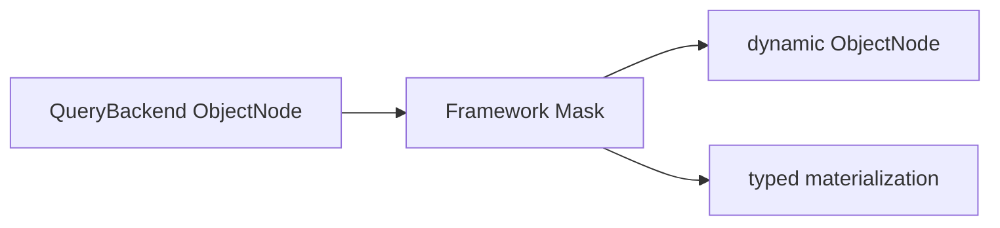

# Field Masking

## Scope and Execution Order

The Gateway runs `SchemaMasker` after receiving Backend nodes and before typed materialization. Ordinary request Filters cannot replace or bypass this fixed stage:



Snapshot and EventStream typed/dynamic single, list, paged, and cursor results use this path, as do state-only/aggregate-state loads through the Snapshot Gateway. Masking only changes the current response, not storage, domain objects, or general Jackson serialization. Count and aggregate rows do not undergo result masking.

## Declaring Sensitive Fields

Annotate the domain field with `@Sensitive`. Kotlin properties normally use a field use-site:

```kotlin
import me.ahoo.wow.api.query.annotation.Mask
import me.ahoo.wow.api.query.annotation.Sensitive
import me.ahoo.wow.api.query.annotation.SensitivityLevel

data class AccountState(
    @field:Sensitive(SensitivityLevel.CONFIDENTIAL)
    val password: String,
    @field:Sensitive(SensitivityLevel.DISPLAY, mask = Mask(keepPrefix = 3, keepSuffix = 4))
    val phone: String?,
)
```

Sensitivity is declared only on the domain field. A declaration file or a string path cannot declare it, because renaming the field would silently drop the protection.

On a property, `@Sensitive` supports only JVM `String`/`String?` properties, or properties of a sensitive value type (below). Enum, UUID, and other JVM types fail closed during Schema construction even when their serialized JSON wire shape is a String, preventing typed-result rematerialization failures.

### Sensitive Value Types

When one value appears in several models — a phone number in the state and in the events that change it — declare its sensitivity once, on its type, so every model protects it the same way:

```kotlin
@JvmInline
@Sensitive(SensitivityLevel.DISPLAY, mask = Mask(keepPrefix = 3, keepSuffix = 4))
value class PhoneNumber(val value: String)

data class ContactState(val phone: PhoneNumber, val backups: List<PhoneNumber>)
data class ContactChanged(val phone: PhoneNumber)
```

- Every property declared with the type, or with a collection of it, inherits its level and mask, in states and event payloads alike.
- Only a type that serializes as a JSON string can carry `@Sensitive`: a Kotlin value class over a `String`, or a type whose `@JsonValue` accessor returns a `String`. `@Sensitive` on any other class fails the Schema build.
- A property may repeat the type's level or tighten it (`DISPLAY` to `CONFIDENTIAL`, with its own mask), never loosen it: loosening fails the Schema build.
- Sensitivity is never linked by path: there is no way to say in a declaration file that two paths hold one value. A model without a value type annotates each field, in the state and in the events.
- When the EventStream schema is built, Wow compares its event payload fields with the aggregate's state. A field that has the same leaf name and value type as a field of the other model, but is protected in only one of them, logs one warning naming both paths. It never fails startup.

### Sensitivity Levels

Both levels mask the value in every result. They differ in what a query may do with the raw value:

| Level | Results | Filters, paged sort | Group, `ANY`, field metric, arithmetic reference, cursor sort |
|---|---|---|---|
| `DISPLAY` | Masked | Allowed; the capability descriptor reports `"comparable": true` | Rejected |
| `CONFIDENTIAL` | Masked | Rejected (`PROTECTED_COMPARISON`) | Rejected |

- A comparable `DISPLAY` field can be approached step by step with range conditions. When that is not acceptable, use `CONFIDENTIAL`, or set `wow.query.sensitivity.display-comparable=false`: `DISPLAY` fields then reject filters and paged sorts like `CONFIDENTIAL` ones, and the descriptor reports `"comparable": false` with no operators.
- Model-wide `SEARCH` (without `fields`) matches every searchable field, and storage decides which fields those are. A model with any field that must not be compared therefore rejects model-wide search (`MODEL_SEARCH_UNSUPPORTED`); search named fields instead.
- The descriptor never lists enum values of a protected field.

### Masks

- `Mask()`, the default, replaces every Unicode code point with one `*`; for example, `A中😀` becomes `***`.
- `Mask(keepPrefix, keepSuffix)` preserves leading and trailing code points and masks the middle. A value too short to preserve both sides is fully masked; for example, `13800138000` becomes `138****8000`, while `1234567` becomes `*******`.
- Missing values and `null` remain unchanged, and an empty string remains empty. Nested objects, collections, and nested string arrays are traversed recursively by Schema path.

A custom `MaskStrategy` replaces the built-in mask. It must be a Kotlin `object` or a public class with a no-argument constructor, and `keepPrefix`/`keepSuffix` must stay `0`:

```kotlin
import me.ahoo.wow.api.query.annotation.MaskStrategy

object RedactStrategy : MaskStrategy {
    override fun mask(value: String): String = if (value.isEmpty()) value else "[redacted]"
}

data class NoteState(
    @field:Sensitive(SensitivityLevel.DISPLAY, mask = Mask(strategy = RedactStrategy::class))
    val note: String,
)
```

A rule that retains character positions should count Unicode code points like the built-in mask. To reuse one declaration, put `@Sensitive` on an annotation class and annotate fields with that annotation.

## Query Schema Contract

At runtime, the default `JsonQueryModelSource` reports each serialized member with its annotations, and `InferredQuerySchemaSource` applies the effective `@Sensitive` annotations it finds on fields, Jackson-visible non-public getters, inherited parent Kotlin properties, and interface getters. Rules flow through Query Schema merging and backend adapters, but the public capability descriptor exposes them only as a field's `sensitivity` (its level and whether it is comparable). Strategy types, mask parameters, and executable functions remain in memory.

Each Gateway subscription uses one Schema version: preparation, admission and response masking read it, and the `AdmittedQuery` carries it to the Backend. Mask traversal definitions are built when the Schema version is published; subscriptions consume that immutable version. Revalidation publishing a new version does not change an in-flight subscription. Schema acquisition failure never skips masking to return raw data. No Mask declarations means no response JSON traversal.

## Behavior Matrix

| Query or result | Behavior |
|---|---|
| Snapshot/EventStream typed `single`, `list`, `paged` | Masked before typed materialization |
| Snapshot/EventStream dynamic `single`, `list`, `paged` | Returns masked `ObjectNode` values |
| Snapshot/EventStream typed/dynamic `cursor` | Masks `CursorPage.list` and preserves `nextCursor` unchanged |
| Snapshot state-only / aggregate-state load | Reuses the Snapshot Gateway and is masked |
| State routes (load by id/version/time, tracing) | Masked only under `wow.webflux.state.point-read-admission=true`; see [State Point Reads](../data-access.md#state-point-reads) |
| Ordinary filter, full-text search, sort | May reference a comparable `DISPLAY` field; the backend matches or sorts raw values, while the response remains masked. A `CONFIDENTIAL` field, or a `DISPLAY` field with comparison turned off, is rejected before Backend execution |
| `CursorQuery` effective sort | Must have a proven CURSOR_SORT binding, be single-valued, carry no masking rule, and not alias a masked projection or physical binding; otherwise it is rejected before Backend execution so raw sort values or multi-value arrays cannot enter `nextCursor` |
| Data-query `count` | Count is unchanged; the Gateway still loads Schema for admission, but the masking layer reads no field values |
| Aggregation group, field metric, numeric expression | Public validation rejects protected fields and source aliases before Backend execution |
| Schema required by aggregation is unavailable | Fails closed; even a count-only aggregation does not fall back to execution |

## Fail-Closed Boundaries

| Condition | Result |
|---|---|
| An annotated member is not JVM String, a covered domain is not a string/string array, or it contains UNKNOWN | Schema construction fails |
| One member has multiple different effective `@Sensitive` annotations, or Schema branches have conflicting rules | Schema conflict |
| A custom Strategy cannot be constructed, or it is combined with `keepPrefix`/`keepSuffix` | Schema construction fails with the original error preserved |
| A response value covered by a rule is not a String/String array, Strategy execution throws, or a custom `MaskStrategy` returns `null` | The current result Publisher fails instead of returning the raw value |
| An EventStream event item contains a non-null payload but its `bodyType` is missing, non-string, or unknown | The current result Publisher fails |
| An EventStream `body` is not an array, or the array contains a non-object event item | The current result Publisher fails |

Masking safely skips an Event projection with no top-level `body`, or with that event array projected as `null`. When present, the top-level `body` must be an array and every event item must be an object. Inside a valid event item, a missing or null payload property `body` means metadata-only or payload-excluded output: there is no sensitive payload to mask, so `bodyType` is not required. A non-null payload still requires a known string `bodyType`; missing, non-string, or unknown types fail closed before masking.

An explicitly declared unmasked union branch, such as INTEGER, retains its value while the string branch is masked. Named Map properties override additionalProperties. Array Item layers and native aliases follow the shared Schema without widening protection to unrelated siblings.

## Trusted Raw-Value Boundaries

- Direct Factory calls return a binding; trusted raw access is `factory.create(namedAggregate).backend` and bypasses the entire Gateway, including query filters, error observation, and masking. A direct caller obtains an `AdmittedQuery` via `QueryAdmission.Trusted` and owns scope, policies and masking itself.
- A custom Factory pairs its Backend with `QueryModelSchemaProvider` in `QueryBackendBinding`; custom Backends never implement Providers. An unavailable Provider fails closed before Context and Backend subscription instead of skipping masking and returning raw values.

Both are suitable only for storage extensions, Backend contract tests, and trusted diagnostics, not ordinary application queries.

## Migration and Verification

`@Mask`, `@KeepMask`, `@Masking` and the old `MaskStrategy<A>` were removed; code that still uses them no longer compiles. Replace them as follows:

| Before | After |
|---|---|
| `@field:Mask` | `@field:Sensitive(SensitivityLevel.DISPLAY)` |
| `@field:KeepMask(prefix = 3, suffix = 4)` | `@field:Sensitive(SensitivityLevel.DISPLAY, mask = Mask(keepPrefix = 3, keepSuffix = 4))` |
| Custom annotation with `@Masking(strategy)` | `mask = Mask(strategy = MyStrategy::class)`, with `MyStrategy : MaskStrategy` masking one value |

`DISPLAY` keeps the behavior of the removed annotations. Choose `CONFIDENTIAL` for values that must never be compared. When migrating from V8 Registry/filter masking, first follow [V9 Query Migration](./v9-query-migration.md) to remove old types and move rules onto domain fields, then complete these checks:

1. Use the [Query Model Schema](./query-model-schema.md) endpoint to confirm the target field reports `sensitivity`, without exposing a strategy or parameters.
2. Verify Snapshot/EventStream typed, dynamic, and state-only/aggregate-state load responses separately.
3. Verify ordinary filter/search/sort and data-query `count` remain available for `DISPLAY` fields and are rejected for `CONFIDENTIAL` fields, while masked cursor sort, group, field metric, numeric expression, and Schema-unavailable aggregation fail closed.
4. Verify direct-Factory raw values only in trusted tests, and confirm that stored documents and general Jackson serialization were not rewritten.

See [Query Gateway](./query-gateway.md) for the complete execution position, filter ordering, and bypass conditions.
