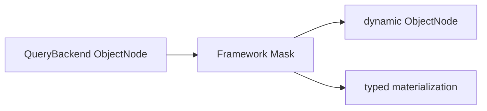

# Field Masking

## Scope and Execution Order

The Gateway runs `SchemaMasker` after receiving Backend nodes and before typed materialization. Ordinary request Filters cannot replace or bypass this fixed stage:



Snapshot and EventStream typed/dynamic single, list, paged, and cursor results use this path, as do state-only/aggregate-state loads through the Snapshot Gateway. Masking only changes the current response, not storage, domain objects, or general Jackson serialization. Count and aggregate rows do not undergo result masking.

## Built-in Annotations

Kotlin properties normally use a field use-site:

```kotlin
import me.ahoo.wow.api.query.mask.KeepMask
import me.ahoo.wow.api.query.mask.Mask

data class AccountState(
    @field:Mask
    val password: String,
    @field:KeepMask(prefix = 3, suffix = 4)
    val phone: String?,
)
```

Mask annotations support only JVM `String`/`String?` properties. Enum, UUID, and other JVM types fail closed during Schema construction even when their serialized JSON wire shape is a String, preventing typed-result rematerialization failures.

- `@Mask` replaces every Unicode code point with one `*`; for example, `A中😀` becomes `***`.
- `@KeepMask(prefix, suffix)` preserves leading and trailing code points and masks the middle. A value too short to preserve both sides is fully masked; for example, `13800138000` becomes `138****8000`, while `1234567` becomes `*******`.
- Missing values and `null` remain unchanged, and an empty string remains empty. Nested objects, collections, and nested string arrays are traversed recursively by Schema path.

## Custom Meta-Annotations

Declare a domain-specific rule with a runtime annotation carrying `@Masking(strategy)`. During Schema construction, the Strategy implements `MaskStrategy<A>.compile` and returns the reusable `CompiledMask`; KSP is not involved.

```kotlin
import me.ahoo.wow.api.query.mask.CompiledMask
import me.ahoo.wow.api.query.mask.MaskStrategy
import me.ahoo.wow.api.query.mask.Masking
import kotlin.annotation.AnnotationRetention.RUNTIME
import kotlin.annotation.AnnotationTarget.FIELD
import kotlin.annotation.AnnotationTarget.PROPERTY_GETTER

@Target(FIELD, PROPERTY_GETTER)
@Retention(RUNTIME)
@Masking(strategy = RedactStrategy::class)
annotation class Redact(val replacement: String = "[redacted]")

object RedactStrategy : MaskStrategy<Redact> {
    override fun compile(annotation: Redact): CompiledMask {
        require(annotation.replacement.isNotEmpty())
        return CompiledMask { value ->
            if (value.isEmpty()) value else annotation.replacement
        }
    }
}
```

A Strategy can be a Kotlin `object` or a public no-argument class. The example does not slice input by UTF-16 code unit and explicitly preserves empty strings. A rule that retains character positions should count Unicode code points like the built-in implementations.

## Query Schema Contract

At runtime, `JsonQuerySchemaSource` discovers effective annotations on fields, Jackson-visible non-public getters, inherited parent Kotlin properties, and interface getters. Rules flow through Query Schema merging and backend adapters, but the recursive value nodes in public `QueryModelSchemaMetadata` expose masking information only as `masked: Boolean`. Strategy types, annotation parameters, compiled rules, and executable functions remain in memory.

Each Gateway subscription captures one Schema shared by preparation, public validation, Backend compilation, and response masking. Mask traversal definitions are built when the Schema generation is published; subscriptions consume that immutable generation. Refresh does not change an in-flight subscription. Schema acquisition failure never skips masking to return raw data. No Mask declarations means no response JSON traversal.

## Behavior Matrix

| Query or result | Behavior |
|---|---|
| Snapshot/EventStream typed `single`, `list`, `paged` | Masked before typed materialization |
| Snapshot/EventStream dynamic `single`, `list`, `paged` | Returns masked `ObjectNode` values |
| Snapshot/EventStream typed/dynamic `cursor` | Masks `CursorPage.list` and preserves `nextCursor` unchanged |
| Snapshot state-only / aggregate-state load | Reuses the Snapshot Gateway and is masked |
| Ordinary filter, full-text search, sort | May reference a masked field; the backend matches or sorts raw values, while the response remains masked |
| `CursorQuery` effective sort | Must have a proven CURSOR_SORT binding, be single-valued, carry no masking rule, and not alias a masked projection or physical binding; otherwise it is rejected before Backend execution so raw sort values or multi-value arrays cannot enter `nextCursor` |
| Data-query `count` | Count is unchanged; the Gateway still loads Schema for admission, but the masking layer reads no field values |
| Aggregation group, field metric, numeric expression | Public validation rejects protected fields and source aliases before Backend execution |
| Schema required by aggregation is unavailable | Fails closed; even a count-only aggregation does not fall back to execution |

## Fail-Closed Boundaries

| Condition | Result |
|---|---|
| An annotated member is not JVM String, a covered domain is not a string/string array, or it contains UNKNOWN | Schema construction fails |
| One member has multiple effective mask annotations, or Schema branches have conflicting rules | Schema conflict |
| A Strategy cannot be constructed, or `compile` throws | Schema construction fails with the original error preserved |
| A response value covered by a rule is not a String/String array, Strategy execution throws, or a custom `CompiledMask` returns `null` | The current result Publisher fails instead of returning the raw value |
| An EventStream event item contains a non-null payload but its `bodyType` is missing, non-string, or unknown | The current result Publisher fails |
| An EventStream `body` is not an array, or the array contains a non-object event item | The current result Publisher fails |

Masking safely skips an Event projection with no top-level `body`, or with that event array projected as `null`. When present, the top-level `body` must be an array and every event item must be an object. Inside a valid event item, a missing or null payload property `body` means metadata-only or payload-excluded output: there is no sensitive payload to mask, so `bodyType` is not required. A non-null payload still requires a known string `bodyType`; missing, non-string, or unknown types fail closed before masking.

An explicitly declared unmasked union branch, such as INTEGER, retains its value while the string branch is masked. Named Map properties override additionalProperties. Array Item layers and native aliases follow the shared Schema without widening protection to unrelated siblings.

## Trusted Raw-Value Boundaries

- Direct Factory calls return a binding; trusted raw access is `factory.create(namedAggregate).backend` and bypasses the entire Gateway, including query filters, error observation, and masking.
- A custom Factory pairs its Backend with `QueryModelSchemaProvider` in `QueryBackendBinding`; custom Backends never implement Providers. An unavailable Provider fails closed before Context and Backend subscription instead of skipping masking and returning raw values.

Both are suitable only for storage extensions, Backend contract tests, and trusted diagnostics, not ordinary application queries.

## Migration and Verification

When migrating from V8 Registry/filter masking, first follow [V9 Query Migration](./v9-query-migration.md) to remove old types and move rules onto domain fields, then complete these checks:

1. Use the [Query Model Schema](./query-model-schema.md) endpoint to confirm the target field adds only `masked: true`, without exposing a strategy or parameters.
2. Verify Snapshot/EventStream typed, dynamic, and state-only/aggregate-state load responses separately.
3. Verify ordinary filter/search/sort and data-query `count` remain available, while masked cursor sort, group, field metric, numeric expression, and Schema-unavailable aggregation fail closed.
4. Verify direct-Factory raw values only in trusted tests, and confirm that stored documents and general Jackson serialization were not rewritten.

See [Query Gateway](./query-gateway.md) for the complete execution position, filter ordering, and bypass conditions.
