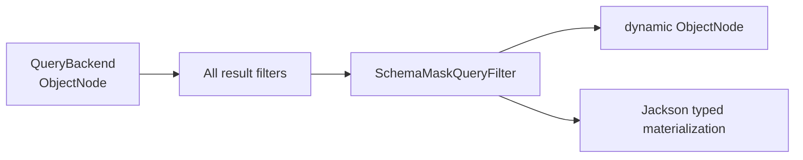

# Field Masking

## Scope and Execution Order

Field masking is implemented by the framework-owned `SchemaMaskQueryFilter` in the managed `QueryGateway` response chain and requires the selected Backend to provide `QueryModelSchemaProvider`. The framework always installs this filter as the outermost filter; its result phase is fixed after every generic result filter and before Jackson materializes a typed result:



This chain covers Snapshot and EventStream typed/dynamic `single`, `list`, and `paged` results, plus state-only/aggregate-state results loaded through the Snapshot Gateway. Masking changes only the current response node. It does not rewrite stored documents, domain objects, or the application's general Jackson serialization contract. `count` and aggregation results also do not pass through result masking.

## Built-in Annotations

Kotlin properties normally use a field use-site:

```kotlin
import me.ahoo.wow.api.query.mask.KeepMask
import me.ahoo.wow.api.query.mask.Mask

data class AccountState(
    @field:Mask
    val password: String,
    @field:KeepMask(prefix = 3, suffix = 4)
    val phone: String?,
)
```

- `@Mask` replaces every Unicode code point with one `*`; for example, `A中😀` becomes `***`.
- `@KeepMask(prefix, suffix)` preserves leading and trailing code points and masks the middle. A value too short to preserve both sides is fully masked; for example, `13800138000` becomes `138****8000`, while `1234567` becomes `*******`.
- Missing values and `null` remain unchanged, and an empty string remains empty. Nested objects, collections, and nested string arrays are traversed recursively by Schema path.

## Custom Meta-Annotations

Declare a domain-specific rule with a runtime annotation carrying `@Masking(strategy)`. During Schema construction, the Strategy implements `MaskStrategy<A>.compile` and returns the reusable `CompiledMask`; KSP is not involved.

```kotlin
import me.ahoo.wow.api.query.mask.CompiledMask
import me.ahoo.wow.api.query.mask.MaskStrategy
import me.ahoo.wow.api.query.mask.Masking
import kotlin.annotation.AnnotationRetention.RUNTIME
import kotlin.annotation.AnnotationTarget.FIELD
import kotlin.annotation.AnnotationTarget.PROPERTY_GETTER

@Target(FIELD, PROPERTY_GETTER)
@Retention(RUNTIME)
@Masking(strategy = RedactStrategy::class)
annotation class Redact(val replacement: String = "[redacted]")

object RedactStrategy : MaskStrategy<Redact> {
    override fun compile(annotation: Redact): CompiledMask {
        require(annotation.replacement.isNotEmpty())
        return CompiledMask { value ->
            if (value.isEmpty()) value else annotation.replacement
        }
    }
}
```

A Strategy can be a Kotlin `object` or a public no-argument class. The example does not slice input by UTF-16 code unit and explicitly preserves empty strings. A rule that retains character positions should count Unicode code points like the built-in implementations.

## Query Schema Contract

At runtime, `JsonQuerySchemaSource` discovers effective annotations on fields and getters, including inherited parent Kotlin properties and interface getters. Rules flow through Query Schema merging and backend adapters, but public `QueryModelSchemaMetadata` exposes only field-level `masked: Boolean`. Strategy types, annotation parameters, compiled rules, and executable functions remain in memory.

For every result query, `SchemaMaskQueryFilter` reads the Provider's current Schema: the same Schema instance reuses its compiled Masker, while a refresh-published new instance recompiles it. A Schema-load failure is not cached, so a later subscription or `retry` can load again. When the root Schema has no `masked` field, result handling reuses an empty masking decision on an O(1) fast path: it creates no masker, does not walk JSON, and adds no per-result `map`.

## Behavior Matrix

| Query or result | Behavior |
|---|---|
| Snapshot/EventStream typed `single`, `list`, `paged` | Masked before typed materialization |
| Snapshot/EventStream dynamic `single`, `list`, `paged` | Returns masked `ObjectNode` values |
| Snapshot state-only / aggregate-state load | Reuses the Snapshot Gateway and is masked |
| Ordinary filter, full-text search, sort | May reference a masked field; the backend matches or sorts raw values, while the response remains masked |
| Data-query `count` | Count is unchanged; the masking layer neither loads Schema nor reads field values |
| Aggregation group, field metric, numeric expression | A masked-field reference resolves as `INCOMPATIBLE` and is rejected before Backend execution |
| Schema required by aggregation is unavailable | Fails closed; even a count-only aggregation does not fall back to execution |

## Fail-Closed Boundaries

| Condition | Result |
|---|---|
| A field or Schema alternative is not a String wire shape | Schema construction fails |
| One member has multiple effective mask annotations, or Schema branches have conflicting rules | Schema conflict |
| A Strategy cannot be constructed, or `compile` throws | Schema construction fails with the original error preserved |
| A response value is not a String/String array, Strategy execution throws, or a custom `CompiledMask` returns `null` | The current result Publisher fails instead of returning the raw value |
| An EventStream `body` array contains a missing or unknown `bodyType` | The current result Publisher fails |

Masking safely skips an Event projection with no `body`, or with the top-level `body` projected as `null`. Once `body` is present, it must be a valid event array. A non-array shape, invalid event entry, or missing/unknown `bodyType` fails closed.

## Trusted Raw-Value Boundaries

- Calling `SnapshotQueryBackendFactory` or `EventStreamQueryBackendFactory` directly bypasses the entire Gateway, including query filters, error observation, and masking, and returns raw Backend values.
- A custom Backend without `QueryModelSchemaProvider` still runs Gateway filters and error handling when wrapped by a Gateway, but only masking is skipped; field values retain their raw form.

Both are suitable only for storage extensions, Backend contract tests, and trusted diagnostics, not ordinary application queries.

## Migration and Verification

When migrating from V8 Registry/filter masking, first follow [V9 Query Migration](./v9-query-migration.md) to remove old types and move rules onto domain fields, then complete these checks:

1. Use the [Query Model Schema](./query-model-schema.md) endpoint to confirm the target field adds only `masked: true`, without exposing a strategy or parameters.
2. Verify Snapshot/EventStream typed, dynamic, and state-only/aggregate-state load responses separately.
3. Verify filter/search/sort and data-query `count` remain available, while group, field metric, numeric expression, and Schema-unavailable aggregation fail closed.
4. Verify direct-Factory raw values only in trusted tests, and confirm that stored documents and general Jackson serialization were not rewritten.

See [Query Gateway](./query-gateway.md) for the complete execution position, filter ordering, and bypass conditions.
