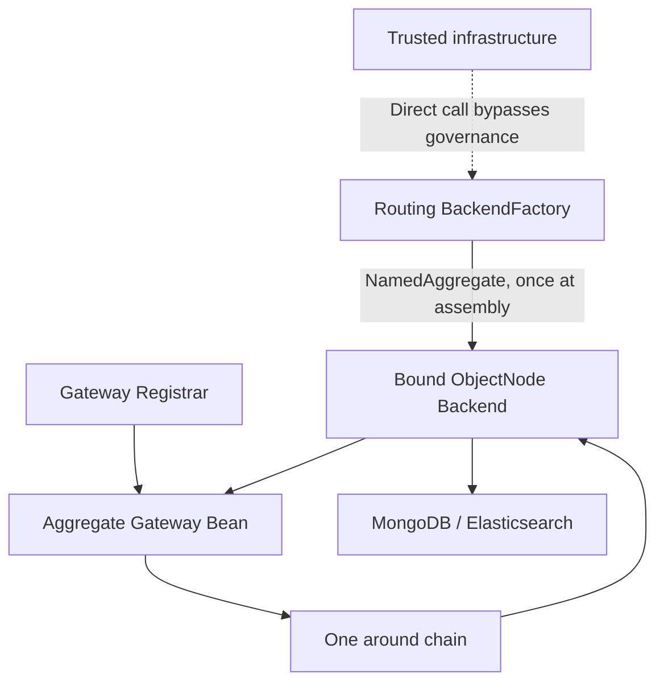

# Query Backend

## QueryBackend contract

`QueryBackend` is the aggregate-bound low-level contract. Its six execution methods accept only a `ResolvedQuery` prepared by the Gateway:

```kotlin
fun single(query: ResolvedQuery<ISingleQuery>): Mono<ObjectNode>
fun list(query: ResolvedQuery<IListQuery>): Flux<ObjectNode>
fun paged(query: ResolvedQuery<IPagedQuery>): Mono<PagedList<ObjectNode>>
fun cursor(query: ResolvedQuery<ICursorQuery>): Mono<CursorPage<ObjectNode>>
fun count(query: ResolvedQuery<FilterExpression>): Mono<Long>
fun aggregate(query: ResolvedQuery<AggregationQuery>): Flux<ObjectNode>
```

There are no compatibility overloads accepting raw queries. A Backend neither obtains nor resolves Schema and never chooses `QuerySchemaValidationMode`; it only compiles and executes `ResolvedQuery.query` with the non-null `ResolvedQuery.schema`. Schema-aware Projection, Sort, Filter, and Aggregation Compilers use `QueryFieldBinding.physicalField` as their only physical-path source; `projectionField` is already physical, and an accepted `COMPATIBLE` field without a binding retains its original path. Single, list, paged, cursor, and aggregate use `tools.jackson.databind.node.ObjectNode`; count returns `Long`, while cursor wraps nodes in `CursorPage<ObjectNode>`. `SnapshotQueryBackend` and `EventStreamQueryBackend` distinguish the data model. Typed materialization belongs to the Gateway, not the Backend; a custom Backend never implements or delegates `QueryModelSchemaProvider`.

## Node ownership constraints

Every subscription to a Backend publisher must create mutable `ObjectNode` instances owned exclusively by that subscription. Subscriptions created by `retry`, `repeat`, and concurrent callers each receive fresh nodes. A Backend must not cache or share nodes across subscriptions, publish cached nodes, or continue mutating a node asynchronously after emission.

Only standard JSON trees may cross the Backend boundary. MongoDB `Document`, Elasticsearch source `Map`, BSON values, `POJONode`, and arbitrary POJOs must be normalized or rejected inside the Backend instead of leaking into the Gateway.



## Injecting a typed SnapshotQueryGateway Bean

Spring can inject a snapshot Gateway by its state type:

```kotlin
@Component
class OrderReader(
    private val queryGateway: SnapshotQueryGateway<OrderState>,
) {
    fun find(query: PagedQuery): Mono<PagedList<MaterializedSnapshot<OrderState>>> =
        queryGateway.paged(query)
}
```

This is the in-process JVM entry. Requests and results traverse the same [Query Gateway](query-gateway.md) policy chain.

## Bean registration and naming

`SnapshotQueryGatewayRegistrar` registers `SnapshotQueryGateway<STATE>` with `ResolvableType`; its Bean name is `{contextAlias.}{aggregateName}.SnapshotQueryGateway`. `EventStreamQueryGatewayRegistrar` registers `EventStreamQueryGateway` as `{contextAlias.}{aggregateName}.EventStreamQueryGateway`.

When a same-name Gateway Bean exists, the Registrar retains it. A custom Bean owns the complete governance contract; it is not an alias for a Backend Factory.

## How a Gateway binds its Backend

When it creates a Gateway, the registrar calls `SnapshotQueryBackendFactory` or `EventStreamQueryBackendFactory` once with the current `NamedAggregate`. The Factory returns one `QueryBackendBinding`, and the registrar passes its `backend` and `schemaProvider` together to the Gateway. The routing Factory selects an aggregate-specific route or its default at that point. The Gateway then keeps the bound pair instead of selecting again for every request.

## Factories, caching, and storage routing

`SnapshotQueryBackendFactory` and `EventStreamQueryBackendFactory` return `QueryBackendBinding<Backend>`; their abstract base classes cache the complete binding by materialized aggregate. A custom Factory explicitly pairs its Backend and `QueryModelSchemaProvider`; routing forwards that pair atomically. MongoDB, Elasticsearch, or another configured implementation compiles the admitted `ResolvedQuery` into a physical query and normalizes results as `ObjectNode`.

A direct Factory call does not pass through the Gateway. Application code should use the Spring-registered aggregate Gateway; only low-level diagnostics, contract tests, and storage extensions should call the Factory directly.

## EventStreamQueryGateway Beans

Event-stream Gateways have no `STATE` generic. When multiple candidates exist, qualify by the exact Bean name instead of relying on generic disambiguation.

## Raw backend access

Direct Factory access is for trusted infrastructure extensions or cases that explicitly require raw backend semantics: `factory.create(namedAggregate).backend`. It bypasses Gateway request filters, ABAC, result filters, masking, and error observation; the caller must own those responsibilities.

## Cursor Execution and Tokens

Before validation, `QueryModelSchema.resolve(ICursorQuery)` appends the model-specific unique tie-breaker: Snapshot uses `aggregateId`, while EventStream uses the stream-record `id`. The Backend receives that sort inside `ResolvedQuery<ICursorQuery>` and neither appends nor resolves it again. MongoDB uses a keyset filter. Elasticsearch uses `search_after` without PIT. Both request `size + 1` to detect another page, perform no count or offset, and return no total. Traversal is forward-only and has no cross-request snapshot; concurrent writes can change what a later page observes.

The backend encodes effective sort values as an unpadded Base64URL continuation. The token is neither encrypted nor signed, carries no authorization, and should not be logged; the framework has no cursor encryption-key configuration. Callers should pass it back unchanged rather than parse or construct it.

Every effective sort must resolve exactly in Query Schema, be single-valued, carry no Mask rule, and not alias a masked projection or physical binding. Neither the requested nor resolved physical sort may be `_score`, `_doc`, or `_shard_doc`. Mask rules include those compiled from `@Mask`, `@KeepMask`, or a custom `@Masking` meta-annotation; unavailable Schema fails closed. An invalid token is rejected as `Invalid cursor.` without echoing its content.

## Schema uses the same route

Snapshot and EventStream Schema HTTP handlers both obtain `factory.create(namedAggregate).schemaProvider`. Because this unwraps the same routed binding used by the Registrar, Schema and query execution select the same storage route and Provider. An unavailable Provider fails explicitly instead of falling back to another backend.

WebFlux publishes `snapshot/schema`, `snapshot/schema/refresh`, `event/schema`, and `event/schema/refresh` routes. [WebFlux](../extensions/webflux.md) is authoritative for runtime routes, [OpenAPI](../open-api.md) for published HTTP/OpenAPI contracts, and [API Client](./query-api-client.md) for client boundaries. `wow-apiclient.query` still provides only Snapshot query interfaces and has no EventStream query interface.
