# Query Gateway

`SnapshotQueryGateway<S>` and `EventStreamQueryGateway` are application query entries. Spring resolves a `QueryBackendBinding` during aggregate Gateway registration and retains its Backend and Provider instead of routing each request again.

## Fixed execution order

Each subscription independently:

1. Obtains one Schema from the Provider.
2. Runs ordered `QueryFilter.prepare` stages; each emits one prepared logical Query.
3. Appends the request scope from Reactor Context.
4. Appends configured `QueryPolicy` access filters for Snapshot queries, after ordinary preparation.
5. Only the Gateway applies model defaults: Snapshot adds `DELETION = ACTIVE` unless explicitly overridden; EventStream adds no deletion predicate. It also appends the model's unique cursor sort field.
6. Validates the final public Query, then calls `backend.operation(query, schema)`.
7. Masks returned query nodes with the captured Schema, then optionally materializes typed results.
8. Notifies `QueryObserver` of completion, error, or cancellation.

```mermaid
flowchart LR
    Provider --> Prepare["QueryFilter.prepare"]
    Prepare --> Scope["Request scope"]
    Scope --> Policy["Snapshot ABAC policy"]
    Policy --> Validate["Defaults + public validation"]
    Validate --> Backend["Backend query + schema"]
    Backend --> Mask["Mask"]
    Mask --> Result["ObjectNode / typed result"]
    Result --> Observer["Terminal observer"]
```



Preparation, validation, Backend compilation, and Mask share that captured Schema. Schema failure or empty prepare completion fails before Backend execution. Retry/repeat starts a fresh subscription and obtains its Schema again. Count returns Long without result masking. Aggregation rejects protected grouping/metric/expression inputs before execution rather than attempting to conceal them in returned aggregate rows.

## Request preparation extension

`QueryContext<Q>` contains only `query`, `namedAggregate`, and `schema`. A Filter has no continuation, result object, or result-processing authority. It prepares a request and cannot wrap or re-execute the Backend:

```kotlin
@Component
class VisibleQueryFilter : SnapshotQueryFilter {
    override fun <Q : RewritableFilter<Q>> prepare(context: QueryContext<Q>): Mono<Q> =
        Mono.just(context.query.appendFilter(filter { "state.visible" eq true }))
}
```

`SnapshotQueryFilter` and `EventStreamQueryFilter` restrict the applicable model; a plain `QueryFilter` can apply to both. `@Order` controls preparation order. Conditions use logical fields and still undergo final Schema validation.

## Request scope and authorization

A WebFlux Handler uses `QueryRequestScope` to obtain tenant/owner/space scope, places it in Reactor Context, and invokes the Gateway. `HttpQueryGuard` applies HTTP cost and response limits outside the Gateway Filter stages.

A JVM caller can supply trusted scope explicitly:

```kotlin
queryGateway.dynamicList(query)
    .contextWrite { context ->
        context.withQueryScope(TenantIdFilter("tenant-1"))
    }
```

`withQueryScope` combines an existing scope. Authentication remains the application's responsibility; unverified request fields are not identity. Snapshot Gateway and its Spring registrar depend on `QueryPolicy`. `AbacQueryPolicy` implements this interface for tag-based access; other policies implement `QueryPolicy` directly. A policy only returns an access filter, which the gateway combines with AND at the fixed authorization stage. It cannot replace the query, execute the backend, or transform results. An empty publisher is a protocol error. EventStream does not automatically run Snapshot policies. See [Data Access Control](../data-access.md).

## Results and observation

The Backend returns independently owned ObjectNodes for each subscription. Framework masking runs before typed materialization, with no general result Filter stage. `QueryObserver` exposes terminal callbacks only and cannot replace a result or error. Ordinary observer failures are logged; they cannot retry the query or invoke the Backend again. The default implementation is `QueryLogObserver`.

Direct Backend access bypasses these stages; see [Query Backend](./query-backend.md), [Field Masking](./masking.md), and [Query Model Schema](./query-model-schema.md).
