# Query Gateway

`SnapshotQueryGateway<S>` and `EventStreamQueryGateway` are application query entries. Spring resolves the routed Backend and the `QuerySchemaCatalog` schema provider during aggregate Gateway registration and retains them instead of routing each request again. The Gateway also describes its model (`describe(entry)`) from that schema under its own `QueryEntryPolicy`, so the HTTP descriptor and admission share one budget.

## Fixed execution order

Each subscription independently runs the steps below. One `QueryAdmission` runs steps 0 to 6 (the Gateway calls it once per query type), so no entry point can skip a step. A load route's selection (the aggregate id and version range in its URL) is appended at step 3 with the caller scope as an operation constraint, not caller scope: `QueryFilter`s never see it and cannot remove it, and the audit does not report it among the scope fields.

0. Admits the entry and checks its budget: the query entry is read once from Reactor Context, and a query whose entry is `HTTP` must fit the `wow.query.http.*` budget (`QueryEntryPolicy`). This runs on the query as submitted, before any Schema or storage work.
1. Obtains one Schema from the Provider; with `wow.query.require-authenticated-scope=true`, an `HTTP` query whose authenticated scope does not pin `tenantId` is rejected here.
2. Runs ordered `QueryFilter.prepare` stages; each emits one prepared logical Query.
3. Appends the caller scope from Reactor Context.
4. Appends configured `QueryPolicy` filters through the shared policy stage for both Snapshot and EventStream queries, after ordinary preparation.
5. Appends the model default scope: Snapshot adds `DELETION = ACTIVE` unless the query states a deletion scope; EventStream adds no deletion predicate.
6. Admission finishes the query: it replaces field aliases with their canonical fields, appends the model's unique tie-breaker sort to a cursor query, validates the query against the Schema, normalizes it (relative time, derived operators, logical simplification) and resolves every field reference. The result is an `AdmittedQuery`.
7. Calls one Backend primitive with the `AdmittedQuery`: `stream`, `page`, `count` or `aggregate`. Single, list, paged and cursor queries are built on `stream` and `page`.
8. Masks returned records with the same Schema.
9. Materializes typed results when the caller asked for them.
10. Notifies `QueryObserver` of completion, error, or cancellation.

```mermaid
flowchart LR
    Entry["Entry + budget"] --> Provider["Schema"]
    Provider --> Prepare["QueryFilter.prepare"]
    Prepare --> Scope["Caller scope"]
    Scope --> Policy["QueryPolicy.evaluate"]
    Policy --> Default["Model default scope"]
    Default --> Admission["Finish · validate · resolve"]
    Admission --> Backend["Backend primitive(AdmittedQuery)"]
    Backend --> Mask["Mask"]
    Mask --> Result["ObjectNode / typed result"]
    Result --> Observer["Terminal observer"]
```



One Schema version serves the whole subscription: admission and masking use it, and the Backend's compilers read the fields admission resolved against it, carried by the `AdmittedQuery`, instead of looking the Schema up again. Schema failure or empty prepare completion fails before Backend execution. Retry/repeat starts a fresh subscription and obtains its Schema again. Count returns Long without result masking. Aggregation rejects protected grouping/metric/expression inputs before execution rather than attempting to conceal them in returned aggregate rows.

## Request preparation extension

`QueryContext<Q>` contains only `query`, `namedAggregate`, `schema`, `queryType`, and `entry`. A Filter has no continuation, result object, or result-processing authority. It prepares a request and cannot wrap or re-execute the Backend:

```kotlin
interface QueryFilter {
    fun <Q : RewritableFilter<Q>> prepare(context: QueryContext<Q>): Mono<Q>
}
```

`SnapshotQueryFilter` and `EventStreamQueryFilter` restrict the applicable model; a plain `QueryFilter` can apply to both. `@Order` controls preparation order. Prepared requests use logical fields and still undergo admission.

## Preparation and mandatory constraints

| Extension | Result | Composition |
| --- | --- | --- |
| `QueryFilter.prepare` | A prepared Query | Later prepare steps may replace its query/filter |
| `QueryPolicy.evaluate` | An additional logical FilterExpression or an error | Gateway applies it with AND after all prepare steps |

Both can construct filter expressions. Use QueryFilter when replacement is allowed; use QueryPolicy when a condition must survive all preparation. For example, mandatory `state.visible = true`, a data lifecycle restriction, or an authorization condition belongs in a Policy. QueryPolicy remains generic in the rules it represents; its authority is limited to adding constraints or rejecting a query. Built-in model defaults, Schema validation, backend execution and result processing retain their existing owners.

Policies run one after another in `@Order` order, like `QueryFilter`; unordered policies keep their registration order. Their filters are ANDed, so the order decides only which policy's error, and which audit entry, comes first.

## Request scope and policies

A WebFlux Handler uses `QueryRequestScope` to obtain tenant/owner/space scope, places it in Reactor Context, and invokes the Gateway. The route marks the query entry `HTTP`, so the Gateway checks the `wow.query.http.*` budget at admission step 0. `HttpQueryGuard` keeps only the HTTP adapter's own duties outside the Gateway: response row caps, the `limit=0` default, idle timeout and buffering.

A JVM caller can supply trusted scope explicitly:

```kotlin
queryGateway.dynamicList(query)
    .contextWrite { context ->
        context.withQueryScope(TenantIdFilter("tenant-1"))
    }
```

`withQueryScope` combines an existing scope. Authentication remains the application's responsibility; unverified request fields are not identity. `QueryContext` also carries the operation (`queryType`) and the query entry, so a filter or policy can tell a count from a list and an HTTP query from an in-process one. Both Snapshot and EventStream Spring registrars inject `QueryPolicy` beans, and the shared Gateway stage evaluates them. A policy uses `QueryContext` to determine applicability and returns `MatchAllFilter` when it does not apply. `AbacQueryPolicy` resolves principal tags and generates tag conditions only for Snapshot; for other models it returns `MatchAllFilter` without reading tags. Other policies implement `QueryPolicy.evaluate` for rules such as data lifecycle or business query constraints without principal-tag lookup.

A policy returns an additional logical filter or an error. The gateway combines filters with AND at the fixed policy stage before model defaults and validation. It cannot replace the query, execute the backend, or transform results. An empty publisher is a protocol error, not a way to signal that a policy does not apply. Policy failures terminate the query before backend execution. See [Data Access Control](../data-access.md).

### Scope provenance

Each part of the caller scope is `AUTHENTICATED` (taken from credentials, or vouched for by a trusted component) or `DECLARED` (stated by the request: a path variable or a header). Both restrict the query; only an authenticated scope is a security boundary.

- `QueryRequestScope` returns a `QueryScope(authenticated, declared)`. `DefaultQueryRequestScope` marks an aggregate's static tenant as authenticated and everything read from the request as declared. `CoSecQueryRequestScope` does the same.
- Where a trusted component owns a value (for example an authenticating gateway that strips client-supplied tenant headers), extend `AbstractQueryRequestScope` and override `tenantIdProvenance`, `ownerIdProvenance` or `spaceIdProvenance` to return `AUTHENTICATED`.
- An in-process caller writes an authenticated scope with `withQueryScope(QueryScope(authenticated = TenantIdFilter(tenantId)))`; `withQueryScope(filter)` is declared.
- `wow.query.require-authenticated-scope=true` rejects an `HTTP` query on Snapshot or EventStream whose authenticated scope does not pin `tenantId`. The response is `403` with error code `IllegalAccessQueryScope`, sent before any backend I/O. A declared tenant still filters the query but does not satisfy the check. The switch is off by default, which keeps the old behavior of trusting the declared scope.

## Query entry

Every query carries an entry in the Reactor context: `HTTP`, `IN_PROCESS` or `UNSPECIFIED`. The built-in REST query routes write `HTTP` in the one place they all share, together with the request scope. The gateway reads the entry once, when the query is subscribed.

- `UNSPECIFIED` is treated as in-process, so existing `QueryGateway` callers work unchanged. Set `wow.query.require-explicit-entry=true` to reject queries that do not state their entry.
- A query issued from inside a `QueryFilter`, a `QueryPolicy` or a cache loader should not inherit the HTTP caller's scope and entry. Wrap it with `asInProcessQuery()`, which drops both and runs it as `IN_PROCESS`:

```kotlin
snapshotQueryGateway.dynamicList(lookup).asInProcessQuery()
```

## Rejected queries

A query the client got wrong is answered with HTTP 400 and an `ErrorInfo` body. `errorCode` is `IllegalArgument` for request and budget problems and `QuerySchemaValidation` for fields and capabilities the model does not offer. `errorMsg` says what is wrong in words, and `bindingErrors` carries one entry to switch on:

```json
{
  "errorCode": "QuerySchemaValidation",
  "errorMsg": "Unknown logical field [state.missing].",
  "bindingErrors": [{ "name": "state.missing", "msg": "Unknown logical field [state.missing].", "code": "UNKNOWN_FIELD" }]
}
```

`code` comes from `QueryErrorCodes` (also published as the `BindingError.code` enum in OpenAPI). Codes are added over time and never renamed, so treat unknown codes as generic. `name` is the JSON path for request-body problems (`body` when there is none), and the absolute logical field path for admission problems (for an element-scoped field, the full path such as `state.items.price`; empty for model-level problems).

| Codes | Meaning |
|---|---|
| `INVALID_JSON`, `BODY_NOT_OBJECT`, `EMPTY_BODY` | The body is not a JSON object |
| `UNKNOWN_PROPERTY`, `UNKNOWN_TYPE`, `UNKNOWN_VALUE`, `INVALID_VALUE` | The JSON does not fit the query type: an unknown property, `op` or metric type, enum value, or a wrong or missing value |
| `INVALID_REQUEST` | Any other request rule; `msg` names it |
| `CURSOR_SORT_DUPLICATE`, `CURSOR_SORT_TOO_MANY` | A cursor sort repeats a field (`name`) or exceeds the field limit once the identity tie-breaker is appended |
| `INVALID_CURSOR` | The cursor token was not issued for this model and effective sort (`name` is `cursor`) |
| `SIZE_OUT_OF_RANGE`, `FILTER_TOO_LARGE` | The entry budget (`wow.query.http.*`) bounds a limit, page index/size/window or cursor size (`name`: `limit`, `pagination.size`, …), or the filter and HAVING nodes and values (`name`: `filter`, `having`) |
| `EXPENSIVE_OPERATOR_DISABLED`, `COUNT_REQUIRES_FILTER` | The entry does not allow expensive operators: the operator or aggregation feature named in `msg`, or a counting query that matches every record |
| `RESIDUAL_GROUPS_EXCEEDED` | The query service computes HAVING or a metric sort itself and read more groups than `wow.query.http.max-residual-groups` allows; it can arrive after the response started streaming |
| `EXPLICIT_ENTRY_REQUIRED` | In-process only: the gateway requires every query to state its entry |
| `UNKNOWN_FIELD`, `UNSUPPORTED_CAPABILITY`, `ELEMENT_SCOPE_REQUIRED`, `VALUE_MISMATCH`, `NOT_COLLECTION`, `NOT_SINGLE_STRING`, `MODEL_SEARCH_UNSUPPORTED`, `CURSOR_NOT_ALLOWED`, `PROTECTED_AGGREGATION`, `PROTECTED_COMPARISON`, `MISSING_KEY_REQUIRES_STRING`, `ANY_REQUIRES_SINGLE_VALUE`, `INCOMPLETE_PROJECTION`, `METRIC_FILTER_SEARCH`, `METRIC_FILTER_ELEMENT_MATCH`, `METRIC_FILTER_ARRAY_FIELD`, `NOT_PROJECTABLE`, `EVENT_PROJECTION_TYPE_REQUIRED`, `TEMPORAL_REPRESENTATION_REQUIRED`, `TEMPORAL_CONFIGURATION_CONFLICT`, `PARALLEL_ARRAY_SORT`, `ARRAY_EQUALITY`, `FIRST_LAST_REQUIRES_SINGLE_VALUE`, `FIRST_LAST_REQUIRES_ORDER_BY`, `TEMPORAL_AGGREGATION_UNSUPPORTED`, `SORT_TOO_MANY`, `SORT_FIELD_DUPLICATE`, `IDENTITY_UNDEFINED` | The model rejects the query at admission |
| `STORAGE_UNSUPPORTED` | The storage cannot run a feature the query uses (named in `msg`): one it declares unsupported, rejected at admission, or one its native query language cannot express, rejected by the backend before any I/O |

The rows above `UNKNOWN_FIELD` carry `errorCode` `IllegalArgument`; it and the rows below it carry `QuerySchemaValidation`. A failure the client cannot fix by changing the request (a failing mask strategy, a stored record or backend row that breaks integrity, a storage timeout or shard failure, any other storage or driver error) is a server fault: HTTP 500 with `errorCode` `InternalServerError` and no `bindingErrors`. A storage or driver error is answered as `Query storage failed.`; its own message, which may quote query values, stays server-side, and the query log redacts it. Retry a server fault; changing the query does not help.

## Results and observation

The Backend returns independently owned ObjectNodes for each subscription. Framework masking runs before typed materialization, with no general result Filter stage. `QueryObserver` exposes terminal callbacks only and cannot replace a result or error. Ordinary observer failures are logged; they cannot retry the query or invoke the Backend again. The default implementation is `QueryLogObserver`.

An observer that sets `audits = true` also receives one `QueryAudit` per subscription at its terminal signal. The audit carries:

- the entry, the model and its content-hash `modelVersion`;
- a `fingerprint` of the submitted query's shape, built by walking the query rather than redacting its JSON: operators, fields, how many values each operator was given, sort, projection, groups and metrics, and the paging kind and size. Every value is left out, including range bounds, day counts, offsets, time zones, search text, `HAVING` bounds, constants, aliases, the page index and the cursor, so queries that differ only in values share one fingerprint;
- the `scopeFields` the caller's scope restricts, and the `policies` that actually restricted the query;
- the `rows` delivered, the `maskedFields` the response carries (read from the admitted projection, after aliases resolve to canonical fields; empty when the query was rejected before admission), the `outcome`, and the `errorCode` of a failure (with the rule code when one is stated);
- the subscriber `context`, from which the application reads its principal: Wow does not own identity.

No filter value is ever part of it, and `toString()` leaves the context out, so logging an audit does not put personal data into the log. Observers that do not audit cost nothing: the gateway builds the audit only when one is wanted.

Direct Backend access bypasses these stages; see [Query Backend](./query-backend.md), [Field Masking](./masking.md), and [Query Model Schema](./query-model-schema.md).
