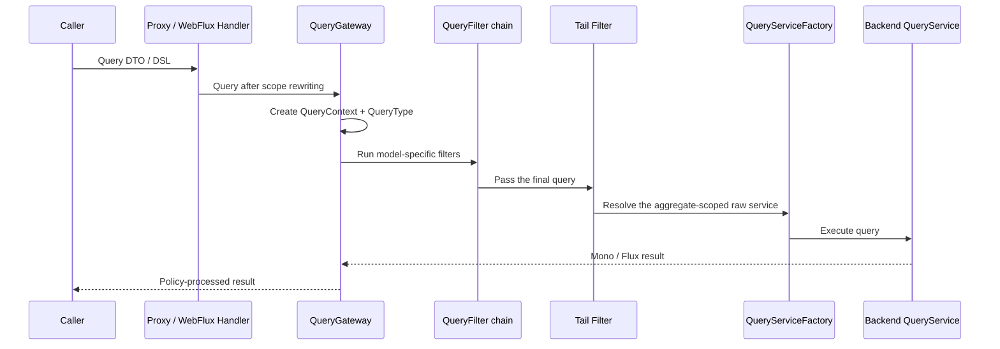

# Query Gateway

## Why queries go through the Gateway first

`QueryGateway` is the policy execution boundary for queries. Aggregate-level `QueryService` instances registered by Spring are forwarded by `QueryServiceProxy` to the Gateway, so query rewriting, HTTP guards, configured authorization filters, and result masking run through one chain before the raw backend is reached.

Business code should not normally bypass the Gateway. Use a Factory directly only for infrastructure extensions or when raw backend semantics are explicitly required; that call does not run the Gateway policy chain.

## Execution chain

The complete chain is:

`QueryServiceProxy` serves in-process typed Beans; a WebFlux Handler calls the same kind of service after deserialization and request rewriting. The Tail Filter creates the raw aggregate service, stores the result, and the Gateway returns the corresponding `Mono` or `Flux`.

## QueryContext and QueryType

The Gateway creates an independent `QueryContext` for every subscription, so separate subscriptions to the same reactive Publisher do not share the query, result, or attributes. The context holds the aggregate identity, query object, result, and `QueryType` for filters that rewrite queries or results.

`QueryType` covers single, list, paged, count, aggregation, and dynamic-document forms; concrete query models, entry points, and protocol exposure can still differ.

## Snapshot and event-stream filter chains

`SnapshotQueryGateway` and `EventStreamQueryGateway` select their respective model-specific `QueryFilter` chains. Their snapshot and event-stream Tail Filters obtain a raw service from the Factory. A model-specific filter cannot assume it runs in the other chain.

## The WebFlux request boundary

`RewriteRequestFilter` adds tenant, owner, and space conditions before the Gateway; both snapshot and event-stream WebFlux requests take this step. In-process calls do not automatically receive this HTTP request scope.

`HttpQueryGuardFilter` belongs to both Gateways, but applies only when a `ServerRequest` exists in the Reactor Context; it does not change ordinary in-process query constraints.

## ABAC and result masking

The built-in `AbacQueryFilter` belongs to the snapshot query gateway. Snapshot result masking does not process count or aggregation; event-stream dynamic-result masking covers only the currently supported dynamic query forms, not typed results or aggregation.

For authentication, Principal binding, and the complete fail-closed policy, see [Data Access Control](../data-access.md).

## Raw Factories and custom Beans

Calling `SnapshotQueryServiceFactory` or `EventStreamQueryServiceFactory` directly bypasses query rewriting, ABAC, and result masking. A custom Bean with the generated service name is also retained as-is instead of being wrapped; when a Gateway is absent, the Registrar likewise returns the raw service. These are trusted infrastructure boundaries, not normal business extension points.

## Migrating from QueryHandler

Replace the former `QueryHandler` / `AbstractQueryHandler`, `SnapshotQueryHandler`, and `EventStreamQueryHandler` with their corresponding Gateway types and implementations. Rename `snapshotQueryHandler` / `eventStreamQueryHandler` Beans to `snapshotQueryGateway` / `eventStreamQueryGateway`.

Custom filters' `@FilterType` must target the corresponding `QueryGateway`. A custom Gateway no longer implements `Handler` or exposes `handle(QueryContext)`: it must implement `aggregate`, and its `count` accepts only `FilterExpression`.

## Validation strategy boundaries

The Gateway owns the policy chain; it does not replace backend field capabilities, schema resolution, or application business validation. Direct Factory access, a same-name custom Bean, and a missing Gateway each bypass this boundary. Infrastructure code that needs those paths must explicitly own their security and query semantics.
