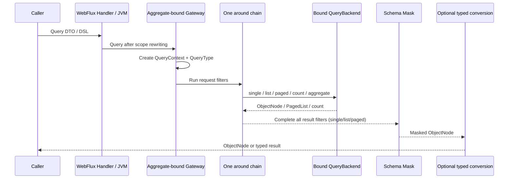

# Query Gateway

## Why queries go through the Gateway first

`SnapshotQueryGateway<S>` and `EventStreamQueryGateway` are the application query entries and the policy boundary. Spring registers a bound Gateway per aggregate so request rewriting, HTTP guards, authorization, and generic result handling execute in one around chain.

Business code should not normally bypass the Gateway. Use a Factory directly only for infrastructure extensions or when raw backend semantics are explicitly required; that call does not run the Gateway policy chain.

## Execution chain

The complete chain is:

At Gateway assembly, the registrar calls the routing Factory once for the `NamedAggregate` and binds the selected Backend. Requests are not routed again. The Backend produces `ObjectNode`; result filters process those nodes, single/list/paged data results are then masked from the Query Model Schema, and Jackson finally materializes typed results. Count remains `Long`. Aggregation remains a stream of `ObjectNode` rows, with Schema rejecting groups, metrics, and expressions that reference masked fields.

## QueryContext and QueryType

The Gateway creates an independent `QueryContext` for every subscription, so separate subscriptions to the same reactive Publisher do not share the query, result, or attributes. The context holds the aggregate identity, query object, result, and `QueryType` for filters that rewrite queries or results.

`QueryType` contains only `SINGLE`, `LIST`, `PAGED`, `COUNT`, and `AGGREGATION`; typed and `ObjectNode` results share the same operation type. Concrete query models, entries, and protocol exposure can still differ.

## Snapshot and event-stream filter chains

`SnapshotQueryGateway` and `EventStreamQueryGateway` share the `QueryFilter<QueryContext<*, *>>` contract. A generic `QueryFilter` needs no `@FilterType` and enters both Gateways; only model-specific filters use `@FilterType(SnapshotQueryGateway::class)` or `@FilterType(EventStreamQueryGateway::class)`.

## The WebFlux request boundary

`RewriteRequestFilter` adds tenant, owner, and space conditions before the Gateway; both snapshot and event-stream WebFlux requests take this step. In-process calls do not automatically receive this HTTP request scope.

`HttpQueryGuardFilter` belongs to both Gateways, but applies only when a `ServerRequest` exists in the Reactor Context; it does not change ordinary in-process query constraints.

## ABAC and Static Masking

The built-in `AbacQueryFilter` belongs to the snapshot Gateway. For a Backend that provides `QueryModelSchemaProvider`, the Gateway applies Query Model Schema-driven static-annotation masking to raw `ObjectNode` values after all generic result filters and before typed materialization. Snapshot and EventStream typed, dynamic, and aggregate-state load entries share this managed path.

The Gateway caches a successful Schema decision. A transient Schema-load error is not cached, so a later subscription can retry. When the root Schema has no `masked` fields, the fast path creates no masker and does not walk result JSON. With EventStream masking enabled, a missing or unknown `bodyType` fails the result Publisher closed.

For authentication, Principal binding, and the complete fail-closed policy, see [Data Access Control](../data-access.md).

## Raw Factory Boundary

Calling `SnapshotQueryBackendFactory` or `EventStreamQueryBackendFactory` directly bypasses the entire Gateway governance chain, including ABAC, result filters, and masking. A custom Backend without `QueryModelSchemaProvider` cannot establish a masking contract either. Both are trusted raw-value boundaries for storage extensions, focused diagnostics, and backend contract tests. Ordinary application code should inject the aggregate-bound Gateway.

## Bean Names

Aggregate Bean names are exactly `{contextAlias.}{aggregateName}.SnapshotQueryGateway` and `{contextAlias.}{aggregateName}.EventStreamQueryGateway`; omit the prefix when there is no context alias. Snapshot Gateways are also registered by their state generic. Event-stream Gateways have no state generic, so qualify by Bean name when there are multiple candidates.

## Validation strategy boundaries

The Gateway owns the policy chain; it does not replace backend field capability, Schema resolution, or application validation. If a JSON-array or SSE stream fails after emitting rows, those rows are not rolled back. SSE attempts to emit an `ErrorInfo` error event. A `RequestExceptionHandler` failure or a failure while generating, rendering, or serializing that error event is attached to the original as a suppressed error only when distinct and not already recorded. The original terminal error is always propagated; partial failure never completes successfully.
