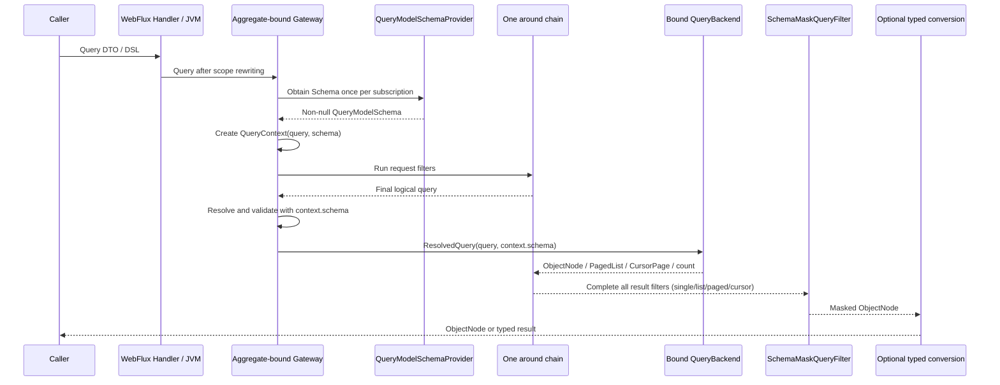

# Query Gateway

## Why queries go through the Gateway first

`SnapshotQueryGateway<S>` and `EventStreamQueryGateway` are the application query entries and the policy boundary. Spring registers a bound Gateway per aggregate so request rewriting, HTTP guards, authorization, and generic result handling execute in one around chain.

Business code should not normally bypass the Gateway. Use a Factory directly only for infrastructure extensions or when raw backend semantics are explicitly required; that call does not run the Gateway policy chain.

## Execution chain

The complete chain is:

At Gateway assembly, the registrar calls the routing Factory once for the `NamedAggregate` and binds the selected Backend. Requests are not routed again. On each subscription, the Gateway obtains one Schema from the Provider, creates the Context, runs Filters, resolves the final query under the configured validation mode, and passes only a `ResolvedQuery` to the Backend. The Backend produces `ObjectNode`; it neither obtains Schema nor chooses a validation mode. The framework-owned outermost `SchemaMaskQueryFilter` reads `QueryContext.schema` after all generic result filters and masks the final node. Filter, Resolver, Backend, and Mask therefore share one Schema instance. Jackson finally materializes typed results. Unavailable Schema fails every managed Gateway call closed before Context or Backend execution. Count remains `Long` and performs no result masking. Aggregation remains a stream of `ObjectNode` rows, with Schema rejecting groups, metrics, and expressions that reference masked fields.

## QueryContext and QueryType

For every subscription, the Gateway obtains one currently published Schema and creates an independent `QueryContext`, so separate subscriptions to the same reactive Publisher do not share the query, result, or attributes. From the beginning of the Filter chain, the context exposes a non-null immutable `schema` reference alongside the aggregate identity, query object, result, and `QueryType`.

`QueryType` contains only `SINGLE`, `LIST`, `PAGED`, `CURSOR`, `COUNT`, and `AGGREGATION`; typed and `ObjectNode` results share the same operation type. Concrete query models, entries, and protocol exposure can still differ.

## Snapshot and event-stream filter chains

`SnapshotQueryGateway` and `EventStreamQueryGateway` share the `QueryFilter<QueryContext<*, *>>` contract. A generic `QueryFilter` needs no `@FilterType` and enters both Gateways; only model-specific filters use `@FilterType(SnapshotQueryGateway::class)` or `@FilterType(EventStreamQueryGateway::class)`.

## The WebFlux request boundary

`RewriteRequestFilter` adds tenant, owner, and space conditions before the Gateway; both snapshot and event-stream WebFlux requests take this step. In-process calls do not automatically receive this HTTP request scope.

`HttpQueryGuardFilter` belongs to both Gateways, but applies only when a `ServerRequest` exists in the Reactor Context; it does not change ordinary in-process query constraints.

A cursor is not a policy snapshot. Every later HTTP request reapplies tenant, owner, and space conditions, then reruns authorization, the original filter, HTTP guards, result filters, and `SchemaMasker`; the token neither carries nor restores authorization state. Every in-process subscription likewise reruns the Gateway chain.

## ABAC and Field Masking

The built-in `AbacQueryFilter` belongs to the snapshot Gateway. `QueryGateway` receives `QueryModelSchemaProvider` through a constructor parameter independent of its Backend. In the current Spring assembly, the Registrar calls `requiredQueryModelSchemaProvider()` on the routed Backend and passes that Provider to the Gateway; this is only the current wiring mechanism. The framework-owned `SchemaMaskQueryFilter` applies Schema-driven field masking after all generic result filters and before typed materialization. If the paired Provider is unavailable, the query fails closed before Filter or Backend execution; masking is never merely skipped. Snapshot and EventStream typed, dynamic, cursor, and aggregate-state load entries share this managed path. See [Field Masking](./masking.md) for annotations, caching, the behavior matrix, and fail-closed rules.

For authentication, Principal binding, and the complete fail-closed policy, see [Data Access Control](../data-access.md).

## Raw Factory Boundary

Calling `SnapshotQueryBackendFactory` or `EventStreamQueryBackendFactory` directly bypasses the entire Gateway governance chain, including Schema acquisition and admission, ABAC, result filters, and field masking; the caller must construct an accepted `ResolvedQuery` itself. This trusted raw-value boundary is only for storage extensions, focused diagnostics, and backend contract tests. Ordinary application code should inject the aggregate-bound Gateway.

## Bean Names

Aggregate Bean names are exactly `{contextAlias.}{aggregateName}.SnapshotQueryGateway` and `{contextAlias.}{aggregateName}.EventStreamQueryGateway`; omit the prefix when there is no context alias. Snapshot Gateways are also registered by their state generic. Event-stream Gateways have no state generic, so qualify by Bean name when there are multiple candidates.

## Validation strategy boundaries

The Gateway owns the policy chain and Schema admission; it does not replace backend field capability or application validation. Spring's `wow.query.schema.validation-mode` controls only Gateway admission; the Backend never chooses the mode. Before Cursor field admission, `QueryModelSchema` appends the model-specific unique sort: Snapshot uses `aggregateId`, while EventStream uses the stream-record `id`. The final effective sort must resolve exactly in Query Schema, be single-valued, carry no Mask rule, and not alias a masked projection or physical binding. Mask rules include those compiled from `@Mask`, `@KeepMask`, or a custom `@Masking` meta-annotation; unavailable Schema fails closed rather than falling back in compatible mode. If a JSON-array or SSE stream fails after emitting rows, those rows are not rolled back. SSE attempts to emit an `ErrorInfo` error event. A `RequestExceptionHandler` failure or a failure while generating, rendering, or serializing that error event is attached to the original as a suppressed error only when distinct and not already recorded. The original terminal error is always propagated; partial failure never completes successfully.
