# Query Gateway

`SnapshotQueryGateway<S>` and `EventStreamQueryGateway` are application query entries. Spring resolves a `QueryBackendBinding` during aggregate Gateway registration and retains its Backend and Provider instead of routing each request again.

## Fixed execution order

Each subscription independently:

1. Obtains one Schema from the Provider.
2. Runs ordered `QueryFilter.prepare` stages; each emits one prepared logical Query.
3. Appends the request scope from Reactor Context.
4. Appends configured `QueryPolicy` filters through the shared policy stage for both Snapshot and EventStream queries, after ordinary preparation.
5. Only the Gateway applies model defaults: Snapshot adds `DELETION = ACTIVE` unless explicitly overridden; EventStream adds no deletion predicate. It also appends the model's unique cursor sort field.
6. Validates the final public Query, then calls `backend.operation(query, schema)`.
7. Masks returned query nodes with the captured Schema, then optionally materializes typed results.
8. Notifies `QueryObserver` of completion, error, or cancellation.

```mermaid
flowchart LR
    Provider --> Prepare["QueryFilter.prepare"]
    Prepare --> Scope["Request scope"]
    Scope --> Policy["QueryPolicy.evaluate"]
    Policy --> Validate["Defaults + public validation"]
    Validate --> Backend["Backend query + schema"]
    Backend --> Mask["Mask"]
    Mask --> Result["ObjectNode / typed result"]
    Result --> Observer["Terminal observer"]
```



Preparation, validation, Backend compilation, and Mask share that captured Schema. Schema failure or empty prepare completion fails before Backend execution. Retry/repeat starts a fresh subscription and obtains its Schema again. Count returns Long without result masking. Aggregation rejects protected grouping/metric/expression inputs before execution rather than attempting to conceal them in returned aggregate rows.

## Request preparation extension

`QueryContext<Q>` contains only `query`, `namedAggregate`, and `schema`. A Filter has no continuation, result object, or result-processing authority. It prepares a request and cannot wrap or re-execute the Backend:

```kotlin
interface QueryFilter {
    fun <Q : RewritableFilter<Q>> prepare(context: QueryContext<Q>): Mono<Q>
}
```

`SnapshotQueryFilter` and `EventStreamQueryFilter` restrict the applicable model; a plain `QueryFilter` can apply to both. `@Order` controls preparation order. Prepared requests use logical fields and still undergo final Schema validation.

## Preparation and mandatory constraints

| Extension | Result | Composition |
| --- | --- | --- |
| `QueryFilter.prepare` | A prepared Query | Later prepare steps may replace its query/filter |
| `QueryPolicy.evaluate` | An additional logical FilterExpression or an error | Gateway applies it with AND after all prepare steps |

Both can construct filter expressions. Use QueryFilter when replacement is allowed; use QueryPolicy when a condition must survive all preparation. For example, mandatory `state.visible = true`, a data lifecycle restriction, or an authorization condition belongs in a Policy. QueryPolicy remains generic in the rules it represents; its authority is limited to adding constraints or rejecting a query. Built-in model defaults, Schema validation, backend execution and result processing retain their existing owners.

## Request scope and policies

A WebFlux Handler uses `QueryRequestScope` to obtain tenant/owner/space scope, places it in Reactor Context, and invokes the Gateway. `HttpQueryGuard` applies HTTP cost and response limits outside the Gateway Filter stages.

A JVM caller can supply trusted scope explicitly:

```kotlin
queryGateway.dynamicList(query)
    .contextWrite { context ->
        context.withQueryScope(TenantIdFilter("tenant-1"))
    }
```

`withQueryScope` combines an existing scope. Authentication remains the application's responsibility; unverified request fields are not identity. `QueryContext` also carries the operation (`queryType`) and the query entry, so a filter or policy can tell a count from a list and an HTTP query from an in-process one. Both Snapshot and EventStream Spring registrars inject `QueryPolicy` beans, and the shared Gateway stage evaluates them. A policy uses `QueryContext` to determine applicability and returns `MatchAllFilter` when it does not apply. `AbacQueryPolicy` resolves principal tags and generates tag conditions only for Snapshot; for other models it returns `MatchAllFilter` without reading tags. Other policies implement `QueryPolicy.evaluate` for rules such as data lifecycle or business query constraints without principal-tag lookup.

A policy returns an additional logical filter or an error. The gateway combines filters with AND at the fixed policy stage before model defaults and validation. It cannot replace the query, execute the backend, or transform results. An empty publisher is a protocol error, not a way to signal that a policy does not apply. Policy failures terminate the query before backend execution. See [Data Access Control](../data-access.md).

### Scope provenance

Each part of the caller scope is `AUTHENTICATED` (taken from credentials, or vouched for by a trusted component) or `DECLARED` (stated by the request: a path variable or a header). Both restrict the query; only an authenticated scope is a security boundary.

- `QueryRequestScope` returns a `QueryScope(authenticated, declared)`. `DefaultQueryRequestScope` marks an aggregate's static tenant as authenticated and everything read from the request as declared. `CoSecQueryRequestScope` does the same.
- Where a trusted component owns a value (for example an authenticating gateway that strips client-supplied tenant headers), extend `AbstractQueryRequestScope` and override `tenantIdProvenance`, `ownerIdProvenance` or `spaceIdProvenance` to return `AUTHENTICATED`.
- An in-process caller writes an authenticated scope with `withQueryScope(QueryScope(authenticated = TenantIdFilter(tenantId)))`; `withQueryScope(filter)` is declared.
- `wow.query.require-authenticated-scope=true` rejects an `HTTP` query on Snapshot or EventStream whose authenticated scope does not pin `tenantId`. The response is `403` with error code `IllegalAccessQueryScope`, sent before any backend I/O. A declared tenant still filters the query but does not satisfy the check. The switch is off by default, which keeps the old behavior of trusting the declared scope.

## Query entry

Every query carries an entry in the Reactor context: `HTTP`, `IN_PROCESS` or `UNSPECIFIED`. The built-in REST query routes write `HTTP` in the one place they all share, together with the request scope. The gateway reads the entry once, when the query is subscribed.

- `UNSPECIFIED` is treated as in-process, so existing `QueryGateway` callers work unchanged. Set `wow.query.require-explicit-entry=true` to reject queries that do not state their entry.
- A query issued from inside a `QueryFilter`, a `QueryPolicy` or a cache loader should not inherit the HTTP caller's scope and entry. Wrap it with `asInProcessQuery()`, which drops both and runs it as `IN_PROCESS`:

```kotlin
snapshotQueryGateway.dynamicList(lookup).asInProcessQuery()
```

## Rejected queries

A query the client got wrong is answered with HTTP 400 and an `ErrorInfo` body. `errorCode` is `IllegalArgument` for request and budget problems and `QuerySchemaValidation` for fields and capabilities the model does not offer. `errorMsg` says what is wrong in words, and `bindingErrors` carries one entry to switch on:

```json
{
  "errorCode": "QuerySchemaValidation",
  "errorMsg": "Unknown logical field [state.missing].",
  "bindingErrors": [{ "name": "state.missing", "msg": "Unknown logical field [state.missing].", "code": "UNKNOWN_FIELD" }]
}
```

`code` comes from `QueryErrorCodes` (also published as the `BindingError.code` enum in OpenAPI). Codes are added over time and never renamed, so treat unknown codes as generic. `name` is the JSON path for request-body problems (`body` when there is none), and the absolute logical field path for admission problems (for an element-scoped field, the full path such as `state.items.price`; empty for model-level problems).

| Codes | Meaning |
|---|---|
| `INVALID_JSON`, `BODY_NOT_OBJECT`, `EMPTY_BODY` | The body is not a JSON object |
| `UNKNOWN_PROPERTY`, `UNKNOWN_TYPE`, `UNKNOWN_VALUE`, `INVALID_VALUE` | The JSON does not fit the query type: an unknown property, `op` or metric type, enum value, or a wrong or missing value |
| `INVALID_REQUEST` | Any other request rule; `msg` names it |
| `CURSOR_SORT_DUPLICATE`, `CURSOR_SORT_TOO_MANY` | A cursor sort repeats a field (`name`) or exceeds the field limit once the identity tie-breaker is appended |
| `UNKNOWN_FIELD`, `UNSUPPORTED_CAPABILITY`, `ELEMENT_SCOPE_REQUIRED`, `VALUE_MISMATCH`, `NOT_COLLECTION`, `NOT_SINGLE_STRING`, `MODEL_SEARCH_UNSUPPORTED`, `CURSOR_NOT_ALLOWED`, `PROTECTED_AGGREGATION`, `MISSING_KEY_REQUIRES_STRING`, `ANY_REQUIRES_SINGLE_VALUE`, `INCOMPLETE_PROJECTION`, `METRIC_FILTER_SEARCH`, `METRIC_FILTER_ELEMENT_MATCH`, `METRIC_FILTER_ARRAY_FIELD`, `NOT_PROJECTABLE`, `EVENT_PROJECTION_TYPE_REQUIRED`, `TEMPORAL_REPRESENTATION_REQUIRED`, `TEMPORAL_CONFIGURATION_CONFLICT` | The model rejects the query at admission |

HTTP budget rejections (`HTTP list query limit[...]` and the like) carry no `bindingErrors` yet.

## Results and observation

The Backend returns independently owned ObjectNodes for each subscription. Framework masking runs before typed materialization, with no general result Filter stage. `QueryObserver` exposes terminal callbacks only and cannot replace a result or error. Ordinary observer failures are logged; they cannot retry the query or invoke the Backend again. The default implementation is `QueryLogObserver`.

Direct Backend access bypasses these stages; see [Query Backend](./query-backend.md), [Field Masking](./masking.md), and [Query Model Schema](./query-model-schema.md).
